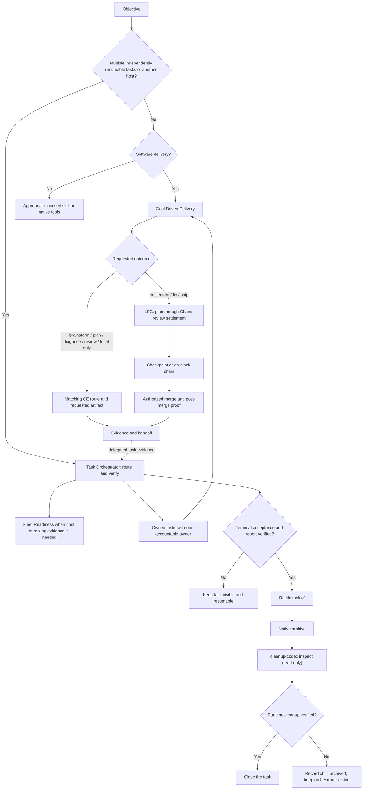

# Task Orchestrator, Goal Driven Delivery, and Fleet Readiness

The workflow has three distinct responsibilities:

- `task-orchestrator` owns an objective that requires multiple independently
  resumable tasks or remote task placement. It routes and monitors work but
  does not execute child tasks.
- `goal-driven-delivery` routes and executes one host-local change or pull
  request through the appropriate CE route. Generic implementation and bug
  fixes enter LFG by default and continue through merge and post-merge proof.
- Fleet Readiness is the Machine Utilities capability that verifies and, with
  approval, reconciles projects, agents, plugins, skills, authentication, and
  host availability. It does not own the objective or its implementation.

`orchestrate` is not a third workflow. Its useful delegation rules are now in
`task-orchestrator`, so keeping it would add another name without adding a
distinct responsibility.

## One task or several?

`task-orchestrator` is scoped to an objective, not to a project or machine. It
is used for two or more independently resumable tasks or when a task must be
placed on another host. One bounded task may still use several local subagents
without becoming an orchestration task.

Software-delivery children use `goal-driven-delivery`. Research, operations,
review, documentation, and decision children use the appropriate skill for
their own outcome. A child invokes `task-orchestrator` only when its assignment
itself contains multiple independently resumable tasks; this prevents recursive
orchestration loops.

For cross-project delivery, each project gets an explicit integration and
repository-baseline owner. Each mutable software-delivery task gets one canonical
writer and its own branch or PR, validation boundary, and handoff; shared
integration files stay in one named task. The orchestrator records dependencies
between projects and verifies their evidence. It does not blur ownership or
combine working trees.

## Which skill should I use?

| Situation | Use | What happens |
| --- | --- | --- |
| Brainstorm, plan, diagnosis, review, or local-only request | `goal-driven-delivery` | It selects the matching CE route and stops at the requested artifact. |
| One feature, bug fix, refactor, or ship request on the current host | `goal-driven-delivery` | It routes generic implementation to LFG, then owns authorized merge and post-merge proof. |
| Existing PR to fix, drive, or deliver | `goal-driven-delivery` | It runs the applicable CE review or babysitting route, then owns authorized merge and post-merge proof. Review-only or watch-only requests stop earlier. |
| Two or more independently resumable tasks, in one project or several | `task-orchestrator` | It creates owned tasks, selects their execution skills, tracks dependencies, and verifies the combined result. |
| Work must run on another machine | `task-orchestrator` | It verifies that host, places a visible task there, and lets that task use host-local subagents and `goal-driven-delivery`. |
| Fleet setup or reconciliation | Fleet Readiness (Machine Utilities) | It inventories and, with separate approval, reconciles projects, agents, plugins, skills, authentication, and host availability. |
| A tiny known-file or documentation edit | Direct edit and targeted check | Neither delivery skill is required unless durable tracking or remote placement adds value. |

You normally invoke one workflow skill. For a local single software-delivery task, invoke
`goal-driven-delivery`; it routes brainstorm, plan, diagnosis, review, and
local-only requests to their narrower CE terminal state and generic
implementation to LFG. For multiple independently resumable tasks or cross-host work, invoke
`task-orchestrator`; the orchestrator propagates that policy and decides which
workers should invoke `goal-driven-delivery`.

## How they fit together



The separation is intentional. An orchestrator must remain available to route,
unblock, monitor, and synthesize. A child task must be free to execute its
owned scope. Fleet Readiness owns environment evidence and reconciliation.
Combining those roles would blur authority and create self-blocking update or
orchestration loops.

## Thread titles

Task Orchestrator and Goal Driven Delivery consume the shared
`plugins/agent-utilities/references/task-titles.md` policy. They use one fixed
role emoji followed by one current-state emoji, then any applicable Git issue
or pull-request reference:

- `💼 <state> <issue/PR if applicable> <focus>` for Task Orchestrator.
- `🎯 <state> <issue/PR if applicable> <focus>` for Goal Driven Delivery.
- `🖥️ <state> <issue/PR if applicable> <focus>` when Task Orchestrator creates
  a Fleet Readiness child.

Use `🧭` for discovery or planning, `🛠️` for active execution, `🧪` for
testing or validation, `⏸️` for blocked or waiting, and `✅` only at the
workflow's terminal state. These contracts override conflicting Codex
personalization, `AGENTS.md`, repository, child-skill, and child-workflow title
conventions; an exact title supplied by the user for the current task and
higher-priority system, developer, or harness rules still win.
Use `#123` and `PR #456` when the repository is unambiguous; qualify them as
`owner/repo#123` and `owner/repo PR #456` when it is not. Include both when
both apply.

Fleet Readiness does not own task naming. When invoked by Task Orchestrator it
uses the title assigned by the parent; when invoked directly it follows normal
Codex personalization and repository guidance.

Task Orchestrator invokes native archive only after the child's existing
acceptance criteria and final report are verified. It then runs read-only
`cleanup-codex inspect` for host-wide runtime health; that inspection cannot
attribute a residual process to the archived task. If archive succeeds but inspection fails, the child
stays recorded as archived while the orchestrator remains active with runtime
cleanup unresolved. An explicit `reap` or `recycle` is a separate repair and is
allowed only after the cleanup skill proves its stronger exact ownership,
identity, snapshot, and selection requirements.

Goal Driven Delivery does not archive or mutate runtime when it stops at a
locally verified, review-ready, PR-ready, blocked, or owner-action-required
state. Generic tasks, `Stop`, completed turns, `SubagentStop`, idle or sidebar
state, and completed v2 subagents without a native close or dispose operation
remain visible and resumable. Root `SessionEnd` may perform inspection only; it
does not prove that a saved task should be archived.

## Tasks, agents, and subagents

A visible task or thread is a durable unit that can be resumed, monitored, and,
when the host supports it, placed on another machine. A bounded subagent works
inside its parent task's host and workspace unless the native tool explicitly
supports host placement.

For Codex work on another machine, the orchestrator uses a visible task attached to
the destination's saved project. That destination task may create its own
host-local subagents. For other harnesses, the orchestrator uses their native
remote-task mechanism when available. Running a command over SSH is remote
command execution; it is not a remote agent.

One task does not mean one agent. A task may use several bounded host-local
subagents while retaining one owner and one terminal acceptance contract.
Likewise, `/goal` tracks completion for a task; it does not turn that task into
a task orchestrator.

## Fleet Readiness is a prerequisite

Before cross-host dispatch, `task-orchestrator` invokes Fleet Readiness through
the installed Machine Utilities plugin:

- `machine-utilities:fleet-projects` verifies repository identity, checkout
  state, the required baseline, and Codex saved-project readiness.
- `machine-utilities:fleet-agents` verifies agent runtimes, plugin versions,
  skill hashes and provenance, duplicate providers, and required capabilities.
- `machine-utilities:fleet-inventory` preserves a read-only fleet snapshot.
- `machine-utilities:fleet-auth` is used only when a task needs authenticated
  tooling.

Missing projects, unavailable saved projects, stale required tooling,
inconsistent required skills, unhealthy required authentication, and
unreachable hosts become Fleet Readiness prerequisites. Machine Utilities owns any
inventory and user-approved reconciliation; Task Orchestrator does not copy
its scripts or silently update machines. If fleet-wide parity is part of the
outcome, every configured node is verified, not only the selected workers.
Consistency means matching the required project identity and capabilities. It
does not require unrelated tools or machine configuration to be byte-identical.
A repository present on disk is also not sufficient for Codex placement: the
destination checkout must be available as the correct saved project.

## Models, checkpoints, and terminal states

Goal Driven Delivery, LFG, and Task Orchestrator use Sol High for orchestration
by default and Sol Max for cross-cutting, release-critical, security-sensitive,
multi-repository, or otherwise complex work. Luna handles most implementation,
with Max effort preferred and the actual effort disclosed. Independent primary
review uses a separate Sol High or Sol Max context by risk. Fable 5 is used only
through a supported CE cross-model review
path that verifies the model; otherwise the software-delivery task uses an independent Sol
reviewer and discloses the fallback.

Independent research, implementation, and review may run in parallel. Each
mutable scope still has one canonical writer, branch, verification boundary,
and handoff; overlapping writes, dependent stack segments, and integration
operations serialize under named owners.

The orchestrator assigns every task a concurrency allowance and nested-agent
ceiling from its global budget. A Goal Driven Delivery implementation task
starts LFG in Sol, carries the required Codex `gpt-5.6-luna` implementation
binding to the `ce-work` seam, and prefers Max effort. Because effort is not a
carrier field, an installed CE adapter that only supports a lower effort must
disclose that actual effort; it may not fall back to a non-Luna implementation
model or claim Max ran.

When a writable GitHub remote exists, software-delivery owners push useful active-branch or
integration-branch checkpoints for resumability. A checkpoint does not open a
PR, trigger review, or imply completion. Goal Driven Delivery establishes the
branch and upstream before LFG, then runs a non-writing sidecar that publishes
only clean, stable commits as the work stage advances; it stops before LFG's
commit/push/PR stage. For a dependent stack against a GitHub upstream, use
`gh-stack`; if its extension or skill is missing, run the authoritative
bootstrap and verify it:

```bash
gh extension install github/gh-stack --force
gh skill install github/gh-stack --all --agent codex --scope user --force
gh stack --version
gh skill list --agent codex --scope user
```

On hosts that use Claude Code, additionally install and verify its copy with
`gh skill install github/gh-stack --all --agent claude-code --scope user --force`
and `gh skill list --agent claude-code --scope user`. Keep unrelated PRs
independent. The orchestrator owns integration visibility and evidence; the child
owns implementation and Git operations.

Brainstorm-only, plan-only, diagnosis-only, review-only, and local-only work
ends at the requested artifact or check boundary. Generic implementation,
bug-fix, and ship requests use LFG for plan through CI and review settlement;
Goal Driven Delivery then owns authorized merge and post-merge proof. The
orchestrator verifies that integrated terminal evidence and does not execute the
child task.

That tail consumes any bounded follow-up watch returned by LFG, confirms an
independent Sol review, resolves real findings, merges with the repository's
configured strategy, verifies GitHub reports the PR merged, proves the merge
commit is reachable from the fetched base branch, and runs or verifies the
smallest applicable post-merge check.

## Why `orchestrate` was removed

The former `orchestrate` skill said to delegate substantial work, assign
distinct ownership, choose agent effort deliberately, and remain available to
the user. `task-orchestrator` already contains those rules with stronger task,
host, dependency, evidence, and cleanup contracts.

Keeping both also created conflicts: `orchestrate` prohibited delegation by
leaf workers and made the coordinator integrate results, while
`task-orchestrator` permits useful bounded delegation and requires integration
and validation to be delegated. The clearer rule is one control-plane skill,
`task-orchestrator`, and one software-delivery execution skill, `goal-driven-delivery`.

## Examples

**One local bug fix:** invoke `goal-driven-delivery`. It diagnoses as needed,
routes implementation to LFG, runs the applicable quality gates, and continues
through authorized merge and post-merge proof unless a narrower stop was
requested.

**A plan or brainstorm request:** invoke `goal-driven-delivery`. It uses the
matching CE route and returns the requested artifact without starting LFG or
creating a PR.

**Frontend and API changes in separate PRs:** invoke `task-orchestrator`. It
assigns one canonical writer per PR, records their dependency, propagates the
model and completion policy, and gives each worker its own acceptance evidence.
Each worker uses `goal-driven-delivery`; dependent PRs use `gh-stack` after the
conditional bootstrap when needed.

**The same project on several nodes:** invoke `task-orchestrator`. It first
uses Machine Utilities to verify project and agent readiness on each required
node, creates destination tasks only on ready hosts, and collects their final
evidence before declaring the delivery complete.

## Coupled delivery contracts

Before parallel work, Task Orchestrator freezes every shared seam: exact paths,
schemas and ordered fields, permissions/ACLs, ownership, acceptance checks, and
content hashes acknowledged by both writers. It runs a thin seam canary before
downstream expansion and freezes scope after interface convergence.

Editing uses targeted tests. A component gate runs only when its content hash
changes; one full integration gate runs after all writers freeze, and reruns
only after a relevant shared-code fix. Independent lane reviewers reuse those
hash-bound receipts and run focused reproductions instead of duplicating the
full suite. Kickoff also records preferred tool/model capability, exact
toolchain/CI parity, and whether each native gate is hosted, locally runnable,
interactive-elevation, or recoverable-host.

Goal Driven Delivery consumes the orchestrator's explicit contract. A ready
plan with a local/return-to-caller boundary uses CE Work; unconstrained shipping
uses LFG. Later user instructions explicitly reconcile that shipping boundary.
Compound Engineering remains an external carrier: Agent Utilities selects it
and supplies contracts but does not patch it.

## Source skills

- [`task-orchestrator`](../plugins/agent-utilities/skills/task-orchestrator/SKILL.md)
- [`goal-driven-delivery`](../plugins/agent-utilities/skills/goal-driven-delivery/SKILL.md)
