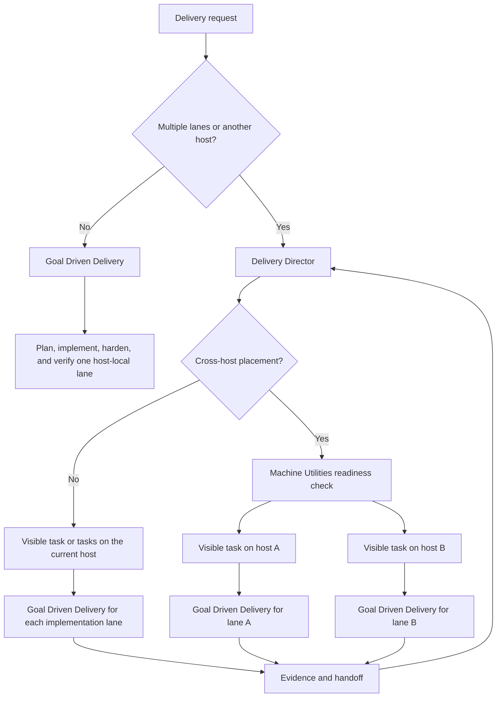

# Delivery Director and Goal Driven Delivery

The plugin has two delivery skills with different jobs:

- `delivery-director` coordinates work across lanes or machines. It does not
  implement, test, commit, or push.
- `goal-driven-delivery` executes and hardens one host-local change or pull
  request through the appropriate planning, review, testing, and PR gates.

`orchestrate` is not a third workflow. Its useful delegation rules are now in
`delivery-director`, so keeping it would add another name without adding a
distinct responsibility.

## One project or several?

`delivery-director` is scoped to a delivery outcome, not to a project. It can
coordinate several lanes in one repository or related work across multiple
projects and repositories.

For cross-project delivery, each project gets an explicit integration and
repository-baseline owner. Each mutable lane inside it gets one canonical
writer and its own branch or PR, validation boundary, and handoff; shared
integration files stay in one named lane. The director records dependencies
between projects and verifies their evidence. It does not blur ownership or
combine working trees.

## Which skill should I use?

| Situation | Use | What happens |
| --- | --- | --- |
| One feature, bug fix, refactor, or PR on the current host | `goal-driven-delivery` | It selects and runs the appropriate single-lane delivery route. |
| Two or more independently resumable scopes or PRs, in one project or several | `delivery-director` | It creates owned lanes, tracks dependencies, and verifies terminal evidence. Each implementation lane may use `goal-driven-delivery`. |
| Work must run on another machine | `delivery-director` | It verifies that host, places a visible task there, and lets that task use host-local subagents and `goal-driven-delivery`. |
| Fleet setup or reconciliation without software delivery | Machine Utilities | It inventories and, with separate approval, reconciles projects, agents, plugins, skills, or authentication. |
| A tiny known-file or documentation edit | Direct edit and targeted check | Neither delivery skill is required unless durable tracking or remote placement adds value. |

You normally invoke one skill. For a local single lane, invoke
`goal-driven-delivery`. For multi-lane or cross-host work, invoke
`delivery-director`; the director decides which workers should invoke
`goal-driven-delivery`.

## How they fit together

The separation is intentional. A director must remain available to coordinate,
unblock, and monitor. A lane worker must be free to edit, test, and repair its
owned scope. Combining those roles would make it unclear whether the active
task is allowed to execute or must remain a control plane.

## Tasks, agents, and subagents

A visible task or thread is a durable lane that can be resumed, monitored, and,
when the host supports it, placed on another machine. A bounded subagent works
inside its parent task's host and workspace unless the native tool explicitly
supports host placement.

For Codex work on another machine, the director uses a visible task attached to
the destination's saved project. That destination task may create its own
host-local subagents. For other harnesses, the director uses their native
remote-task mechanism when available. Running a command over SSH is remote
command execution; it is not a remote agent.

One lane does not mean one agent. A lane may use several bounded host-local
subagents while retaining one owner and one terminal acceptance contract.
Likewise, `/goal` tracks completion for a task; it does not turn that task into
a multi-lane director.

## Machine readiness is a prerequisite

Before cross-host dispatch, `delivery-director` delegates readiness checks to
the installed Machine Utilities plugin:

- `machine-utilities:fleet-projects` verifies repository identity, checkout
  state, the required baseline, and Codex saved-project readiness.
- `machine-utilities:fleet-agents` verifies agent runtimes, plugin versions,
  skill hashes and provenance, duplicate providers, and required capabilities.
- `machine-utilities:fleet-inventory` preserves a read-only fleet snapshot.
- `machine-utilities:fleet-auth` is used only when a lane needs authenticated
  tooling.

Missing projects, unavailable saved projects, stale required tooling,
inconsistent required skills, unhealthy required authentication, and
unreachable hosts become prerequisite lanes. Machine Utilities owns any
inventory and user-approved reconciliation; Delivery Director does not copy
its scripts or silently update machines. If fleet-wide parity is part of the
outcome, every configured node is verified, not only the selected workers.
Consistency means matching the required project identity and capabilities. It
does not require unrelated tools or machine configuration to be byte-identical.
A repository present on disk is also not sufficient for Codex placement: the
destination checkout must be available as the correct saved project.

## Why `orchestrate` was removed

The former `orchestrate` skill said to delegate substantial work, assign
distinct ownership, choose agent effort deliberately, and remain available to
the user. `delivery-director` already contains those rules with stronger task,
host, dependency, evidence, and cleanup contracts.

Keeping both also created conflicts: `orchestrate` prohibited delegation by
leaf workers and made the coordinator integrate results, while
`delivery-director` permits useful bounded delegation and requires integration
and validation to be delegated. The clearer rule is one control-plane skill,
`delivery-director`, and one lane-execution skill, `goal-driven-delivery`.

## Examples

**One local bug fix:** invoke `goal-driven-delivery`. It plans and executes the
fix, runs the applicable quality gates, and stops locally unless shipping was
requested.

**Frontend and API changes in separate PRs:** invoke `delivery-director`. It
assigns one canonical writer per PR, records their dependency, and gives each
worker its own acceptance evidence. Each worker can use
`goal-driven-delivery`.

**The same project on several nodes:** invoke `delivery-director`. It first
uses Machine Utilities to verify project and agent readiness on each required
node, creates destination tasks only on ready hosts, and collects their final
evidence before declaring the delivery complete.

## Source skills

- [`delivery-director`](../plugins/agent-utilities/skills/delivery-director/SKILL.md)
- [`goal-driven-delivery`](../plugins/agent-utilities/skills/goal-driven-delivery/SKILL.md)
