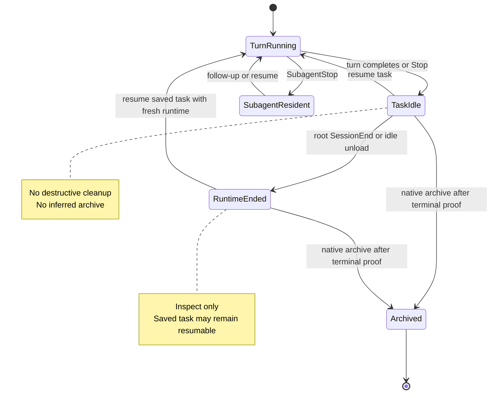
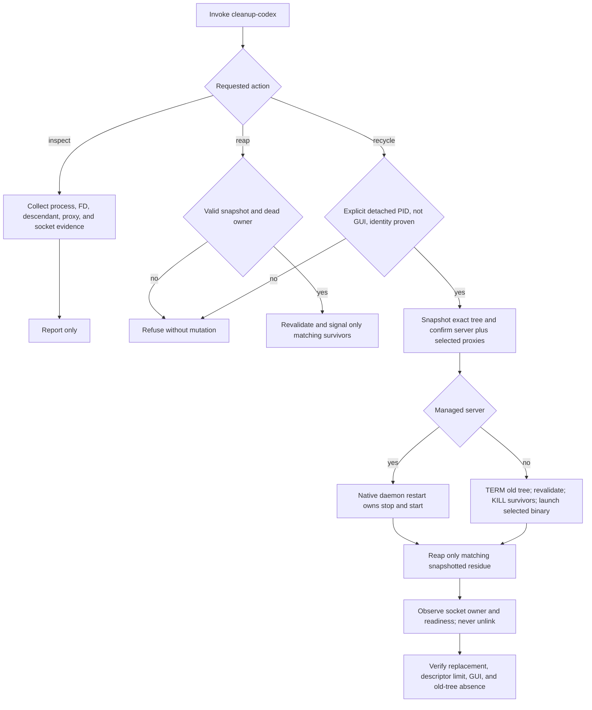

# Codex Runtime Cleanup - Plan

## Goal Capsule

- **Objective:** Add a safe Agent Utilities skill that diagnoses retained Codex runtime resources and can explicitly recycle one verified detached Unix app-server without disturbing the current GUI server or resumable tasks.
- **Authority:** Native Codex and Claude task lifecycle operations decide whether work is complete or archived. The cleanup skill may inspect runtime state, verify native cleanup, and repair a specifically selected stale process tree; it may not infer task completion.
- **Execution profile:** Five implementation units in dependency order, based on `origin/main` at delivery-consolidation commit `1e0bc812f5dfaef689dcae106d329b9da4435f7d` or later.
- **Stop conditions:** Refuse mutation when process identity, ownership, socket ownership, GUI separation, or restart authority is ambiguous. Do not kill on turn completion, `SubagentStop`, idle state, sidebar visibility, or age/descriptor pressure alone.
- **Tail ownership:** The implementing task owns source changes, focused tests, both plugin manifests, documentation, and source validation. Fleet-wide launcher and descriptor-limit configuration remains Machine Utilities work.

---

## Product Contract

### Summary

Agent Utilities will provide a `cleanup-codex` skill with read-only inspection, snapshot-bound orphan reaping, and an explicit guarded recycle for one detached Unix Codex app-server. A root `SessionEnd` hook will perform only a bounded health inspection and record the latest receipt. Delivery workflows will call native archive operations only after their existing terminal criteria, then use cleanup as verification or repair rather than as the archive mechanism.

### Problem Frame

Codex has native session and MCP shutdown paths, but released and long-lived app-server processes can still retain descriptors, MCP stacks, proxies, or other descendants. Raising the soft descriptor limit gives the runtime headroom; it does not reclaim retained resources. Broad process killing is unsafe because a machine can have a current GUI app-server, a detached Unix app-server, visible resumable tasks, and unrelated Node or MCP processes at the same time.

The verified MacBook Pro incident establishes the recovery target. Detached Unix app-server PID `91181` was 3 days 9 hours old at FD `255/256`, with 83 descendants and three stale remote proxy clients. The operator snapshotted that exact tree, sent TERM, sent KILL only to matching survivors, preserved the current GUI app-server and visible tasks, and restarted the Unix server through the user-local Codex wrapper. Replacement PID `33657` inherited soft limit `8192`, owned a ready socket, had 122 descriptors with highest FD 145, and had 19 direct children. The old server, its parent, sampled descendants, and stale proxies were gone. During verification, replacement socket creation raced contemplated stale-socket cleanup; a fresh `lsof` ownership check showed why Agent Utilities must never unlink that path and must leave socket mutation to native startup.

### Actors

- A1. **Operator or agent:** Requests inspection, reviews evidence, and explicitly authorizes a reap or recycle.
- A2. **Lifecycle hook:** Performs bounded read-only inspection after a root runtime ends and records a latest-health receipt.
- A3. **Task Orchestrator:** Proves a visible task terminal, archives it natively, and requests post-archive verification.
- A4. **Codex or Claude host:** Supplies lifecycle events and native task/archive operations with host-specific capabilities.

### Requirements

**Inspection and evidence**

- R1. `cleanup-codex inspect` must be the default, read-only action and must never signal a process, unlink a socket, archive a task, or change host configuration.
- R2. Inspection must report each relevant app-server's PID, parent PID, executable and command identity, start time, age, GUI or detached classification, descriptor count and highest descriptor, descendant summary, remote proxy clients, control-socket path and owner, and any missing evidence.
- R3. Human output must explain the selected candidate and refusals; `--json` must return the same facts in a stable machine-readable result with explicit `action`, `selected`, `skipped`, `warnings`, and `verification` fields. Exit codes must be stable: `0` healthy or successful, `1` warning or pressure, `2` refused/ambiguous/invalid, and `3` attempted cleanup or restart verification failure.
- R4. The skill must classify pressure as a reason to investigate, never as proof of staleness. Default warning thresholds must be overrideable without a config framework.

**Mutation safety**

- R5. `reap` may signal only identities captured by `inspect --snapshot <path>` in a prior exact-tree snapshot whose recorded owner is now conclusively gone; it must revalidate PID, UID, start time, executable, and process-group identity immediately before TERM and before survivor-only KILL.
- R6. `recycle` must require an explicitly selected detached Unix app-server PID, create a pre-mutation receipt naming that server and every selected proxy PID, reject the current GUI app-server, surface all connected proxy clients, and require interactive confirmation or an exact non-interactive token covering every selected PID.
- R7. Treat a server as managed only when native daemon state attests ownership of the exact selected PID. Missing or conflicting attestation is ambiguous and must refuse under R11; it must never fall through to unmanaged signaling. For an attested managed server, recycle must delegate stop/restart ownership to native `codex app-server daemon restart`, then reap only matching snapshotted residue. For an explicitly proven unmanaged server, it must TERM the selected old tree, wait a bounded grace period, KILL only still-matching snapshotted survivors, and restart through the selected launcher. It must never use generic `killall`, name-only selection, or a broad process pattern.
- R8. Agent Utilities must never unlink `app-server-control.sock`. It may observe socket ownership and readiness, but native app-server startup owns locking and stale-socket handling; ambiguous or failed ownership/readiness must fail closed.
- R9. Recycle must use native `codex app-server daemon restart` for a managed server. For an unmanaged server, it must restart through a caller-selected launcher, then `AGENT_UTILITIES_CODEX_BIN`, then the resolved `codex` command or user-local wrapper. It must not install or edit the launcher or descriptor-limit configuration.
- R10. Before stopping an unmanaged server, recycle must validate the expected launcher path and configured minimum soft descriptor limit, default `8192` for macOS recovery. Post-restart verification must prove a new PID and ready socket, require the replacement soft limit to meet that minimum, report descriptor count and highest descriptor, report its direct-child baseline, and prove the old snapshotted server, descendants, parent when applicable, and selected stale proxies are gone.
- R11. A failed identity check, ambiguous server classification, unselected or unclassified proxy, occupied socket, inadequate expected or replacement descriptor limit, concurrent mutation lock, failed restart, or incomplete verification must fail closed with the exact reason and recovery evidence; read-only inspection may run concurrently.

**Lifecycle and delivery behavior**

- R12. `Stop`, completed turns, `SubagentStop`, completed subagent turns, idle tasks, review-ready work, and sidebar presence are nonterminal signals and must not trigger mutation or archival.
- R13. Root `SessionEnd` may run `inspect --hook` only. It must not archive a task or invoke `reap` or `recycle`, because a saved task can remain visible and resumable after its runtime unloads.
- R14. Runtime cleanup and task archival must remain separate actions. Native close/archive is authoritative; cleanup verifies or repairs residual OS resources after the native action.
- R15. Task Orchestrator may archive only after its existing terminal acceptance and report-verification gates, then request post-archive inspection. Goal Driven Delivery must not archive when it stops at locally verified, review-ready, PR-ready, blocked, or owner-action-required state.
- R16. Generic tasks outside terminal delivery workflows must remain visible and resumable until the user or native host archives them.
- R17. The skill must not attempt external per-subagent reclamation when the active multi-agent surface has no close/dispose operation or when a completed agent is documented as resident and resumable.

**Packaging and compatibility**

- R18. The skill and its core executable must work from the Agent Utilities source plugin in Codex and Claude Code; host-specific lifecycle branches must be named rather than presented as false parity.
- R19. The root `SessionEnd` hook is a Codex-specific adapter and must be capability-tested against the supported Codex manifest. Claude must expose the shared skill explicitly without installing a Claude-session hook that scans Codex runtime state.
- R20. Source changes must update and validate both plugin manifests, skill listings, and release metadata as required; implementation must never edit the installed Codex plugin cache as source.
- R21. Inspection and hook receipts must contain process metadata only. They must not capture prompts, transcript content, environment secrets, or command arguments unrelated to process identity.

### Key Flows

- F1. Read-only health inspection
  - **Trigger:** The operator invokes the skill, a delivery workflow requests verification, or root `SessionEnd` invokes hook mode.
  - **Actors:** A1 or A2, A4
  - **Steps:** Discover app-servers; collect process, descriptor, descendant, proxy, and socket evidence; classify candidates and missing proof; emit human or JSON results.
  - **Outcome:** No machine state changes. The result says healthy, investigate, or refused-to-classify.
  - **Covered by:** R1-R4, R11, R13, R21
- F2. Snapshot-bound orphan reap
  - **Trigger:** An operator saved a tool-generated exact-tree snapshot with `inspect --snapshot <path>` and its recorded owner is now gone.
  - **Actors:** A1
  - **Steps:** Validate the snapshot and owner death; revalidate each survivor identity; TERM matching survivors; wait; revalidate and KILL only remaining matches; report skipped identities.
  - **Outcome:** Only provable survivors from the dead owner are reaped.
  - **Covered by:** R5, R7, R11, R21
- F3. Guarded detached app-server recycle
  - **Trigger:** An operator explicitly selects one detached Unix app-server after reviewing inspection evidence.
  - **Actors:** A1, A4
  - **Steps:** Revalidate selection, GUI separation, proxies, and restart preconditions; snapshot the exact tree; confirm every selected PID; use native daemon restart for a managed server or exact-tree TERM/KILL plus the selected launcher for an unmanaged server; reap only matching residue; observe socket ownership without unlinking it; verify replacement health and old-tree absence.
  - **Outcome:** The selected detached server is replaced without changing the GUI server or saved tasks.
  - **Covered by:** R6-R11, R16, R21
- F4. Terminal delivery closeout
  - **Trigger:** Task Orchestrator has verified all task acceptance criteria.
  - **Actors:** A3, A4, A1
  - **Steps:** Retitle terminal task; invoke native archive; inspect runtime cleanup; use explicit repair only when residual ownership is proven.
  - **Outcome:** The terminal task is archived and any provable residual runtime is reported or repaired; nonterminal tasks are unchanged.
  - **Covered by:** R12-R17

### Acceptance Examples

- AE1. **Root runtime ends while its saved task remains visible.** Given a root `SessionEnd`, when the hook runs, then it records inspection evidence only and the task remains resumable. Covers R12-R14 and R16.
- AE2. **Completed v2 subagent remains resumable.** Given a `SubagentStop` and no exposed close operation, when the parent consumes the result, then cleanup sends no signals and does not archive either task. Covers R12 and R17.
- AE3. **Pending delivery work is review-ready.** Given Goal Driven Delivery reaches a locally verified or PR-ready stop, when the workflow returns, then no archive or destructive cleanup occurs. Covers R15-R16.
- AE4. **Terminal directed task is archived.** Given Task Orchestrator verifies terminal evidence, when it archives the task, then native archive runs before read-only cleanup verification. Covers R14-R16.
- AE5. **Detached Unix server and healthy GUI server coexist.** Given an explicit detached PID and a separate GUI app-server, when recycle runs, then only the detached server and its snapshotted tree are replaced and the GUI PID remains alive. Covers R6-R11.
- AE6. **PID identity changes after snapshot.** Given a process exits and its PID is reused, when mutation revalidates identity, then it skips the PID and returns a refusal without signaling the replacement. Covers R5, R7, and R11.
- AE7. **Replacement wins the socket race.** Given a replacement owns `app-server-control.sock` during verification, when cleanup observes ownership, then it preserves the socket and leaves all stale-socket mutation to native startup. Covers R8 and R11.
- AE8. **TERM leaves survivors.** Given matching snapshotted descendants ignore TERM, when the grace period ends, then KILL targets only survivors whose identities still match. Covers R5 and R7.
- AE9. **MacBook recovery baseline.** Given a detached server near FD 256 with 83 descendants and three stale proxies, when the receipt and confirmation name the server and all three proxy PIDs and guarded recycle succeeds through the user-local Codex wrapper, then the replacement reports soft limit 8192, a ready owned socket, a lower descriptor/child baseline, old-tree absence, and no GUI disruption. Covers R6-R10.

### Success Criteria

- A focused automated test suite proves selection refusal, PID reuse protection, snapshot-bound survivor escalation, concurrent-mutation refusal, GUI preservation, and the socket-ownership race without signaling real Codex processes.
- A guarded local canary reproduces the inspect and recycle protocol against controlled fixture processes before any live Codex canary.
- One live opt-in canary demonstrates the MacBook evidence contract: selected old tree absent, GUI server unchanged, replacement socket ready, descriptor limit reported, and receipts contain no session content.
- Both plugin manifests and all changed skill frontmatter validate from source; a source install/reinstall exposes the skill and supported hook without editing the plugin cache.

### Scope Boundaries

**In scope**

- macOS process inspection and guarded cleanup for Codex app-server trees;
- a shared Codex/Claude skill surface with explicit host differences;
- a read-only Codex root `SessionEnd` health hook;
- delivery workflow guidance for native archive followed by verification;
- source tests, documentation, and plugin packaging.

**Deferred**

- external per-subagent reclamation until Codex exposes a reliable close/dispose operation and ownership metadata on the active tool surface;
- automatic recycle based on subscriber presence until app-server exposes authoritative attached-client state;
- other operating systems after equivalent process identity, socket, and process-group guards are designed and tested.

**Outside this plan**

- installing or changing `launchd`, `maxfiles`, shell profiles, system LaunchDaemons, user LaunchAgents, or the user-local Codex wrapper;
- generic task archival, idle-task cleanup, or sidebar cleanup;
- a cleanup daemon, periodic kill loop, persistent ownership database, generic MCP killer, or `killall` command;
- changes to the upstream `openai/codex` runtime.

### Dependencies and Risks

- Implementation must use `origin/main` at delivery-consolidation commit `1e0bc812f5dfaef689dcae106d329b9da4435f7d` or later. That landed change updates `delivery-director` (the former name of `task-orchestrator`), `goal-driven-delivery`, both manifests and documentation, and removes `orchestrate`; do not restore the removed skill.
- PID and process-group reuse can target unrelated work. Every mutation needs fresh identity validation immediately before each signal.
- Current Codex source performs explicit MCP runtime shutdown before root `SessionEnd`, and `SessionEnd` is root-only, advisory, capped at three seconds, and used on unload/archive/delete/shutdown. Hook work must stay bounded and diagnostic.
- Current app-server keeps an unsubscribed root thread loaded for 30 idle minutes before unload. A finished turn is therefore not a runtime-end signal.
- Plugin-bundled hook support has changed across Codex versions. Validate the minimum supported version and retain the explicit skill path.
- The app-server does not expose enough supported subscriber-presence data to automate safe detached-server recycling. The current open subscriber-presence request confirms this limitation.
- Upstream cleanup has improved since the original reports. The skill is a guarded recovery tool for residual or detached runtimes, not a replacement for native teardown.

### Sources and Research

- Agent Utilities patterns: `AGENTS.md`, `README.md`, `plugins/agent-utilities/skills/skill-cleaner/scripts/skill-cleaner.ts`, and `plugins/agent-utilities/skills/skill-cleaner/scripts/skill-cleaner.test.ts`.
- Delivery consolidation baseline: `origin/main` commit `1e0bc812f5dfaef689dcae106d329b9da4435f7d` updates `delivery-director` (the former name of `task-orchestrator`), `goal-driven-delivery`, plugin metadata and documentation, and removes `orchestrate`.
- Codex lifecycle source at commit `322d5b96cfa5c8fd52bd83ecfdb79cd9b330205f`: [app-server thread unload and SessionEnd contract](https://github.com/openai/codex/blob/322d5b96cfa5c8fd52bd83ecfdb79cd9b330205f/codex-rs/app-server/README.md), [session runtime shutdown order](https://github.com/openai/codex/blob/322d5b96cfa5c8fd52bd83ecfdb79cd9b330205f/codex-rs/core/src/session/handlers.rs), [v1 close-agent subtree shutdown](https://github.com/openai/codex/blob/322d5b96cfa5c8fd52bd83ecfdb79cd9b330205f/codex-rs/core/src/agent/control/legacy.rs), and [v2 active tool registration](https://github.com/openai/codex/blob/322d5b96cfa5c8fd52bd83ecfdb79cd9b330205f/codex-rs/core/src/tools/spec_plan.rs).
- Upstream lifecycle reports: [subagent MCP stacks remaining after close](https://github.com/openai/codex/issues/25015), [eager per-session MCP retention](https://github.com/openai/codex/issues/21984), [MCP manager replacement leakage](https://github.com/openai/codex/issues/18881), and [desktop task cleanup fixed by explicit MCP shutdown](https://github.com/openai/codex/issues/12491).
- Automation boundary: [subscriber-presence API request](https://github.com/openai/codex/issues/35676) and current [plugin-bundled hook implementation](https://github.com/openai/codex/blob/322d5b96cfa5c8fd52bd83ecfdb79cd9b330205f/codex-rs/core/src/session/mod.rs).

---

## Planning Contract

### Key Technical Decisions

- KTD1. **Use one skill-local Node executable and no daemon.** Implement `cleanup-codex` with one plain `.mjs` executable plus `node:test` tests. This uses the existing executable-skill pattern while remaining compatible with Claude's Node 18 baseline. A daemon or ownership database is unnecessary. Governs R1-R11 and R18-R21. (session-settled: user-approved — chosen over a host-wide kill loop: automatic broad cleanup cannot prove task or process ownership.)
- KTD2. **Expose `inspect`, `reap`, and `recycle` as separate authority levels.** Inspection is freely callable; reap requires a prior exact-tree snapshot; recycle requires an explicit detached PID and confirmation. One host-local mutation lock serializes reap and recycle. This makes the destructive boundary visible to both humans and agents. Governs R1-R11.
- KTD3. **Keep hooks audit-only.** Register only root `SessionEnd` inspection. Never bind mutation to `Stop` or `SubagentStop`. SessionEnd runs after native runtime shutdown and cannot prove that a saved task should be archived. Governs R12-R19. (session-settled: user-directed — chosen over cleanup on every completed agent turn: completed turns and subagents can remain resumable.)
- KTD4. **Native lifecycle operations remain authoritative.** Task Orchestrator archives only after its terminal gates; cleanup then verifies or repairs provable residue. Goal Driven Delivery and generic tasks do not archive at review-ready or idle states. Governs R12-R17. (session-settled: user-directed — chosen over archiving all apparently completed tasks: visible work may still be active or intentionally resumable.)
- KTD5. **Use immutable identity evidence at every signal boundary.** Snapshot PID, PPID, PGID, executable, command identity, and start time; revalidate immediately before TERM and again before KILL. PID, name, age, and pressure alone never authorize mutation. Governs R5-R8 and R11.
- KTD6. **Observe socket ownership but never unlink externally.** A path that looked stale before restart can be owned by the replacement by the time verification runs. Agent Utilities reports ownership/readiness and fails closed; native app-server startup alone owns locking and stale-socket mutation. Governs R8-R11. (session-settled: user-directed — chosen over external stale-socket unlink: the proven replacement race can delete a live server's socket.)
- KTD7. **Prefer native daemon lifecycle and keep the descriptor-limit wrapper separate.** Classify a server as managed only when native daemon state attests ownership of the exact selected PID; missing or conflicting attestation refuses rather than defaulting to unmanaged cleanup. Use the native daemon restart as stop/start owner for an attested managed server because it already owns locking, binary selection, socket preparation, and readiness. Resolve an explicitly proven unmanaged restart launcher through an explicit flag, `AGENT_UTILITIES_CODEX_BIN`, the current `codex` command, or the user-local wrapper; validate its expected minimum soft limit before stopping and require the replacement to meet that limit afterward. Do not manage launchd or shared machine configuration from this plugin. Governs R7-R10 and R20. (session-settled: user-approved — chosen over plugin-installed host configuration: the wrapper is already the fleet safety fuse and cleanup addresses retained resources.)
- KTD8. **Ship host parity at the skill contract, not by pretending lifecycle parity.** Codex and Claude share commands, evidence, and safety gates. Hook registration and lifecycle semantics use documented host branches and fall back to explicit invocation when unsupported. Governs R18-R20.
- KTD9. **Do not reimplement upstream teardown.** Current Codex already shuts down MCP runtime and session processes. The skill detects and recovers exceptional residual/detached trees and keeps its selectors narrow enough to delete when upstream makes the workaround unnecessary. Governs R1, R5-R17.

### High-Level Technical Design

The diagrams define safety and sequencing. They do not prescribe internal function signatures.





```mermaid
sequenceDiagram
  participant O as Operator or delivery workflow
  participant C as cleanup-codex
  participant Old as Selected detached app-server
  participant New as Replacement app-server
  participant GUI as Current GUI app-server
  O->>C: recycle explicit PID
  C->>C: prove identity and snapshot exact tree
  C->>GUI: record preservation baseline
  C-->>O: show evidence and request confirmation
  O->>C: confirm exact server and selected proxy PIDs
  alt Managed server
    C->>New: native daemon restart owns stop and start
    C->>C: reap matching snapshotted residue only
  else Unmanaged server
    C->>Old: TERM
    C->>C: revalidate survivors
    C->>Old: KILL matching survivors only
    C->>New: start through validated launcher
  end
  C->>C: observe socket owner and readiness; never unlink
  C->>New: verify ready socket, FD limit, FD and child baseline
  C->>GUI: verify original PID remains alive
  C-->>O: final receipt or exact failure
```

### Implementation Constraints

- Start implementation from `origin/main` at `1e0bc812f5dfaef689dcae106d329b9da4435f7d` or later; do not restore the removed `orchestrate` skill.
- Keep the executable macOS-only for mutation in this plan. Other platforms return a clear unsupported result; do not approximate process identity with weaker evidence.
- Use Node standard-library modules and existing macOS commands through argument-array process calls. Do not add a package manifest or runtime dependency.
- Keep the hook below Codex's three-second `SessionEnd` cap. Hook mode must inspect only the owning app-server ancestry and its bounded direct health summary; it must not scan session histories or perform a machine-wide `lsof`. Support one documented environment opt-out.
- Store at most one latest hook health receipt per app-server identity under the user state directory, with mode `0600` and atomic replacement. Manual full inspection may prune receipts only for identities proven absent. Manual invocations return their full receipt to the caller; no append-only process registry is introduced.
- The script must make discovery and decision functions injectable so tests use fixtures and fake signal/command adapters. Tests must never target live Codex processes.

### Sequencing

1. Update the implementation worktree to `origin/main` at delivery-consolidation commit `1e0bc812f5dfaef689dcae106d329b9da4435f7d` or later.
2. Implement U1 before destructive behavior so every later unit shares one result and refusal contract.
3. Implement U2 before U3; guarded recycle consumes the same snapshot and survivor-revalidation primitives.
4. Implement U4 after the executable is stable because the hook timeout and packaging depend on its final inspect path.
5. Implement U5 last against the reconciled delivery architecture and its terminal criteria.

---

## Implementation Units

### U1. Cleanup skill and read-only inspection contract

- **Goal:** Add the shared skill, command surface, stable result schema, and macOS read-only inventory.
- **Requirements:** R1-R4, R11, R18, R21
- **Files:** `plugins/agent-utilities/skills/cleanup-codex/SKILL.md`; `plugins/agent-utilities/skills/cleanup-codex/scripts/cleanup-codex.mjs`; `plugins/agent-utilities/skills/cleanup-codex/scripts/cleanup-codex.test.mjs`
- **Approach:** Follow the `skill-cleaner` executable-skill layout. Use Node standard library only. Separate OS collection from pure classification so fixture tests cover process, descriptor, proxy, and socket states. Define `inspect` as the default command, support human and JSON output, and implement stable exit codes from R3.
- **Test scenarios:** A healthy GUI-only fixture reports no mutation candidate; GUI plus detached Unix servers are classified separately; incomplete `ps` or `lsof` evidence produces a refusal reason; FD/age/child thresholds warn but never authorize action; JSON omits transcript and unrelated command content.
- **Verification:** `node --test plugins/agent-utilities/skills/cleanup-codex/scripts/cleanup-codex.test.mjs`; run `cleanup-codex.mjs inspect --json` and confirm no mutation occurs.

### U2. Snapshot-bound identity and orphan reaping

- **Goal:** Add exact-tree snapshots and safe TERM/KILL escalation for survivors of a conclusively dead owner.
- **Requirements:** R5, R7, R11, R21
- **Dependencies:** U1
- **Files:** `plugins/agent-utilities/skills/cleanup-codex/scripts/cleanup-codex.mjs`; `plugins/agent-utilities/skills/cleanup-codex/scripts/cleanup-codex.test.mjs`; `plugins/agent-utilities/skills/cleanup-codex/SKILL.md`
- **Approach:** Reuse the U1 identity record. Make `inspect --snapshot <path>` atomically write a complete mode-`0600` exact-tree snapshot containing owner and descendant identities; make `reap --snapshot <path>` consume it. Prove owner absence, revalidate every target before TERM, wait a bounded grace period, and revalidate before KILL. Report every skipped or changed identity.
- **Test scenarios:** A matching dead-owner fixture reaps only recorded survivors; a live owner refuses; PID reuse, changed UID, executable, start time, or PGID skips the process; a TERM-responsive process is not KILLed; a TERM-resistant matching survivor is KILLed; an unrelated child that joins later is untouched; a second mutation refuses while the host lock is held.
- **Verification:** Run the focused node tests; run a controlled fixture process group and prove `reap` removes only the snapshotted children.

### U3. Guarded detached app-server recycle

- **Goal:** Implement the proven exact-PID recycle, restart, socket-race guard, and end-to-end verification.
- **Requirements:** R6-R11, R16, R21
- **Dependencies:** U2
- **Files:** `plugins/agent-utilities/skills/cleanup-codex/scripts/cleanup-codex.mjs`; `plugins/agent-utilities/skills/cleanup-codex/scripts/cleanup-codex.test.mjs`; `plugins/agent-utilities/skills/cleanup-codex/SKILL.md`
- **Approach:** Require `recycle --pid`. Reuse U2 snapshot and escalation. Reject GUI ancestry and ambiguous proxy/subscriber evidence. Name every selected proxy PID in the receipt and confirmation token, link it to the chosen server/socket with process evidence, and revalidate PID, UID, start time, and executable before signaling. Treat the server as managed only when native daemon state attests ownership of that exact PID; missing or conflicting attestation refuses. For an attested managed server, delegate stop/start to native daemon restart and reap only matching residue. For an explicitly proven unmanaged server, validate the launcher and expected minimum soft limit before exact-tree TERM/KILL and restart. Poll readiness within a bounded timeout, observe socket ownership without unlinking, and require the replacement to meet the configured minimum soft limit. Emit one receipt containing before, actions, after, and preservation checks.
- **Test scenarios:** Explicit GUI or editor PID refuses; ambiguous detached PID refuses; exact server-and-proxy confirmation is required without a TTY; an unselected or unclassified proxy refuses; PID-reused proxy refuses; exact-PID daemon attestation selects managed restart; missing or conflicting daemon attestation refuses without falling through to unmanaged signals; explicitly proven unmanaged server uses the resolved wrapper fallback; an expected launcher below the minimum limit refuses before stop; replacement PID differs and GUI baseline survives; replacement-owned and unowned socket paths are never unlinked; restart failure, inadequate replacement limit, and readiness timeout return incomplete verification; old-tree absence is reported; the MacBook incident fixture yields the expected guarded selection and after-state.
- **Verification:** Run node tests; run an isolated fake app-server/socket canary; only with explicit operator approval, run a live canary and compare the receipt against AE9.

### U4. Bounded root SessionEnd inspection and plugin packaging

- **Goal:** Package the shared skill for Codex and Claude, plus a Codex-only root `SessionEnd` read-only health receipt.
- **Requirements:** R12-R14, R18-R21
- **Dependencies:** U1
- **Files:** `plugins/agent-utilities/hooks/hooks.json`; `plugins/agent-utilities/.codex-plugin/plugin.json`; `plugins/agent-utilities/.claude-plugin/plugin.json`; `plugins/agent-utilities/skills/cleanup-codex/scripts/cleanup-codex.mjs`; `plugins/agent-utilities/skills/cleanup-codex/scripts/cleanup-codex.test.mjs`; `README.md`
- **Approach:** Register only Codex `SessionEnd` and invoke the executable's bounded hook mode for the owning app-server. Atomically replace one mode-`0600` latest-state receipt per app-server identity and remain silent when healthy. Support a documented environment opt-out. Keep explicit skill invocation for Claude and for Codex versions that do not load plugin hooks. Update both manifests and the README skill table without touching installed cache.
- **Test scenarios:** Codex hook input runs inspect only; hook mode cannot select mutation subcommands; repeated runs replace rather than append receipts; the opt-out performs no inspection; an unavailable state directory fails harmlessly; subagent and Stop payloads do not route to mutation; the Codex manifest loads the hook while the Claude manifest exposes only the skill; Codex hook execution stays below three seconds on a controlled fixture.
- **Verification:** Validate both manifests with JSON parsing and the repository/plugin validators; run the focused node tests; install from source through the documented cachebuster/reinstall flow and confirm the skill and supported hook are discovered.

### U5. Delivery lifecycle integration and operator guidance

- **Goal:** Integrate cleanup with the reconciled delivery architecture without changing terminal ownership or archiving generic work.
- **Requirements:** R12-R17, R20
- **Dependencies:** U3, U4, and `origin/main` at `1e0bc812f5dfaef689dcae106d329b9da4435f7d` or later
- **Files:** `plugins/agent-utilities/skills/task-orchestrator/SKILL.md`; `plugins/agent-utilities/skills/goal-driven-delivery/SKILL.md`; `docs/delivery-workflows.md`; `README.md`
- **Approach:** Extend Task Orchestrator's existing terminal sequence with native archive followed by `cleanup-codex inspect`; allow explicit reap/recycle only when inspection proves its stronger preconditions. If archive succeeds but cleanup verification fails, keep the orchestrator active with the child recorded as archived and the cleanup lane unresolved. State that Goal Driven Delivery's review-ready exits do not archive or mutate runtime. Update the landed workflow documentation. Do not restore or integrate the removed `orchestrate` skill.
- **Test scenarios:** Terminal directed task archives then inspects; archive succeeds but cleanup verification fails and the orchestrator remains active; blocked or nonterminal directed task stays visible; GDD review-ready and PR-ready exits do not archive; generic visible tasks remain resumable; v2 completed subagent without close capability is left resident; explicit post-archive repair refuses without ownership proof.
- **Verification:** Manually trace each documented route against AE1-AE4; validate changed skill frontmatter; search for conflicting guidance that archives on Stop, SubagentStop, idle, or review-ready states.

---

## Verification Contract

| Gate | Command or evidence | Applies to | Done signal |
|---|---|---|---|
| Focused behavior tests | `node --test plugins/agent-utilities/skills/cleanup-codex/scripts/cleanup-codex.test.mjs` | U1-U4 | All identity, refusal, escalation, managed/unmanaged restart, no-unlink socket-race, receipt, and hook tests pass without touching live Codex PIDs. |
| Existing regression test | `npx tsx plugins/agent-utilities/skills/skill-cleaner/scripts/skill-cleaner.test.ts` | U1-U5 | Existing executable skill behavior remains green. |
| JSON manifests | `node -e 'for (const p of process.argv.slice(1)) JSON.parse(require("node:fs").readFileSync(p,"utf8"))' plugins/agent-utilities/.codex-plugin/plugin.json plugins/agent-utilities/.claude-plugin/plugin.json` | U4-U5 | Both manifests parse. |
| Skill frontmatter | Use the installed skill-creator `quick_validate.py` on each changed skill directory. | U1, U5 | Every changed skill has valid YAML frontmatter and required files. |
| Plugin packaging | Use the installed plugin validator against `plugins/agent-utilities`, then perform the documented source cachebuster/reinstall flow. | U4-U5 | Source validates; the installed version exposes `cleanup-codex`; supported plugin hook discovery is proven without cache edits. |
| Controlled process canary | Launch fixture owner/children/socket processes, run inspect/reap/recycle, and compare PIDs and receipts. | U2-U3 | Only selected fixture identities die; replacement socket race and PID reuse guards pass; Agent Utilities never unlinks the socket. |
| Live opt-in canary | Snapshot one explicitly selected detached Unix server and the current GUI baseline, then run guarded recycle. | U3 | Replacement ready; configured minimum soft limit satisfied; old tree/proxies absent; GUI PID and visible tasks unchanged; Agent Utilities performed no socket unlink. |
| Lifecycle review | Trace `SessionEnd`, `Stop`, `SubagentStop`, archive, review-ready, and resume flows against current Codex source and both delivery skills. | U4-U5 | No nonterminal event triggers mutation or archive; post-archive inspection is ordered after native archive. |

`release:validate` does not exist in this repository. Do not invent it. If implementation changes the plugin version, follow `AGENTS.md` release coupling and validate the corresponding marketplace metadata in its owning repository.

---

## Definition of Done

- R1-R21 are implemented and trace to U1-U5 and AE1-AE9.
- The cleanup skill defaults to read-only inspection and every destructive path fails closed on ambiguous identity or ownership.
- No code path signals by name, age, descriptor pressure, task visibility, or nonterminal lifecycle event alone.
- Socket ownership/readiness observation is tested, and no Agent Utilities path unlinks the control socket.
- Task Orchestrator archives only after terminal proof and inspects afterward; Goal Driven Delivery and generic tasks remain non-archiving at review-ready or idle states.
- Implementation is based on `origin/main` at `1e0bc812f5dfaef689dcae106d329b9da4435f7d` or later, and the removed `orchestrate` skill is not reintroduced.
- Focused tests, the existing skill-cleaner regression test, manifest parsing, skill validation, plugin validation, controlled canary, and lifecycle review pass.
- A live canary is performed only with explicit operator approval and proves GUI/task preservation plus replacement health.
- Both source manifests, README, skill metadata, and workflow documentation describe actual supported behavior and host differences.
- The implementation neither edits plugin cache nor changes launchd, descriptor limits, or the wrapper.
- Hook receipts are bounded, private, process-metadata-only, and do not grow without limit.
- Abandoned experiments, unused helpers, temporary snapshots, and fixture processes are removed before completion.

---

## Appendix

### Lifecycle decision matrix

| Signal or state | Runtime action | Task action | Reason |
|---|---|---|---|
| Turn completes or `Stop` | None | None | The task is idle and resumable. |
| `SubagentStop` | None | None | The child may be resident and resumable. |
| Root `SessionEnd` | Read-only inspect | None | Runtime ended; saved task may remain resumable. |
| Native v1 `close_agent` succeeds | Inspect residuals only | Native spawn edge closes | Native subtree shutdown owns the lifecycle. |
| Active surface has no close/dispose | None | None | External ownership is insufficient. |
| Goal Driven Delivery is review-ready or PR-ready | None | None | Owner or review work may remain. |
| Task Orchestrator proves terminal and archives | Inspect, then explicit repair only with proof | Archive | Terminal evidence authorizes native archive first. |
| Explicit operator selects a detached Unix server | Guarded recycle | None | Server repair must not change saved-task state. |

### Operational refusal examples

- Refuse when the selected PID belongs to the current GUI app-server or shares its application ancestry.
- Refuse when PID, executable, start time, or process group changed between observation and signal.
- Refuse when any remote proxy is unselected, unclassified, no longer matches its receipt identity, or cannot be linked to the selected server/socket by process evidence; display it for the operator.
- Never unlink the control socket; report ownership/readiness and leave stale-socket mutation to native startup.
- Refuse automatic recycle when subscriber presence cannot be proven.
- Refuse per-subagent killing when only the long-lived app-server owns the observed MCP children.
