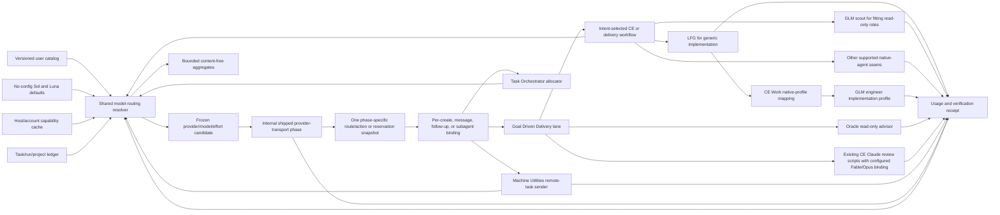
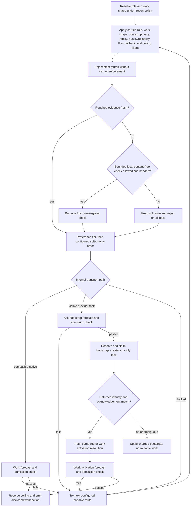
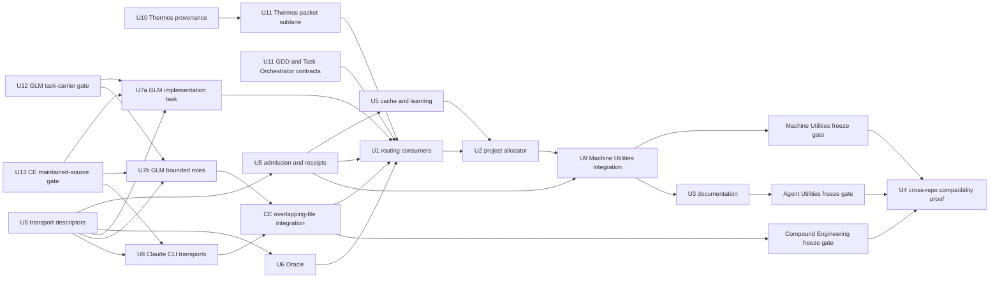

# Delivery Routing, Execution Discipline, and Model Policy - Plan

## Goal Capsule

- **Objective:** Extend the shipped delivery-routing contract with one configurable, budget-aware model policy that selects the built-in safe defaults or only providers and models the user has configured and the destination host can support, including every downstream task/chat/subagent action.
- **Authority:** Explicit user policy overrides built-in preferences. Repository instructions, privacy and budget limits, installed adapter capabilities, and existing Compound Engineering boundaries constrain every route.
- **Execution profile:** When configured fleet or account routing is active, Task Orchestrator is the preferred software-delivery intake and project allocator even when it fast-paths to one lane. Goal Driven Delivery owns each host-local delivery lane. Explicit local/no-fleet work may enter GDD directly. Machine Utilities remains owner of its host/readiness and remote-execution mechanics while consuming the same routing skill. LFG remains the implementation-delivery engine.
- **Default behavior:** With no user catalog, preserve Sol High/Max orchestration and review, Luna at Max for most implementation, and the shipped disclosed Terra-at-Max substitution only when the active runtime verifies Luna is unavailable or unselectable and no explicit user or repository requirement wins. Preserve LFG-first delivery, canonical writers, and the existing terminal-state rules. Do not probe or assume GLM, Fable, Opus, Oracle, or any other optional route.
- **Configured behavior:** Re-evaluate workflow intake on every user turn, then resolve a frozen policy snapshot for each work-starting or steering action from the user catalog, host-scoped capability evidence, privacy requirements, context and role fit, forecast budget, and explicit preferences while retaining run/project ownership. Every fallback and unknown must remain visible.
- **Terminal state:** Planning, brainstorming, diagnosis, review-only, and local-only requests end at the requested artifact. Implementation delivery ends after merge and post-merge proof unless the user requests a narrower stop.
- **Tail ownership:** LFG owns plan through CI and review settlement. Goal Driven Delivery owns authorized merge and post-merge proof. Task Orchestrator verifies lane and integrated evidence without executing child work.

---

## Product Contract

### Summary

This is the only active implementation plan for configurable model selection, execution discipline, and budget policy. Its original intent routing, LFG-first delivery, branch, stack, writer, and terminal-state requirements are already represented on the current default branch. This deepening preserves their identifiers and adds a shared model catalog, deterministic resolver and named skill entrypoint, cached capability evidence, budget reservation ledger, privacy-conscious outcome learning, supported review adapters, per-action task/subagent routing, bounded Machine Utilities adoption, and the minimum execution controls required by the Fleet Privilege Brokers retrospective.

The narrower [`2026-08-03-002-fix-cross-provider-thread-routing-plan.md`](2026-08-03-002-fix-cross-provider-thread-routing-plan.md) is completed historical transport evidence, not a second implementation track. Its shipped `plugins/agent-utilities/references/provider-task-routing.md` contract remains the source policy for transport trust-domain compatibility, native-child eligibility, the visible provider-task bridge with post-creation identity and acknowledgement verification, secret-free handoff acknowledgement, and provider-local nesting. This plan incorporates that behavior into one public `agent-utilities:model-routing` lifecycle rather than making callers coordinate two routers. The existing reference remains the focused normative transport section behind that entrypoint; Goal Driven Delivery, Task Orchestrator, Thermos, Machine Utilities, and future consumers call only the versioned model-routing contract and receive the appropriate phase-specific model/effort/budget/transport decision and receipt.

The smallest design that holds is a versioned user-owned JSON file; one dependency-free Node resolver with private bounded state behind a thin `agent-utilities:model-routing` skill, incorporating the shipped provider-task transport phase; the existing Oracle skill as a read-only advisor; one bounded caller binding into Compound Engineering's existing cross-model Claude review adapter; two fixed GLM separate-task profile carriers; narrow consumer changes to Goal Driven Delivery, Task Orchestrator, and Thermos; a bounded Machine Utilities consumer update; and one delegated-slot contract adopted at the specific Compound Engineering egress seams that need it. In the schema, a carrier ID names one such fixed executable adapter; it is not a service or another agent. The design adds no second router, service, database, telemetry backend, provider client framework, second Claude wrapper, copied cross-plugin resolver, or speculative Kimi, Qwen, or local-model integration.

### Problem Frame

The shipped delivery skills still carry Sol/Luna/Terra/Fable choices in workflow prose while the provider-task contract separately owns transport safety. They cannot distinguish catalog availability from actual invocation transport or explain that GLM-5.2 is a separate-task profile while Fable/Opus are Claude `-p` CLI routes. The remaining gaps are workflow routing, bounded handoff, objective/artifact closure, and execution cadence; trying every configured model through the Codex model selector creates false “unavailable” results and wasted retries.

The existing `agent-utilities:oracle` skill already provides a strong, long-context, one-shot review route through a signed-in standard ChatGPT conversation or a separately metered API. It is not connected to delivery routing, has long-running detachable sessions, and cannot cheaply prove account entitlement or exact served model identity. A Codex agent may launch Oracle, but the admitted browser child still executes on the ChatGPT surface rather than Codex or the OpenAI API. For a verified browser route on an eligible configured subscription, its own marginal per-call cash, Codex-credit use, and API bill are zero; ChatGPT model allowance, fixed subscription allocation, wall-clock time, latency, and the parent Codex orchestration remain separate budget dimensions.

The current Fable and Opus families are similarly account- and adapter-dependent. Today the provider-maintained `fable` and `opus` aliases target generation 5, but a reusable policy must follow an attested current-family alias when it advances to 5.1 or later rather than force the user to blacklist yesterday's model. Exact pins and minimum generations remain available for reproducibility. The installed Claude CLI can cheaply prove its version and authentication context, but not Fable entitlement, effective effort, or exact served/fallback model without a real routed invocation. Compound Engineering already has read-only, least-privilege cross-model review scripts that invoke the signed-in Claude CLI and parse `modelUsage`; those scripts currently choose a fixed Opus alias and do not accept a budget-bound caller model/effort binding. The implementation should extend those existing scripts narrowly so configured Fable review actually works while Goal Driven Delivery never duplicates their transport, sandbox, persona, or synthesis machinery.

The policy therefore needs to distinguish configured intent, measured facts, heuristics, and learned estimates; filter hard constraints before ranking; reserve conservative budget before dispatch; and be honest when cost or availability is unknown.

### Requirements

#### Existing intent and terminal-state contract

- R1. Route exploratory product framing to `compound-engineering:ce-brainstorm`, plan-only work to `compound-engineering:ce-plan`, diagnosis-only work to `compound-engineering:ce-debug`, existing-PR work to the appropriate review or babysitting route, and generic implementation delivery to `compound-engineering:lfg`.
- R2. Route diagnose-and-fix requests through diagnosis and then LFG without treating diagnosis as delivery completion.
- R3. Keep implementation delivery active through local checks, independent review, feedback resolution, commit and push, PR creation, CI, merge, and post-merge verification unless the user explicitly requests an earlier terminal state.
- R4. Preserve plan-only, brainstorm-only, diagnosis-only, review-only, local-only, and user-directed stop boundaries without silently mutating or shipping.

#### Default orchestration and delivery behavior

- R5. With no model-policy configuration, run Goal Driven Delivery and LFG orchestration on Sol High by default and Sol Max for cross-cutting, release-critical, security-sensitive, multi-repository, or otherwise complex work.
- R6. With no configuration, assign most implementation work to Luna at Max and independent primary review to a separate Sol High or Sol Max context by risk. Only when the active collaboration runtime verifies Luna is unavailable or unselectable and no explicit user or repository model requirement applies, use the shipped cheaper supported Terra-at-Max substitution and disclose `implementation_model_substitute` with the actual model and effort. Optional external or cross-family reviewers are not assumed.
- R7. Use maximum safe parallelism for independent research, implementation, and review work while keeping one canonical writer per mutable scope and serializing dependency, ownership, integration, and budget-reservation conflicts.
- R8. Let Task Orchestrator own global concurrency, host placement, and project budget allocation; let Goal Driven Delivery own its issued lane/run allowance; propagate the frozen route, effort, budget, and completion policy to every lane.

#### Existing integration and compatibility contract

- R9. Give each project or repository one named integration owner and each mutable lane one canonical writer, branch, verification boundary, and handoff.
- R10. When a writable GitHub remote exists, push active lane and integration branches at useful checkpoints so plans, commits, and intermediate state are resumable across agents and machines before PR readiness.
- R11. Distinguish a pushed checkpoint branch from a review-ready branch or open PR; checkpoint publication must not imply completion or trigger review prematurely.
- R12. When stacked delivery is selected against a GitHub upstream, use `gh-stack`; install and verify its GitHub extension and companion skill through the existing authoritative bootstrap only when the capability is missing.
- R13. Keep the retired external context-routing integration absent from maintained guidance and plugin skills; do not create a parallel context router.
- R14. Preserve Thermos, React Doctor, CE review, browser testing, PR monitoring, durable learning, blocker, resume, evidence, and safety contracts that remain applicable.
- R15. Keep user-facing workflow documentation, skill metadata, route defaults, branch checkpoints, stack behavior, model policy, and terminal states consistent.
- R16. Modify maintained source repositories only. Do not edit any installed plugin cache. The GLM implementation includes a companion maintained Compound Engineering source change, but publication/version coupling occurs through its normal separately authorized delivery and release workflow, never by patching cached payloads.

#### Catalog, configuration, and capability evidence

- R17. Load a per-user, versioned JSON catalog that can describe provider and account aliases, adapter and carrier identifiers, execution and billing surfaces, provider/model aliases, requested and provider-facing model identifiers, supported roles and capabilities, effort levels, relative or actual cost metadata, latency, quality/reliability, context limits, privacy/locality/retention, and provider/account constraints.
- R18. Keep the catalog declarative and credential-free. It may reference opaque account labels and carrier/probe IDs, but never contain tokens, cookies, passwords, arbitrary shell commands or flags, executable paths, secret-bearing URLs, prompt text, source code, host inventory, or user-asserted transport trust-domain/decryption compatibility. Executable support and transport compatibility are determined by closed adapter descriptors and declared runtime/tool metadata, not by catalog strings.
- R19. Treat a missing catalog as the static default in R5-R6 with no external probes. Treat a present but invalid catalog, unsupported schema version, unsafe metadata file, or corrupt budget state as a blocking configuration error rather than silently ignoring privacy or hard-budget policy.
- R20. Separate `user_configuration`, `measured_fact`, `maintainer_heuristic`, and `learned_estimate` in both schema and receipts. Record value provenance, observation time, expiry, confidence, and source adapter wherever a fact can age or be inferred.
- R21. Prefer explicit configuration for user policy, then fresh host/account/adapter-scoped measured evidence. Reuse Task Orchestrator's shipped exact deferred/lazy host-catalog discovery before declaring a carrier/tool surface absent; eager-list absence is `unknown`, not unavailable. Inside the same router, retain the provider-task policy's one metadata-only transport/trust-domain discovery pass and prohibition on trial spawns or follow-ups as probes. Apply all config-only privacy, endpoint, carrier, fallback, current-family, and static budget filters before model discovery. In v1, run at most one bounded local, content-free, zero-egress model check per shortlisted provider account only when a required fact is missing or stale. Remote entitlement/model-list probes and paid or browser prompts are work, not discovery; leave their availability `unknown` until configuration or a real admitted invocation supplies evidence.
- R22. Cache positive and negative capability results with class-specific TTLs, invalidate on catalog/policy hash, host, account, adapter path/version, or manual refresh changes, honor bounded provider retry timing, and preserve `unknown` rather than relabeling it `unavailable`.

#### Budget admission, accounting, and disclosure

- R23. Support soft, hard-admission, and strict task, run, and project limits for typed meters including marginal USD, Codex credits, API/provider spend, provider or subscription allowance units when the user can define them, optional allocated subscription USD, active-agent minutes, and elapsed deadlines. A hard-admission limit prevents compliant routed callers from over-allocation before start but cannot intercept a caller that bypasses the admission seam or guarantee a carrier will not exceed its ceiling; a strict limit requires a carrier-enforced maximum for that meter and every downstream call. Keep fixed subscription allocation, marginal per-call cash, Codex credits, API spend, quota pressure, active duration, elapsed deadline, and latency distinct, and never debit the same work to another execution surface merely because its parent agent initiated it.
- R24. Before dispatch, forecast a conservative route ceiling, warn when hard-accounted spend plus outstanding reservations plus forecast crosses a soft limit, and atomically reserve the ceiling for hard-admission or strict limits. A route with unknown maximum cost cannot pass either limit without a user-configured conservative ceiling, and a route without a matching carrier-enforced maximum cannot pass a strict limit.
- R25. When a route would exceed a hard-admission/strict limit or cannot enforce a strict stop, choose a cheaper capable route allowed by policy; otherwise block in non-interactive mode or ask the user to raise/change the limit, change policy, or stop. Never weaken capability, privacy, or reliability requirements merely to fit the budget.
- R26. Track `planned -> reserved -> claimed -> started -> settled`. `admit` requires a caller-generated bounded `requestId`; retrying it returns the original immutable decision and reservation even when the first response was lost. After admission, the caller must durably claim the one allowed dispatch before spawning a carrier. A confirmed pre-claim or carrier-specific proved no-start releases its reservation; a claimed or ambiguous start keeps the ceiling charged until explicit reconciliation. Stable request, decision, reservation, claim, attempt, dispatch, and receipt IDs make resume and imported child receipts idempotent, and a claimed decision is never automatically spawned again.
- R27. Distinguish `forecast`, `reserved`, `measured_usage`, `calculated_estimate`, and `measured_billed`. When billed actual is unavailable, keep the reservation ceiling for hard accounting and report estimates separately. A fixed carrier contract may prove that a meter is not applicable and therefore exactly zero, but absence of a receipt alone may not. If a measured bill exceeds the ceiling, charge the larger measured amount, emit `ceiling_breached`, and freeze new admissions for that scope pending reconciliation.
- R28. Require every selected route and fallback receipt to disclose requested/configured/observed provider, endpoint class, execution surface, billing surface, model, and effort where knowable; carrier/probe identity; charged and explicitly non-applicable meters; forecast/reservation/actual provenance; capability freshness; privacy/egress; reason code; rejected alternatives; parent/child attribution boundary; and any user escalation.

#### Review routing, Oracle, Fable, and Opus

- R29. Keep CE review plus a separate Sol High/Max review as the no-config baseline. Allow configured policy to add read-only roles such as `review.plan`, `review.code`, `review.deep`, `review.architecture`, `review.long_context`, `review.cross_family`, or `review.adversarial` without giving any reviewer canonical-writer or merge authority. Once a route is configured and its standing privacy/egress/retention policy permits it, the resolver may select it automatically without per-review confirmation.
- R30. Reuse `agent-utilities:oracle` as the supported local `oracle-browser` advisor. Express provider intent as the current ChatGPT Pro channel (`chatgpt_current_pro`), currently GPT-5.6 Sol Pro, not as a fixed GPT-5 generation. For Oracle 0.17.0, pass `--engine browser --model gpt-5-pro`: `gpt-5-pro` is the Oracle browser-picker control alias for the UI's current `Pro` option, not the requested or observed model identity. Freeze bounded canonical prompt bytes, the smallest exact regular-file bytes, route arguments, and exclusions into one private input manifest and bundle; run secret/type/size checks and Oracle dry-run against those same bytes; revalidate their SHA-256 digest before egress; bind the result to that frozen input and diff/commit; and report the requested current-Pro channel, version-gated adapter alias, current documented product label, and observed identity separately.
- R31. Treat Oracle browser access as account-dependent and eligible only when the fixed carrier verifies `--engine browser`, the route declares the `chatgpt_standard` execution surface, and the user configures an eligible `subscription_included` account with standing egress and retention authorization. That configuration authorizes implicit selection for fitting review roles; do not ask again per invocation. Authentication readiness comes only from a fresh successful route receipt or a future fixed local attestor; absent either, keep it `unknown` rather than claiming signed-in. Policy may allow one normally admitted browser attempt with unknown auth. If that attempt lands on or reports a login/account-selection surface, stop without clicking, typing, selecting an account, changing credentials, or switching to API; return `auth_context_unavailable`, charge the attempt's time/allowance evidence conservatively, negatively cache the observed context, and take a disclosed fallback or required-route block. This is failure detection; automatic authentication recovery remains outside v1. This user's example ranks Oracle current Pro highly for complex plan/code review and prefers it for deep, architecture, long-context, adversarial, security-sensitive, release-critical, and other high-risk review when privacy, allowance, latency, and deadlines fit. For a verified standard-conversation Oracle child, reserve and report exactly zero marginal per-call USD, zero Codex credits, and zero OpenAI API spend; those zeros come from the verified surface contract and user billing policy, not from guessing at model usage. Remaining ChatGPT model allowance may stay unknown, and configured allowance units, optional fixed-subscription allocation, active-agent minutes, elapsed deadline, and latency remain budget inputs. Attribute any Codex work used to orchestrate or verify the review to the parent run only, never again to the Oracle child.
- R32. Make Oracle readiness selected-route-only and validate executable provenance before the first version, lifecycle, or dispatch command. Routed mode ignores executable/model environment overrides; resolves only the built-in fixed Homebrew carrier in v1; rejects repository-local, group/world-writable, non-regular, or identity-changed executables; requires Oracle 0.17.0 or newer; and uses `steipete/tap/oracle` install/upgrade only under managed-lifecycle authority. Before any Homebrew mutation, require the candidate to pass static suitability and budget preflight and admit a separate bounded lifecycle transaction with its own time/network forecast, reservation, claim, and receipt. Re-resolve and revalidate the formula binary after mutation, then make a fresh final review admission decision and disclose version transitions. Never run network lifecycle work on every invocation or use elevation.
- R33. Treat a detached Oracle browser session as an outstanding nonterminal review dependency. The routed wrapper owns a private user-state Oracle home outside repositories and plugin caches, passes the configured bounded `--retain-hours`, and records only its retention class plus generated opaque session ID/slug, original host digest, start time, frozen-input digest, claim, and reservation. Reattach the same local session after timeout instead of redispatching or reserving twice; clean up only claim-bound terminal sessions at policy expiry. Routed Oracle is local-only in v1; remote Oracle transport is deferred.
- R34. Do not route Oracle API in v1. Catalog/schema vocabulary may describe a future metered `oracle-api` surface, but the resolver returns `unsupported_adapter` until a separate fixed API carrier can pin and attest its provider, endpoint, credential source, model/effort controls, claim, and receipt. Existing manual Oracle API use remains outside this policy and retains its own per-invocation cost consent. Oracle browser never falls back to API, never inherits API authorization, and never asks for API consent.
- R35. Represent current Fable and Opus families as optional configured models with `provider_latest_family`, exact-pin, and minimum-generation modes. The delivered user-policy example ranks the provider-maintained current Fable family first for appropriate difficult cross-family review and the current Opus family as a lower-priority alternate; today those aliases resolve to Fable 5 and Opus 5 and should advance automatically when the provider moves them to 5.1 or later. The example requests High or xhigh for difficult Fable review and requires high-risk justification plus budget headroom for Max. This ordering is user policy, not a universal benchmark claim.
- R36. Extend Compound Engineering's existing cross-model Claude review adapter to accept one validated caller binding for configured `fable` or `opus` review: fixed target/carrier ID, family alias or exact pin, High/xhigh/Max effort, `prefer`/`require`, decision ID, reserved slot ID from the claimed bundle, and constrained fallback policy. The CE review workflow consumes that reserved slot immediately before its existing detached runner, retains its existing persona, least-privilege tool denial, egress disclosure, synthesis, and no-writer rules, and emits provider/credential-source kind, requested family/channel or exact pin, frozen resolution, requested effort, `modelUsage`, cost, and fallback evidence. For the subscription carrier, require a version-attested Claude CLI `--safe-mode` path that preserves the enrolled OAuth/keychain subscription while disabling user/project/local CLAUDE.md, skills, hooks, plugins, MCP, and settings customizations; pair it with the existing fixed tool denial, strict empty MCP surface where supported, and a minimal environment that removes every documented API-key, auth-token, base-URL, Bedrock, Vertex, Foundry, and other third-party provider selector. Do not use `--bare`, which disables OAuth/keychain auth. Admin-managed settings remain an explicit trust input: if the adapter cannot attest that they do not redirect provider, endpoint, credential source, or billing surface, the subscription route is ineligible before egress. An installed or authenticated Claude CLI is capability evidence, not entitlement proof; a missing, signed-out, incompatible, or unattestable route takes a disclosed fallback or required-route block. With no caller binding, preserve Compound Engineering's current internal mapping; do not add an Agent Utilities or GDD Claude runner.
- R37. For Claude-backed routes, freeze the provider-maintained family alias resolution per decision; record requested family/alias, configured resolution, observed primary/fallback identities, requested effort, and effective effort separately; and preserve `unknown` when currentness or effort cannot be attested. Each supported family carrier owns a bounded parser that normalizes an observed identity to the expected family plus a numeric generation tuple and compares tuples component-by-component; never use raw string or generic semantic-version ordering. Unparseable, cross-family, or unattested identities remain unknown/ineligible. Every actual/fallback identity must satisfy the frozen exact pin or minimum generation. A route requiring current-family enforcement is ineligible before egress when the carrier cannot constrain and attest its fallback set; a post-run mismatch is charged but rejected as review evidence and cached only as scoped negative evidence.

#### Privacy-conscious learning and extensibility

- R38. Store routing state privately and locally with no prompts, source, diffs, paths, transcripts, credentials, cookies, raw provider output, human account/host/lane labels, or arbitrary account identifiers. Persist generated opaque IDs or digests and allowlisted reason codes only; bound JSON depth, counts, and string lengths; reject control characters and reserved object keys. Oracle-owned session artifacts and the temporary frozen bundle remain outside resolver state and require explicit egress/local-retention/deletion rules.
- R39. Enable the learning loop automatically by default on supported private-state hosts as an atomic side effect of reconciling each eligible terminal outcome; there is no separate opt-in or caller-owned outcome-recording step. Keep it bounded, inspectable, clearable, disableable, content-free, and entirely local: it may aggregate only role, bounded risk/context bands, the allowlisted categorical work-shape record, route/model/effort identifiers, duration, validated token/cost receipt, retry/failure class, verification outcome, and explicit user rating; it may not upload telemetry or derive or retain prompt/code features. Use a stable outcome ID so duplicate reconciliation updates it once. A user may disable learning globally or tighten its fields/retention at any time.
- R40. Learn only from validated terminal receipts or one stable no-config outcome receipt; ambiguous, claimed, started, detached, or otherwise nonterminal work does not train estimates. Estimate base task demand from route-independent role/risk/context/work-shape buckets. Route-specific latency/retry multipliers require a fixed minimum sample count and capped influence; observational cross-route differences are never labeled measured savings or causal quality. Let learned estimates improve forecasts and tie-breaking only within routes already allowed and ordered by user policy. Learning cannot establish availability, enable a provider, weaken privacy/locality, raise a budget, change a hard constraint, replace a configured preference, or silently rewrite the catalog. Inspect, clear, disable, and enable operations affect only learning state and never capability, budget, reservation, receipt, or policy state.
- R41. Keep provider and model identifiers open-ended so future Kimi, Qwen, and local inference entries require no schema change. Unknown adapter IDs validate as catalog data but remain ineligible with an explicit `unsupported_adapter` reason until a real built-in/host adapter exists; do not add speculative integrations.
- R42. Let a future budget-owner or PM skill call the same resolver, admission, status, and reconciliation contract as a v1 consumer. Task Orchestrator remains the orchestrated project owner until a separately planned epoch-safe ownership protocol exists; the future skill must not duplicate model scoring, capability discovery, or spend accounting.

#### Deployed GLM-5.2 separate-task carrier

- R43. Add fixed carrier descriptors for the exact configured GLM task profiles `glm-5-2-scout` and `glm-5-2-engineer`; catalog data may reference those carrier IDs but may not supply a profile, provider override, command, flag, endpoint, or path. The current fleet profiles attest requested model `glm-5.2`, scout effort High, engineer effort xhigh, and a 200,000-token host-adapter context ceiling. The current host profile's provider key is `zai_litellm` with display name `Z.ai Coding Plan via LiteLLM`; record that as scoped measured/configured evidence, not a universal provider name or reusable default. These are separate-task carriers under R57, not native subagent types or Codex model-selector entries.
- R44. Keep workflow intent selection ahead of model selection; selecting GLM never forces another workflow into LFG. V1 may create an authorized scout task for bounded research/investigation/secondary review and an engineer task for already-legitimized implementation or fix execution. The selected role must not take plan-author, reasoning-elevation, root-cause, primary/security/adversarial/validator review, independent-Sol, legitimacy, outward-mutation, or child-dispatch authority. Enforce those limits through R68 carrier attestations when available; otherwise label the boundary cooperative and exclude roles requiring hard isolation. `ce-babysit-pr` passes only a bounded pipeline contract and never treats GLM as a native subagent. Every workflow retains canonical-writer, verification, review, and completion authority.
- R45. Treat the LiteLLM listener as a local transport bridge to external Z.ai processing, never as local inference or proof of privacy, entitlement, quota, or served identity. Reuse Task Orchestrator/Fleet Readiness evidence for the exact separate-task profiles, task carrier, model catalog, provider binding, and destination host; only when a shortlisted selected route has stale bridge evidence may one bounded content-free loopback health check run and be cached. Never send a prompt, query remote model availability, or hit Z.ai merely to discover capability. Budget the route from explicit user policy as Z.ai Coding Plan subscription allowance/fixed allocation or metered API spend as applicable, plus time/latency, and reconcile real usage/identity only from validated carrier receipts.
- R46. Make cost a first-class selection input after hard suitability. For each provider/model/effort combination, allow dated, provenance-labeled actual unit rates by typed meter and/or a bounded user-configured relative-cost index when exact or comparable billing is unavailable. Bind exact-scoped rates, ceilings, and learned aggregates to the frozen resolved-model digest, carrier version, effort, and billing surface; a provider-current alias that advances starts a new bucket and makes unmatched exact-scoped economics unknown. Only an explicitly family-scoped configured rate may survive a family advance. Roles use ordered preference tiers: strict tier order expresses a hard user preference, while an ordered list of soft priorities such as cost, latency, quality, and reliability chooses among capable routes in the first eligible tier. A cost-focused tier may therefore prefer a cheaper capable GLM or Luna route, while a quality/reliability floor remains non-negotiable. Never treat unknown cost as free or add unlike meters without an explicit user conversion or shadow price. Each decision states its forecast basis, freshness, cheaper rejected alternatives, and cost-versus-quality justification. A rate change is a catalog update that affects the next immutable snapshot without a code release or silent rewrite of an active run.
- R47. Make task shape part of hard model suitability before cost ranking. The caller supplies only bounded content-free categories such as ambiguity, novelty, repetition, decomposability, unit-volume band, semantic risk, and deterministic-verification strength; unknown stays unknown. This user's configured implementation policy keeps the provider-current Luna family at Max effort as the general default, permits a supported provider-current Terra family at Max as the unavailable-Luna fallback, and makes GLM-5.2 eligible when work is large-volume but routine, repetitive or mechanical, well-specified, cleanly decomposable, low-ambiguity, bounded-risk, and strongly verifiable. A cheaper GLM route cannot outrank Luna/Terra or another current GPT/Claude route when the work requires architecture, ambiguous synthesis, novel design, weak verification, security judgment, high semantic risk, or workflow authority outside its declared profile. These are configurable user-policy rules, not universal model-quality claims, and the reusable no-config Luna behavior in R6 remains exact.
- R48. For model work delegated into a CE workflow, reserve one bounded delegated-slot bundle before handoff rather than pretending the outer caller can claim each future task, native subagent, or provider-CLI invocation. Task Orchestrator may allocate only the destination-bound lease plus the maximum slot policy; after accepting that lease, destination GDD creates and claims the actual bundle inside its allowance. The frozen bundle names only allowlisted role/carrier/transport IDs, `prefer`/`require`, maximum calls, per-slot ceilings, and opaque reservation/slot IDs. The owning workflow durably consumes one slot immediately before each allowed dispatch and returns per-slot start/result/fallback evidence for idempotent reconciliation. Unused slots release only after terminal workflow reconciliation; ambiguous consumed slots stay charged. Worker packets and fixed review carriers forbid delegation, policy changes, commits, pushes, merges, or authority expansion. Strict per-call routing remains ineligible unless the selected task, subagent, or CLI carrier can enforce it.

#### Cross-task and subagent dispatch routing

- R49. Treat every coordination action that assigns or steers work in another Codex task/chat or native subagent as a fresh routing boundary before `create_thread`, `send_message_to_thread`, native `spawn_agent`, `send_message`, `followup_task`, or an equivalent adapter action. Classify the bounded work the destination will perform by role, risk, work shape, context, privacy, capability, and budget independently of the sender's model and the destination's prior lane. Resolve model plus reasoning effort through the shared catalog and policy. For a fresh task or subagent, pass the selected model and effort whenever that adapter exposes validated overrides; a user-owned catalog is standing user direction for those selections, but never authority to create a user-visible task. Do not copy fixed Luna, Terra, Sol, GLM, Fable, or Oracle routing tables into Task Orchestrator or Goal Driven Delivery.
- R50. For a message or follow-up to an existing destination, compare the new bounded work-class digest with the destination's current lane. When the class differs, explicitly request the newly selected model and effort wherever the adapter supports it; destination existence never justifies omission. Intentional inheritance is allowed only when the work class continues, the prior route comes from a resolver-owned claim/receipt digest, and the fresh resolver decision still selects that exact attested current model and effort as the winner under current policy and budget. An external or unattested destination is `prior_route_unknown`, not caller-asserted evidence. A truly non-triggering message may be budget-neutral only when it requests status, supplies clarification without expanding the objective, or cancels/narrows work; it records a no-model-start action receipt, and any later work-starting action must re-resolve. Any `send_message` that expands objective, acceptance checks, files, unit volume, provider/carrier calls, or expected duration is an active-work adjustment: before sending, atomically reserve its additional conservative ceiling against the existing attempt and emit an adjustment receipt that cannot authorize another spawn. If the adjustment cannot fit, narrow/cancel, wait for a newly admitted follow-up, or block. Native subagents select from their own bounded role, risk, budget, and capability needs rather than blindly inheriting the parent.
- R51. Model/effort override and work-start behavior are fixed-adapter capability evidence, not user-asserted catalog data. If the preferred route is unavailable or the adapter cannot select one or both controls, apply the same cached evidence and configured fallback policy as every other route: use a disclosed capable fallback, choose a fresh compatible native subagent, create a fresh user-visible task only under separate explicit user authority, or block/escalate. Never silently inherit, steer different-class work into a running no-override agent, or substitute. Every action receipt records adapter and dispatch kind, whether it starts work, work-class digest, destination's prior route digest when applicable, override capability/freshness, requested and actual model and effort or `unknown`, intentional-inheritance/fallback reason, and model claim/budget attribution or explicit `not_applicable`. Allowlisted reasons include `intentional_same_class_inheritance`, `prior_route_unknown`, `preferred_unavailable`, `override_unsupported`, `context_override_conflict`, and `fresh_destination_required`.
- R52. Apply R49-R51 to maintained Machine Utilities source as a compatible cross-repository consumer of the single `agent-utilities:model-routing` contract. Its Codex remote-control reference and every skill that creates or follows up a visible remote task must send exact `contractVersion: "agent-utilities/model-routing/v1"`, host/task/transport readiness, bounded destination work class, budget scope, and explicit visible-task authority, then pass the combined returned path/model/effort controls; Machine Utilities must not call a second provider router or copy model constants, transport matrices, scoring, cache, or ledger logic. Task Orchestrator remains project allocator for an orchestrated multi-task/fleet run, but Machine Utilities accepts that lease and is sole sender-side resolver/invoker for each of its native remote actions. A standalone explicitly authorized Machine Utilities operation may own only its one bounded task/run scope through the same resolver. Missing or incompatible shared-routing capability or contract version blocks Codex task dispatch with `model_routing_capability_unavailable`; it never falls back to omitted model/effort. Implementation begins with a current-default-branch call-site inventory so the known central reference and consumers are a baseline, not an assumed exhaustive list.
- R53. Incorporate the shipped `provider-task-routing.md` matrix into the single `agent-utilities:model-routing` entrypoint for every R49-R52 action. One router owns the whole lifecycle, but a visible-provider bridge is two separately accounted actions: first resolve/admit/claim an acknowledgement-only task bootstrap, create it with the selected target model/effort, verify tool-returned identity, and compare the secret-free handoff acknowledgement; only after success may a fresh router decision admit and claim the provider-local work activation/follow-up. The bootstrap explicitly forbids mutable work, and acknowledgement failure settles its own charged attempt without authorizing activation. Same-provider or verified-plaintext work uses one native action. A transport rejection may consider another configured candidate only as a new disclosed fallback, never as a silent provider/model substitution. Preserve untrusted-output, monitoring, and provider-local nesting rules. Consumers must not call a second router or copy either matrix, and each provider-local work-starting action re-enters the same single router under its sender-side owner.
- R54. Select a candidate delivery workflow on every new user turn through native semantic skill matching and shared `AGENTS.md` guidance, then require both Task Orchestrator and GDD to run the same read-only intake preflight before work. Explicit user-named workflows and explicit brainstorm/plan/diagnose/review/local-only boundaries win. Otherwise configured fleet/account software delivery redirects to or remains in Task Orchestrator, even when it fast-paths to one GDD lane; explicit local single-host work or absence of configured fleet/account policy redirects to or remains in GDD. The preflight makes no model call, performs no host/provider probe, creates no task, and adds no router service or session hook. Implicit selection never grants authority to create a user-visible task.
- R55. Apply one invariant work contract after model selection—objective, source of truth, scope, constraints, authorization, acceptance evidence, and stop condition—then a maintained closed prompt overlay for the selected carrier. Direct user instructions and applicable repository instructions outrank the overlay. The overlay may change presentation, not intent or authority: GPT uses a lean explicit bounded brief; Opus receives the complete task specification and explicit scope/delegation/progress limits; Fable receives autonomy and pause boundaries, evidence-grounded progress, and long-run memory instructions; GLM receives explicit repository standards, boundaries, plan/impact/risk, and verification; Oracle receives a self-contained one-shot briefing plus the complete selected file context. User catalog data cannot inject prompt text.
- R56. Track public price evidence separately from subscription fixed cost, quota/remaining usage/reset, and marginal/overage cost. Every comparable public rate records a primary vendor source URL, `checkedAt`, effective date when published, and promotional expiry or boundary when applicable; it becomes stale after 30 days, an applicable promotion expiry, or a resolved-model advance. The router never silently scrapes account surfaces or calls a model to refresh prices. Refresh primary-source public evidence only before freezing the next snapshot when read-only web access exists; otherwise mark price stale/unknown and follow conservative configured policy. Active snapshots never change, and offline tests use fixtures rather than live network access.

#### Execution discipline and carrier transport

- R57. Separate model choice from invocation transport. The fixed adapter registry distinguishes selector-native Codex subagents, separate Codex tasks with a configured provider/profile carrier, provider-CLI work performed by a separate task, provider-CLI work performed by a selector-native Codex worker, and browser advisors. A model absent from the active Codex model selector is never passed to `spawn_agent`, a subagent override, or a Codex task model field merely because it exists in the catalog. GLM-5.2 is eligible only through a callable task-profile creation mechanism that attests request fields, profile/provider identity, user-visible-task authority, acknowledgement, and no-start/ambiguous-start behavior; the currently exposed selector-only `create_thread` schema and profile files alone do not prove that mechanism. Until a host exposes and verifies it, GLM returns `transport_unsupported` while other work proceeds. Fable and Opus use the maintained Claude `-p` adapter. `claude-cli-via-worker` admits one selector-visible Codex worker such as Terra plus one Claude child slot. `claude-cli-via-task` is the same composite lifecycle with a separately admitted selector-visible Codex controller task; controller and Claude child have linked but distinct ceilings, claims, start ambiguity, usage, and terminal receipts. User-visible task creation requires explicit authority. Unsupported transport falls back visibly or blocks; trying the wrong adapter never becomes a global model-unavailable claim.
- R58. Before fan-out or implementation, reconcile the requested objective against an existing plan and emit a compact admission receipt covering every named platform, lifecycle path, security boundary, deliverable, and completion condition. Objective-level omissions or contradictions block expansion; ordinary implementation uncertainty may enter one bounded spike. Late objective-changing deltas re-enter admission, while local implementation deltas do not.
- R59. Prove the deployable artifact chain for every runtime deliverable before downstream work expands: producer, build output when applicable, package/include rule, install or deployment path, and consumer/runtime proof. For executable or privileged artifacts also bind source/build identity, target OS/architecture, package inclusion, expected digest or platform signature, secure installed ownership/mode/ACL, installed-byte identity, and native invocation of those installed bytes. Source-only payloads pass without invented binaries. Expected generated or gitignored artifacts without package/install ownership block general implementation after at most one bounded closure spike. Build success alone is never distribution or integrity proof.
- R60. Implement a coherent vertical chunk before pausing for verification: the smallest behaviorally complete slice whose focused check can fail for that behavior, not each file, function, or edit. During the chunk, run a cheap boundary canary only when its result can change the next implementation step; shared schema, catalog, protocol, security, migration, and runtime-artifact boundaries still require their thinnest canary before downstream work expands. At the chunk boundary, run only the minimum focused checks covering changed behavior. Do not repeat an unchanged check merely because another edit occurred. After writers and review inputs freeze, run each required lifecycle, full-suite, hosted, native, and review gate once on the frozen hashes; rerun only evidence invalidated by a relevant failure or content change. Preserve required final, security, native, and release gates.
- R61. Represent substantial work as a dependency DAG with one canonical writer per overlapping seam and a bounded lane lifecycle: `admitted -> oriented -> active -> frozen -> consumed|superseded|blocked -> terminal`. Start all dependency-ready lanes, monitor by milestone or artifact rather than tight polling, and close scouts immediately after their output is consumed. A lane that produces no consumed output receives one bounded redirect before replacement or stop; healthy long-running tools are not restarted merely for elapsed time. Fan-in begins only from frozen, named inputs.
- R62. Track all three Thermos skills in `upstreams.json` against Cursor's `cursor/plugins` repository at reviewed commit `fa16d695b35ccf4ea179d976e5aaee0834a25b0b`: `thermos`, `thermo-nuclear-review`, and `thermo-nuclear-code-quality-review`. Record local adaptations in `UPSTREAM.md`: provider-safe routing, Codex explorer versus Claude execution, dual-harness packaging, and the intentional decision about Cursor's `disable-model-invocation: true` metadata. Never raw-sync away those adaptations. Thermos consumes one frozen review packet and requires one correctness/security disposition plus one code-quality disposition with distinct scopes; under R71 matching existing independent evidence may satisfy a disposition without another invocation. Add a cross-model reviewer only for a unique unresolved question after transport preflight. Reviewers reuse frozen validation receipts and never independently rerun broad suites.
- R63. Record a compact governing-skill provenance and restart receipt containing plan digest, objective epoch, skill/package source and digest, active lanes, frozen inputs, decisions, and reusable evidence. Resume from that receipt rather than rereading the whole repository or transcript. A skill digest change triggers reconciliation before further work, not silent policy replacement. A late scope delta identifies affected requirements, shared contracts, consumers, lanes, and evidence; invalidate only dependent receipts and preserve unrelated native or release proof.
- R64. Optimize wall-clock time and token/model cost as separate first-class outcomes without weakening completion proof. Plans and retrospectives report critical-path duration, active agent time, external wait, tool/process time, duplicated work, model tiers, and token/cost estimates separately. Parallelism that lowers wall time may legitimately spend more aggregate tokens; cheaper-model routing that increases retries may lose both. The router and delivery skills choose an explicit objective/tradeoff and disclose it instead of using token count as a proxy for elapsed time.
- R65. Represent visible-task creation authority as a one-use receipt produced by the owning workflow from an explicit user instruction, never as a caller Boolean, catalog field, or model inference. Bind it to objective epoch, sender owner, destination class, carrier, maximum task count, and current turn or bounded expiry; consume it atomically at task creation. Cross-objective, cross-carrier, expired, duplicated, or replayed authority blocks before reservation or egress.
- R66. Use one carrier-neutral external-egress envelope for GLM, Claude, and Oracle inputs. Resolve the smallest explicit bounded regular-file set without following symlinks; secret/type/size check the exact prompt, files, exclusions, arguments, destination, and retention class; freeze them under one digest; and revalidate immediately before dispatch. Record only content-free metadata. Claude additionally resolves one canonical provenance-checked executable, rejects repository/caller overrides and unsafe writable ancestors, records file identity/version, and revalidates immediately before spawn.
- R67. Only a fixed local carrier adapter may construct authoritative receipt fields from tool/process metadata. Bind every imported receipt to its claim, dispatch/session ID, adapter version, host/account scope, frozen-input digest, and tool-returned destination identity. Model-authored text is untrusted payload and cannot establish started/no-start, provider/model identity, cost, entitlement, or terminal status. Reject unknown producers, replay/cross-claim/cross-host bindings, impossible transitions, and model-supplied receipt JSON.
- R68. Treat GLM separate-task authority as enforced only when the task/profile carrier attests tool, filesystem, network, credential, Git, and child-dispatch restrictions. Scouts require read-only scope with no outward authority. Engineers require an isolated bounded worktree with no credentials, merge, push, or child-dispatch capability. If hard restriction is unavailable, classify the boundary explicitly as cooperative, contain it with isolated state and independent verification, and make any role requiring hard isolation ineligible; never state prompt-only prohibitions as technical enforcement.
- R69. Give routing overhead its own falsifiable fast-path budget. A no-config simple request adds no model/network/browser call, task, subagent, repository scan, or state write before real work and invokes the resolver at most once per outbound boundary. Paired before/after fixtures report median and p95 local overhead, tool calls, state writes, receipt bytes, and total workflow wall time; a consistent regression outside the predeclared measurement-noise band blocks release unless the selected route demonstrates a larger measured critical-path or cost benefit. Configured routing may add only the resolve/admit/claim operations required by its chosen carrier, not polling or duplicate discovery.
- R70. Separate completion states: `offline_implementation_ready`, `host_capability_attested`, and `live_carrier_verified`. Deterministic tests establish the first; current adapter/profile/executable/provider evidence establishes the second. Advertising a carrier as supported on a host requires one separately authorized, budgeted, minimal live canary on final frozen inputs that validates the real creation/invocation path, returned identity, receipt binding, and no duplicate dispatch. A missing canary leaves the route implemented but live-unverified and cannot block unrelated routes.
- R71. Treat review as a coverage portfolio, not an additive invocation list. GDD/Thermos maps correctness/security, code quality, independent-provider, and any specialized concerns to distinct frozen-input evidence. An existing CE or independent Sol review may satisfy a Thermos concern only when its scope, independence, input digest, disposition schema, and authority match. Launch another reviewer only for uncovered concern coverage or unresolved disagreement. Preserve mandatory correctness/security and quality coverage while avoiding duplicate semantic passes and broad-suite reruns.
- R72. Close objective admission with at least one named end-to-end exemplar for every major platform, manager, and capability. Each exemplar records the real user operation, native execution surface, expected primary result, required secondary state such as package-manager metadata, and human-gated boundary. A generic capability claim does not substitute for proving its representative outcome. A missing or contradictory exemplar blocks broad implementation or enters one bounded feasibility spike.
- R73. Before scaling a new compiled/native helper, service, daemon, runtime payload, or complexity-threshold crossing, produce a simplification receipt that compares the existing platform module, API, CLI, or repository primitive; states the exact security evidence lost by the simpler route; and proves the chosen artifact's build, package, install, and invocation path. Use the simpler supported mechanism when it preserves the required boundary. An unresolved distribution path or unjustified complexity threshold blocks implementation beyond the spike.
- R74. Treat hosted CI and other slow remote validation as frozen-input proof, not the default interactive debugger. Reproduce locally, on a prepared disposable/native host, or with the cheapest hosted job first when possible; batch evidence-backed fixes; and permit at most one instrumented diagnostic push per opaque failure stage before escalation or a new execution environment. Every later push must carry new evidence and run only invalidated jobs. Repository push-triggered matrices are accounted as external critical-path work.
- R75. After the first opaque, silent, or late failure, do not repeat the same expensive command with another speculative fix. First isolate the smallest failing stage, add bounded secret-free progress or stage receipts, and move the cheapest decisive check before unrelated expensive setup. Retry only from new evidence, with the same frozen input unless the finding requires a change.
- R76. Model cross-platform fixtures with separate `executionHost` and `targetPlatform` identities. Select filesystem, process, shell, permission, and utility semantics from the actual execution host; select policy and expected product behavior from the target platform. Every supported host-target combination receives its cheapest parser/tool-semantics canary before a lifecycle or hosted matrix gate.
- R77. A carrier readiness canary must represent the real invocation class. For a tool-using review it uses the same authentication surface, tool class, safe-mode/MCP/plugin policy, output protocol, and supervisor class as production; a no-tools or startup-only canary is insufficient. Stream bounded progress, enforce startup/idle/total watchdogs, validate allowed model identity throughout the event stream and final usage receipt, and reject any fallback, identity drift, buffered-silence ambiguity, or unapproved provider usage.
- R78. Derive completion and “remaining work” claims from one terminal gate ledger covering implementation units, changed repositories, frozen local evidence, native and hosted gates, review status, PR/merge state, release coupling, marketplace/source pins, and local/remote clean-state proof. Report `no currently known implementation defects` separately from terminal completion. Claim “only X remains” only when every other required gate is satisfied, intentionally excluded, or blocked with an owner.

### Acceptance Examples

- AE1. **Covers R1 and R4.** “Use goal-driven delivery to plan the migration” invokes `ce-plan` and stops with the plan artifact.
- AE2. **Covers R1 and R4.** “Brainstorm how this feature should work” invokes `ce-brainstorm` and does not create a branch or PR.
- AE3. **Covers R1-R3.** “Fix this bug” diagnoses as needed, runs LFG, and continues through merge and post-merge proof.
- AE4. **Covers R5-R8, R19, R39, and R40.** With no catalog and Luna available, Sol orchestrates, Luna at Max implements, separate Sol reviews, Agent Utilities adds no optional provider probe or advisor, and the exact existing LFG carrier remains intact. If the active runtime instead verifies Luna unavailable or unselectable, the built-in policy preserves the shipped disclosed cheaper supported Terra-at-Max substitution without probing GLM or another optional provider. CE's internally owned review behavior remains unchanged. Terminal reconciliation on a supported host lazily creates or updates one bounded private learning outcome in the same idempotent operation; this side effect cannot alter that completed run's route.
- AE5. **Covers R9-R11.** A writable-remote checkpoint remains resumable without being represented as PR readiness.
- AE6. **Covers R12.** A selected GitHub stack installs and verifies `gh-stack` when missing, then proceeds without conflating bootstrap with delivery completion.
- AE7. **Covers R13-R16.** Repository-wide negative search finds no retired external context-routing integration; contract fixtures retain the applicable Thermos, React Doctor, CE review, browser, PR-monitoring, durable-learning, blocker, resume, evidence, and safety hooks; documentation and metadata agree with the route behavior; and implementation diffs touch only maintained Agent Utilities and separately delivered Compound Engineering source, never installed plugin caches.
- AE8. **Covers R17-R20.** A valid user catalog loads aliases, current-family/pin/minimum modes, roles, capabilities, costs, privacy, and constraints. A misspelled hard-budget or privacy field fails validation instead of falling back to defaults. Native Windows can validate the catalog but a configured state-mutating command fails with `secure_state_unsupported` rather than claiming ACL safety.
- AE9. **Covers R21-R22.** A stale shortlisted candidate runs one allowed local, zero-egress content-free check, a fresh negative entry suppresses repetition, manual refresh invalidates capability evidence only, and remote entitlement or unsupported probe evidence remains `unknown`.
- AE10. **Covers R23-R28.** Two independent lanes whose individual forecasts fit but combined reservations exceed the project hard-admission limit cannot both start; the second uses a cheaper capable route or stops before egress.
- AE11. **Covers R26-R28.** A caller loses the first `admit` response and retries the same request ID, receiving the original single reservation. If it later crashes after the one-way dispatch claim but before recording provider start, resume does not spawn again; the reservation remains charged until carrier-specific proved no-start or a later receipt reconciles it, and importing that receipt twice settles it once.
- AE12. **Covers R17, R18, R41, R43-R45, and R47.** This user's configured fleet route resolves the exact separate-task `glm-5-2-scout` or `glm-5-2-engineer` profile carrier only where role, task-shape, task-carrier, and destination evidence fit; it records the scoped `zai_litellm`/Z.ai Coding Plan via LiteLLM provider evidence, 200,000-token ceiling, fixed High/xhigh effort, and external-egress classification. Another user or host with no callable task-profile carrier receives `unsupported_adapter` or `unknown`; the reusable default never assumes GLM.
- AE13. **Covers R29-R34.** A configured eligible high-risk review selects Oracle current Pro automatically without a per-review confirmation, freezes and hashes the exact prompt, private bundle, arguments, and exclusions, runs local dry-run/file reporting against those bytes, pins the browser surface and bounded session retention, records egress, and resumes a detached local session by ID. Its request records `chatgpt_current_pro`, the Oracle 0.17.0 adapter alias `gpt-5-pro`, the currently documented GPT-5.6 Sol Pro product label, and any observed picker/model evidence separately. It never silently becomes Oracle API or rereads changed inputs.
- AE14. **Covers R30-R33.** After static suitability and budget preflight, missing Oracle on a route with managed lifecycle admits and claims one bounded lifecycle transaction, installs `steipete/tap/oracle`, records its time/network/version receipt, and then reruns final review admission. A cached lifecycle receipt prevents another network upgrade attempt until its TTL expires. A PATH or environment shim is rejected before execution. If lifecycle mutation is disallowed or its budget/deadline does not fit, an optional route falls back and a required route escalates without mutation.
- AE15. **Covers R23, R27, R28, R31, and R34.** A configured eligible ChatGPT Pro route verifies the fixed Oracle browser carrier, proceeds implicitly under standing authorization, and records `chatgpt_standard`, zero Oracle-child Codex credits, zero API spend, and zero marginal per-call USD. It separately reserves configured ChatGPT allowance/time meters, reports optional subscription allocation without calling it a per-call bill, and leaves unknown remaining provider allowance unknown. Parent Codex orchestration is charged only to the parent run. With no fresh successful auth receipt or fixed local attestor, readiness stays unknown; when policy permits the admitted attempt and Oracle reveals a login/account-selection surface, the wrapper stops without interaction, records and charges the failed attempt, returns `auth_context_unavailable`, and never falls through to API. An `oracle-api` candidate is unsupported in v1 and cannot inherit the browser claim or authorization.
- AE16. **Covers R26-R28 and R35-R37.** A configured difficult cross-family review ranks current-family Fable above current-family Opus, admits Compound Engineering's compatible cross-model Claude review adapter, and consumes its reserved Fable/xhigh slot from the claimed bundle immediately before the detached read-only spawn. The receipt records the requested alias, full observed `claude-fable-*` identity or `unverified`, requested/effective effort separately, the configured Claude subscription billing surface, usage/fallback evidence, and cost provenance. An observed API or third-party provider surface invalidates the route. A missing, signed-out, incompatible, over-budget, or stale-currentness Fable route takes the disclosed configured Opus/Sol fallback or blocks when required; it never silently inherits Compound Engineering's no-binding default or runs an Agent Utilities/GDD Claude process.
- AE17. **Covers R35-R37 and R46.** A cached `fable` family resolution advances from generation 5 to hypothetical 5.1 after its freshness evidence expires; an exact pin stays on 5, and a configured minimum rejects an older or unattested primary/fallback. Numeric tuple fixtures order 5, 5.1, 5.2, and 5.10 correctly while rejecting malformed suffixes and cross-family fallback. The new resolved-model digest starts fresh exact-scoped cost/learning buckets rather than inheriting generation-5 economics. A supported transport's Fable-plus-Opus usage receipt is accepted only when every observed identity satisfies the frozen family policy; requested and effective effort remain distinct.
- AE18. **Covers R38-R40.** With no `learning` key, reconciling the first eligible terminal receipt automatically records its outcome; retrying the same receipt/outcome ID remains one settlement and one learning update. Redacted inspect exposes only allowlisted aggregates; clear removes only learning data; a local disable stops future learning; enable removes that local override unless config explicitly disables learning. Hard caps evict eligible learning detail before protected accounting. Learned latency and verification aggregates may change a forecast tie-breaker but cannot make a privacy-disabled provider eligible, move a model ahead of explicit user ordering, or learn from ambiguous/nonterminal work.
- AE19. **Covers R19, R26, and R28.** Changing the policy hash during a run preserves already-started settlement under the old snapshot and blocks the next dispatch until the lane receives a new disclosed snapshot.
- AE20. **Covers R42.** A future budget-owner fixture calls the shared admission contract and receives the same route, reservation, explanation, and receipt shape as Goal Driven Delivery and Task Orchestrator.
- AE21. **Covers R23-R27.** A route with a conservative forecast but no carrier-enforced maximum may pass a configured hard-admission limit, but is ineligible under a strict limit. A measured bill above its ceiling freezes later admission and charges the larger amount.
- AE22. **Covers R18, R28, R32, and R34.** Repository-local `oracle`/`brew`, unsafe executable ancestors, or model/executable environment overrides cannot change the admitted Oracle browser carrier, its fixed `--engine browser` invocation, or its browser-surface accounting. No routed Oracle API process exists in v1.
- AE23. **Covers R8, R26-R28, and R38.** Task Orchestrator reserves one destination-bound allocator-host lease carrying opaque project/owner/epoch/lease IDs and per-meter ceilings before cross-host dispatch. A compliant child durably accepts it once, cannot self-promote to standalone owner or release an ambiguous lost lease, and stops new egress on a wrong-epoch, destination-mismatched, already-consumed, or exhausted lease. The fixture verifies cooperative workflow behavior, not hostile handoff tamper resistance.
- AE24. **Covers R43-R44 and R47-R48.** Fitting configured work may create one authorized `glm-5-2-scout` task for ce-plan research, ce-debug investigation, or an allowed secondary review persona without changing workflow authority. CE Work or an already-legitimized fix stage may consume an engineer-task slot without granting reply/resolve/commit/push authority. Every receipt discloses the separate-task profile/provider, fixed effort, consumed slot, and actual identity or `unverified`; no GLM selector/subagent request is made.
- AE25. **Covers R21-R22, R28, and R45.** A destination with configured GLM profiles but stale bridge evidence gets at most one bounded content-free loopback check. A fresh failure is negatively cached and causes disclosed host re-placement, cheaper capable fallback, or a required-route block without a remote entitlement/model call. A successful bridge check proves only local transport readiness; Z.ai entitlement, remaining Coding Plan allowance, served identity, and billed actual remain configured, receipt-measured, or unknown as appropriate.
- AE26. **Covers R20, R23-R25, and R46.** Luna and GLM both satisfy one coding role's hard capability, context, privacy, reliability, and budget requirements and occupy the same preference tier whose first soft priority is cost. The resolver chooses the lower configured forecast or relative-cost route and explains the cost basis and quality floor. A later dated catalog update that makes the other route cheaper may change the next run's decision while the active snapshot stays fixed. An unknown rate is never scored as zero, and learned estimates may refine task demand but cannot overwrite either configured rate or relative-cost index.
- AE27. **Covers R6, R20, R44, R46, and R47.** Two implementation units have the same provider availability and budget. A high-volume, highly repetitive, well-specified and cleanly decomposable unit with low ambiguity, low novelty, low semantic risk, and strong deterministic checks makes configured GLM eligible and may choose it on cost; an ambiguous cross-cutting unit with novel design, high semantic risk, and weak verification rejects GLM on suitability even when GLM is cheaper. Luna Max remains this user's general configured choice, and a supported Terra Max route is considered only under the unavailable-Luna fallback rule. No-config uses the exact shipped Luna carrier when Luna is selectable, preserves the current disclosed Terra substitution only when Luna is verified unavailable or unselectable, and never probes GLM.
- AE28. **Covers R26-R28 and R48.** GDD reserves and claims a bounded delegated-slot bundle before a CE workflow. The owning workflow consumes distinct durable slots immediately before two allowed GLM separate-task dispatches or one configured Claude `-p` review transport, serializes overlapping writers, and returns one receipt per slot. Resume cannot reuse a consumed slot; an unused slot releases only at terminal reconciliation; an ambiguous slot remains charged; nested delegation creates no authorized spend path.
- AE29. **Covers R49 and R51.** After the user has explicitly authorized a fresh visible Codex task, its work is classified before `create_thread`; the shared policy selects its model and effort, the adapter receives both supported overrides, and the receipt records requested versus actual settings instead of relying on the creator's lane. Catalog policy alone cannot authorize task creation.
- AE30. **Covers R49-R51.** A `send_message_to_thread` follow-up enters an existing expensive audit task but asks it to perform a different, bounded routine work class. The caller re-resolves and passes the configured cheaper capable model and effort through that adapter's existing-task override rather than omitting them and inheriting the audit's Sol/High lane.
- AE31. **Covers R49-R51.** The regression fixture for a bounded routine manager refresh classifies low-ambiguity, low-risk, strongly verifiable work and selects the catalog's economical eligible route even when dispatched by an expensive architecture or audit lane. No Task Orchestrator constant decides which economical model that is.
- AE32. **Covers R49-R51.** A native subagent spawned by a Sol/High parent receives the model and effort selected for its own bounded research, implementation, or review assignment. Full-parent inheritance is not the default; if a platform restriction makes the selected override incompatible with the requested context-fork mode, the resolver chooses an allowed context/route combination or returns a disclosed block/fallback.
- AE33. **Covers R49-R51.** A follow-up continuing the same review class on an existing destination deliberately keeps its exact current model and effort only because a fresh decision selects that attested pair as the winner and cites the prior route receipt. The receipt records `intentional_same_class_inheritance`; an unattested prior lane returns `prior_route_unknown`, and omission without a decision is a contract failure.
- AE34. **Covers R21-R22, R28, and R49-R51.** A preferred model is unavailable on the destination, or the native `followup_task`/message adapter cannot select the requested model or effort. Fresh cached evidence prevents repeated probing; policy deliberately inherits only a winning same-class route, selects a disclosed capable fallback or fresh native subagent, uses a fresh visible task only when the user separately authorized one, or blocks with `fresh_destination_required`. The receipt retains requested and actual model/effort plus `preferred_unavailable`, `override_unsupported`, or `context_override_conflict` rather than silently inheriting, relabeling, or creating an unauthorized task.
- AE35. **Covers R49-R52.** Machine Utilities' bounded routine named-plugin refresh classifies the remote manager work before its visible Windows task and selects the catalog's economical capable model/effort rather than inheriting the initiating audit lane. Later chunk-retrieval follow-ups re-resolve their own bounded work and pass supported existing-task overrides. The fixture also proves explicit task-creation authority, requested-versus-actual receipts, shared budget attribution, and a hard block—not omission—when the compatible `agent-utilities:model-routing` capability is unavailable.
- AE36. **Covers R21-R22, R26-R28, and R49-R53.** Across an incompatible encrypted boundary, the first `agent-utilities:model-routing` action admits and claims only an acknowledgement bootstrap for the configured target provider/model/effort. It creates the visible task with an ack-only contract, verifies returned provider/model/task identity, and charges the attempt even if acknowledgement fails. A matching acknowledgement permits a second fresh decision for the provider-local work activation, with its own ceiling and explicit existing-task model/effort controls; failure never unlocks mutable work. Same-provider work keeps one compatible native action. Missing bridge capability produces a separately disclosed configured fallback or block—never a trial spawn or silent model/provider change. Nested provider-local actions re-enter the same router.
- AE37. **Covers R23-R28 and R49-R51.** A native `send_message` asking only for status receives an idempotent budget-neutral action receipt with model claim, reservation, dispatch/session, and budget `not_applicable`. A message that adds files, acceptance checks, units, provider calls, or expected duration is instead classified as an active-work adjustment, atomically tops up the existing attempt before send, and records the additional ceiling without creating another spawn claim. Insufficient task/run/project headroom blocks or defers the expansion; it never rides for free on the original reservation.
- AE38. **Covers R54.** A new implementation request under configured fleet/account policy enters Task Orchestrator and fast-paths one GDD lane when no useful parallel or remote lane exists. The same request under explicit local/no-fleet policy enters GDD directly; an explicit brainstorm still stops at brainstorming. The preflight performs no model/provider/host call and creates no visible task.
- AE39. **Covers R55.** The same frozen objective, scope, authority, acceptance evidence, and stop condition survive routing to GPT, GLM, Fable, Opus, or Oracle while each carrier receives only its maintained presentation overlay. Tests reject an overlay that changes those invariant fields or accepts catalog prompt text.
- AE40. **Covers R56 and R64.** Primary-source price evidence checked 31 days ago, an expired promotion, or a newly advanced resolved model is stale for the next decision. Without safe read-only refresh, price remains unknown rather than zero. The receipt separately reports estimated tokens/cost and critical-path/wait estimates; neither is presented as the other.
- AE41. **Covers R57.** A selected GLM-5.2 route creates an explicitly authorized separate task through the configured GLM profile carrier and never calls `spawn_agent` or a Codex model-selector field with `glm-5.2`. A selected Fable/Opus route invokes the maintained Claude `-p` adapter either from a separate task or a selector-visible Terra worker. Trying the wrong adapter yields `transport_unsupported`, not a global model-unavailable claim.
- AE42. **Covers R58.** An existing plan that omits a user-required macOS path blocks before fan-out with the uncovered objective item. A plan with an uncertain implementation detail but complete objective coverage admits one bounded spike without reopening the whole plan.
- AE43. **Covers R59.** A pure source-distributed plugin passes artifact admission without an invented binary. A required WinGet .NET helper whose gitignored output has no package/include, install, and native consumer proof blocks before broad implementation; build success does not close it.
- AE44. **Covers R60.** Multiple edits in one behaviorally complete chunk trigger one minimum focused gate, not a gate after each edit. A shared catalog/schema change runs its cheapest parser and consumer canaries before a slow lifecycle gate. Full, native, hosted, signed-install, and review gates run once on frozen inputs and rerun only when a dependent hash changes.
- AE45. **Covers R61 and R63.** Four dependency-ready lanes start in parallel with named consumers and stop conditions. A nonproducing lane receives one redirect; a healthy observable long build/test is left running; consumed scouts close promptly. After restart, unchanged plan/skill/content receipts resume at the next action without broad rereads. A late macOS delta invalidates only affected lanes and evidence.
- AE46. **Covers R62.** The existing upstream refresh workflow compares all three Thermos skills to Cursor commit `fa16d695b35ccf4ea179d976e5aaee0834a25b0b`, reports the two unchanged reviewer rubrics, and preserves documented local wrapper/frontmatter adaptations. A frozen Thermos packet forces disposition of a 5,000-line helper and a missing runtime delivery path; one correctness/security and one code-quality review reuse existing receipts, while optional cross-model review is added only for a unique question.
- AE47. **Covers R60-R64.** A simple one-file task remains single-lane, uses one focused check, and receives no DAG ceremony or review swarm. A complex task may spend more aggregate tokens to reduce the critical path through useful parallel lanes, but reports that tradeoff explicitly and still completes the final required gates.
- AE48. **Covers R65.** A user authorizes one GLM scout task for the current objective. The one-use authority receipt cannot create an engineer task, a second scout, a task after expiry, or a task after the objective epoch changes. A catalog flag or caller Boolean is rejected.
- AE49. **Covers R66 and R68.** A GLM or Claude route freezes the smallest secret-checked regular-file set, arguments, destination, and retention under one digest and revalidates it before egress. Symlink, secret, oversized, mutated, or omitted input blocks/narrows. A scout lacking enforced read-only/no-child restrictions is ineligible for a hard-isolation role; a cooperative low-risk role is labeled and independently verified.
- AE50. **Covers R67.** Model output containing plausible receipt JSON cannot settle a claim. Only the fixed adapter's tool/process evidence bound to the correct host, task/session, adapter version, claim, and input digest can establish start, identity, usage, or terminal state. Replay, false no-start, cross-host, and impossible-transition fixtures fail closed.
- AE51. **Covers R59.** A privileged WinGet helper with a valid build but wrong architecture, stale digest, package substitution, writable installed ACL, or installed bytes differing from the reviewed artifact fails closure. Source-only plugin payloads remain exempt from binary-integrity fields.
- AE52. **Covers R69.** A no-config simple task adds no model/network/task/subagent/repository-scan action and at most one local resolver call per outbound boundary. Paired fixtures report median/p95 overhead, tool calls, writes, receipt bytes, wall time, and token/model deltas; a consistent regression outside the declared noise band blocks release unless measured route savings are larger.
- AE53. **Covers R70.** Offline fixtures can mark GLM, Claude, or Oracle implementation-ready but not host-supported. One separately authorized minimal final canary upgrades only that host/carrier to live-verified after real path, identity, receipt, and no-duplicate-dispatch checks. Failure leaves unrelated carriers and default delivery unaffected.
- AE54. **Covers R71.** A frozen independent Sol review whose scope and disposition schema fully cover correctness/security satisfies that Thermos concern without another semantic pass; Thermos still obtains distinct code-quality coverage. A scope mismatch or unresolved disagreement launches the missing reviewer, and no reviewer reruns an unchanged broad suite.
- AE55. **Covers R72.** A macOS package-manager capability is not admitted from parser or broker tests alone. Its exemplar upgrades Visual Studio Code through ordinary-user Homebrew, verifies the application result and Caskroom metadata, and preserves the enrolled privilege boundary. A Windows exemplar invokes the exact distributed WinGet payload or supported module path on native Windows.
- AE56. **Covers R73.** A proposed multi-thousand-line compiled WinGet helper with no distributed payload blocks at the simplification gate. A supported pinned PowerShell module that preserves the fixed request, protected execution, attestation, and post-state boundary wins unless concrete evidence proves a required security property is missing.
- AE57. **Covers R74 and R75.** A push-triggered three-OS matrix fails after several minutes with no stage marker. The executor does not push a sequence of speculative fixes: it adds bounded stage evidence or reproduces on a prepared host, moves the decisive enrollment check before the certificate ceremony, batches the resulting fixes, and performs one frozen candidate push.
- AE58. **Covers R76.** A macOS policy fixture running on Ubuntu selects GNU/Linux `stat`, `readlink`, process-ID, and ACL tooling from `executionHost=linux` while retaining macOS policy expectations from `targetPlatform=macos`. BSD/GNU output contamination and simulated-target tool selection fail the cheap portability canary.
- AE59. **Covers R77.** A Claude tool-using canary starts as Fable but later emits an Opus fallback event, or waits on an unrelated MCP startup. The adapter rejects the review despite successful initialization. A streamed safe-mode canary with the production tool class, empty MCP policy, bounded watchdogs, approved identity throughout, exit zero, and a non-error final receipt attests readiness.
- AE60. **Covers R78.** Windows and Ubuntu code gates are green while macOS fixtures, marketplace SHA coupling, or remote clean-state proof remain pending. Status reports the satisfied and pending ledger entries and may say no known code defect remains; it cannot say that one mechanical step is the only remaining work unless every other gate is settled.
- AE61. **Covers R72-R78.** A simple one-platform change with no new runtime artifact, hosted-only failure, simulated target, or optional carrier adds no exemplar matrix ceremony beyond its existing smoke case. The new controls trigger only from the corresponding risk surface and preserve the no-config fast path.

### Scope Boundaries

#### In this implementation

- One shared catalog/resolver/state contract, dependency-free Node implementation, focused tests, GDD/Task Orchestrator integration, Oracle routed-advisor integration, configuration examples, and migration/default documentation.
- One fixed trigger-aware task/subagent adapter matrix consumed at every create, message, follow-up, and native spawn boundary; no new task service or launcher.
- Host-scoped capability evidence, bounded local on-demand checks, budget admission/reconciliation, explainable selection, and bounded local outcome aggregates.
- Built-in Oracle Homebrew lifecycle for a selected configured route, with cached update checks and no daemon.
- A bounded caller binding into Compound Engineering's existing cross-model Claude review adapter so configured current-family Fable review, with current-family Opus as a lower-priority alternate, is actually executable without a second Claude wrapper or process owner.
- Fixed GLM scout/engineer separate-task carrier descriptors, content-free task-shape policy, bounded delegated slots, and the named maintained Compound Engineering role seams for fitting plan/debug/review/PR/CE Work uses. This user's fleet deployment is an in-scope supported configuration, not a reusable default.
- A bounded maintained Machine Utilities adoption unit for its Codex remote-control task creation/follow-up seams. It consumes the Agent Utilities routing skill; it does not copy the resolver or expand this task into a full Machine Utilities redesign.
- POSIX/macOS/Linux configured state and accounting. Native Windows keeps no-config defaults and catalog validation in v1, but state mutation and configured budget enforcement fail closed until a native ACL/reparse attestor exists.
- Existing-plan objective admission and producer-to-runtime artifact closure before fan-out, with one bounded uncertainty spike rather than broad speculative implementation.
- Coherent vertical chunks, decision-changing canaries, minimum focused checks, repository-scoped frozen gates, bounded lane/restart/invalidation receipts, and separate wall-clock versus token/model-cost reporting.
- Adaptation-preserving upstream tracking for all three Thermos skills plus one deterministic frozen review packet whose two mandatory reviewers reuse existing verification receipts.

#### Deferred follow-ups

- Arbitrary third-party review models or a generic user-defined Claude command/flag carrier beyond the fixed maintained CE `fable`/`opus` binding. New families still require a real attesting adapter rather than catalog-only execution.
- Automatic same-account/same-billing-surface CLI or browser reauthentication remains out of scope; this plan keeps login and credential entry human-owned rather than expanding into provider-specific identity automation.
- A fixed routed Oracle API carrier with explicit provider/endpoint/credential/model controls, metered admission, claim, receipt, and per-invocation consent; v1 returns `unsupported_adapter` rather than reusing the browser wrapper.
- Provider-specific Kimi/Qwen adapters, local inference adapters, and fleet-shared distributed budget storage.
- Remote entitlement/model-list probes, non-Homebrew Oracle carrier enrollment, native-Windows secure state mutation, provider billing ingestion, admin UI, hosted policy service, central telemetry, automatic benchmark generation, or opaque learned routing.

#### Human-owned

- Provider and browser login, credential entry, account/workspace enablement, standing privacy/egress/retention authorization, hard-budget increases, consent for any manual/out-of-v1 Oracle API use, lifecycle mutation policy, and enrollment of a new provider/account. Once configured and still signed in, a browser-subscription route does not require per-invocation consent.

---

## Planning Contract

### Key Technical Decisions

- KTD1. **Intent classification still precedes execution.** Goal Driven Delivery selects the narrow workflow matching the requested artifact; generic implementation language defaults to LFG.
- KTD2. **Goal Driven Delivery still owns completion above LFG.** LFG owns its fixed plan-through-CI pipeline. Goal Driven Delivery continues from its handoff through authorized merge and post-merge verification.
- KTD3. **Models follow configured roles, with static safe defaults.** No config means Sol High/Max orchestration and review plus Luna-at-Max implementation, retaining the shipped disclosed cheaper supported Terra-at-Max substitution only when Luna is verified unavailable or unselectable and no explicit model requirement wins. Configured alternatives must pass the shared resolver; catalog presence never proves an executable carrier. `session-settled: user-directed; rejected alternative: replace the current safe defaults for every user.`
- KTD4. **Concurrency is bounded by ownership and spend.** Independent work runs in parallel only after non-overlapping writers, dependencies, hosts, and budget reservations are established.
- KTD5. **GitHub branches remain the durable coordination surface.** Checkpoint pushes are distinct from PR creation and review readiness.
- KTD6. **`gh-stack` keeps dependent-PR ownership.** Model routing does not recreate stack mechanics.
- KTD7. **Task Orchestrator remains a control plane.** It owns graph, placement, project allocation, monitoring, and integrated evidence; each implementation lane executes through Goal Driven Delivery.
- KTD8. **One shared resolver owns policy and operational route constants.** Add a thin `plugins/agent-utilities/skills/model-routing/SKILL.md` entrypoint over `plugins/agent-utilities/references/model-routing.md`, one dependency-free `plugins/agent-utilities/scripts/model-routing.mjs`, and focused `node:test` coverage. Its built-in profile is the sole operational source of the exact no-config Sol/Luna/review defaults and the shipped unavailable-Luna Terra substitution rule; when Luna wins it emits the existing four-field Luna implementation binding verbatim, and GDD passes that output rather than reconstructing it. GDD, Task Orchestrator, Machine Utilities, and a future budget skill consume policy IDs and immutable decisions rather than copying scoring, ledger rules, Terra slugs, or Luna/Terra ranking tables. Documentation may describe defaults and examples without becoming executable policy. `session-settled: user-directed; rejected alternative: duplicate model-routing logic or behavioral model constants in consumers.`
- KTD9. **Use independently versioned JSON config and state.** JSON is supported by Node without a dependency. Version 1 is the initial model-routing format; use an explicit absolute environment override first, then platform user-config/state directories. Overrides must remain outside repositories, the current working tree, and plugin caches. Never write a repo-local policy file or edit installed plugin cache. Configured state mutation is POSIX/macOS/Linux-only in v1; native Windows fails closed rather than pretending Node mode checks prove ACL safety.
- KTD10. **Hard filters precede soft ranking.** Adapter/carrier support, role/capability, work-shape fit, context, privacy/retention/locality, account constraints, current-family/pin/minimum-generation policy, capability state, fallback allowlist, hard quality/reliability floors, and hard budget all filter candidates before cost, latency, residual quality/reliability preference, and configured order are considered.
- KTD11. **Discovery is lazy, local, and content-free.** Configuration and fresh receipts come first. Task Orchestrator keeps ownership of exact read-only host-catalog discovery and its `capability_ready`/`capability_discovery_unavailable` receipts. Only a shortlisted stale/unknown model route may then run one fixed local version/auth-context check; v1 never uses network or provider work as model discovery, and unavailable remote evidence stays `unknown` until real admitted work reports it.
- KTD12. **A run uses an immutable policy snapshot.** The decision includes schema version and catalog/policy digest. Policy changes do not rewrite active work; the next dispatch resnapshots while prior receipts reconcile against their original digest.
- KTD13. **Reservations make compliant admission deterministic, not carrier spend magically enforceable.** The project owner admits only when `hard-accounted spend + outstanding reservations + candidate ceiling <= hard-admission/strict limit`. Unknown billed cost charges its ceiling for accounting. A strict limit additionally requires a carrier-enforced maximum for the same meter; otherwise the route is ineligible. These guarantees cover dispatches that honor the GDD/Task Orchestrator admission seam; receipts without a matching claim are policy violations, not silently imported spend.
- KTD14. **Truth layers never collapse.** User configuration can authorize and order. Measured facts can prove a scoped observation. Maintainer heuristics supply transparent initial estimates. Learned estimates refine only eligible tie-breakers.
- KTD15. **Reuse Oracle browser mode; do not fork it or route Oracle API in v1.** The existing skill plus one small routed browser wrapper owns frozen-input preparation, fixed browser execution, managed lifecycle, private session storage/retention, reattachment, and standing browser authorization. The resolver owns validation, eligibility, content-free capability evidence, admission, claims, and reconciliation only. A fresh successful matching receipt may attest signed-in readiness; otherwise readiness is `unknown`, and configured policy may allow one ordinary admitted attempt without additional consent. A login/account-selection result stops without interaction and falls back or blocks; Oracle findings remain advisory and tied to frozen inputs. API and authentication-recovery carriers are deferred rather than sharing the browser claim. `session-settled: user-directed; rejected alternative: leave Oracle outside delivery review routing, create a second browser client, pause every eligible browser review for redundant consent, claim a nonexistent signed-in preflight, or reuse the browser wrapper as a generic API carrier.`
- KTD16. **Oracle is a separate context, not automatically a different model family.** A current ChatGPT Pro review, currently GPT-5.6 Sol Pro, can be valuable and stronger for deep review, but it does not satisfy `review.cross_family` unless served-family evidence proves independence.
- KTD17. **Reuse Compound Engineering's existing cross-model Claude review adapter for configured current-family Fable.** This user's example ranks the provider-maintained `fable` latest-family alias above the current Opus family for suitable difficult cross-family review, while Oracle is preferred for suitable deep, architecture, long-context, and adversarial roles. Each decision freezes alias resolution, effort, cost, and fallback policy; exact pins and numeric minimum generations remain configurable. A narrow maintained caller binding and delegated slot select Fable/Opus through that existing read-only script and receipt kernel. No binding preserves Compound Engineering's current default; Agent Utilities never shells directly to Claude or assumes every user has Fable. `session-settled: user-directed; rejected alternative: leave Fable catalog-only, hard-code Fable for every CE user, or duplicate CE review execution in GDD.`
- KTD18. **Execution-surface attribution prevents false charges and false “unlimited” claims.** A verified Oracle browser child on an eligible configured ChatGPT subscription uses the standard ChatGPT surface, so its marginal per-call USD, Codex credits, and API spend are zero. ChatGPT allowance, optional allocated subscription cost, latency, and wall-clock remain separate; parent Codex orchestration belongs to the parent run. Other subscription carriers need their own attested surface contract. `session-settled: user-directed; rejected alternative: charge Oracle browser work to Codex or API merely because Codex launched it.`
- KTD19. **Carriers and local content-free probes use separate allowlisted IDs.** Catalog IDs are data. The resolver may spawn only fixed, zero-egress read-only probe branches such as canonical executable version or local auth-context status, with pinned arguments/environment and a five-second process-tree timeout. It never starts carrier work, provider prompts, browser automation, LFG, Oracle review, or Homebrew lifecycle mutation. GDD invokes the admitted `carrierId` with fixed argument arrays and imports its receipt.
- KTD20. **The later budget-owner skill is a v1 consumer, not a second owner.** Task Orchestrator remains project owner for orchestrated work. Standalone GDD owns only its local delivery scope, and standalone Machine Utilities owns only one explicitly authorized bounded remote task/run scope. A future skill calls the same status/resolve/admit/reconcile contract; ownership transfer or automatic failover is deferred until that skill has an epoch-based protocol.
- KTD21. **Dispatch is a one-way claimed action.** `admit` reserves; `claim-dispatch` atomically records carrier, attempt, and reservation before spawn. A claim cannot be reused for another spawn. Resume reattaches when possible or requires explicit no-start/ambiguous reconciliation; it never guesses that the carrier did not start.
- KTD22. **Budget math is exact and conservative.** Canonical USD decimal strings with at most six fractional digits convert to integer micro-USD `BigInt`; other meters use bounded integer strings. Rational conversions use integer `ceilDiv` for forecasts/debits and round released capacity down. Reject negative, noncanonical, exponential, over-precision, and unsafe-range inputs before hashing or comparison.
- KTD23. **Cross-host leases are cooperative offline allocations, not a cryptographic security boundary.** Project state is never copied/shared. Task Orchestrator reserves the entire lane lease before dispatch and sends opaque project/owner/epoch/lease/destination/policy identifiers plus per-meter ceilings through the trusted orchestration channel. Destination GDD durably accepts a lease once and may admit only inside it; missing, destination-mismatched, already-consumed, or ambiguous leases fail closed. Opaque IDs do not authenticate hostile handoff tampering, so v1 makes no adversarial replay-resistance claim and does not add signing/key enrollment, distributed locks, or a database.
- KTD24. **The deployed GLM-5.2 profiles are separate-task carriers, not a workflow or subagent type.** This user's managed fleet exposes `glm-5-2-scout` and `glm-5-2-engineer` through a task/profile path whose current provider evidence is `zai_litellm` (`Z.ai Coding Plan via LiteLLM`). Intent chooses ce-plan, ce-debug, review/babysitting, LFG, or another workflow first; the reusable resolver may then select an explicitly authorized separate task wherever that workflow exposes a compatible role and exact host evidence exists. No caller passes GLM to the Codex model selector or Q2/native `spawn_agent`. `session-settled: user-directed; rejected alternative: defer GLM despite its fleet deployment, try a selector path that cannot carry it, let model choice rewrite workflow intent, or assume every user has the same provider.`
- KTD25. **Oracle lifecycle is managed only at a selected readiness boundary.** The built-in Homebrew formula installs or upgrades a configured Oracle route under explicit lifecycle authority, with a 24-hour receipt and version/provenance revalidation; no invocation performs an unconditional network update. `session-settled: user-directed; rejected alternative: leave a missing Oracle unresolved or run Homebrew network updates on every review.`
- KTD26. **Budget scopes use explicit lifetime windows.** A task is one routed child action, a run is one GDD delivery session or bounded Machine Utilities remote-operation session, and a project is the standalone approved-consumer or Task Orchestrator allocation that owns the run. Their opaque IDs and parent links are frozen at reservation; v1 has no calendar rollover. An epoch seals only after every reservation is terminal, and late receipts cannot mutate a sealed epoch automatically.
- KTD27. **Private learning is an automatic terminal-reconciliation side effect, not opt-in.** On supported hosts, every eligible terminal reconciliation updates one bounded content-free local aggregate by stable outcome ID under the same state lock. Users can inspect, clear, disable, or re-enable learning, but learned data never becomes policy, capability proof, content telemetry, or a reason to change configured ordering. Missing config means enabled; state is created lazily only when the first eligible terminal receipt is reconciled. `session-settled: user-directed; rejected alternative: require opt-in or a separate best-effort outcome command that callers can forget.`
- KTD28. **Suitability gates precede configurable cost optimization.** Ordered role tiers preserve explicit hard preference; within the first eligible tier, lexicographic soft priorities can make cost dominant without inventing a cross-dimensional scoring formula or weakening capability, privacy, context, quality, or reliability floors. Actual comparable rates and explicit user conversions outrank relative indices; unknown never means free. Dated cost changes come from config or measured receipts, while learned demand estimates remain a separate truth layer. `session-settled: user-directed; rejected alternative: hard-code vendor prices, always choose the nominally best model, or compare unlike subscription/API/Codex meters as if they were dollars.`
- KTD29. **Task shape is explicit suitability evidence, not prompt-derived learning.** GDD or the owning workflow classifies a small allowlisted work-shape record before resolution. GLM is a strong economic fit for sufficiently large routine/decomposable/verifiable work under this user's policy, not the general fallback for every cheaper task. Missing or disputed shape evidence cannot be inferred from retained prompt/code features and leaves shape-constrained routes ineligible. `session-settled: user-directed; rejected alternative: route on price alone or encode project-specific examples into model policy.`
- KTD30. **Nested model calls use a pre-reserved delegated-slot bundle, not a callback service.** Task Orchestrator allocates only a lane lease and maximum slot policy; destination GDD accepts that lease, reserves and claims the actual bounded workflow exposure once, and the owning workflow consumes individual task, selector-native-subagent, or fixed-review slots immediately before dispatch and reports them for reconciliation. Workers and review peers cannot delegate. This is the smallest seam that preserves hard-admission, resume, and writer rules without a daemon or resolver callback; strict per-call enforcement still requires carrier support. `session-settled: user-directed; rejected alternative: claim once and allow unlimited children, or add a routing service solely for nested claims.`
- KTD31. **Every destination turn is a shared-policy decision with one sender-side owner.** Task Orchestrator resolves every cross-task/host action it directly originates and allocates the initial lane. For an orchestrated Machine Utilities operation, Task Orchestrator allocates the lease but Machine Utilities accepts it and is the sole sender-side resolver/invoker for each remote task action; Task Orchestrator does not resolve or invoke that same edge. Standalone Machine Utilities owns only its explicitly authorized bounded scope. Destination GDD resolves lane-internal task/subagent actions inside its accepted lease. Thermos is the sole sender for its two reviewer-spawn edges: standalone Thermos resolves and admits them itself, while GDD-invoked Thermos consumes the exact pre-reserved reviewer slots GDD supplied and never resolves those same edges again. CE likewise does not re-route but consumes the exact frozen delegated slot immediately before its own allowed spawn. Destinations cannot infer or rewrite routes or self-promote. Same-class inheritance is an affirmative fresh winner for an exact attested prior receipt, never the absence of a decision. A fresh native subagent is an in-task fallback; a fresh user-visible task additionally requires explicit user authority. `session-settled: user-directed; rejected alternative: let child turns inherit whichever expensive lane happened to receive the message, or let multiple layers route the same dispatch.`
- KTD32. **A fixed trigger- and budget-effect-aware adapter registry maps policy to native fields.** The resolver owns versioned descriptors for task create/message and subagent create/message/follow-up, including `startsWork`, `budgetEffect`, model/effort field mapping, context-fork restrictions, and user-visible-create authority. Work-starting actions use normal admission/claim accounting. A budget-neutral native message gets an immutable no-model-start route/action receipt keyed by a caller-supplied stable `actionId` and recorded in the caller's existing workflow ledger, not a fake model reservation; a retry with the same action ID and snapshot returns the same receipt, and the caller gates the one message on that ledger entry. Its model claim, reservation, dispatch/session IDs, and budget fields are `not_applicable` and it cannot authorize later work. Scope-expanding steering has `budgetEffect:adjust_active`, atomically increases the existing attempt's reservation before send, and never grants another spawn claim. Later work start re-resolves. Unsupported controls, unknown prior routes, insufficient adjustment headroom, and context conflicts follow the same cached fallback/block policy. `session-settled: user-directed; rejected alternative: infer override support from destination existence, let steering expand spend for free, or add a task-routing service.`
- KTD33. **Machine Utilities consumes a named, versioned skill contract, not copied routing code.** A thin `agent-utilities:model-routing` skill is the stable cross-plugin entrypoint over U5's resolver. Every request, response, and receipt declares exact `contractVersion: "agent-utilities/model-routing/v1"`. Machine Utilities keeps host discovery, remote-control readiness, task payloads, validation, and native execution; it delegates only model/effort selection and budget admission. Compatible Agent Utilities ships before the Machine Utilities integration advertises support, and an absent or unsupported contract version blocks that task path with `model_routing_capability_unavailable`. `session-settled: user-directed; rejected alternative: hard-code another Luna/Terra table in Machine Utilities, locate an installed plugin cache path, or build a routing service.`
- KTD34. **One router incorporates the shipped provider-task transport phase.** `agent-utilities:model-routing` is the only public dispatch-routing entrypoint. Its internal transport phase follows the existing `provider-task-routing.md` matrix exactly for trust-domain classification, native-child compatibility, visible provider-task handoff, acknowledgement, and monitoring. A bridge is not falsely “verified” before creation: the router first admits an ack-only bootstrap and, after returned identity plus acknowledgement pass, separately admits the existing-task work activation. Both actions use the same versioned router and linked opaque lifecycle ID, but have distinct ceilings, claims, and receipts; failed acknowledgement never authorizes work. The focused transport reference remains separately readable and testable, but workflow consumers no longer invoke it directly. `session-settled: user-directed and repository-evidence; rejected alternative: expose two routers, create an unbudgeted probe task, fabricate pre-dispatch acknowledgement, duplicate the shipped matrix, or let transport silently choose a cheaper/different model.`
- KTD35. **Carrier availability and invocation transport are separate facts.** A configured model is executable only through an attested adapter: selector-native subagent, separate configured task/profile, provider CLI inside a separate task, provider CLI inside a selector-native Codex worker, or browser advisor. GLM uses the separate-task profile. Fable/Opus use the maintained Claude `-p` adapter either in a separate task or through a compatible Codex worker such as Terra. Readiness follows R77's representative invocation-class proof rather than a startup-only canary. `session-settled: user-directed; rejected alternative: equate catalog presence with model-selector support or report a provider unavailable after trying only the wrong adapter.`
- KTD36. **Validation is layered around coherent vertical chunks and frozen integration inputs.** Cheap boundary canaries run only when they can redirect implementation; focused checks run at behaviorally complete chunk boundaries; slow lifecycle, full-suite, native, hosted, and review gates run once after freeze and rerun only when their evidence is invalidated. R74-R75 govern opaque hosted failures before another push or expensive retry. `session-settled: user-directed; rejected alternative: verify every file/edit, use CI as the normal debugger, skip early shared-contract canaries, or weaken final proof to save time.`
- KTD37. **Cursor provenance is tracked without erasing local Thermos adaptations.** All three skills enter the existing upstream ledger at the reviewed Cursor commit. Refresh uses the existing compare-and-review workflow, with provider routing, dual-harness behavior, and model-invocation metadata treated as explicit local adaptation decisions. `session-settled: user-directed; rejected alternative: raw-copy upstream, invent a second refresh system, or leave the imported skills untracked.`
- KTD38. **Per-turn workflow intake uses native skill matching plus one shared read-only preflight.** Candidate selection remains semantic; explicit workflow/terminal instructions win; configured fleet/account delivery enters Task Orchestrator and explicit local/no-fleet work enters GDD. No new router or session hook is added. `session-settled: user-directed; rejected alternative: duplicate delivery routers or infer fleet ownership from static skill metadata.`
- KTD39. **Prompt adaptation is a closed carrier layer over one immutable work contract.** Maintained overlays change format and emphasis only after direct user and repository instructions; catalog data cannot supply prompt policy. `session-settled: user-directed; rejected alternative: model-specific objectives, injectable catalog prompts, or one bloated prompt for every carrier.`
- KTD40. **Wall-clock and model/token cost are measured independently.** Critical-path parallelism, active compute, external waits, token volume, model tier, retries, and duplicated work are reported separately; optimization declares which dimension it targets and preserves required proof. `session-settled: user-directed; rejected alternative: use token reduction as a wall-clock claim or reduce verification to improve either metric.`
- KTD41. **Optional cross-repository adapters require an explicit maintained-source gate.** Before U7a/U7b/U8 edits, identify the authoritative Compound Engineering repository/ref, isolated-worktree policy, contribution/PR authority, local compatibility command, and release/version tuple. If that gate is unavailable, default routing and independently landable execution contracts proceed while CE-integrated GLM/Fable/Opus remains unsupported; installed plugin caches are never patched. `session-settled: repository-boundary evidence; rejected alternative: infer source authority from an installed cache or block all improvements on an optional upstream adapter.`
- KTD42. **Capability closure is exemplar-backed.** Objective admission uses R72's named real operations and observable secondary state rather than treating low-level primitive coverage as product completion. `session-settled: user-directed; rejected alternative: infer end-to-end support from parser, broker, or unit-test success.`
- KTD43. **Simplification precedes implementation scale.** R73's feasibility receipt is the admission boundary for a new runtime artifact or threshold crossing; Thermos reviews the frozen decision instead of discovering the missing simpler path after implementation. `session-settled: user-directed; rejected alternative: preserve a large architecture because implementation effort has already been spent.`
- KTD44. **Hosted validation has a feedback budget.** GDD applies R74-R75 at the first opaque remote failure and records each diagnostic push as critical-path work. `session-settled: user-directed; rejected alternative: push speculative fixes serially through a full platform matrix.`
- KTD45. **Fixture host and target are independent identities.** R76 owns host tool selection and target behavior, including simulated-platform tests. `session-settled: user-directed; rejected alternative: select host utilities from the platform being simulated.`
- KTD46. **Completion narration is ledger-derived.** GDD and Task Orchestrator render status from R78's terminal gates and keep defect state distinct from delivery completion. `session-settled: user-directed; rejected alternative: announce the last remaining step from the currently visible failure alone.`

### Configuration and State Contract

#### Paths and migration

- Config path order: an absolute `AGENT_UTILITIES_MODEL_POLICY_PATH`; then `$XDG_CONFIG_HOME/agent-utilities/model-routing.json` or `~/.config/agent-utilities/model-routing.json` on POSIX; then the current user's `LOCALAPPDATA/agent-utilities/model-routing.json` on Windows. An override must resolve outside every repository/current-worktree ancestor and outside plugin caches.
- State path order on supported POSIX hosts: an absolute `AGENT_UTILITIES_MODEL_STATE_PATH`; then `$XDG_STATE_HOME/agent-utilities/model-routing-state.json` or `~/.local/state/agent-utilities/model-routing-state.json`. The override has the same outside-repository/cache rule. The `LOCALAPPDATA/agent-utilities/state/model-routing-state.json` location is reserved for a later native-Windows attestor; v1 commands that would mutate configured state return `secure_state_unsupported` on native Windows. WSL is evaluated as its Linux host and is never evidence for native Windows.
- Missing config returns built-in routes without probing optional adapters or depending on model-routing state for admission. Learning defaults enabled, but no state is created until the first eligible terminal outcome; `reconcile` then uses its learning-only `default_terminal` variant. If existing state is absent, it creates the bounded private state; if state is unsafe, corrupt, or unsupported, it returns `learning_state_invalid` or `learning_state_unsupported`, does not overwrite it, and leaves the completed default route unaffected. Configured routing still fails closed on corrupt protected state. Native Windows v1 skips learning because secure state mutation is unavailable.
- No prior model-routing schema exists. Config schema version 1 and state schema version 1 are independent initial formats; implementation must not silently rewrite user config, and unsupported future versions fail with exact migration guidance.
- Bound input before parsing: 256 KiB config, depth 8, 1,000 aggregate map/array entries, 256-character ordinary strings unless a narrower field bound applies, no reserved prototype keys, and no control characters. User aliases are opaque ASCII slugs rather than emails, hostnames, workspace names, or paths.
- Supported POSIX config/state reads inspect the named entry before open, use no-follow behavior, then `fstat` a size-bounded regular single-link file owned by the current user with private permissions and compare its identity to the named entry. Reject symlink/hardlink/device/FIFO/directory races. Native Windows may validate bounded catalog syntax but never claims reparse-point/DACL safety or mutates state in v1.
- State contains an exact purpose marker before replacement. Create lock/temp files exclusively inside the private state directory with private modes; fsync the file and parent where supported; revalidate parent and destination before atomic rename. A lock records opaque owner, PID, process-start/boot identity, and random token; live, reused-PID, or ambiguous locks are never removed automatically.

#### Schema version 1

| Key | Required contract |
|---|---|
| `schemaVersion` | Exact integer `1`; unknown versions fail closed. |
| `providers` | Map of opaque aliases to carrier/probe ID, provider identity, opaque account slug, admitted credential-source kind, typed `executionSurface` (`codex`, `chatgpt_standard`, `provider_api`, `provider_subscription`, or `local`), billing mode/meters, privacy/locality/retention, pinned endpoint class, and account constraints. The fixed carrier/dispatch-adapter allowlist constrains which surface values, work-start behavior, model/effort controls, and context-fork combinations it may attest; catalog data may require a control but cannot invent one. Unknown IDs remain data and are never executed. No secret values or executable routing. |
| `models` | Map of user aliases to provider alias, requested family, `provider_latest_family` or exact-pin identity mode, optional minimum generation, adapter/provider identifiers, role/capability fit, supported effort, context limit, dated actual unit rates by typed meter and/or bounded relative-cost index, cost ceiling, latency, quality/reliability, fallback constraints, and provenance/freshness. Each built-in carrier defines a bounded ASCII grammar; reject leading option/response-file/path/delimiter forms unless that typed field explicitly permits them. Unknown or stale rate data is never coerced to zero. |
| `roles` | Ordered preference tiers of allowed aliases by role, hard capability/context/privacy/quality/reliability/work-shape requirements, and an ordered list of soft priorities within a tier. Strict tier order and soft-priority order win over learned estimates; use a final configured alias order as the deterministic tie-break. |
| `privacy` | Root egress, provider, locality, retention, ZDR, local-session-artifact, and secret-file rules. Role/task overrides may only tighten; loosening requires changing the root policy and therefore its digest, never a nested override. |
| `budgets` | Optional task/run/project soft, hard-admission, and strict limits by typed meter: marginal USD, Codex credits, API/provider spend, provider/subscription allowance units, optional allocated subscription USD, active-agent minutes, and elapsed deadline; opaque parent-linked lifetime window IDs; conservative ceilings; required carrier enforcement; escalation behavior; and canonical decimal-string/integer units. No calendar rollover exists in v1. |
| `discovery` | Positive/negative TTLs, five-second local-check timeout, manual-refresh policy, and selected-route managed adapter lifecycle. Remote live probes are rejected in v1. |
| `learning` | Optional. Absence means automatic local learning is enabled with fixed safe bounds. `enabled:false` disables it; user settings may shorten retention, lower counts, or remove allowlisted aggregate fields but cannot expand the hard-coded privacy allowlist or caps. |

Actual rates use the existing canonical nonnegative decimal/integer meter formats, an allowlisted unit, RFC 3339 `asOf`, provenance, and an optional bounded `staleAfterSeconds`. `relativeCostIndex` is an integer from 1 through 1,000,000 where lower means cheaper and is comparable only inside the role/tier that references it. Soft-priority names are unique allowlisted values; missing data follows the role's explicit `ineligible`, `last`, or conservative configured fallback rule and never defaults to zero.

Each resolve/admit request carries a bounded `workShape` object whose allowlisted categorical fields are `ambiguity`, `novelty`, `repetition`, `decomposability`, `unitVolume`, `semanticRisk`, and `verificationStrength`, each `low`, `medium`, `high`, or `unknown`. It is current-request classification, not learned prompt metadata, and it is retained only in the immutable decision/receipt as categories. A route with a hard shape rule does not match `unknown` unless the user's policy explicitly permits that value.

For an outbound task/chat/subagent boundary, the same request also carries a fixed allowlisted `callerKind` and sender-owner digest, fixed `adapterId`, allowlisted `dispatchKind` (`task_create`, `task_message`, `subagent_create`, `subagent_message`, or `subagent_followup`), fixed `budgetEffect` (`start`, `adjust_active`, or `none`), an opaque destination digest when one exists, a bounded destination-work class and digest, the destination's resolver-owned prior-route receipt digest and exact attested current model/effort or `unknown`, requested context-fork mode, explicit visible-task authority when applicable, and whether the caller proposes intentional same-class inheritance. V1 caller kinds are Task Orchestrator, GDD, Thermos, and Machine Utilities; CE proves a frozen delegated slot rather than becoming another caller. Standalone Thermos owns its two reviewer actions; GDD-invoked Thermos consumes GDD's exact pre-reserved slots and cannot submit duplicate decisions for them. Human task titles, message text, and prompts never enter resolver state. Fixed adapter descriptors, refreshed through the existing capability evidence path, say which dispatch kinds start work, adjust active work, or are budget-neutral and which can select model, effort, both, or neither.

Current built-in dispatch descriptors are versioned host evidence, not user-configurable commands:

| `adapterId` | Native action | Budget effect | Policy-to-adapter controls | Hard constraints |
|---|---|---:|---|---|
| `codex-task-create` | `create_thread` | `start` | model -> `model`; effort -> `thinking` | Codex task only; fresh visible task requires separate explicit user authority; destination host validates the pair; provider bridge bootstrap is ack-only |
| `codex-task-message` | `send_message_to_thread` | `start` | model -> `model`; effort -> `thinking` | Codex task only; omission is allowed only by an intentional same-class decision; provider bridge activation is a separately admitted action after acknowledgement |
| `configured-profile-task-create` | separate task through an enrolled task/profile carrier | `start` | fixed profile -> carrier-owned task binding | User-visible task authority plus callable non-selector mechanism required; current selector-only `create_thread` is insufficient; verify profile identity after creation or return `transport_unsupported` without a start claim |
| `native-subagent-create` | `spawn_agent` | `start` | selector-visible model -> `model`; effort -> `reasoning_effort` | Only models exposed by the active subagent selector; model/effort overrides require a compatible non-full-history fork |
| `native-subagent-message` | `send_message` | Request-classified `none` or `adjust_active` | None | `none` is limited to status, clarification without scope growth, cancellation, or narrowing; any objective/files/checks/unit-volume/carrier/duration expansion must top up the existing attempt before send and cannot create another spawn claim |
| `native-subagent-followup` | `followup_task` | `start` | None in the current adapter | Requires an intentional winning-route inheritance, policy-approved fresh native destination, separately authorized visible task, disclosed capable fallback, or block |
| `claude-cli-via-task` | selector-visible Codex controller task invokes maintained Claude `-p` adapter | composite `start` | controller model/effort via task selector; family/effort via CLI binding | Task authority required; controller and Claude child use linked distinct reservations/claims/receipts; Fable/Opus never enter the selector |
| `claude-cli-via-worker` | selector-native Codex worker invokes maintained Claude `-p` adapter | composite `start` | worker model via selector; family/effort via CLI binding | Worker such as Terra and Claude child use linked distinct reservations/claims/receipts; worker owns no review authority |

Reject unknown security- or budget-critical fields so typos cannot disable enforcement. Accept syntactically valid future provider/model/adapter aliases as data, but never execute an unknown adapter.

#### State schema version 1

| Key | Required contract |
|---|---|
| `purpose`, `stateSchemaVersion` | Exact `agent-utilities/model-routing-state` and integer `1`; prevent replacement of unrelated JSON and reject unknown versions. |
| `capabilities` | Host/account/adapter/provider/resolved-model/effort/billing-surface/dispatch-kind/policy-digest keyed measured facts with canonical carrier/probe identity; declared collaboration transport and opaque trust-domain evidence; visible-task create/message/wait support; supported model/effort override controls and context-fork constraints; version, allowlisted result code, provenance, observed/expiry time, and confidence. User configuration cannot manufacture compatibility. Never raw stdout/stderr, task objective, or acknowledgement body. |
| `budgetEpochs` | Opaque project/run/task scope IDs and parent links, allocator owner, epoch, immutable lifetime window ID, exact per-meter limits, hard-accounted totals, and frozen/sealed state. Project state exists only on the allocator host; an epoch seals only after all reservations are terminal. |
| `taskAuthority` | One-use user-direction receipts bound to objective epoch, sender owner, destination class, carrier, maximum count, and turn/expiry; never caller Boolean, catalog data, or model text. Consumed, expired, or mismatched receipts fail closed. |
| `leases` | Opaque lease/lane/destination IDs, owner/epoch, policy digest, exact per-meter ceilings/consumed amounts, one-time destination acceptance, and `issued/active/settled/ambiguous` state. There is no destination-clock expiry in v1; abandonment stays charged until allocator reconciliation. |
| `reservations` | Work-starting actions and active-work adjustments: caller/owner, task-authority receipt when required, request/decision/claim/attempt/adapter/dispatch/session digests, budget scope and amounts, carrier/transport, requested and actual model/effort or `unknown`, frozen-input digest, optional bridge lifecycle, and bounded delegated slots. Authoritative reconciliation also binds fixed adapter producer/version, host/account scope, tool-returned destination identity, and allowed state transition; model text is never a receipt producer. An `adjust_active` record adds ceiling to the named active attempt but creates no new start claim. |
| `settlementTombstones` | Receipt ID/digest and charged result retained until the owning epoch is explicitly sealed; a sealed epoch rejects later automated receipts and routes genuinely late evidence to manual reconciliation. No provider text. |
| `spendAggregates` | Exact settled totals by active budget scope/window and provenance class, sufficient after old detailed outcomes compact. |
| `learningControl` | Local disable override plus bounded clear/enable timestamps and digests; no human identity or free text. A local disable may tighten config, while local enable cannot override `enabled:false`. |
| `learningOutcomes` | At most 200 terminal content-free outcomes for 30 days, keyed by stable opaque outcome ID for idempotency; never prompt, source, path, transcript, provider output, or human labels. |
| `learningAggregates` | At most 256 bounded content-free tagged aggregates split between `baseDemand`, keyed only by role/risk/context/work-shape bands, and `routeEffect`, keyed by the same base bucket plus resolved-model/carrier-version/effort/billing-surface. Route effects require the fixed sample floor and influence cap; a family resolution change starts a new route-effect bucket. Never used as capability or policy. |

Active, claimed, started, ambiguous, open-window budget records, and required idempotency tombstones are never evicted. State has a default 1 MiB bound. Before admission, compact eligible learning/settled detail and reserve worst-case bytes for that reservation's claim, settlement, and tombstone lifecycle; if protected records plus reserved headroom would exceed the bound, block new admission with `state_capacity_exceeded`. `status` and `reconcile` remain operable at the boundary and never drop accounting evidence.

#### Resolver CLI contract

The script accepts bounded JSON on stdin and emits one JSON object on stdout; every request, response, and receipt declares exact `contractVersion: "agent-utilities/model-routing/v1"`. Diagnostics go to stderr and never include secrets, prompt content, or absolute paths. Validation reports a logical source kind (`config-default`, `config-override`, or `state`) plus digest and bounded error codes; an explicit local-only diagnostic flag may reveal the resolved path but that value is never persisted or imported.

| Command | Mutability | Contract |
|---|---|---|
| `validate` | Read-only | Validate config/state schema and report logical source kind, digest, and bounded errors. |
| `resolve` | Read-only except an allowed local capability-cache refresh | Explain eligible/rejected routes and forecast without reserving spend. For a budget-neutral message, require a caller-supplied stable `actionId` and emit one immutable no-model-start action receipt for the caller's existing workflow ledger. A retry with the same action ID and policy/work-class snapshot returns the same receipt; a conflicting reuse fails. `modelClaim`, reservation, dispatch/session IDs, and budget are `not_applicable`, and the receipt cannot authorize later work. |
| `admit` | Writes private state | For a work-starting action or `adjust_active`, require a caller-generated `requestId`; resolve against one snapshot and atomically create or return its single idempotent reservation decision within the caller's allocator-host scope or accepted lane lease. An adjustment names the existing attempt/claim, increases only its ceiling, and cannot authorize another spawn. Reject budget-neutral action kinds so they cannot acquire fake model reservations. For a provider bridge, admit ack bootstrap and later work activation as distinct actions under one opaque bridge lifecycle ID; activation requires the exact passed identity/ack receipt. |
| `claim-dispatch` | Writes private state | Atomically record the one allowed carrier/attempt claim before the caller spawns work; repeat calls return the existing claim and never authorize another spawn. An active-work adjustment has no claim. A provider bridge has distinct ack-bootstrap and work-activation claims, and activation cannot be claimed until identity/ack reconciliation passes. |
| `reconcile` | Writes private state | Import started/session, delegated-slot consumption, completion, failure, proved no-start, or ambiguous-start evidence exactly once and settle, charge, freeze, or retain the reservation. Eligible terminal settlement atomically updates the bounded learning outcome/aggregate by stable outcome ID unless disabled or unsupported; nonterminal evidence never learns. A validated `default_terminal` variant carries a stable outcome ID and built-in-policy digest, has no reservation/capability/spend authority, and exists only so no-config terminal work learns automatically. |
| `status` | Read-only | Report freshness, reservations, hard-accounted spend, measured/estimated spend, and sanitized adapter readiness. |
| `refresh` | Writes capability cache only | Invalidate selected evidence and rerun allowlisted local zero-egress checks. Remote checks return `remote_probe_unsupported`; refresh never deletes or rewrites spend receipts. |
| `learning inspect|clear|disable|enable` | Read-only for inspect; otherwise learning-only state mutation | Inspect redacted allowlisted outcomes/aggregates; clear only learning outcomes/aggregates; set or remove the local disable override. Never alter capabilities, budgets, reservations, tombstones, receipts, or config-disabled policy. |

Use the descriptor-bound exclusive lock and atomic state replacement above for same-host writers. Task Orchestrator's project state remains authoritative only on its allocator host and is never copied to destinations. It reserves each fixed, non-renewable offline lease in full before dispatch through the trusted orchestration channel; destination GDD durably accepts that destination-bound lease once, admits only inside it, and returns unused budget only through idempotent receipt import. Exhaustion blocks further egress and requests a new disclosed supplemental lease at a monitored checkpoint. This is cooperative accounting among compliant skills, not hostile-message authentication. Do not add signatures/key enrollment, a distributed lock, automatic owner failover, or a database in v1.

#### Truth and receipt fields

| Layer | May affect | Must not be represented as |
|---|---|---|
| User configuration | Eligibility, ordering, ceilings, privacy, lifecycle authorization | Measured availability or billed actual |
| Measured fact | Scoped binary/version/auth state, real invocation result, usage, billed receipt | Fleet-wide fact or permanent entitlement |
| Maintainer heuristic | Initial relative cost/latency/quality/reliability | Provider fact or user preference |
| Learned estimate | Forecast and tie-break within configured order | Policy, capability proof, billed actual, or consent |

Every admitted work-starting decision, active-work adjustment, or budget-neutral action receipt contains `contractVersion: "agent-utilities/model-routing/v1"`; a stable opaque action or request ID; policy digest; budget owner/epoch/lease or `not_applicable`; role and risk; selected preference tier and soft-priority order; selected and rejected routes with allowlisted reason codes; carrier/probe; fixed adapter, dispatch kind, and budget effect; destination-work-class digest; resolver-owned prior-route digest and prior destination model/effort when applicable; adapter override controls and freshness; intentional-inheritance or fallback reason; execution and billing surfaces plus parent/child attribution; requested family/channel or pin, configured resolution, and observed provider/endpoint/model identities; requested/effective effort; capability provenance/freshness; cost-rate or relative-index provenance/as-of basis and comparable savings delta when available; privacy/egress; incorporated transport/trust-domain evidence states, chosen native or visible-provider-task path, provider-bridge lifecycle/phase when applicable, and acknowledgement/wait status codes; timestamps; and receipt confidence. Work-starting decisions additionally contain exact per-meter budget forecast/reservation/settlement plus claim/attempt/dispatch/session digests. Active-work adjustments contain the existing attempt/claim digest and incremental reservation but no new claim. Budget-neutral receipts set model claim, reservation, budget, dispatch, and session fields to `not_applicable` and are idempotent only for their stable `actionId`; they cannot authorize a future turn. Provider/model/endpoint identities must match carrier-specific canonical grammars; a noncanonical observation persists only an allowlisted mismatch code plus digest, never raw text. Display labels are resolved transiently from current config. Content, paths, human host/account/task labels, provider output, acknowledgement bodies, and arbitrary error text are excluded.

### Selection and Discovery Algorithm

1. Load the default profile or descriptor-safely validate the bounded user catalog and private state; canonicalize exact numeric units before hashing.
2. Freeze the policy digest, allowlisted caller kind and sender owner, opaque scope/epoch/lease, role, risk, bounded work-shape categories, context need, privacy rules, terminal mode, and—at every outbound boundary—fixed adapter, dispatch kind, `budgetEffect`, destination-work-class digest, resolver-owned prior-route digest or `prior_route_unknown`, exact attested prior model/effort, existing attempt/claim for an adjustment, context-fork request, visible-task authority, bridge phase when applicable, and proposed inheritance into one request snapshot. Reject overlapping or self-promoted ownership and classify destination work independently of the sender. Classify `send_message` as budget-neutral only for status, clarification without expansion, cancellation, or narrowing; any scope or expected-spend growth is `adjust_active`.
3. Resolve the fixed carrier/probe and dispatch-adapter descriptors and pinned provider/endpoint/credential-source class, including model/effort field mapping and context-fork support for this action. Resolve a provider-maintained current-family alias from fresh attested evidence or keep it unknown; freeze any exact pin or minimum generation. Remove routes failing static carrier, role/capability, work-shape, context, privacy, retention, locality, current-family/fallback, effort/override compatibility, visible-task authority, hard quality/reliability floor, or conservative-ceiling requirements before any check.
4. Forecast static meters with conservative integer rounding using dated configured rates plus measured or learned task-demand estimates kept in their own provenance layers. Reject strict routes without carrier-enforced maxima and hard-admission/strict routes without ceilings. Unknown cost is never zero; a route requiring cost comparison needs a configured conservative value or remains ineligible for that tier. Rank a shortlist using only known/configured facts.
5. Consult host/account/carrier/model/policy-scoped cache. If a shortlisted route still needs stale/unknown local evidence, run no more than one allowlisted local content-free check for that provider account with a default five-second process-tree timeout. Do not access the network, prompt a model, or open ChatGPT for discovery; preserve unavailable remote evidence as `unknown`.
6. Classify only allowlisted probe results; ambiguous output stays `unknown`. Raw stderr and unbound imported negatives cannot become auth/entitlement facts. Reapply final hard filters and forecast.
7. Enter the first eligible ordered role tier, then compare its capable routes lexicographically by the configured soft-priority list—for example cost first, then reliability, latency, and quality—with final configured alias order as the stable tie-break. Compare actual forecasts only across the same typed meter or an explicit user conversion/shadow price; otherwise use the configured relative-cost index without calling it billed spend. Learned estimates may refine task demand and a named soft-priority value but never rewrite rate metadata, relative-cost indices, hard floors, tier order, or soft-priority order. Intentional inheritance succeeds only if this fresh ranking selects the exact attested prior model/effort as winner; continuity can influence the result only through an explicit configured soft priority. Emit the winning forecast, data freshness, estimated savings or delta where comparable, and why any cheaper candidate failed suitability.
8. Inside the read-only resolve request, run the existing `provider-task-routing.md` matrix plus R57's carrier-transport matrix and return exactly one compatible selector-native, separate-task profile, provider-CLI-via-task, provider-CLI-via-worker, browser, visible-provider bridge, or block decision. A blocked candidate returns to ranking only as a disclosed fallback. A subsequent budget-neutral action records its immutable no-start receipt; `admit` reserves work or adjusts an active attempt; `claim-dispatch` separately records the one allowed work-start immediately before dispatch. A visible bridge still uses separately admitted/claimed acknowledgement bootstrap and activation actions. A nested workflow admits the full bounded slot bundle for its exact transport choices before any claim.
9. Task Orchestrator invokes only actions it directly owns; Machine Utilities remains sole sender for its native remote actions; GDD owns lane-internal actions; Thermos owns its reviewer edges; CE consumes frozen delegated slots. Every task, subagent, browser, or CLI adapter result reports requested and actual model/effort/transport or `unknown`. GLM task profiles, Claude `-p` transports, selector-native workers, and browser advisors never masquerade as one another. Workers and review peers cannot delegate or create another carrier claim.
10. Reconcile idempotently, update only validated scoped capability evidence, and automatically update bounded learning outcomes/aggregates after eligible terminal settlement unless disabled or secure local state is unsupported. Never learn from nonterminal work or silently retry another provider; return to the resolver for one disclosed new decision.

Default cache behavior:

- Installed binary/version and positive actual-route evidence: 24 hours; invalidate immediately when adapter path/version or policy digest changes.
- Transient network, rate-limit, and provider failure: 15 minutes or a bounded provider `Retry-After`, whichever is more specific.
- Local auth-context failure or account-entitlement failure observed during admitted work: 30 minutes; a failure means unavailable in that observed context, not globally logged out.
- Missing binary/version mismatch: 24 hours plus PATH/version/manual invalidation.
- Unsupported adapter/carrier: until plugin/host capability or catalog digest changes.
- Unsupported zero-cost probe: preserve `unknown` and do not repeat until relevant inputs or manual refresh change.
- Privacy, context, role, and budget rejection are policy decisions, not capability-cache entries.

### Model Route Contract

| Route | Eligible roles | Eligibility and budget treatment | Current support |
|---|---|---|---|
| Separate Sol High/Max | `review.primary` | Native default; High normally, Max for high-risk or release-critical work | Supported and required by current delivery policy |
| Current Luna family | General implementation | This user's configured policy fixes Max for the general implementation choice; hard task fit, privacy, context, quality/reliability, and budget still apply. No-config separately preserves the exact shipped `gpt-5.6-luna` carrier, prefers Max under R6, and discloses actual effort. | Supported current default; provider-current family routing requires an attesting carrier |
| Current Terra family | Configured unavailable-Luna fallback | This user's policy fixes Max and considers Terra only when Luna is unavailable and the host exposes an attesting carrier; never probe or silently substitute it on the reusable no-config path. | Optional configured fallback, host/carrier dependent |
| Oracle browser — current ChatGPT Pro | `review.plan`, `review.code`, `review.deep`, `review.architecture`, `review.long_context`, `review.adversarial` | Provider intent is `chatgpt_current_pro`, currently GPT-5.6 Sol Pro. Oracle 0.17.0 receives browser control alias `gpt-5-pro`, which selects the UI's current `Pro` option and is not a GPT-5 identity claim. This user's configured policy may select it implicitly and ranks it highly for complex/high-risk reviews. A configured eligible subscription, standing OpenAI egress/retention authorization, and latency fit are required; auth readiness is fresh-receipt-backed or `unknown`, with an optional policy-admitted attempt that stops without interaction on login/account selection. Oracle-child marginal USD, Codex credits, and API spend are zero only for the attested standard-conversation surface; ChatGPT allowance, optional subscription allocation, time, and latency remain. Exact served identity may remain unknown. | Supported through existing Oracle skill and routed wrapper; no per-use browser consent |
| Oracle API | Future explicit metered review | Schema-visible for budgeting only; no v1 carrier or fallback | `unsupported_adapter` in routed v1; manual Oracle API remains outside policy |
| Current Fable family (`fable`) | `review.cross_family`, difficult read-only review | User example ranks first; today resolves to Fable 5 and follows later provider-current generations; High/xhigh normally, Max only with high-risk justification/headroom; requires Compound Engineering's compatible cross-model Claude review adapter, signed-in configured account, privacy fit, a reserved slot from the claimed bundle, cost ceiling, and model/fallback receipt | Supported after U8 through the existing CE review script; never a reusable no-config assumption |
| Current Opus family (`opus`) | Optional configured alternate | Lower-ranked in this user's example; today resolves to Opus 5 and follows later provider-current generations; uses the same fixed review adapter and requires currentness/cost/privacy/fallback evidence | Supported after U8 as a configured alternate; no-binding Compound Engineering behavior remains unchanged |
| GLM-5.2 separate-task profiles | Large-volume routine research/mapping, bounded secondary review, mechanical implementation/validation | Role selection happens inside the already selected workflow and requires low ambiguity/novelty/risk, high repetition/decomposability/unit volume, and strong verification under this user's policy. Current fixed descriptors bind `glm-5-2-scout`/High or `glm-5-2-engineer`/xhigh to `glm-5.2`; provider evidence is `zai_litellm` through a local LiteLLM bridge to the Z.ai Coding Plan. Treat the bridge as external egress and account from configured subscription allowance/allocation or metered policy. | Supported on attested fleet hosts only as explicit separate tasks through the exact U7a/U7b role matrix and slot contract; never a Q2/native subagent or selector value. |

Oracle selected-route lifecycle:

1. The stdlib routed wrapper does not use environment variables to choose the Oracle executable, engine, or model control and ignores repository PATH shims. It validates the canonical Homebrew executable before use; require a regular current-user/root-owned file with no group/world write and no repository-local ancestor.
2. Resolve Oracle from the fixed Homebrew formula location, canonicalize the final Cellar binary, record path/file identity, revalidate immediately before every spawn, and require version 0.17.0 or newer for the current ChatGPT Pro browser route. The adapter descriptor version-gates and tests the mapping from `chatgpt_current_pro` to Oracle's `gpt-5-pro` picker control; it must not infer product identity from that token. PATH presence alone is not readiness.
3. Keep one 24-hour managed-lifecycle receipt. When due for a statically suitable candidate, run budget/deadline preflight, reserve and claim a separate lifecycle transaction, then use the validated Homebrew binary for the fixed `brew install steipete/tap/oracle` if absent or `brew upgrade steipete/tap/oracle` if present, without elevation. Re-resolve and validate Oracle, reconcile the lifecycle receipt, and make a fresh review admission decision; the lifecycle claim never authorizes the review spawn. Treat Homebrew plus `steipete/tap` as an explicit user-authorized supply-chain boundary and record/disclose the before/after formula and Oracle versions. Do not perform this network/mutation step on every review. Cross-host lifecycle reconciliation remains delegated to Fleet Readiness.
4. If lifecycle mutation is unavailable/disallowed, disclose the missing/outdated carrier. Optional review falls back; a required Oracle route escalates. V1 supports only the built-in fixed Homebrew carrier; custom/non-Homebrew enrollment is deferred rather than invented from catalog commands or environment overrides.
5. Resolve the minimal explicit source set without following symlinks; securely read bounded regular files; secret/type/size check canonical bounded prompt bytes and content; and freeze the prompt, literal bundle, arguments, and exclusions under one SHA-256 input digest in a private route-owned directory. Dry-run/file reporting and dispatch consume that same frozen input; glob expansion never occurs again after freeze. The wrapper revalidates immediately before spawn and treats a fully malicious same-user process as outside the filesystem race threat model.
6. After budget admission and the durable dispatch claim, revalidate the Oracle executable, its version-gated current-Pro mapping, and the frozen-input digest, then dispatch exactly once without another consent prompt using a minimal child environment plus explicit `--engine browser --model gpt-5-pro`, a generated slug, the safe route-owned Oracle home, and bounded `--retain-hours`. The fixed wrapper receipt attests `chatgpt_standard` so the child cannot be reconciled against Codex-credit or API-spend meters. Persist requested `chatgpt_current_pro`, adapter token, current documented product label, and observed picker/model evidence as distinct fields.
7. Persist only the sanitized routing/session receipt. Delete the temporary input bundle after Oracle has accepted it or on proved no-start, using bounded crash cleanup. Keep content-bearing Oracle artifacts only in the validated private route-owned Oracle home, record their retention class, and delete only claim-bound terminal sessions at configured expiry; never copy their content into model-routing state.
8. On timeout or detach, monitor/reattach the recorded local session on its original host. Do not create another claim, dispatch, or reservation unless the prior session is proved terminal and a new decision is admitted.

### Budget and Learning Contract

| Billing mode | Hard-admission and strict treatment | Actual reporting |
|---|---|---|
| `metered` | Both modes need a ceiling; strict additionally requires a carrier-enforced maximum covering downstream calls | `measured_billed` only from billing receipt; otherwise keep hard-accounted ceiling and show usage/estimate separately |
| `subscription_included` | User supplies the account/billing policy. A carrier may reserve exact zero only for meters its fixed execution-surface contract proves inapplicable; allowance/time remain separate, and strict allowance/time still needs enforcement. | For verified `oracle-browser`, report zero marginal per-call USD, zero Codex credits, and zero API spend; keep ChatGPT allowance, allocated subscription cost, and unsupported measurements separate or unknown. Other carriers require their own proof. |
| `local` | User may configure electricity/time/compute ceiling; strict eligibility requires enforceable resource limits for the chosen meter | Report measured compute/usage when available, calculated estimate otherwise |
| `unknown` | Eligible only without hard-admission/strict limit for that meter; strict is always ineligible | Preserve unknown |

- Scope semantics: a task is one routed child action, a run is one GDD delivery session or bounded Machine Utilities remote-operation session, and a project is the owning standalone approved-consumer or Task Orchestrator allocation. Each reservation freezes all three opaque IDs and immutable lifetime-window IDs. V1 has no calendar or timezone rollover; an epoch seals only after every reservation is terminal, and late evidence requires manual reconciliation.
- Surface attribution: `oracle-browser` is a `chatgpt_standard` child even when a Codex agent launches it. Any Codex credits consumed while selecting, dispatching, reading, or verifying the result stay in the parent run's Codex receipt; Oracle reconciliation records only its own ChatGPT-surface meters, preventing double counting. `oracle-api` is reserved schema vocabulary for a later fixed `provider_api` carrier and is never dispatched by v1.
- GLM attribution: the current fleet's GLM separate-task profiles are backed by `zai_litellm`, a loopback LiteLLM bridge, and external Z.ai processing. The task carrier's configured billing surface—not the loopback address or `openai/` LiteLLM syntax—determines whether the route consumes Coding Plan allowance/fixed allocation or metered provider spend. Parent orchestration and child provider usage remain separate when receipts permit.
- Subscription allocation: a user-configured or maintainer-heuristic share of a fixed subscription may appear as `calculated_estimate` for total-cost reporting and routing justification. It is never `measured_billed` per-call spend and does not become a marginal debit unless the user explicitly selects an allocated-total-cost policy.
- Cost selection versus accounting: actual typed forecasts and ceilings drive budget admission; a relative-cost index is a ranking-only value and is never debited or mislabeled as currency. The resolver compares unlike meters only when the user supplies an explicit conversion or shadow price. Otherwise it uses hard limits plus within-tier relative indices and explains that no monetary savings comparison was possible. Learned base demand comes from route-independent role/risk/context/work-shape buckets; route-specific latency/retry multipliers require enough samples and have capped influence. Learning cannot infer a counterfactual bill, call observational differences measured savings, or rewrite a configured rate card, conversion, relative index, preference tier, or quality floor.
- Time semantics: `active_agent_minutes` is an additive meter across concurrent lanes. `elapsed_deadline` is a non-additive remaining-duration gate anchored to the allocator's dispatch and a destination monotonic timer; a route passes only when forecast completion fits. Strict elapsed limits require carrier cancellation/timeout evidence, so detached Oracle browser work is ineligible for strict elapsed limits. Nonterminal overrun accrues measured usage, freezes new scope admissions at reconciliation, and is reattached rather than killed or redispatched.
- No-start proof is carrier-specific and allowlisted: a pre-spawn wrapper failure proves no-start; Oracle may prove no session/process was created for the claim; another carrier must return an attested no-start receipt keyed to the claim; otherwise only explicit user reconciliation can release it. Missing output or a crashed caller alone is always `ambiguous`.
- Task Orchestrator owns project allocations and outstanding cross-lane reservations on its allocator host. It reserves each fixed lease in full before dispatch; each GDD lane can consume only its lease and cannot read or draw from project remainder.
- For a standalone delivery lane, GDD is the local project/run owner; for one explicitly authorized standalone Machine Utilities remote operation, Machine Utilities owns only that bounded task/run. An orchestrated child never self-promotes to standalone ownership. Automated project-owner transfer/failover is out of v1; loss or ambiguity blocks new project egress until the original allocator state is reconciled.
- A lane that exhausts its lease stops new egress without discarding local work and asks the allocator for a separately reserved, non-renewable supplemental lease at a monitored checkpoint; the new lease and snapshot are disclosed before resume.
- Maximum safe parallelism is the minimum permitted by writer, dependency, host, and budget constraints.
- LFG's built-in Compound Engineering cross-model review call is opaque potential spend. Under a hard-admission limit, reserve its configured conservative ceiling before LFG. Under a strict limit, require the existing review adapter to enforce a maximum or support external-review prohibition; if neither exists, block rather than let child-owned spend bypass enforcement.
- Treat that built-in review call as opaque for model policy too. No-config delivery leaves Compound Engineering's internal behavior unchanged. With configured current-family, provider, privacy, or fallback constraints, require the review adapter to attest compliance or honor a supported prohibition; otherwise block the constrained LFG route and disclose the separate Sol/Oracle alternatives instead of silently accepting an unknown or stale review.
- Keep active/claimed/ambiguous reservations, open-epoch spend records, and receipt tombstones until the epoch seals. Automatic learning retains at most 200 sanitized outcomes for 30 days and 256 aggregate role/route buckets. Evict learning and eligible settled detail before protected accounting; reserve settlement headroom and block new admission rather than exceed the 1 MiB state bound or discard protected records. A learning-only write failure is disclosed and skipped without changing route completion unless the same state failure also compromises protected accounting, which follows the existing fail-closed budget rule.
- Base-demand aggregates may contain counts and exponentially weighted usage/duration by role/risk/context/work-shape only. Route-effect aggregates may additionally contain resolved model/carrier/effort/surface, bounded latency/retry/failure deltas, verification class, and explicit user rating after the sample floor. Neither bucket contains text features, claims causal savings, changes policy, or leaves the machine.

### High-Level Technical Design

```mermaid
stateDiagram-v2
  [*] --> Planned
  Planned --> Reserved: admit and reserve ceiling
  Planned --> BridgeBootstrapReserved: admit ack-only task bootstrap
  BridgeBootstrapReserved --> BridgeBootstrapClaimed: claim before task creation
  BridgeBootstrapClaimed --> BridgeBootstrapSettled: returned identity and acknowledgement match; settle bootstrap receipt
  BridgeBootstrapClaimed --> Settled: acknowledgement fails or stays ambiguous; no work activation
  BridgeBootstrapSettled --> ActivationPlanned: linked receipt permits a new action
  ActivationPlanned --> Reserved: separately admit work activation
  Reserved --> Claimed: durable one-way dispatch claim
  Reserved --> BundleClaimed: claim bounded CE slot bundle
  Reserved --> Settled: confirmed no-start releases
  Claimed --> Started: carrier start or session proven
  Claimed --> Claimed: crash or start ambiguous; never respawn
  Claimed --> Settled: proved no-start reconciliation
  BundleClaimed --> BundleClaimed: durably consume next slot before spawn
  BundleClaimed --> Settled: terminal workflow reconciliation after consumed slots settle or stay ambiguous and unused slots release
  Started --> Settled: idempotent receipt reconciliation
  Started --> Started: admitted active-work adjustment increases ceiling without another spawn
  Started --> Started: detach or resume same dispatch/session
  Settled --> [*]
```

### Assumptions and Explicit Unknowns

- Current CE Work's generic external Codex controller and native subagent selector cannot carry this configured GLM route. Widening a model regex or passing `agent_type` would not work. U7a/U7b therefore preserve each CE persona but dispatch an authorized separate task through the fixed profile carrier. Luna remains the no-config implementation route.
- The current default branch now ships a prose-level cheaper supported Terra-at-Max substitution when the active collaboration runtime verifies Luna unavailable or unselectable and no explicit model requirement applies. U5 preserves that no-config behavior while moving its operational rule into the shared built-in profile; it still does not invent or probe a Terra identifier. User configuration may tighten or replace the fallback only when a destination exposes an attesting provider-current carrier. GLM suitability categories encode this user's policy judgment about routine/decomposable/verifiable work, not a universal benchmark, and can be tightened through configuration without changing code.
- Current CE Code Review already has read-only Claude CLI review scripts, model-usage receipt parsing, detached supervision, and review synthesis, but those scripts currently choose a fixed Opus alias and High effort. U8 adds only the bounded caller model/effort/slot binding needed for configured current-family Fable/Opus routing; GDD does not emulate those scripts with an ad hoc Claude shell command.
- `claude auth status` can prove scoped local auth context but not Fable entitlement. Provider-maintained `fable`/`opus` aliases express current-family intent, not proof of the served model; effective effort and currentness may remain unknown, and every Fable/Opus fallback must appear in the receipt and satisfy the frozen family policy.
- Claude CLI `--max-budget-usd` is useful invocation defense in depth when its version supports the required behavior, but its client-side cost estimate is not provider-billed truth; it cannot by itself satisfy a strict billed-USD limit.
- OpenAI currently names the ChatGPT Pro target GPT-5.6 Sol Pro. Oracle 0.17.0's `gpt-5-pro` argument is a browser-control alias that selects the current UI `Pro` option; it is not the ancient GPT-5 model name and must never be displayed as observed model identity. Current Oracle/browser evidence may still fail to prove the exact served GPT-5.6 Sol Pro identity, so exact-identity-required policy blocks unless a stronger receipt exists.
- A verified Oracle browser route on an eligible configured subscription has zero Oracle-child marginal per-call bill, zero Codex-credit use, and zero API spend because it executes as a standard ChatGPT conversation. It remains subject to availability, separate model allowances, safeguards, fixed subscription allocation, latency, and wall-clock. Codex orchestration around it is accounted once in the parent run.
- Standing Oracle browser authorization covers egress and retention, not proof of current authentication. Only a fresh successful matching route receipt or a future fixed local attestor establishes signed-in readiness; otherwise readiness remains `unknown`. Policy may admit one ordinary attempt, but a login/account-selection result stops without interaction. V1 performs no automatic reauthentication, login/account choice, credential mutation, or API fallback when authentication is unavailable.
- The current GLM identity chain is a separately created task -> fixed `glm-5.2`/effort profile carrier -> provider key `zai_litellm` -> local LiteLLM Responses bridge -> external Z.ai service. The profile is not a Codex model-selector or native-subagent value. The loopback bridge and LiteLLM's `openai/` adapter syntax are not local inference or OpenAI service/billing evidence. Requested profile/model, configured provider mapping, and observed served identity remain separate; entitlement, remaining allowance, served identity, and billed actual may stay unknown until validated work receipts exist.
- Cross-host leases assume the existing same-user trusted orchestration channel and compliant GDD/Task Orchestrator callers. They prevent cooperative double allocation by reserving the full lease at the allocator, but they are not authenticated capabilities against a malicious child or altered handoff.
- Native task/subagent override fields and work-start semantics are host/version-scoped adapter evidence. The current matrix is explicit, but implementation must rediscover or invalidate it when the task-tool surface changes; a missing control never becomes permission to inherit silently.
- The shipped `provider-task-routing.md` reference remains the sole normative transport-trust and visible-provider-task bridge section, but it is incorporated behind the one `agent-utilities:model-routing` entrypoint. Workflow consumers do not invoke it separately. The combined resolver state retains only its bounded metadata fields and never the handoff acknowledgement body.
- Machine Utilities' known current-default-branch Codex task actions are centralized in `codex-remote-control.md`, but U9 does not assume that list stays complete. Its first implementation step repeats the call-site inventory and requires compatible `agent-utilities:model-routing` exposure without locating either plugin through cache paths.
- Stateful configured routing is not available on native Windows in v1 because this repository has no native ACL/reparse attestor. Static defaults and bounded catalog validation remain portable; WSL evidence does not satisfy native Windows.

---

## Implementation Units

The implementation uses independently landable vertical stages. U10, U11's GDD/Task Orchestrator sublanes, and U5 start in parallel; only U11's Thermos sublane waits for U10. U5's transport descriptors unlock adapter implementation, its admission checkpoint unlocks routed integration, and its later cache/learning checkpoint does not block early adapter work. U7a, U7b, and U8 proceed in parallel where files are disjoint; one integration owner serializes only their overlapping CE review files. Repository-scoped full gates start as soon as that repository's slice freezes; only final compatibility waits for every repository.

### U10. Pin Cursor provenance for all three Thermos skills

- **Goal:** Put the existing Thermos wrapper and both reviewer rubrics under the repository's current upstream-refresh contract before changing local behavior.
- **Requirements:** R62.
- **Dependencies:** None.
- **Files:** `upstreams.json`, `UPSTREAM.md`.
- **Approach:** Add exact entries for `thermos`, `thermo-nuclear-review`, and `thermo-nuclear-code-quality-review` from `https://github.com/cursor/plugins.git`, paths `thermos/skills/<name>`, track `refs/heads/main`, commit `fa16d695b35ccf4ea179d976e5aaee0834a25b0b`, license MIT. Use the existing refresh workflow; add no new synchronizer. Record only current adaptations: provider-safe routing, Codex/Claude execution branches, dual-harness packaging, and the reviewed decision about Cursor's `disable-model-invocation: true` frontmatter. A refresh presents those differences for review and never raw-copies over them.
- **Patterns to follow:** Existing `upstreams.json` entries, `UPSTREAM.md` adaptation notes, and `.github/workflows/refresh-imported-skills.md`.
- **Test scenarios:** AE46; JSON parses; exact three name/repository/path/track/commit/license tuples exist; comparison distinguishes expected adaptations from unexpected upstream drift.
- **Verification:** Provenance checks are offline and do not modify installed plugin caches or upstream content.

### U11. Land execution-discipline contracts independently

- **Goal:** Deliver the retrospective's highest-value wall-clock, token/cost, artifact, and recovery improvements without waiting for optional model adapters.
- **Requirements:** R58-R64, R71-R78.
- **Dependencies:** None for GDD and Task Orchestrator; the Thermos sublane depends on U10.
- **Files:** `plugins/agent-utilities/skills/goal-driven-delivery/SKILL.md`, `plugins/agent-utilities/skills/task-orchestrator/SKILL.md`, `plugins/agent-utilities/skills/thermos/SKILL.md`, `plugins/agent-utilities/skills/task-orchestrator/scripts/delivery-contracts.test.mjs`, and `UPSTREAM.md` after deterministic packet behavior exists.
- **Approach:** Extend existing contracts rather than add a service. Start GDD objective/artifact/exemplar admission, simplification receipts, coherent-chunk cadence, frozen gates, hosted-feedback budget, opaque-failure narrowing, host-target fixture identity, terminal-gate status, and restart/invalidation receipts immediately. In parallel, extend Task Orchestrator's current ledger with bounded lane lifecycle, output consumer, critical-path status, one redirect, consumed-output closure, and simple-task fast path. After U10, land the Thermos packet and R71 portfolio mapping: mandatory correctness/security and quality dispositions may reuse matching independent CE/Sol evidence, while only uncovered concerns or disagreements launch another reviewer. Preserve early trust-boundary canaries and all final proof.
- **Patterns to follow:** Existing GDD cadence and receipts, Task Orchestrator ledger/lane states, Thermos two-reviewer wrapper, and dependency-free delivery-contract tests.
- **Test scenarios:** AE42-AE47 and AE51-AE61; source-only versus privileged runtime artifact; representative outcome exemplar; simplification threshold; coherent multi-edit chunk; cheap shared-contract canary; one redirect versus healthy long tool; one instrumented hosted failure; opaque-failure stage receipt; host-target portability; representative carrier canary; terminal-gate narration; restart/invalidation; frozen Thermos dispositions and review-portfolio reuse; simple single-lane task; separate wall-clock and token/cost accounting.
- **Verification:** Focused delivery-contract tests pass with no model/provider calls, broad suites, or native fleet mutation; U11 can land and improve delivery before U5-U9.

### U5. Add one shared router incorporating provider-task transport policy

- **Goal:** Create the single configuration, selection, discovery-cache, budget-reservation, receipt, and learning primitive reused by all routing consumers.
- **Requirements:** R17-R28, R35-R57, R64-R67, R69-R70, R77.
- **Dependencies:** None.
- **Files:** `plugins/agent-utilities/skills/model-routing/SKILL.md`, `plugins/agent-utilities/references/model-routing.md`, the existing `plugins/agent-utilities/references/provider-task-routing.md`, `plugins/agent-utilities/scripts/model-routing.mjs`, `plugins/agent-utilities/scripts/model-routing.test.mjs`, `plugins/agent-utilities/skills/task-orchestrator/scripts/delivery-contracts.test.mjs`, `plugins/agent-utilities/.codex-plugin/plugin.json`, and `plugins/agent-utilities/.claude-plugin/plugin.json`.
- **Approach:** Expose one public contract as a thin `agent-utilities:model-routing` skill over one dependency-free Node resolver. Implement four focused checkpoints in the same files: (1) bounded catalog/static selection plus transport descriptors and an attestation gate for every callable adapter; (2) one-use visible-task authority, separate admit/claim/settle transitions, trusted adapter receipt production, and exact accounting; (3) capability/cache evidence and leases/slots; (4) bounded learning and redacted status. The GLM descriptor reports `transport_unsupported` unless a real non-selector task-profile creation mechanism is callable and attestable. Claude task/worker descriptors reserve controller and child legs separately. Each checkpoint runs only focused tests; advertise the contract only after the complete U5 slice freezes. U5 owns all built-in model/effort and transport constants. Catalog data can reference but never invent model selectors, task profiles, CLI commands, providers, efforts, or billing surfaces. Incorporate the existing provider-task reference internally. The resolver returns bindings and receipts but never starts work or contacts providers. Add no daemon, database, new dependency, arbitrary command execution, or key infrastructure.
- **Patterns to follow:** `plugins/agent-utilities/references/provider-task-routing.md` for the already shipped transport owner; `plugins/agent-utilities/references/task-titles.md` for shared cross-skill policy; `plugins/agent-utilities/skills/cleanup-codex/scripts/cleanup-codex.mjs` for schema versioning, private state, symlink/mode checks, and atomic writes; Node `node:test` precedent in existing plugin scripts.
- **Test scenarios:** AE8-AE12, AE15-AE37, AE48-AE50, and AE52-AE53; preserve existing catalog, routing, accounting, cache, privacy, lease, learning, and provider-bridge fixtures; add exact transport capability, one-use authority, trusted receipt-producer, composite controller/child accounting, fast-path overhead, and completion-state fixtures. Keep all tests offline and focused by U5 checkpoint.
- **Verification:** `node --test plugins/agent-utilities/scripts/model-routing.test.mjs` and the focused delivery contract tests pass without network, credentials, provider calls, or installed plugin-cache writes; static checks prove one public router while preserving the provider-transport matrix and acceptance contract.

### U12. Establish the callable GLM separate-task carrier

- **Goal:** Resolve the load-bearing capability gap between configured GLM profile files and an actual task-creation API before U7a/U7b claim executable support.
- **Requirements:** R43-R45, R57, R65-R68, R70, R77.
- **Dependencies:** None; it may run in parallel with U5.
- **Files:** `plugins/agent-utilities/references/model-routing.md`, `plugins/agent-utilities/scripts/model-routing.test.mjs`, and the maintained source owned by the task-profile creation mechanism only after that owner/repository and authorization are identified. Never patch an installed cache or silently expand into Codex platform source.
- **Approach:** Inventory the current task-tool and remote-control adapters for a non-selector profile binding. Name the maintained owner, request/response fields, user-visible authority receipt, profile/provider identity acknowledgement, tool/filesystem restriction attestation, and no-start/ambiguous-start semantics. If the mechanism exists in an authorized maintained repository, integrate it and add a capability descriptor. If it belongs outside the authorized repository set or does not exist, record that external dependency and keep GLM `transport_unsupported`; U7a/U7b stop without blocking U6/U8/U11 or the default router.
- **Patterns to follow:** Existing provider-task bootstrap/acknowledgement, task-tool capability discovery, and Machine Utilities sender-side ownership.
- **Test scenarios:** AE12, AE24, AE41, AE48-AE50; selector-only tool surface; files-only profile; callable profile carrier; wrong returned profile/provider; authority replay; no-start and ambiguous-start; cooperative versus enforced task restrictions.
- **Verification:** Offline capability tests distinguish configured, callable, attested, and live-verified. One authorized minimal canary is required only for `live_carrier_verified`, never as an inner-loop test.

### U13. Establish Compound Engineering source and delivery authority

- **Goal:** Make the optional GLM and Claude adapter work executable without treating the installed Compound Engineering plugin cache as maintained source.
- **Requirements:** R16, R36, R44, R48, KTD41.
- **Dependencies:** None; run read-only setup in parallel with U5/U10-U12.
- **Files:** None until the authoritative maintained repository/ref is identified; the resulting receipt names that repository, starting ref, isolated worktree, applicable issue/PR authority, compatibility test path, and release/version tuple.
- **Approach:** Inspect configured repositories/remotes and repository instructions. If an authorized maintained CE checkout exists, freeze its starting ref and delivery contract before writers begin. If it does not, report `ce_source_or_authority_unavailable`; U7a/U7b/U8 remain unsupported while U5/U6/U10/U11 and non-CE consumers proceed. Never edit or publish from an installed cache.
- **Test expectation:** None; this is a non-feature-bearing setup gate. Its observable output is a complete source/authority/compatibility receipt or the exact bounded block reason.
- **Verification:** The receipt points to maintained source and a runnable local compatibility gate; it contains no credentials and grants no authority beyond the user's/repository's existing instructions.

### U6. Make Oracle a routed, lifecycle-managed read-only advisor

- **Goal:** Reuse the existing Oracle skill for implicit policy-selected current-Pro browser reviews with safe egress, separately admitted Homebrew readiness, detachable-session receipts, and no writer authority; routed Oracle API is out of v1.
- **Requirements:** R29-R34, R77.
- **Dependencies:** U5 checkpoint 1 for implementation; checkpoint 2 for routed integration.
- **Files:** `plugins/agent-utilities/skills/oracle/SKILL.md`, `plugins/agent-utilities/skills/oracle/scripts/oracle-route.mjs`, `plugins/agent-utilities/references/model-routing.md`, `plugins/agent-utilities/scripts/model-routing.test.mjs`.
- **Approach:** Add one small stdlib routed wrapper as the sole admitted Oracle browser carrier; it consumes the review claim, ignores routing overrides, validates and revalidates Homebrew/Oracle, owns the safe private Oracle home and `--retain-hours`, maps `chatgpt_current_pro` to the Oracle-version-gated `gpt-5-pro` browser control, freezes prompt/bundle/arguments/exclusions under one SHA-256 digest, runs dry-run and the single fixed browser spawn without per-use consent, and emits sanitized session receipts. When the cached 24-hour lifecycle check is due, static preflight first admits and claims a separate bounded fixed-formula Homebrew transaction; after install/upgrade and its receipt, the caller re-resolves and separately admits the review. Treat authentication as fresh measured evidence only after a successful matching browser route or future fixed local attestor; otherwise preserve `unknown`. A policy-allowed unknown-auth attempt is ordinary admitted work. If its browser/session result shows login or account selection, stop without interaction, return and negatively cache `auth_context_unavailable`, conservatively settle the failed attempt, and take the configured fallback/block; do not claim the wrapper avoided opening a page it cannot preflight. The successful browser receipt attests the standard ChatGPT surface and zero Oracle-child Codex-credit/API/marginal-USD meters while keeping allowance, subscription allocation, and time separate. It reattaches rather than redispatches and treats advisor output as untrusted input that the canonical writer verifies against frozen code before acting. Return `unsupported_adapter` for `oracle-api`; existing manual API use and consent stay outside routed v1. Document that OpenAI currently calls the target GPT-5.6 Sol Pro while exact served identity and remaining ChatGPT allowance may remain unknown. Leave Fable/Opus execution to U8's existing Compound Engineering review scripts; add no direct Claude CLI runner, new browser client, custom Oracle carrier, remote Oracle route, or API carrier.
- **Patterns to follow:** Existing Oracle bundling, dry-run, session, duplicate-prompt, API-consent, and secret-exclusion behavior; existing GDD canonical-writer rules.
- **Test scenarios:** AE13-AE15 and AE21-AE23; no Oracle config means no command; configured fitting browser route dispatches without a consent pause; fresh successful auth receipt versus no attestor/unknown; policy-disallowed unknown blocks before launch; policy-allowed unknown is admitted and a simulated login/account-selection result causes immediate no-interaction stop, conservative settlement, negative cache, and disclosed fallback/block; `oracle-api` stays unsupported; malicious `ORACLE_BIN`/`ORACLE_MODEL`/`ORACLE_HOME_DIR`/PATH/brew values cannot alter the fixed browser carrier; executable/symlink/ancestor replacement; version below 0.17.0 or unsupported current-Pro mapping; adapter token is never reported as observed identity; static/budget preflight before a separately reserved/claimed lifecycle transaction; cached lifecycle and disclosed version transition; managed install disabled; post-lifecycle re-resolution and separate review claim; prompt/file mutation, new glob, symlink/non-regular/secret/oversized input; hash mismatch; unsafe session root/retention; claim/spawn crash; timeout/reattach/claim-bound cleanup; wrong host; same-family labeling; stale frozen input; ChatGPT-browser versus Codex/API meter attribution; parent/child double-count prevention; prompt-injection-shaped advisor output remains untrusted.
- **Verification:** Static contract tests prove fixed-engine selection, version/install policy, session idempotency, egress disclosure, Oracle read-only authority, browser/API separation, and signed-out fallback; tests do not open a browser, install a package, or invoke a paid model.

### U7a. Add the GLM engineer separate-task path to LFG/CE Work

- **Goal:** Let the common generic-implementation workflow use the deployed GLM engineer when task shape and policy select it, without bypassing LFG or CE Work.
- **Requirements:** R43-R51, R65-R68.
- **Dependencies:** U12 callable-carrier proof, U13 maintained-source authority, and U5 checkpoint 1 for adapter work; checkpoint 2 for routed integration.
- **Files:** `plugins/agent-utilities/references/model-routing.md`; in the maintained Compound Engineering source repository, `skills/ce-work/SKILL.md`, `skills/ce-work/references/execution-engines.md`, `skills/ce-work/scripts/unit_workspace_state.py`, `tests/skills/ce-work-outcome-spine.test.ts`, and `tests/skills/unified-plan-artifact-contract.test.ts`. Never edit the installed Compound Engineering cache.
- **Approach:** Keep the existing LFG binding but route an admitted GLM engineer slot through R57's attested separate-task/profile carrier. Consume one-use task authority and the slot immediately before creation; verify returned task/profile/provider identity; send only R66's frozen secret-checked envelope; and import only R67 adapter receipts. Never call `spawn_agent`, use a Codex selector override, or widen `cross-model-work.sh`. Enforce R68 with an isolated bounded worktree and no credentials, merge, push, or child-dispatch capability; if the carrier cannot attest that boundary, classify it cooperative and make hard-isolation roles ineligible. CE Work retains decomposition, canonical-writer assignment, focused verification, fan-in, and return-to-LFG behavior.
- **Patterns to follow:** CE Work's implementation-unit isolation, canonical-writer rules, durable unit state, return-to-caller contract, and the existing provider-task identity/acknowledgement receipt.
- **Test scenarios:** AE12, AE24-AE25, AE27-AE28, and AE41; exact engineer task profile; task-shape rejection; wrong provider/model/effort; profile installed but task carrier unavailable; unauthorized task creation; slot exhaustion/reuse/ambiguous resume; nested-dispatch rejection; `prefer` Luna fallback versus `require` block; shared-workspace serialization; no GLM selector or native-subagent call.
- **Verification:** Agent Utilities and CE contract tests prove exact separate-task profile selection, per-slot accounting, LFG tail ownership, canonical writers, disclosed fallback, and no installed-cache mutation or selector-based GLM dispatch.

### U7b. Add bounded GLM separate-task profiles to appropriate non-LFG CE roles

- **Goal:** Let plan, diagnosis, review, and PR workflows use deployed GLM separate-task profiles at role-appropriate seams without duplicating the chosen CE workflow or promoting the model to workflow authority.
- **Requirements:** R43-R51, R65-R68.
- **Dependencies:** U12 callable-carrier proof, U13 maintained-source authority, and U5 checkpoint 1 for adapter work; checkpoint 2 for routed integration.
- **Files:** In Agent Utilities, `plugins/agent-utilities/references/model-routing.md` and `plugins/agent-utilities/skills/goal-driven-delivery/SKILL.md`. In maintained Compound Engineering source: `AGENTS.md`; `tests/skill-agent-ce-prefix.test.ts`; `skills/ce-plan/SKILL.md`; `skills/ce-plan/references/deepening-workflow.md`; `tests/skills/ce-plan-native-profile-routing.test.ts`; `tests/reasoning-elevation-parity.test.ts`; `skills/ce-debug/SKILL.md`; `skills/ce-debug/references/pipeline-mode.md`; `tests/skills/ce-debug-native-profile-routing.test.ts`; `tests/pipeline-review-contract.test.ts`; `skills/ce-code-review/SKILL.md`; `skills/ce-code-review/references/dispatch-reviewers.md`; `skills/ce-code-review/references/finish-review.md`; `tests/skills/ce-code-review-native-profile-routing.test.ts`; `tests/review-skill-contract.test.ts`; `tests/skills/ce-code-review-cross-model-routes.test.ts`; `skills/ce-resolve-pr-feedback/SKILL.md`; `skills/ce-resolve-pr-feedback/references/full-mode.md`; `skills/ce-resolve-pr-feedback/references/targeted-mode.md`; `skills/ce-resolve-pr-feedback/references/agents/pr-comment-resolver.md`; `tests/skills/ce-resolve-pr-feedback-native-profile-routing.test.ts`; `skills/ce-babysit-pr/SKILL.md`; and `tests/ce-babysit-pr-contract.test.ts`. Never edit installed cache.
- **Approach:** Preserve each CE persona and pass it through R66's frozen envelope to an explicitly authorized separate GLM task. Scout and engineer eligibility follows R44 and R68; prompt-only restrictions never count as enforcement. `ce-babysit-pr` passes bounded task slots to owned stages and never pretends GLM is a native child. Each task consumes one-use authority and one exact slot before creation, accepts only R67 adapter receipts, and closes after its output is consumed.
- **Patterns to follow:** Existing CE phase/legitimacy gates, feedback-before-CI ordering, stale-SHA cancellation, one semantic writer, provider-task acknowledgement, and return-to-caller boundaries. Add no platform-level CE agents or shared runtime service.
- **Test scenarios:** AE12, AE24-AE25, AE27-AE28, and AE41; exact role matrix; persona retained; profile or task carrier missing; user-visible task authority absent; forbidden author/owner/reviewer/outward-mutation roles; prefer fallback/require block; bounded pipeline pass-through; serialized writers; slot accounting/resume; no nested delegation or GLM selector/subagent request.
- **Verification:** Named Agent Utilities and maintained CE tests prove role boundaries, no duplicate workflow work, no authority transfer, fixed-profile receipts, bounded claims, and fallback behavior without real provider calls.

### U8. Make configured Fable review executable through CE's existing Claude review scripts

- **Goal:** Let configured policy select the provider-current Fable family, or a lower-priority current Opus alternate, for fitting expensive cross-family review without changing CE's no-binding behavior or creating another Claude runner.
- **Requirements:** R26-R29, R35-R37, R46, R48-R51, R65-R67, R77.
- **Dependencies:** U13 maintained-source authority plus U5 checkpoint 1 for adapter work and checkpoint 2 for routed integration; only overlapping CE review-file integration waits for U7b's matching edits.
- **Files:** In Agent Utilities, `plugins/agent-utilities/references/model-routing.md` and `plugins/agent-utilities/skills/goal-driven-delivery/SKILL.md`. In maintained Compound Engineering source: `skills/lfg/SKILL.md`; `skills/ce-code-review/SKILL.md`; `skills/ce-code-review/references/cross-model-review.md`; `skills/ce-code-review/scripts/cross-model-adversarial-review.sh`; `skills/ce-doc-review/SKILL.md`; `skills/ce-doc-review/references/cross-model-review.md`; `skills/ce-doc-review/scripts/cross-model-doc-review.sh`; `skills/ce-pov/references/cross-model-panel.md`; `skills/ce-pov/scripts/cross-model-pov.sh`; `tests/skills/ce-code-review-cross-model-routes.test.ts`; `tests/skills/ce-doc-review-cross-model-routes.test.ts`; `tests/skills/ce-pov-cross-model-routes.test.ts`; `tests/cross-model-receipt-parity.test.ts`; and the focused LFG review-binding contract test selected during implementation. Never edit installed cache.
- **Approach:** Reuse Compound Engineering's existing cross-model Claude review scripts and receipt kernel. Add one typed caller binding with family/effort, fallback, decision/slot IDs, and R57 transport `claude-cli-via-task` or `claude-cli-via-worker`. The task route independently admits a selector-visible controller task and Claude child; the worker route independently admits a selector-visible worker and Claude child. Neither passes Fable/Opus to a Codex selector. Both use R66's frozen egress envelope and only R67 adapter receipts. Resolve Claude from a canonical supported installation, reject repository/caller/PATH overrides and unsafe writable ancestors, record file identity/version, and revalidate immediately before the version-attested `--safe-mode` spawn. Apply R77 with a production-class tool-using streamed canary, empty MCP/plugin policy, bounded watchdogs, and identity/fallback validation across initialization, assistant events, and final `modelUsage`. Preserve fixed tool denial, minimal provider-variable-free environment, subscription-auth isolation, detached supervision, and no-binding behavior. Unsupported safe isolation or managed redirection makes the route ineligible; never auto-login, switch billing surfaces, or treat `--max-budget-usd` as billed truth.
- **Patterns to follow:** CE's current Claude `claude -p` adapter, read-only denial list, no-session-persistence behavior, target-bound model override validation, `modelUsage` receipt extraction, cross-model receipt parity test, detached runner, persona/synthesis contract, and LFG's typed carrier propagation. Reuse those seams; do not fork them in Agent Utilities.
- **Test scenarios:** AE16-AE17, AE28, and AE59; no binding preserves the current CE default bytes/behavior; configured Fable High/xhigh/Max and configured Opus alternate; exact pin and numeric minimum; missing CLI; signed-out or wrong auth/billing surface; safe mode missing; malicious user/project/local settings with hooks, plugins, MCP, provider/base-URL env, or CLAUDE.md cannot load; managed settings uninspectable or redirecting make the route ineligible; `--bare` is absent; injected process environment cannot switch a subscription route; wrong decision/slot/carrier; slot consume/start/resume ambiguity; startup Fable followed by Opus fallback; Context7/MCP startup hang; buffered final-only output; startup/idle/total timeout; fallback allowed versus rejected; `modelUsage` Fable primary, Opus fallback, multiple keys, missing receipt, and malformed identity; cost/allowance warning and hard-admission block; Max without justification; no Task/Bash/write/MCP tools, session persistence, direct GDD Claude process, or live provider call in deterministic tests; receipt-kernel parity across code review, doc review, and POV remains intact.
- **Verification:** Focused maintained CE route/parity tests prove the configured Fable binding, no-binding compatibility, model/effort/fallback receipts, subscription-surface isolation, slot accounting, and unchanged CE review authority. The full CE suite runs once in U4 after U7a/U7b/U8 inputs freeze. Support is not advertised until both repositories' compatible source and CI are available.

### U1. Extend Goal Driven Delivery at the lane seam

- **Goal:** Preserve the shipped intent/LFG/merge tail while consuming one immutable lane snapshot, enforcing its lease, and routing supported read-only review advisors.
- **Requirements:** R1-R14, R19-R78.
- **Dependencies:** U11, U5 checkpoint 2, U6, U7a, and the U7b/U8 CE integration.
- **Files:** `plugins/agent-utilities/skills/goal-driven-delivery/SKILL.md`, `plugins/agent-utilities/skills/thermos/SKILL.md`, and `plugins/agent-utilities/skills/task-orchestrator/scripts/delivery-contracts.test.mjs`.
- **Approach:** Consume U11's execution contracts and add model/transport binding only. Run R54 intake, resolve one U5 snapshot without changing workflow intent, and dispatch selector-visible Codex, GLM separate-task, Claude `-p`, or Oracle carriers through their exact adapters. Every task/subagent/CLI action consumes one admitted slot and returns an inspectable receipt. Preserve GDD's lane, lease, writer, provider bridge, untrusted-output, merge/post-merge, security, and terminal contracts; do not restate or fork U11's cadence, Thermos packet, or invalidation policy.
- **Patterns to follow:** Existing intent precedence, four-field LFG carrier, merge/post-merge tail, independent Sol review, evidence cadence, and canonical-writer sections.
- **Test scenarios:** AE1-AE4, AE11-AE16, AE19, AE21-AE22, AE24, AE28, AE31-AE34, and AE36-AE41; exact no-config behavior, intent-first routing, GLM separate-task and Claude `-p` transports, budget/lease faults, Oracle safety, and requested-versus-actual model/effort/transport disclosure.
- **Verification:** Each representative request resolves to one workflow and one disclosed model snapshot; no GDD/LFG recursion, unreserved hard-budget provider call, direct Claude runner, silent downgrade, or writer transfer appears.

### U2. Make Task Orchestrator the project budget allocator

- **Goal:** Preserve the orchestrator's no-execution boundary while adding catalog-aware host eligibility, non-overlapping lane leases, budget-constrained parallelism, receipt import, and future budget-owner interoperability.
- **Requirements:** R7-R12, R17-R28, R38-R78.
- **Dependencies:** U11, U5 checkpoint 3, U1, and the U7a/U7b/U8 carrier receipts.
- **Files:** `plugins/agent-utilities/skills/task-orchestrator/SKILL.md`.
- **Approach:** Consume U11's lane and recovery contract, then add catalog-aware placement, project budget leases, and U5 transport choices. GLM is eligible only through an attested separate-task profile; Fable/Opus only through Claude `-p`. Task Orchestrator never implements, invokes providers, runs tests, duplicates U11's ledger rules, or double-routes Machine Utilities actions. Wrong epochs, exhausted leases, or unsupported transports block before egress.
- **Patterns to follow:** Existing task ledger, host readiness, canonical writer, dependency, evidence, maximum-safe-parallelism, and cross-host boundaries.
- **Test scenarios:** AE23, AE29-AE47; deferred host discovery and existing reason codes; GLM task profile plus task carrier versus files-only/wrong-provider/stale bridge; Fable/Opus CLI transports; one-lane fast path; dependency-ready fan-out; one redirect; healthy long tool; frozen fan-in; restart and late-scope invalidation; lease/budget/epoch faults; provider bridge acknowledgement; future budget-consumer parity. Do not claim tests resist a malicious child modifying the handoff.
- **Verification:** Task Orchestrator never runs Oracle, Claude, model probes, Homebrew, tests, Git, or implementation itself; every lane has one host, writer, policy digest, budget lease, and terminal evidence.

### U9. Adopt shared dispatch routing in maintained Machine Utilities

- **Goal:** Apply the same per-action model/effort and budget policy to Machine Utilities' visible remote tasks and follow-ups without moving its host-readiness or execution responsibilities into Agent Utilities.
- **Requirements:** R49-R53, R57-R60, R63-R70, R72-R76, R78.
- **Dependencies:** U5 checkpoint 2 for independent consumer work; U2 only for orchestrated lease integration.
- **Files:** In the maintained Machine Utilities source repository, begin with `plugins/machine-utilities/references/codex-remote-control.md`; its current consumers `plugins/machine-utilities/skills/fleet-agents/SKILL.md`, `fleet-auth/SKILL.md`, `fleet-chezmoi/SKILL.md`, `fleet-inventory/SKILL.md`, `fleet-projects/SKILL.md`, and `fleet-update/SKILL.md`; `plugins/machine-utilities/scripts/test-machine-utilities`; `README.md`; and `docs/architecture.md`. At implementation start, search the then-current default branch for all native task/thread/subagent create, message, and follow-up actions and add any newly found maintained files. Never edit installed plugin caches.
- **Approach:** Keep saved-project/host matching, Windows-native placement, executor readiness, bounded payload/chunk protocol, and result validation in Machine Utilities. Before each visible remote task or work-starting follow-up, use the single `agent-utilities:model-routing/v1` contract with bounded work class, exact carrier transport, budget scope, visible-task authority, and separate execution-host/target-platform fields. Preserve Machine Utilities as sole sender for its native actions. Add R58 artifact closure for every compiled/generated helper and R60 cheapest-first validation: schema/catalog/parser canaries before remote expansion, focused platform checks at coherent chunk boundaries, and native lifecycle/install/full gates once after platform inputs freeze. Before scaling a new manager/helper path, require R73's simplification receipt and one R72 named end-to-end native exemplar covering primary and secondary state. Hosted validation follows R74-R75's bounded feedback loop: classify the affected matrix, add stage receipts on the first opaque failure, and permit at most one instrumented diagnostic push for that failure stage before a local/disposable/native reproduction or explicit blocker. A late shared-contract delta invalidates dependent parsers and platform receipts without discarding unaffected host proof. Missing shared routing, a package/install/consumer link, or R78 terminal-gate evidence blocks the affected dispatch or completion claim. Copy no router, model table, or installed-cache path.
- **Patterns to follow:** Machine Utilities' central `codex-remote-control.md` reference, exact lazy task-tool discovery and reason codes, native-Windows/WSL boundary, saved-project evidence, bounded follow-up chunking, and `test-machine-utilities` contract assertions.
- **Test scenarios:** AE29-AE37 and AE55-AE60; routine manager refresh from an expensive audit lane chooses the configured economical capable route; initial task and chunk retrieval get separate work-class decisions; same-class inheritance requires an exact winning prior receipt; budget-neutral versus scope-expanding message adjustment; user-visible task authority absent; task adapter/model/effort unavailable; missing or unsupported `agent-utilities/model-routing/v1`; requested/actual mismatch; same-provider native and incompatible-provider visible-task paths come from the same versioned router, with the bridge returning separately accounted bootstrap and activation decisions; Task Orchestrator allocates but does not double-route Machine Utilities actions; standalone bounded scope; native WinGet exemplar and artifact closure; execution-host/target-platform mismatch; opaque hosted failure narrowing; terminal-ledger status; no direct provider-router call, operational Luna/Terra constants, or copied resolver/state/matrix; existing task-control failure reasons and payload validation remain exact.
- **Verification:** The maintained Machine Utilities `plugins/machine-utilities/scripts/test-machine-utilities` gate and Agent Utilities dispatch-contract fixtures pass offline. A default-branch negative search finds no direct work-starting task/subagent action lacking a shared route decision and no copied routing policy; live remote tasks are not routine tests.

### U3. Document configuration, routing, budgets, and migration

- **Goal:** Make repository and user-facing guidance agree on defaults, optional providers, Oracle, Fable/Opus limitations, budget meters, privacy, refresh, and future extensibility.
- **Requirements:** R13-R22, R28-R78.
- **Dependencies:** U10, U1, U2, U6, U7a, U7b, U8, U9.
- **Files:** `AGENTS.md`, `README.md`, `docs/delivery-workflows.md`.
- **Approach:** Update the delivery topology and model table; document user config/state paths and independent versions, no-config migration, native-Windows state limitation, local-only refresh, automatic private learning and inspect/clear/disable/enable controls, task/run/project lifetime scopes, execution/billing-surface attribution, hard-admission versus carrier-enforced strict limits, cooperative cross-host trust, truth provenance, local learning bounds, executable/endpoint trust, and secure metadata. Reconcile the current default branch's provider-safe delegation documentation into the one-router topology: `agent-utilities:model-routing` is the only consumer entrypoint, while `provider-task-routing.md` remains its internal normative transport section. Show dated actual-rate and relative-cost examples, ordered preference tiers, hard suitability/quality floors, lexicographic within-tier soft priorities, unknown/unlike-meter behavior, and how a user updates a changed Luna or GLM cost in config so the next snapshot changes without a plugin release. Document the bounded task-shape categories and this user's configured implementation example: current-family Luna Max as general, supported current-family Terra Max as unavailable-Luna fallback, and GLM for large-volume routine/decomposable/strongly verified units rather than high-ambiguity or high-risk work. Include the exact current-fleet GLM profiles, provider key `zai_litellm`, display name Z.ai Coding Plan via LiteLLM, 200,000-token adapter ceiling, external-egress warning, role matrix, slot-bundle accounting, and prefer/require fallback without making those reusable defaults. Explain the LFG/CE Work seam plus the narrower plan/debug/review/PR seams and babysit limitation. Document that every fresh task, existing-task message/follow-up, and native subagent action is separately classified and routed; model/effort omission means only recorded same-class inheritance, never accidental reuse of an expensive lane. Show requested-versus-actual disclosure and unavailable/unselectable fallback, and explain that Task Orchestrator consumes the shared catalog rather than retaining rigid Luna/Terra constants. Also document provider-current Fable-over-Opus review preference with pin/minimum controls, role-specific Oracle preference, and Oracle browser subscription routing. Explain that this user's configured Oracle route targets `chatgpt_current_pro` (currently GPT-5.6 Sol Pro), uses Oracle's version-gated `gpt-5-pro` UI control rather than claiming an old model, runs implicitly when policy selects it, and consumes neither Oracle-child Codex credits nor API spend; parent Codex orchestration, ChatGPT allowance, optional subscription allocation, and time remain separate. State that signed-out browser routes do not auto-login in v1, automatic authentication recovery is out of scope, and routed Oracle API is unsupported. Explain local-only Oracle Homebrew lifecycle and current Compound Engineering review-script prerequisites. Keep provider prices and fixed model generations out of undated static policy examples.
- **Cross-plugin documentation:** Document `agent-utilities:model-routing` and exact `agent-utilities/model-routing/v1` as the sole stable consumer contract, including its incorporated provider-safe transport path, sender-side ownership, trigger-aware task/subagent adapter behavior, exact winning-route inheritance, explicit visible-task authority, and Machine Utilities compatibility/release order. GDD, Task Orchestrator, Thermos, and Machine Utilities documentation point to that skill contract and contain no direct second-router call, executable model constants, or copied policy.
- **Patterns to follow:** Existing workflow comparison, Mermaid topology, source/cache boundary, and dual-host wording.
- **Test scenarios:** Documentation says no config/no probe, automatic learning after eligible terminal outcomes, and no pre-outcome learning state; documents retained fields plus inspect/clear/disable/enable and native-Windows skip behavior; distinguishes Sol primary, configured implicit Oracle current-Pro same-family review, and configured current-Fable cross-family review through Compound Engineering's existing adapter; explains numeric latest-family advance/pin/minimum behavior and resolved-model cost-bucket invalidation; names current GPT-5.6 Sol Pro while labeling `gpt-5-pro` as an Oracle picker control only; describes Oracle browser as zero marginal/Codex-credit/API spend but not unlimited; distinguishes standing browser authorization from deferred auth recovery, routed-API unsupported state, standard ChatGPT, Codex, API, subscription allocation, allowance, and active-time/deadline meters; shows suitability/work shape before cost, Luna/Terra/GLM roles, actual rate versus relative index, ordered tiers, dated price changes, and unknown/unlike-meter behavior; names LiteLLM correctly, treats the loopback GLM bridge as external Z.ai egress, and shows that intent chooses the workflow before GLM role selection; explains delegated slots, native worker and review-peer no-delegation, babysit limits, native-Windows, and Fable adapter compatibility/fallback requirements; keeps Kimi/Qwen/local illustrative and unsupported.
- **Cross-plugin scenarios:** Documentation covers fresh task, existing-task message/follow-up, subagent create/message/follow-up, exact same-class inheritance, unavailable/unselectable requested-versus-actual receipts, incorporated provider-safe native/visible-task paths, the Machine Utilities routine-refresh regression, and hard failure when shared routing is unavailable; no Task Orchestrator, GDD, Thermos, or Machine Utilities document becomes a second router or operational ranking table.
- **Verification:** Every documented command, field, route, fallback, and boundary maps to source behavior; negative search finds no installed-cache mutation instructions, raw credentials, speculative provider command, or contradictory fixed Fable default.

### U4. Validate the complete behavioral contract

- **Goal:** Prove schema, resolver, skill, documentation, privacy, budget, resume, and no-config compatibility behavior before delivery.
- **Requirements:** R1-R78.
- **Dependencies:** U10-U13, U1-U3, U5, U6, U7a, U7b, U8, U9.
- **Files:** `plugins/agent-utilities/scripts/model-routing.test.mjs`, `plugins/agent-utilities/skills/task-orchestrator/scripts/delivery-contracts.test.mjs`, Goal Driven Delivery, Task Orchestrator, Thermos, the model-routing skill, Oracle, `plugins/agent-utilities/references/model-routing.md`, `plugins/agent-utilities/references/provider-task-routing.md`, `AGENTS.md`, `README.md`, `docs/delivery-workflows.md`, and U9's maintained Machine Utilities reference/contract-test files.
- **Approach:** During every implementation unit before U4 run only that unit's minimum focused offline contracts. Start a repository-scoped freeze gate as soon as that repository's writers and review inputs freeze: run its required full suite, native/lifecycle/release gates, and independent review once on those hashes. A later change reruns only that repository and dependent evidence. After Agent Utilities, Compound Engineering, and Machine Utilities each have a passing frozen receipt, run one final cross-repository contract/version compatibility proof; do not rerun unaffected full suites. Use fixtures for providers and receipts; never require real credentials, browser login, Homebrew mutation, paid calls, or live remote tasks as routine tests.
- **Test scenarios:** All acceptance examples (AE1-AE61); existing routing, accounting, privacy, provider-transport, Oracle, Fable/Opus, GLM, Machine Utilities, and native-Windows fixtures; Cursor provenance; objective/artifact/exemplar admission; simplification feasibility; coherent chunks and frozen gates; hosted-feedback budget and opaque-failure narrowing; host-target fixture semantics; lane/restart/invalidation behavior; deterministic Thermos packets; simple-task anti-over-orchestration; transport/authority/egress/receipt security; privileged artifact integrity; representative carrier canaries; terminal-gate narration; fast-path overhead; live carrier states; review-portfolio reuse; separate wall-clock and token/cost reporting.
- **Cross-repository scenarios:** Add budget-neutral status/clarification/narrowing message receipts, scope-expanding active-attempt adjustment or block, adapter field mappings and fork conflicts, exact winning-route inheritance, visible-task authority, no duplicated operational constants, Machine Utilities initial/refresh/chunk dispatches, shared-capability failure, and compatible Agent Utilities-before-Machine Utilities release gating.
- **Verification:** All offline gates pass; independent review finds no overspend race, content leak, silent provider/model/effort substitution, duplicated routing logic, carrier mismatch, recursion, or canonical-writer ambiguity.

---

## Verification Contract

| Check | Scope | Done signal |
|---|---|---|
| Resolver unit tests | Catalog, selection, adapter registry, cache, budgets, receipts, learning | `node --test plugins/agent-utilities/scripts/model-routing.test.mjs` passes offline |
| Delivery contract tests | One Model Routing entrypoint, GDD, Task Orchestrator, Thermos, Oracle, and both internal references | `node --test plugins/agent-utilities/skills/task-orchestrator/scripts/delivery-contracts.test.mjs` passes and preserves all shipped provider-task routing fixtures |
| JSON and frontmatter validation | Both manifests and all changed skills | Files parse; schema/frontmatter fields remain valid; no version bump |
| No-config compatibility | Default route fixture | Sol/Luna behavior, verified unavailable-Luna Terra substitution, and exact Luna LFG carrier match current source; no optional-provider probe or pre-outcome state mutation; one eligible terminal outcome may create only bounded private learning state |
| Privacy negative scan | Config/state/stdout/stderr fixtures and resolver output | No prompt, code, diff, path, credential, cookie, email, org/host label, raw provider output, ANSI/control text, or account identity persists |
| Budget race and resume | Concurrent/ambiguous/idempotent fixtures | Hard-admission allocation holds exactly; strict routes require carrier enforcement; no duplicate claim, dispatch, or settlement |
| Cost-aware selection | Same-role Luna/Terra/GLM/Oracle/provider fixtures with work shape, rate, relative-index, quality-floor, and price-change variants | Hard suitability always wins; Luna/general, Terra/fallback, and GLM/routine-volume policy is exact; within-tier cost choices are deterministic and explained; unknown is not free; active snapshots do not drift |
| State and lease integrity | Files, locks, budget epochs, cooperative cross-host receipts | Descriptor identity holds, allocator state is not copied, invalid compliant-flow leases fail closed, sealed epochs reject late automatic mutation, and protected accounting is never evicted |
| Oracle trust and frozen input | Executable/engine/model control, prompt/bundle/arguments, lifecycle, local session, surface accounting | No PATH/env redirect or input drift; one claimed local dispatch uses the fixed validated browser wrapper and bounded private retention; browser child cannot debit Codex-credit/API meters or be double-counted with parent orchestration |
| Fable/Opus CE review adapter | Typed caller binding, Claude subscription surface, family/effort/fallback receipts, delegated slot | Configured Fable/Opus runs only through CE's existing read-only Claude review scripts in version-attested `--safe-mode`, fixed tool denial, strict empty MCP where supported, and a provider-redirect-free environment; no binding preserves CE defaults; unattestable managed redirection makes the route ineligible; mismatch is charged and rejected unless allowed |
| Carrier transport matrix | Selector-native Codex, GLM separate-task profile, Claude `-p` via task, Claude `-p` via Terra worker, Oracle browser | A catalog model is attempted only through an attested transport; GLM never enters the selector/subagent path; Fable/Opus never enter the Codex model field; requested and actual transport remain visible |
| Runtime artifact closure | Every source-to-package-to-install-to-consumer chain, including privileged native helpers | Required outputs exist in the distributed payload; digest, signature, architecture, ownership/ACL, installed bytes, and one native invocation match the frozen source/build receipt before downstream expansion |
| Outcome exemplar admission | Each new platform, manager, carrier, or privileged capability | One named end-to-end exemplar proves the installed consumer path and secondary state before sibling expansion |
| Simplification feasibility | Any proposed compiled/native helper, service, runtime payload, or material complexity increase | A receipt shows reuse/stdlib/native/platform alternatives considered and why the smallest viable path does or does not hold before scale-out |
| Execution cadence | Objective/artifact admission, coherent chunks, lane lifecycle, frozen gates, restart/invalidation | Cheap checks can redirect early; unchanged slow suites are not repeated; required final/native/release gates still run once; unaffected receipts survive local changes |
| Hosted feedback and opaque failures | Hosted CI, remote/native matrices, and external validators | The affected matrix and retry budget are explicit; the first opaque failure gains bounded stage/progress evidence; no more than one instrumented diagnostic push occurs per unresolved failure stage |
| Host-target semantics | Local, SSH, WSL, native Windows, and cross-platform fixtures | `executionHost` and `targetPlatform` remain separate and every platform claim is backed by the target-native path |
| Simple-path overhead | Paired no-config fixtures before and after the routing changes | Median and p95 local overhead, tool calls, state writes, receipt bytes, workflow wall time, and token/model deltas stay inside the declared noise budget or show a larger measured route benefit |
| Optional carrier completion | GLM task profile, Claude controller/child, and other optional carriers | Offline-ready, host-attested, and live-verified states remain distinct; only one separately authorized final-input canary upgrades one host/carrier to live-verified, and failure does not block unrelated routes |
| Representative carrier readiness | Optional carrier initialization, streaming, tools/MCP, watchdogs, identity, and fallback | A production-class streamed tool canary uses the same transport/auth/supervisor/output path as delivery; identity and fallback remain valid from initialization through final receipt |
| Review coverage portfolio | Correctness/security, code quality, independence, and specialized concerns on one frozen input | Matching independent evidence is reused once; uncovered concerns or disagreements trigger only the missing review; no reviewer reruns an unchanged broad suite |
| Thermos provenance and packet | Three Cursor ledger entries, local adaptations, frozen review packet | Exact pin/path/license tuples exist; upstream drift is distinguished from local adaptation; threshold and runtime-artifact dispositions are mandatory; broad suites are reused, not rerun by reviewers |
| Maintained Compound Engineering tests | U7a/U7b/U8 named source and contract tests | Focused `bun test` paths and the full Compound Engineering `bun test` suite pass in the maintained source repository; no installed-cache file is edited |
| Adapter and lifecycle matrix | Sol, Oracle browser/API, current Fable/Opus, GLM, unknown | Only supported configured current/pinned routes select; lifecycle and fallbacks are disclosed and bounded |
| Task/subagent dispatch matrix | Fresh task, existing-task message/follow-up, subagent create/message/follow-up, context-fork and authority variants | Every destination action gets a shared-policy decision; different classes override when selectable; same-class inheritance names an exact winning attested route; only status/clarification/narrowing is budget-neutral, while scope expansion tops up the active ceiling or blocks; unsupported controls follow disclosed fallback/block policy; requested and actual model/effort remain distinct |
| Single-router policy | U5 built-in defaults and provider-transport phase plus GDD, Task Orchestrator, Thermos, and Machine Utilities consumers | Exact shipped Luna binding and Terra substitution come from U5; provider-task fixtures remain intact internally; consumer negative scans find no direct second-router call, operational Terra slug, parallel Luna/Terra table, copied transport matrix/schema, or copied ranking logic |
| Maintained Machine Utilities tests | U9 central remote-control reference, all current consumers, and default-branch call-site inventory | `plugins/machine-utilities/scripts/test-machine-utilities` passes; routine refresh and chunk follow-ups route explicitly; missing shared capability blocks; existing readiness/result contracts remain exact |
| Terminal gate ledger | Remaining-work and completion narration | Status is derived from required gate IDs and receipts; missing, failed, invalidated, or external gates cannot be narrated as complete |
| Documentation trace | R1-R78 and AE1-AE61 | Every requirement and acceptance example maps to a source rule and verification fixture |
| Git checks | Full implementation diffs | `git diff --check` and repository checks pass with no cache edit, service, database, new language/library dependency, speculative adapter, copied cross-plugin resolver, or unrelated change |
| Hosted validation | Future Agent Utilities, Compound Engineering, and Machine Utilities pull requests | Separate required CI and actionable independent review feedback settle in each changed repository; Agent Utilities does not advertise CE-integrated GLM/Fable support before compatible CE source, and Machine Utilities does not advertise routed task dispatch before compatible Agent Utilities support |

Do not use real provider calls as routine tests. A separately authorized manual canary may validate one configured carrier after offline gates, must reserve/claim its budget, disclose egress, and cannot replace deterministic tests or prove strict enforcement beyond the carrier receipt.

---

## System-Wide Impact

### Interaction graph

- A model-policy change affects Task Orchestrator allocation, GDD lane admission, Machine Utilities remote-task dispatch, the exact CE/LFG adapter, optional advisor dispatch, budget receipts, resume behavior, documentation, and future budget-owner consumers.
- A provider/carrier version or canonical executable identity change invalidates only host/account-scoped capability evidence and pending-route admission. It does not rewrite completed receipts or user policy.
- A privacy, endpoint, or budget-policy change blocks the next dispatch and requires a new snapshot. Already-started work remains accountable under its original snapshot but revoked routes are not retried.
- A code change after review invalidates advisor receipts bound to the prior diff/commit. It does not make the advisor a writer; the named lane owner decides what to rerun.
- A Task Orchestrator project allocation constrains child concurrency. A child may use fewer resources but cannot borrow unallocated project budget without a new lease.
- Every task/chat/subagent create, message, or follow-up re-enters the shared resolver for the destination work class under exactly one sender-side owner. Existing destination settings are evidence inputs, never implicit routing policy.

### Error and recovery propagation

- Invalid config/state stops configured routing with logical source kind, digest, and a bounded validation error. Missing config alone uses safe defaults; absolute paths appear only under an explicitly requested local diagnostic flag.
- Missing carrier, stale auth, unknown entitlement, policy rejection, quota/rate limit, network error, budget rejection, endpoint mismatch, ceiling breach, and provider failure retain distinct allowlisted reason codes and TTL behavior.
- A confirmed pre-claim failure or proved post-claim no-start releases the reservation. An uncertain claim/provider/browser start retains it and directs resume/status inspection; automatic retry is forbidden.
- Oracle detach returns opaque session/host evidence to GDD and Task Orchestrator. Routed v1 sessions are local-only; a different host cannot monitor, reattach, or infer the session moved.
- Unsupported or stale-currentness Fable/Opus/GLM routes fall back only through a new disclosed resolver decision. A GLM mismatch never changes the already selected workflow merely to find a carrier. No component edits the catalog or silently relabels the fallback.
- An unavailable preferred task/subagent route or unsupported model/effort control takes one cached-evidence-backed fallback, compatible fresh-native choice, separately authorized visible task, or block. A queued non-triggering message carries an action receipt but cannot attest or reserve a future turn; the work-start action re-resolves.
- Machine Utilities task dispatch fails with `model_routing_capability_unavailable` when the compatible shared skill or exact `agent-utilities/model-routing/v1` contract is missing; it preserves local/SSH evidence and never silently creates an unbound Codex task or calls a separate provider router.

### Security and privacy

- Provider authentication remains in provider CLIs, browser profiles, narrowly scoped environment injection, or supported credential stores. The catalog stores only credential-source type and opaque labels. The Oracle browser carrier relies on its fixed browser invocation and may use an existing signed-in browser profile, but configuration alone does not attest current auth; a login/account-selection result stops without interaction, and browser authorization never becomes API-route authorization. When a carrier can attest a normalized non-secret account/workspace identity, explicit enrollment stores only its digest; a policy that requires account binding makes an unattestable route ineligible.
- Carrier commands use canonical provenance-checked executables, fixed argument arrays/environments, field-specific identifier grammars, pinned endpoint classes, and revalidation immediately before spawn. Model aliases and provider identifiers never become shell text or option-like carrier input.
- The Claude subscription review carrier uses version-attested safe mode, fixed tool denial, strict empty MCP configuration where supported, and a minimal provider-variable-free environment so repository/user settings, hooks, plugins, MCP, and CLAUDE.md cannot redirect or execute during review. It preserves only the enrolled OAuth/keychain surface; unsupported safe isolation or unattestable redirecting managed policy makes the route ineligible before egress.
- Privacy/locality/retention filters run before cost or quality ranking. External review receives the smallest explicit frozen file set; secret-bearing files stop or narrow the route before egress.
- Resolver logs, cache, receipts, and learning remain content-free. Oracle session artifacts live only in the validated private route-owned home and are separately disclosed because they intentionally contain the review bundle/result; routed retention and claim-bound cleanup are enforced before and after egress.
- The filesystem controls defend against accidental/racy replacement and less-privileged local actors, not a process that already fully controls the same user account. Cross-host lease messages likewise assume the existing trusted orchestration channel.
- Browser automation is a local, user-owned, single-account route. It is not exposed as a hosted or multi-user service.

### Operational observability

- `status` explains selected/rejected routes, fact provenance/freshness, outstanding reservations/claims/leases, hard-accounted versus estimated versus billed spend, negative-cache class, carrier lifecycle freshness, and detached sessions without revealing content.
- Every user-facing dispatch names fixed adapter and dispatch kind, `startsWork`, destination work class, provider surface, requested family/channel or exact pin, frozen resolution, requested model/effort, prior destination route when applicable, override or intentional-inheritance reason, incorporated transport/trust-domain evidence class and native/visible-task path, preference tier/objective, cost basis and freshness, comparable savings delta or non-comparability reason, billing meter, forecast/ceiling or `not_applicable`, privacy egress, and fallback constraints. Completion adds actual model/effort or `unknown`, returned task/provider identity where applicable, acknowledgement/wait status codes, observed primary/fallback identities, and actual provenance when available.
- Task Orchestrator summaries aggregate sanitized lane receipts using opaque host/owner/epoch/lease identity; user-facing labels are resolved transiently from current orchestration context and are not persisted in resolver state.

---

## Risks and Mitigations

| Risk | Consequence | Mitigation |
|---|---|---|
| Catalog capability is mistaken for executable support | Unsupported model is silently claimed or delivery blocks late | Hard-filter on real host carrier; explicit `unsupported_adapter`; Fable/Opus only through the compatible Compound Engineering review adapter, never a direct Agent Utilities/GDD runner |
| Forecast ceiling is described as an enforced stop | Carrier can exceed an admitted estimate | Distinguish hard-admission from strict limits; strict routes require carrier-enforced maxima; freeze on ceiling breach |
| Cooperative cross-host lanes over-allocate a project | Budget breach despite individually valid work | Allocator-host-only full reservations, destination-bound one-time leases, no automatic transfer/failover; do not claim hostile handoff integrity |
| A routed caller bypasses admission | Configured hard limit is not observed | Require claim-linked receipts in GDD, Task Orchestrator, Thermos, and Machine Utilities at the edges they own; flag bypass as a policy violation, and describe guarantees as conditional on compliant routing |
| Workflow consumers keep calling the old provider reference as a second router | Model/budget and transport choices drift or run twice | Make `agent-utilities/model-routing/v1` the sole public contract; retain `provider-task-routing.md` only as its normative internal phase; negative-test GDD, Task Orchestrator, Thermos, and Machine Utilities for direct second-router calls or copied matrices |
| Child-owned CE review bypasses admission | Hidden external spend | Reserve an opaque ceiling for hard admission; require enforcement/prohibition for strict mode; otherwise block LFG |
| A new message inherits an unrelated expensive destination lane | Routine work consumes excess budget or the wrong model/effort | Resolve every destination action; explicitly override different-class work; allow omission only when a fresh decision selects the exact attested same-class route; disclose unsupported-control fallback or block |
| Machine Utilities copies or bypasses routing policy | Cross-host refresh/inventory work drifts from budget and model rules | Consume the named Agent Utilities skill, block when incompatible, keep one sender owner, and contract-test no copied constants/schema/ranking logic |
| Oracle browser is charged to Codex/API or called unlimited | Spend is double-counted, or ChatGPT allowance/fixed-cost assumptions distort routing | Attest `chatgpt_standard`; record zero Oracle-child Codex/API/marginal meters; keep parent Codex, allowance, subscription allocation, latency, and wall-clock separate |
| Oracle executable, engine, or model control is hijacked | Wrong model, arbitrary code execution, egress, or spend | Do not select executable/engine/model from environment; canonicalize and validate brew and Oracle; version-gate the current-Pro control mapping; use the fixed browser command and minimal child environment; revalidate before spawn |
| Browser authorization is mistaken for current authentication or API authorization | A route claims readiness it cannot prove, pauses redundantly, interacts with the wrong account, or runs a metered API call | Treat configured browser egress/retention as standing authorization but auth readiness as receipt-backed or `unknown`; stop without interaction on login/account selection; keep routed Oracle API unsupported in v1 and manual API consent outside the browser path |
| Oracle dry-run input differs from dispatched input | Secrets, changed code, or changed instructions egress without review | Freeze prompt, literal bundle, arguments, and exclusions under one digest; dry-run and dispatch the same input; delete under explicit retention |
| Oracle is missing/outdated and every run checks the network | Slow/noisy delivery and repeated mutation | Selected-route local identity/version check plus one 24-hour managed lifecycle attempt; no daemon/every-run network check |
| Claimed or detached work is spawned again | Duplicate egress, time, quota, or cost | Durable one-way claim; persist opaque session/host IDs; reattach idempotently; uncertain claims never respawn |
| A provider-current alias or effort is unverifiable | Stale model, misleading quality, or misleading cost disclosure | Freeze alias resolution per decision; separate requested/configured/observed identity and effort; require pin/minimum/fallback evidence or keep unknown/ineligible |
| Fable uses a stale or unapproved fallback | Policy/privacy/cost violation | Require enforceable current-family/pin/minimum fallback constraints and observed usage evidence; otherwise route is ineligible |
| A stale or incomparable cost is treated as cheap | Expensive routing or false savings claim | Require dated provenance, never coerce unknown to zero, compare typed meters only with explicit conversion, and show relative indices as ranking-only |
| GLM model choice rewrites workflow intent | Plan, diagnosis, PR, or review work is unnecessarily forced into LFG, or a workflow's terminal contract is bypassed | Classify intent first; select only the separate-task profile supported by that frozen workflow and role |
| A non-selector model is sent through a selector adapter | GLM/Fable/Opus is falsely reported unavailable or runs through the wrong billing/security surface | Use R57's attested transport matrix: GLM separate task; Fable/Opus Claude `-p` via task or selector-visible worker; never widen a selector regex |
| A loopback port or profile file is mistaken for usable/local GLM | External Z.ai egress, entitlement, or active-task support is misreported | Require active-task agent-type plus fixed profile/provider evidence; treat LiteLLM as transport only; cache bounded local readiness and keep remote facts unknown |
| Price overwhelms task suitability | Cheap GLM is assigned ambiguous, novel, high-risk, or weakly verified work and quality falls | Hard-filter on bounded work-shape and quality/reliability floors before cost; unknown shape does not match; keep Luna general and Terra unavailable-Luna fallback in this user's policy |
| A native CE worker spawns unreserved children | Spend and writers escape the bundle | Pre-reserve bounded slots, consume one durably before spawn, forbid worker delegation/outward authority, reject nested-dispatch receipts, and keep strict per-call mode ineligible without enforcement |
| A current-family alias inherits old economics | A newer model is routed with stale price/latency/quality estimates | Bind exact rates and learning to resolved-model/carrier/effort/surface digest; only explicit family-scoped rates survive an advance |
| Resolver/state input is raced, poisoned, or leaks content | Data loss, privacy incident, false routing | Descriptor-bound private files/locks, bounded prototype-safe schema, allowlisted codes, content-free state, negative scans, no telemetry |
| Numeric conversion rounds a budget boundary | Incorrect admission or accounting | Canonical fixed-precision strings, `BigInt`, conservative `ceilDiv`, downward capacity release, and freeze on measured ceiling breach |
| Native Windows state is treated as private without ACL proof | Policy or accounting data can be replaced or disclosed | Keep default/static validation portable but fail configured mutation closed until a native ACL/reparse attestor exists |
| Automatic learned estimates silently become policy or leak content | Opaque drift, privacy loss, and loss of user control | Hard-coded content-free allowlist and caps; terminal receipts only; explicit order and hard rules always win; local inspect/clear/disable controls; no telemetry |
| New provider names imply speculative support | Broken Kimi/Qwen/local routes | Open-ended catalog plus closed executable adapter set; add code only with a real integration |
| Schema/config changes rewrite active work | Non-reproducible resume and accounting | Immutable policy digest per dispatch; resnapshot only before next dispatch |

---

## Definition of Done

- Every user turn applies explicit workflow/terminal precedence and the shared read-only intake. Existing-plan objective admission and runtime-artifact closure complete before fan-out; unresolved required producer-package-install-consumer links block expansion.
- All three Thermos skills are pinned in `upstreams.json` to Cursor commit `fa16d695b35ccf4ea179d976e5aaee0834a25b0b`, with local adaptations documented in `UPSTREAM.md`. The existing refresh workflow reports drift without erasing provider routing, dual-harness behavior, deterministic packets, or the reviewed model-invocation metadata decision.
- Inner-loop verification operates on coherent vertical chunks and minimum focused checks. Shared trust-boundary canaries still run before downstream expansion. Each required full, native, hosted, signed-install, lifecycle, and review gate runs once on frozen inputs and reruns only when its evidence is invalidated.
- Each new platform, manager, carrier, or privileged capability proves one named end-to-end exemplar before sibling expansion. A new compiled/native helper, service, runtime payload, or material complexity increase also carries a simplification receipt showing why reuse, stdlib, or the native platform path did not suffice.
- Multi-lane work has an inspectable dependency/lifecycle ledger, one redirect budget, consumed-output closure, and restart/scope-invalidation receipts; simple work remains on the single-lane fast path. Wall-clock and token/model cost are measured and optimized separately.
- Hosted/remote validation has a declared affected matrix and retry budget. The first opaque failure adds bounded stage/progress receipts and narrows locally or on a disposable/native target; no failure stage receives repeated blind diagnostic pushes. Execution host and target platform remain separate facts.
- The no-config/simple fast path satisfies R69's measured overhead budget and performs no optional model/network/task/subagent action or pre-work state write. Review is concern coverage, not an additive swarm: matching independent evidence is reused and only uncovered concerns launch another pass.
- Optional carriers distinguish offline implementation, host capability attestation, and live verification. Only one separately authorized final canary can mark a host/carrier live-verified; an unavailable GLM task-profile or CE source gate leaves that optional route unsupported without blocking default delivery or U11.
- Representative carrier canaries exercise the production transport, authentication, streaming, tool/MCP, supervisor, watchdog, identity, and fallback path. Completion and remaining-work statements are derived from the terminal-gate ledger rather than conversational confidence.
- Missing configuration preserves current Sol/Luna/LFG behavior plus the shipped disclosed Terra-at-Max substitution only when Luna is verified unavailable or unselectable, and performs no Agent Utilities-managed optional-provider or browser probe; CE's internally owned review behavior remains unchanged. On supported hosts, the first eligible terminal outcome may lazily create only the bounded private learning state described here.
- Valid versioned user configuration can describe provider/model aliases, provider-current family channels, exact pins, numeric minimum generations, roles, capabilities, bounded work-shape rules, effort, dated resolved- or family-scoped rates, relative-cost indices, typed meters/conversions, ordered preference tiers and soft priorities, latency, quality/reliability floors, context, privacy/locality, and account constraints without storing credentials or commands.
- Invalid policy or corrupt protected budget state fails closed with an actionable error. No-config default routing does not depend on state; an unsafe/corrupt learning-only terminal update is skipped with a bounded warning and never overwrites state.
- One shared resolver behind `agent-utilities:model-routing` and exact `agent-utilities/model-routing/v1` owns all operational route constants and incorporates the shipped provider-task transport matrix. Each lifecycle action receives one phase-specific model/effort/budget/transport decision from that same router, with deterministic hard-suitability then cost-aware within-tier selection, explicit cost justification, safe native-versus-visible-provider-task placement, exact conservative hard-admission and strict-limit semantics, caller request idempotency, task/run/project lifetime scopes, bounded cached discovery, manual refresh, immutable snapshots, direct claims, bounded delegated-slot bundles, cooperative idempotent leases/receipts, epoch sealing, settlement headroom, resolved-model-scoped economics, and automatic bounded content-free local learning with inspect/clear/disable controls without dispatching carrier work. No workflow consumer invokes a second router.
- Task Orchestrator remains the project allocator and no-execution control plane; GDD remains the lane owner; LFG-first delivery, canonical writers, maximum safe parallelism, branch/stack boundaries, merge tail, and explicit model/effort disclosure remain intact.
- Every task/chat/subagent create, message, and follow-up is classified and resolved for the destination work under one sender-side owner. Fresh work receives supported explicit model/effort controls; different-class existing work overrides them when selectable; same-class inheritance requires a fresh winning decision against an exact resolver-owned prior receipt. Status, non-expanding clarification, cancellation, and narrowing are budget-neutral only on an adapter attested not to start work; triggering task messages remain work-starting. Scope expansion on a non-triggering active message uses `adjust_active`. Unsupported controls and unavailable routes produce requested-versus-actual fallback or block receipts. User-visible task creation retains its explicit-authority gate.
- GLM-5.2 is a first-class configured route only through an explicitly authorized separate task/profile carrier; it is never passed to the Codex model selector or native subagent API. Fable/Opus run only through the maintained Claude `-p` adapter, either in a separate task or a selector-visible Codex worker such as Terra. Requested and actual transport are attested separately from model identity. Missing optional support falls back visibly; a required route blocks.
- Oracle browser is a supported configured local review route with one stdlib routed wrapper, provenance-checked Homebrew/Oracle executables, separately admitted lifecycle mutation, a fixed browser invocation and minimal child environment, requested `chatgpt_current_pro` channel (currently GPT-5.6 Sol Pro), Oracle-version-gated `gpt-5-pro` UI control kept distinct from model identity, version >=0.17.0, 24-hour managed readiness with version disclosure, standing browser authorization and implicit fitting-role selection, one frozen scanned prompt/bundle/argument digest, bounded private session retention, `chatgpt_standard` attribution, exact zero Oracle-child marginal USD/Codex-credit/API spend, separate parent Codex/subscription-allocation/ChatGPT-allowance/time accounting, one-way claim, and local session reattachment. Signed-in readiness is fresh-receipt-backed or `unknown`; a policy-admitted unknown-auth attempt stops without interaction on login/account selection. Automatic authentication recovery remains out of scope, and routed Oracle API is unsupported in v1.
- This user's example prefers the provider-current Fable family over the current Opus family for suitable cross-family review and Oracle for suitable deep/architecture/long-context/adversarial review. The compatible maintained Compound Engineering read-only Claude review scripts consume a reserved slot from the claimed delegated bundle and attest the configured subscription surface, requested/observed model and effort, constrained fallback set, and usage receipt. No binding preserves CE's existing behavior; missing/incompatible/auth-unavailable support falls back or blocks visibly, and GDD never creates a parallel Claude runner.
- Maintained Machine Utilities routes its visible Codex task creation and follow-up seams through exact `agent-utilities/model-routing/v1`, including routine manager refresh and chunk retrieval. It preserves its host/readiness/execution boundaries, accepts but does not duplicate Task Orchestrator's allocation, remains sole sender for its native actions, contains no copied model or transport policy, blocks when the compatible shared skill is unavailable, and does not advertise the integration before the Agent Utilities dependency is available.
- A future budget-owner/PM skill consumes the same resolver and ledger contract without duplicating routing logic; Task Orchestrator remains the v1 orchestrated project owner.
- Offline tests cover no-config migration/default-terminal learning, duplicate outcome idempotency, inspect/clear/disable/enable controls, independent config/state validation, native-Windows mutation fail-closed, descriptor/lock races, exact conservative amounts, local discovery ordering/cache poisoning, numeric current-family advance/pin/minimum/fallback and economics invalidation, work-shape/Luna/Terra/GLM suitability, cost ranking, hard-admission versus strict behavior, direct and delegated-slot claim faults, task/run/project windows, cooperative lease epochs, epoch sealing, actual-versus-estimate provenance, resume/idempotency, privacy, task/subagent create/message/follow-up routing, budget-neutral versus scope-expanding steering, authority and winning-route inheritance, the full shipped provider-task bootstrap/acknowledgement/activation matrix behind one public router, Machine Utilities remote-task adoption, Oracle executable/prompt/bundle/lifecycle/retention/session integrity plus unknown-auth no-interaction/API-negative paths, exact GLM role matrix/no-delegation, configured Fable/Opus safe-mode subscription binding into Compound Engineering's existing adapter/no-binding compatibility, and route-independent learning containment.
- Documentation matches source behavior. No service, database, new language/library dependency, installed-cache edit, speculative provider adapter, copied cross-plugin resolver, or unrelated change is introduced. Machine Utilities' compatible Agent Utilities skill requirement is explicit rather than hidden fallback. This planning task makes no release/version change; later implementation edits maintained Agent Utilities, Compound Engineering, and Machine Utilities sources and follows each repository's separately authorized normal delivery/release coupling.

---

## Sources and Research

### Repository evidence on current default branch

- `plugins/agent-utilities/skills/goal-driven-delivery/SKILL.md`: current intent routes, exact Luna carrier, verified unavailable-Luna Terra substitution, independent Sol review, LFG ownership, merge tail, writer and checkpoint rules.
- `plugins/agent-utilities/skills/task-orchestrator/SKILL.md`: no-execution control plane, exact deferred/lazy host-catalog discovery, destination-host readiness, concurrency allocation, current provider-task handoff, lane propagation, and ledger/evidence boundaries.
- Current default branch commit `cca059135db24a3a9523c36f1636377d74554ee2`, completed historical `docs/plans/2026-08-03-002-fix-cross-provider-thread-routing-plan.md`, `plugins/agent-utilities/references/provider-task-routing.md`, and delivery-contract fixtures: shipped provider-safe dispatch behavior incorporated by U5. Branch `codex/delivery-routing-policy` at `8628931612878aff4c544be0d677a4fe92b2dedd` contributes R54-R56 and is folded into this one active plan rather than retained as a second track.
- `execution-retrospective/EXECUTION_RETROSPECTIVE.md`, `execution-retrospective/SKILL_CHANGE_SPEC.md`, `execution-retrospective/SKILL_CHANGE_CANDIDATES.yaml`, and `execution-retrospective/SKILL_EVAL_PLAN.md`: primary evidence for objective/artifact admission, coherent-chunk verification, bounded lanes, deterministic review packets, restart receipts, and separate wall-clock/token-cost metrics.
- Cursor `cursor/plugins` commit `fa16d695b35ccf4ea179d976e5aaee0834a25b0b`, local `upstreams.json`, `UPSTREAM.md`, and `.github/workflows/refresh-imported-skills.md`: exact three-skill provenance and existing adaptation-aware refresh pattern. The two reviewer bodies match the pin except local frontmatter; the wrapper carries intentional provider/dual-harness adaptations.
- `plugins/agent-utilities/skills/oracle/SKILL.md` plus read-only Oracle 0.17.0 CLI/source inspection: browser/API split; `gpt-5-pro` maps to ChatGPT's current `Pro` picker option while `gpt-5.6-sol --reasoning-mode pro` is API-only; dry-run/file report, long-running sessions, reattachment, API consent, and secret/file constraints.
- `plugins/agent-utilities/skills/task-orchestrator/scripts/delivery-contracts.test.mjs`: dependency-free Node contract-test precedent.
- `plugins/agent-utilities/skills/cleanup-codex/scripts/cleanup-codex.mjs`: private state, schema version, symlink/mode validation, and atomic-write precedent.
- `plugins/agent-utilities/references/task-titles.md`: shared reference consumed by multiple skills.
- `docs/solutions/tooling-decisions/codex-only-hooks-in-dual-host-plugins.md`: shared portable policy with host-specific adapters and separate Codex/Claude validation.
- Local read-only capability evidence on 2026-08-03: Oracle resolves to Homebrew formula `steipete/tap/oracle` version 0.17.0; Claude CLI 2.1.220 exposes model/effort flags, JSON auth status, and `--safe-mode`, which preserves auth/model/permissions while disabling CLAUDE.md, skills, plugins, hooks, MCP, and other customizations. `--bare` also disables OAuth/keychain and therefore cannot carry the configured subscription route. These facts are host/version-scoped, not reusable defaults.
- Current user-managed GLM evidence on 2026-08-03: `~/.codex/agents/glm-5-2-scout.toml` and `glm-5-2-engineer.toml` fix `glm-5.2`, `zai_litellm`, and High/xhigh; `~/.codex/models/glm-5.2.json` supplies the 200,000-token adapter ceiling; `~/.codex/config.toml` names `Z.ai Coding Plan via LiteLLM` on a loopback Responses endpoint; managed chezmoi source carries the profiles, LiteLLM configuration, wrapper, and readiness checks. Active agent-catalog exposure was observed in this task. These are scoped fleet facts, not reusable defaults or proof of current remote entitlement/quota.
- Read-only Compound Engineering 3.21.0 inspection: LFG preserves the four-field implementation binding and CE Work has a native Codex `spawn_agent` branch, but its generic cross-model Codex route accepts only `gpt-*`/`o*`, runs `codex exec --ignore-user-config`, and sanitizes away provider credentials. ce-plan and ce-code-review require generic prompt-seeded subagents; ce-debug exposes investigation and gated fix phases; ce-resolve-pr-feedback has a pure executor after legitimacy; ce-babysit-pr delegates feedback/CI and must not add a direct writer. Those facts produce the exact U7a/U7b role matrix. Separately, CE code review, document review, and POV already share least-privilege Claude CLI review scripts and a receipt kernel; their fixed review mapping currently requests `opus`/High and their override validator omits `fable`, while CE's plan/elevation and work adapters already parse `claude-fable-*` receipts. U8 reuses and narrows those existing seams. Maintained source must change; installed cache remains read-only.
- Current default-branch routing evidence contains the exact `gpt-5.6-luna` implementation carrier plus a disclosed cheaper supported Terra-at-Max substitution when Luna is runtime-verified unavailable or unselectable and no explicit model requirement wins. U5 centralizes both as built-in behavior; it does not invent a Terra slug or probe an optional provider.
- Current native Codex adapter metadata observed on 2026-08-03: fresh task creation and existing-thread messages expose model plus reasoning-effort controls for Codex tasks; native subagent creation exposes model/effort subject to its context-fork contract; native subagent messages do not start a turn; and native subagent follow-up exposes no model/effort override. The plan treats these as versioned host capability evidence, not permanent platform facts.
- Read-only Machine Utilities `origin/main` at `5dd5f05cff3caa2b1efbc4e425d71223fb12383d`: `plugins/machine-utilities/references/codex-remote-control.md` centrally owns visible `create_thread` work, a bounded routine named-plugin refresh, post-bootstrap fresh task creation, and same-task follow-up chunk retrieval. It is consumed by the `fleet-agents`, `fleet-auth`, `fleet-chezmoi`, `fleet-inventory`, `fleet-projects`, and `fleet-update` skills, and `plugins/machine-utilities/scripts/test-machine-utilities` already asserts that shared reference contract. Changes since the earlier scoped-chezmoi baseline touch chezmoi implementation/integrity files but do not add a second dispatch router or alter the listed remote-control reference/consumer/test seams. U9 uses this as a baseline and requires a fresh default-branch dispatch call-site inventory before edits.

### Official external guidance

- OpenAI: [GPT-5.6 pricing](https://openai.com/index/gpt-5-6/), [latest-model prompting](https://developers.openai.com/api/docs/guides/latest-model), and [How OpenAI uses Codex](https://openai.com/business/guides-and-resources/how-openai-uses-codex/) support dated public-rate evidence and lean, explicit, bounded coding briefs.
- Anthropic: [API pricing](https://platform.claude.com/docs/en/about-claude/pricing), [Claude prompting best practices](https://platform.claude.com/docs/en/build-with-claude/prompt-engineering/claude-prompting-best-practices), [Opus 5 prompting](https://platform.claude.com/docs/en/build-with-claude/prompt-engineering/prompting-claude-opus-5), [Fable 5 prompting](https://platform.claude.com/docs/en/build-with-claude/prompt-engineering/prompting-claude-fable-5), and [Claude plan prices](https://support.claude.com/en/articles/11049762-choose-a-claude-plan) support the closed Opus/Fable overlays and API-versus-subscription separation.
- Z.AI: [API pricing](https://docs.z.ai/guides/overview/pricing), [GLM-5.2 guidance](https://docs.z.ai/guides/llm/glm-5.2), and [Coding Plan prices](https://z.ai/subscribe) support GLM's explicit work contract and separate metered-versus-subscription evidence.
- OpenAI: [GPT-5.6 in ChatGPT](https://help.openai.com/en/articles/20001354-gpt-5-6-in-chatgpt) names the current ChatGPT `Pro` choice GPT-5.6 Sol Pro, while the official [model guide](https://learn.chatgpt.com/docs/models) names `gpt-5.6-sol` as the flagship model and [GPT-5.6 Sol upgrade guidance](https://developers.openai.com/api/docs/guides/upgrading-to-gpt-5p6-sol) distinguishes the Sol model slug from API Pro reasoning mode. The ChatGPT article also distinguishes standard conversations from Work, Codex, and API availability and documents plan/account-dependent model allowances; [About ChatGPT Pro tiers](https://help.openai.com/en/articles/9793128/) documents included Pro access and separate model allowances; [Using Credits for Flexible Usage in ChatGPT](https://help.openai.com/en/articles/12642688-using-credits-for-flexible-usage-in-chatgpt-free-go-plus-pro-sora) and the [Codex rate card](https://help.openai.com/en/articles/20001106-codex-rate-card) define the distinct Codex/agentic credit surface. These support treating the fixed Oracle standard-conversation browser child separately from Codex credits; the carrier contract, not model-name inference, supplies that attribution.
- Anthropic: [Claude Code CLI usage](https://code.claude.com/docs/en/cli-usage), [settings](https://code.claude.com/docs/en/settings), [environment variables](https://code.claude.com/docs/en/env-vars), [model configuration](https://code.claude.com/docs/en/model-config), and [authentication](https://code.claude.com/docs/en/authentication) establish model/effort flags, account-dependent availability, auth evidence, settings precedence, provider/endpoint redirect variables, safe-mode isolation, Fable fallback behavior, and CLI budget limits. The fixed CE carrier must strip provider redirect variables and reject unattestable managed redirection rather than assuming `--settings` alone replaces lower-precedence configuration.
- Anthropic: [programmatic Claude Code](https://code.claude.com/docs/en/headless), [cost tracking](https://code.claude.com/docs/en/agent-sdk/cost-tracking), and [Usage and Cost API](https://platform.claude.com/docs/en/manage-claude/usage-cost-api) distinguish model usage, adapter estimates, and billed cost.
- Anthropic: [API data retention](https://platform.claude.com/docs/en/manage-claude/api-and-data-retention) and [Claude Code data usage](https://code.claude.com/docs/en/data-usage) require provider retention to remain separate from local session persistence.
- Z.AI: [GLM-5.2](https://z.ai/blog/glm-5.2), [Coding configuration](https://zcode.z.ai/en/docs/configuration), and [Coding Plan quick start](https://docs.z.ai/devpack/quick-start) establish GLM-5.2 and the account-dependent Coding Plan surface. Local adapter configuration, not provider marketing, supplies this fleet's `zai_litellm` binding and 200,000-token ceiling.

### Research conclusions and unresolved dependencies

- Repository, agent-native, flow, and provider research agree that one JSON policy plus one stdlib resolver/state primitive incorporating the shipped provider-transport matrix is sufficient; a second router, service, or database would add no required authority or correctness.
- The architecture/orchestration follow-up that established the per-action dispatch contract was deliberately sent as `gpt-5.6-sol`/High. That is a disclosed fitting route for this judgment-heavy turn, not a constant to copy into Task Orchestrator or another consumer.
- Machine Utilities' current default branch has one central Codex remote-control reference for the known task-create and follow-up seams, making U9 a bounded consumer change. The plan intentionally defers an exhaustive Machine Utilities dispatch inventory to the first implementation step so it runs against the then-current default branch rather than freezing today's call-site list as complete.
- Oracle browser is implementable now by reusing the existing skill. For an eligible configured subscription, a successful fixed browser receipt proves the standard ChatGPT surface and zero Oracle-child marginal per-call cash, Codex-credit use, and API spend; before that, current authentication remains `unknown`, and a login/account-selection result stops without interaction. Exact served browser model, remaining ChatGPT allowance, and any optional allocated share of the fixed subscription may remain unknown or estimated. Routed API and automatic reauthentication are explicitly outside v1.
- Configurable Fable/Opus review is implementable without a new Claude runner: U8 adds a validated budget-bound binding and chooses either a separate-task or selector-visible-worker transport around the existing Claude `-p` adapter and receipt kernel. Agent Utilities reports the seam unsupported until compatible CE source is available.
- GLM-5.2 is deployed and in scope through a separate-task profile carrier, not direct native scout/engineer selection. U7a/U7b and the bounded slot contract are required before CE workflows claim support; until then the resolver reports the exact transport seam unsupported rather than trying the model selector, generic controller, or an unbudgeted child.
