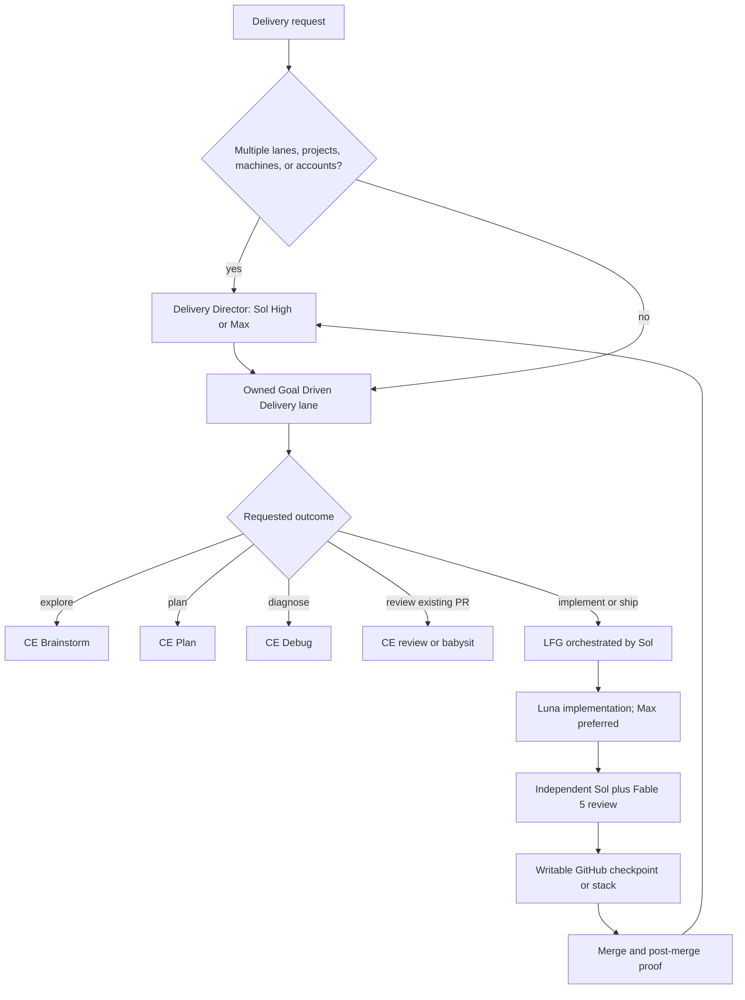

# Delivery Routing and Model Policy - Plan

## Goal Capsule

- **Objective:** Make the two delivery orchestration layers route work to the correct Compound Engineering workflow, model, host, branch, review, and terminal state.
- **Authority:** Explicit user intent overrides defaults. Repository instructions and skill contracts constrain execution. Existing CE child skills retain ownership of their internal stages.
- **Execution profile:** Goal Driven Delivery owns one host-local lane. Delivery Director owns multi-lane, cross-project, cross-machine, and future cross-account coordination.
- **Terminal state:** Planning, brainstorming, diagnosis, and review-only requests end with their requested artifact. Implementation delivery ends after merge and post-merge proof unless the user requests a narrower stop.
- **Tail ownership:** LFG owns plan-through-CI delivery. Goal Driven Delivery owns the authorized merge and post-merge tail. Delivery Director verifies each delegated lane and the integrated outcome.

---

## Product Contract

### Summary

Goal Driven Delivery becomes an intent router and completion policy over Compound Engineering. Delivery Director remains the higher multi-lane control plane and propagates the lane policy without implementing work itself.

### Problem Frame

Goal Driven Delivery currently sends ordinary feature work to `ce-plan` and `ce-work`, while LFG is reserved for an explicit autonomy request. That default stops short of the user's normal intent: complete the change through review, PR, merge, and verification. Retired external context-routing guidance also remains in the skill despite no longer being used.

The two orchestration layers need distinct, durable integration behavior. Lane work must be resumable across agents and machines through writable GitHub branches before PR readiness, while the director must retain project-level integration ownership and dependency visibility.

### Requirements

#### Intent and terminal state

- R1. Route exploratory product framing to `compound-engineering:ce-brainstorm`, plan-only work to `compound-engineering:ce-plan`, diagnosis-only work to `compound-engineering:ce-debug`, existing-PR work to the appropriate review or babysitting route, and implementation delivery to `compound-engineering:lfg` by default.
- R2. Route diagnose-and-fix requests through diagnosis and then LFG without treating a diagnosis as delivery completion.
- R3. Keep implementation delivery active through local checks, independent review, feedback resolution, commit and push, PR creation, CI, merge, and post-merge verification unless the user explicitly requests an earlier terminal state.
- R4. Preserve plan-only, brainstorm-only, diagnosis-only, review-only, local-only, and user-directed stop boundaries without silently mutating or shipping.

#### Orchestration and models

- R5. Run Goal Driven Delivery and LFG orchestration on Sol High by default and Sol Max for cross-cutting, release-critical, security-sensitive, multi-repository, or otherwise complex work.
- R6. Assign most implementation work to Luna with Max effort preferred and actual effort disclosed, independent primary review to a separate Sol High or Sol Max context by risk, and supported cross-model review to Fable 5.
- R7. Use maximum safe parallelism for independent research, implementation, and review work while keeping one canonical writer per mutable scope and serializing dependency or ownership conflicts.
- R8. Let Delivery Director own the global concurrency and host allocation budget, use Sol High or Max for its own orchestration, and propagate the Goal Driven Delivery model and completion policy to each lane.

#### Integration and stacked delivery

- R9. Give each project or repository one named integration owner and each mutable lane one canonical writer, branch, verification boundary, and handoff.
- R10. When a writable GitHub remote exists, push active lane and integration branches at useful checkpoints so plans, commits, and intermediate state are resumable across agents and machines before PR readiness.
- R11. Distinguish a pushed checkpoint branch from a review-ready branch or open PR; checkpoint publication must not imply completion or trigger review prematurely.
- R12. When Goal Driven Delivery or Delivery Director selects stacked delivery against a GitHub upstream, use `gh-stack` for the dependent PR chain. If its GitHub extension and companion skill are missing, seamlessly invoke the authoritative GitHub bootstrap command that installs both, verify the capability, then continue without prompting.

#### Scope and compatibility

- R13. Remove the retired external context-routing integration from Goal Driven Delivery, every other plugin skill, and repository routing guidance without replacing it with a parallel system.
- R14. Preserve Thermos, React Doctor, CE review, browser testing, PR monitoring, durable learning, blocker, resume, evidence, and safety contracts that remain applicable.
- R15. Update user-facing workflow documentation and skill metadata so the two orchestration layers, route defaults, model policy, branch checkpoints, stack behavior, and terminal states agree.
- R16. Modify maintained repository source only. Do not edit the installed plugin cache or bump plugin versions for this source-only workflow change.

### Acceptance Examples

- AE1. **Covers R1 and R4.** Given “use goal-driven delivery to plan the migration,” the skill invokes `ce-plan` and stops with the plan artifact rather than starting LFG.
- AE2. **Covers R1 and R4.** Given “brainstorm how this feature should work,” the skill invokes `ce-brainstorm` and does not create a branch or PR.
- AE3. **Covers R1 through R3.** Given “fix this bug” with no narrower stop, the skill diagnoses as needed, runs LFG for implementation, and continues through merge and post-merge proof.
- AE4. **Covers R5 through R8.** Given a routine implementation lane, Sol High orchestrates, Luna implements with Max effort preferred and actual effort disclosed, and independent Sol review runs; complex or risky orchestration and review elevate to Max.
- AE5. **Covers R9 through R11.** Given a writable remote and unfinished multi-machine work, the lane owner pushes a checkpoint branch that another worker can resume without opening a PR.
- AE6. **Covers R12.** Given dependent changes against a GitHub upstream that should be stacked and no installed `gh-stack` capability, either orchestration layer installs the GitHub extension and companion skill through the authoritative bootstrap, verifies them, and then creates or maintains the stack without interrupting the user.
- AE7. **Covers R13.** A repository-wide negative search finds no retired external context-routing integration in maintained guidance or plugin skills.

### Scope Boundaries

- The change updates orchestration instructions, metadata, and documentation. It does not modify Compound Engineering child skills.
- The change does not publish a plugin release or edit marketplace manifests.
- The change does not define a new stack protocol when `gh-stack` already owns that behavior.

---

## Planning Contract

### Key Technical Decisions

- KTD1. **Intent classification precedes execution.** Goal Driven Delivery selects the narrow workflow that matches the user's requested artifact; generic implementation language defaults to LFG instead of top-level `ce-work`.
- KTD2. **Goal Driven Delivery owns completion above LFG.** LFG remains unchanged and owns its fixed plan-through-CI pipeline. Goal Driven Delivery continues from LFG's handoff through authorized merge and post-merge verification.
- KTD3. **Models follow role, not one global default.** Sol High or Max owns orchestration and independent review, Luna owns most coding with Max effort preferred and actual effort disclosed, and Fable 5 supplies cross-model review where the supported CE path can verify the served model.
- KTD4. **Concurrency is bounded by ownership.** Independent work runs in parallel. Overlapping writes, semantic hotspots, dependent stack segments, and integration operations serialize under a named owner.
- KTD5. **GitHub branches are the durable coordination surface.** Writable remotes receive checkpoint pushes before PR readiness. PR creation remains a separate review-readiness decision.
- KTD6. **`gh-stack` owns dependent PR mechanics.** Both orchestration layers run its authoritative combined extension-and-skill bootstrap only when a GitHub-upstream stack is selected and the capability is missing.
- KTD7. **The director stays a control plane.** It owns decomposition, placement, integration ownership, global concurrency, monitoring, and terminal evidence. Each implementation lane invokes Goal Driven Delivery and never sends execution back into the director.

### Assumptions

- The authoritative bootstrap uses GitHub's own extension and skill commands, not `skill-installer`: `gh extension install github/gh-stack --force`, then `gh skill install github/gh-stack --all --agent codex --scope user --force`; verify with `gh stack --version` and `gh skill list --agent codex --scope user` (repeat install and list with `--agent claude-code` when that host also runs Claude Code).
- Fable 5 is used only when the existing CE cross-model review path supports and verifies it; an unavailable or unverifiable route falls back to an independent Sol reviewer with disclosure rather than a guessed model ID.
- Invoking Goal Driven Delivery for implementation authorizes ordinary repository merge when required checks and reviews pass; explicit user or repository merge restrictions still win.

### High-Level Technical Design

---

## Implementation Units

### U1. Reframe Goal Driven Delivery as the lane intent router

- **Goal:** Replace the default `ce-plan` plus `ce-work` posture with explicit intent routing, LFG-first implementation delivery, model-role policy, safe parallelism, integration checkpoints, stack provisioning, and a merge-complete tail.
- **Requirements:** R1-R7, R9-R14.
- **Dependencies:** None.
- **Files:** `plugins/agent-utilities/skills/goal-driven-delivery/SKILL.md`, `plugins/agent-utilities/skills/goal-driven-delivery/agents/openai.yaml`.
- **Approach:** Remove the retired external context-routing section and routes. Keep the existing CE, Thermos, React, browser, review, learning, and safety gates. Make route precedence and terminal states unambiguous, prevent GDD/LFG recursion, describe model fallback only when the requested provider cannot be verified, and add the conditional GitHub `gh-stack` bootstrap before stacked work.
- **Patterns to follow:** Existing skill router and PR monitoring sections; canonical CE skill names from the host skill list.
- **Test scenarios:**
  - Covers AE1. A plan-only request selects `ce-plan` and stops without shipping.
  - Covers AE2. An exploratory request selects `ce-brainstorm` and stops without repository mutation.
  - Covers AE3. A generic implementation or diagnose-and-fix request reaches LFG and retains the merge tail.
  - Covers AE4. Role-based model and effort assignments remain distinct and explicit.
  - Covers AE5 and AE6. Checkpoint and stacked-delivery language keeps push, PR readiness, and merge as separate states.
- **Verification:** Representative prompt-to-route review finds one terminal workflow per intent and no recursive or contradictory tail ownership.

### U2. Align Delivery Director with the lane policy

- **Goal:** Preserve the director's control-plane boundary while adding Sol orchestration, global concurrency, integration-branch, checkpoint, stack, and lane-policy propagation rules.
- **Requirements:** R7-R12, R14-R16.
- **Dependencies:** U1.
- **Files:** `plugins/agent-utilities/skills/delivery-director/SKILL.md`, `plugins/agent-utilities/skills/delivery-director/agents/openai.yaml`.
- **Approach:** Extend the existing model table and cross-project integration ownership instead of adding a second execution path. Add the same conditional GitHub `gh-stack` bootstrap at the director preflight. Keep implementation, testing, commits, pushes, and merges delegated to owned lanes.
- **Patterns to follow:** Existing canonical-writer, host readiness, task ledger, dependency, evidence, and cleanup contracts.
- **Test scenarios:**
  - A single local lane bypasses the director and enters Goal Driven Delivery.
  - Two independent lanes run concurrently under one global budget and retain distinct writers.
  - A cross-machine lane publishes a resumable checkpoint to a writable remote without opening a PR.
  - Dependent PR lanes route to `gh-stack`; unrelated PRs remain independent.
- **Verification:** The director never claims lane execution, and every delegated implementation lane inherits the model, integration, and completion policy.

### U3. Remove stale routing and document the two-layer workflow

- **Goal:** Make repository guidance and user-facing docs agree with the source skills.
- **Requirements:** R13-R16.
- **Dependencies:** U1, U2.
- **Files:** `AGENTS.md`, `README.md`, `docs/delivery-workflows.md`, `plugins/agent-utilities/.codex-plugin/plugin.json`.
- **Approach:** Delete the retired external tool-routing block from repository instructions. Update the workflow table, diagram, examples, integration ownership, checkpoint, stack/bootstrap, model, and terminal-state descriptions without duplicating the full skills. Align the README and Codex plugin prompt with merge-complete delivery without changing the plugin version.
- **Patterns to follow:** Existing delivery workflow comparison and Mermaid topology.
- **Test scenarios:**
  - Covers AE7. Negative searches find no retired external context-routing variants.
  - Documentation distinguishes director coordination from lane execution and distinguishes pushed checkpoints from review-ready PRs.
  - Model and merge-completion descriptions match both source skills.
- **Verification:** All documented routes and examples have a matching source-skill rule.

### U4. Validate the behavioral contract

- **Goal:** Prove that the edited skills are parseable, internally consistent, and usable through the requested LFG path.
- **Requirements:** R1-R16.
- **Dependencies:** U1-U3.
- **Files:** `plugins/agent-utilities/skills/goal-driven-delivery/SKILL.md`, `plugins/agent-utilities/skills/delivery-director/SKILL.md`, `docs/delivery-workflows.md`, `AGENTS.md`.
- **Approach:** Run repository validation, negative searches, diff checks, independent reviews, and route examples. Apply real findings before shipping.
- **Test scenarios:**
  - Every acceptance example resolves to one route and terminal state.
  - Frontmatter and YAML metadata parse successfully.
  - The final diff contains no installed-cache path or version bump.
  - Independent review finds no recursion, silent model downgrade, ambiguous merge authorization, or integration ownership gap.
- **Verification:** LFG produces the PR, CI and review settle, the PR merges, and the merged branch contains the expected routing contract.

---

## Verification Contract

| Check | Scope | Done signal |
|---|---|---|
| Frontmatter and YAML parse | Edited skills and agent metadata | All files parse and required fields remain present |
| Retired-routing negative search | Entire repository and plugin skill tree | No maintained integration or terminology remains |
| Route scenario review | AE1-AE7 | Each prompt has one documented route and correct terminal state |
| Integration lifecycle review | Director, GDD, docs | Checkpoint push, PR readiness, stack, merge, and post-merge proof are distinct |
| Model-policy review | Director, GDD, docs | Sol, Luna, and Fable roles and effort escalation agree everywhere |
| Git checks | Full diff | `git diff --check` and repository checks pass with no unrelated edits |
| Hosted validation | Pull request | Required CI and actionable review feedback are resolved |

---

## Definition of Done

- Goal Driven Delivery defaults implementation delivery to LFG and preserves narrower requested outcomes.
- Delivery Director remains the multi-lane control plane and propagates the lane model, integration, and completion policy.
- Sol High or Max, required Luna implementation with Max effort preferred and actual effort disclosed, independent Sol review, and supported Fable 5 review have explicit non-conflicting roles.
- Writable-remotes, checkpoint branches, integration ownership, and `gh-stack` provisioning are documented and routable.
- Retired external context routing is absent from maintained repository guidance and plugin skills.
- Documentation and metadata match the source skills.
- All local and hosted checks pass, actionable review feedback is resolved, the PR is merged, and post-merge verification confirms the change.
- No abandoned plan variants, dead-end workflow text, installed-cache edits, or unrelated changes remain.
