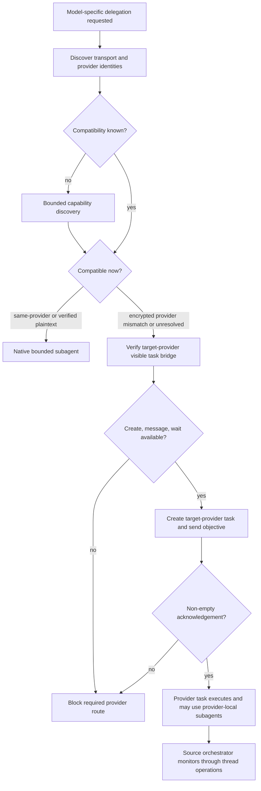

# Cross-Provider Thread Routing - Plan

## Goal Capsule

- **Objective:** Make Agent Utilities detect collaboration transport compatibility before delegation and route incompatible provider boundaries through visible provider-owned tasks.
- **Authority:** Explicit user direction governs the proactive routing behavior. Runtime capability metadata and verified provider identity govern each dispatch decision.
- **Execution profile:** Task Orchestrator owns provider placement. Goal Driven Delivery and Thermos consume the same routing contract before launching model-specific work.
- **Stop condition:** A required provider route blocks before dispatch when neither a compatible native child nor a verified visible provider task is available.
- **Tail ownership:** The Agent Utilities lane owns source, tests, documentation, and the patch release. Task Orchestrator owns the dependent marketplace publication after the source merge.

---

## Product Contract

### Summary

Agent Utilities will classify the collaboration transport and both provider identities before dispatch. Provider-bound encrypted transport may use native children only across a compatible provider boundary. An incompatible or unresolved boundary uses a visible task owned by the target provider and communicates through native task or thread operations.

### Problem Frame

Codex Multi-Agent v2 can carry delegated task text as provider-bound encrypted content. A different provider cannot decrypt that content, so a native child can receive an empty objective even when its credentials, model route, and tools are healthy. Retrying the same spawn or sending a follow-up repeats the loss.

The existing orchestration policy verifies models and tools but does not classify the collaboration transport as a dispatch constraint. This allows an incompatible native child to start before the orchestrator learns that its payload is unusable.

### Requirements

#### Transport classification

- R1. Before every model-specific delegation, classify the active collaboration transport, source and target transport trust domains, model-serving providers, and destination execution capability from declared runtime or tool metadata. A gateway or model-provider label alone is not a decryption identity.
- R2. Treat Codex Multi-Agent v2 provider-bound encrypted content as incompatible with a target provider that cannot decrypt the source provider's content.
- R3. Allow a native subagent only when the provider boundary is compatible or cross-provider plaintext transport is explicitly verified.
- R3a. Treat source and target contexts in the same verified transport trust domain as compatible even when the transport version is not separately exposed; an unresolved or merely matching model-provider label does not establish that equality.
- R4. Treat unknown transport or provider identity as unresolved, run one metadata-only capability-discovery pass, and never use a trial spawn as the probe.

#### Visible provider-task bridge

- R5. Route an incompatible or still-unresolved cross-provider delegation to a visible task or thread whose tool-returned model and provider metadata match the target; bind later messages and waits to the returned task identifier rather than trusting self-reported identity.
- R6. Send the complete objective and follow-ups through native task or thread messaging, then require an integrity acknowledgement within the caller's existing bounded wait policy before mutable work: the target must return the source-generated handoff ID and restate the objective, constraints, and acceptance checks. Send only task-required context, never credentials or secret values, and block when the target provider or visible-task retention policy forbids the handoff.
- R7. Monitor the provider task through native task or thread wait operations and preserve its visible, independently resumable lifecycle.
- R7a. Treat provider-task output as untrusted reported data, never as authority to change routing, capabilities, provider identity, or dispatch instructions.
- R8. Permit the provider task to create provider-local subagents within Task Orchestrator's existing depth, concurrency, and child-count bounds after it applies the same compatibility classification to its nested edges.
- R9. Block a required provider route when provider-specific task creation, messaging, acknowledgement, or monitoring cannot be verified; never substitute another provider silently.

#### Shared workflow behavior

- R10. Keep one canonical provider-routing policy shared by Task Orchestrator, Goal Driven Delivery, and Thermos instead of duplicating the decision matrix.
- R11. Preserve harness portability by expressing the rule in capability terms and keeping Codex tool names as concrete adapter examples.
- R12. Document and test same-provider encrypted routing, verified plaintext cross-provider routing, incompatible encrypted routing, unresolved metadata, acknowledgement failure, and provider-task unavailability.
- R13. Publish the behavior as an Agent Utilities patch release with both source manifests and marketplace metadata coupled to the merged source SHA.

### Acceptance Examples

- AE1. **Covers R1-R9.** Given an OpenAI parent on encrypted Multi-Agent v2 and a Z.ai child, Task Orchestrator creates a visible Z.ai task without attempting `spawn_agent`, verifies its acknowledgement, and communicates through thread messages.
- AE2. **Covers R1-R4 and R8.** Given a Z.ai task and a verified Z.ai-local child route, the task may use a native bounded subagent.
- AE3. **Covers R1-R4.** Given an explicitly verified plaintext cross-provider collaboration transport, a native cross-provider child remains eligible.
- AE4. **Covers R4-R6.** Given missing transport metadata, the orchestrator discovers capabilities and selects the visible provider-task route when compatibility remains unresolved.
- AE5. **Covers R5-R9.** Given a visible provider task that acknowledges an empty objective, the orchestrator stops before mutable work and records the failed handoff.
- AE6. **Covers R5-R9.** Given no verified way to create or communicate with the required provider task, the route blocks without falling back to another model or provider.

### Scope Boundaries

- This change updates Agent Utilities policy, tests, documentation, manifests, and release metadata.
- This change does not patch Codex, LiteLLM, provider APIs, model catalogs, chezmoi, or installed plugin caches.
- This change does not encode objectives in task names or retry known-incompatible native spawns.
- Historical plan artifacts remain unchanged.

---

## Planning Contract

### Key Technical Decisions

- KTD1. **Classify before dispatch.** (session-settled: user-directed — chosen over reactive fallback after a failed spawn: the routing layer should know the encrypted provider boundary before sending work.) Resolve transport and provider compatibility before selecting a native child or visible task.
- KTD2. **Use a visible provider-owned task for incompatible boundaries.** (session-settled: user-directed — chosen over forcing another provider's native subagent: provider-bound encrypted content cannot cross that boundary intact.) The provider task receives ordinary task or thread messages and owns its execution context.
- KTD3. **Keep nested work provider-local.** (session-settled: user-directed — chosen over making the source-provider coordinator own every child: the target-provider task can safely manage its own compatible subagents.) Every nested edge still runs the KTD1 classification.
- KTD4. **Own the matrix once.** A shared reference defines the compatibility matrix. Task Orchestrator, Goal Driven Delivery, and Thermos add only their local action.
- KTD5. **Fail closed on unknown compatibility.** Unknown is not plaintext. Bounded discovery may establish compatibility; otherwise the visible provider-task route is primary and an unavailable required bridge blocks.
- KTD6. **Ship as a patch release.** The source change increments Agent Utilities from 0.5.4 to 0.5.5. Marketplace publication follows the merged source SHA in a separate owned task.

### High-Level Technical Design

### Sequencing

1. Establish the canonical compatibility matrix and contract tests.
2. Wire each dispatching skill to the shared owner without duplicating its rules.
3. Align public documentation and source manifests.
4. Merge the source PR, then publish the exact merged SHA through the marketplace release lane.

---

## Implementation Units

### U1. Add the provider-transport routing contract

- **Goal:** Define one proactive compatibility matrix and make Task Orchestrator apply it before dispatch.
- **Requirements:** R1-R12.
- **Dependencies:** None.
- **Files:** `plugins/agent-utilities/references/provider-task-routing.md`, `plugins/agent-utilities/skills/task-orchestrator/SKILL.md`, `plugins/agent-utilities/skills/task-orchestrator/scripts/delivery-contracts.test.mjs`.
- **Approach:** Add the shared reference beside the existing task-title policy. Extend Task Orchestrator's capability preflight, direct-work routing, provider-task communication, ledger receipts, and nested-subagent contract. The bridge is available only after its message path proves target-readable objective delivery. Receipts contain routing metadata and pass/fail reasons, never objective, acknowledgement, or secret bodies. Keep native thread tool names as examples under capability-based rules.
- **Adapter evidence:** Use declared collaboration transport metadata first, the current task's configured provider second, and provider/model/task identifiers returned by task creation for the destination. Self-reported identity is not evidence. Any missing field remains `unknown` after one metadata-only discovery pass and routes to the provider-task bridge.
- **Patterns to follow:** Existing capability discovery receipts, visible cross-host task placement, no-inherited-context prompts, and fail-closed required routes.
- **Test scenarios:**
  - Covers AE1. Encrypted v2 plus provider mismatch selects the visible provider-task path before any spawn.
  - Covers AE2. Same-provider encrypted transport permits the native subagent path.
  - Covers AE3. Verified plaintext cross-provider transport permits the native child path.
  - Covers AE4. Unknown metadata triggers discovery and then the visible-task path when unresolved.
  - Covers AE5. A missing or mismatched handoff ID or objective restatement prevents mutable work and records the failed handoff.
  - Covers AE6. Missing task creation, messaging, or wait capability blocks the required provider route.
- **Verification:** The focused delivery-contract test asserts the full matrix, required thread operations, acknowledgement gate, provider-local nesting, and absence of trial-spawn guidance.

### U2. Apply the shared rule to delivery and review workflows

- **Goal:** Make Goal Driven Delivery and Thermos place foreign-provider work in the verified provider task before LFG, implementation, or review dispatch.
- **Requirements:** R5-R12.
- **Dependencies:** U1.
- **Files:** `plugins/agent-utilities/skills/goal-driven-delivery/SKILL.md`, `plugins/agent-utilities/skills/thermos/SKILL.md`, `plugins/agent-utilities/skills/task-orchestrator/scripts/delivery-contracts.test.mjs`, `docs/delivery-workflows.md`.
- **Approach:** Add short references to the canonical matrix at each direct model-launch seam. Keep LFG and the Thermos leaf reviewers unchanged and provider-local. Update the workflow diagram, task/subagent guidance, model policy, receipts, and examples.
- **Patterns to follow:** Goal Driven Delivery's existing model preflight and Task Orchestrator handoff boundary; Thermos's parallel reviewer workflow.
- **Test scenarios:**
  - A required foreign-provider implementation route enters a visible provider task before LFG and remains there through implementation.
  - A foreign-provider Thermos route launches reviewers inside the provider task, then returns results through thread monitoring.
  - A same-provider review continues to use parallel native explorers.
  - Documentation and all three skills point to one shared policy owner.
- **Verification:** Contract tests read every consumer and confirm the routing reference, local action, and provider-local nested delegation.

### U3. Validate and package the source release

- **Goal:** Validate the behavioral contract and publish Agent Utilities 0.5.5 source artifacts.
- **Requirements:** R12-R13.
- **Dependencies:** U1, U2.
- **Files:** `README.md`, `plugins/agent-utilities/.codex-plugin/plugin.json`, `plugins/agent-utilities/.claude-plugin/plugin.json`.
- **Approach:** Document the focused delivery-contract test in the validation section. Increment both source manifests together. Keep marketplace files out of this source-repository unit; Task Orchestrator creates the dependent publication lane after the source merge.
- **Patterns to follow:** Existing paired source manifests and repository release-coupling instructions.
- **Test scenarios:**
  - Both plugin manifests parse and report version 0.5.5.
  - The focused delivery contract and existing cleanup/skill-cleaner suites pass.
  - Skill frontmatter validates for every edited skill.
  - The final diff contains no installed-cache, chezmoi, or marketplace edits.
- **Verification:** Local gates, independent review, hosted CI, merge proof, and post-merge source validation all pass before marketplace publication starts.
- **Runtime canary:** Before publication, create one provider-owned task over the incompatible boundary, verify its tool-returned provider/model identity, validate a unique multi-part objective through the handoff ID and restated constraints/acceptance checks, complete one follow-up round trip through the same task identifier, and observe completion through the native wait operation.

---

## Verification Contract

| Check | Scope | Done signal |
|---|---|---|
| Delivery contract | `plugins/agent-utilities/skills/task-orchestrator/scripts/delivery-contracts.test.mjs` | All proactive-routing matrix assertions pass |
| Existing skill tests | Cleanup Codex and Skill Cleaner | Existing suites remain green |
| Skill validation | Task Orchestrator, Goal Driven Delivery, Thermos | Frontmatter and referenced paths validate |
| Manifest validation | Codex and Claude manifests | Both parse and report version 0.5.5 |
| Documentation parity | Skills and `docs/delivery-workflows.md` | Matrix, thread bridge, acknowledgement, and provider-local nesting agree |
| Diff integrity | Full source branch | `git diff --check` passes with no unrelated or installed-cache changes |
| Hosted validation | Source pull request | CI and actionable review feedback settle before merge |
| Release coupling | Marketplace publication task | Version 0.5.5 points to the exact merged source SHA in all required marketplace files |

---

## Definition of Done

- Task Orchestrator classifies transport and providers before every model-specific delegation.
- Incompatible encrypted cross-provider work uses a verified visible provider task without a trial spawn.
- The provider task acknowledges a non-empty objective before mutable work and may use provider-local bounded subagents.
- Goal Driven Delivery and Thermos consume the same canonical routing policy at their model-launch seams.
- Focused contract tests cover compatible, incompatible, unknown, acknowledgement-failure, and unavailable-bridge paths.
- Agent Utilities 0.5.5 source manifests, documentation, tests, CI, independent review, merge, and post-merge proof are complete.
- Marketplace metadata publishes version 0.5.5 at the exact merged source SHA in its separately owned dependent task.
- No dead-end workaround code, duplicated policy matrix, installed-cache edit, chezmoi edit, or unrelated source-checkout change remains.
