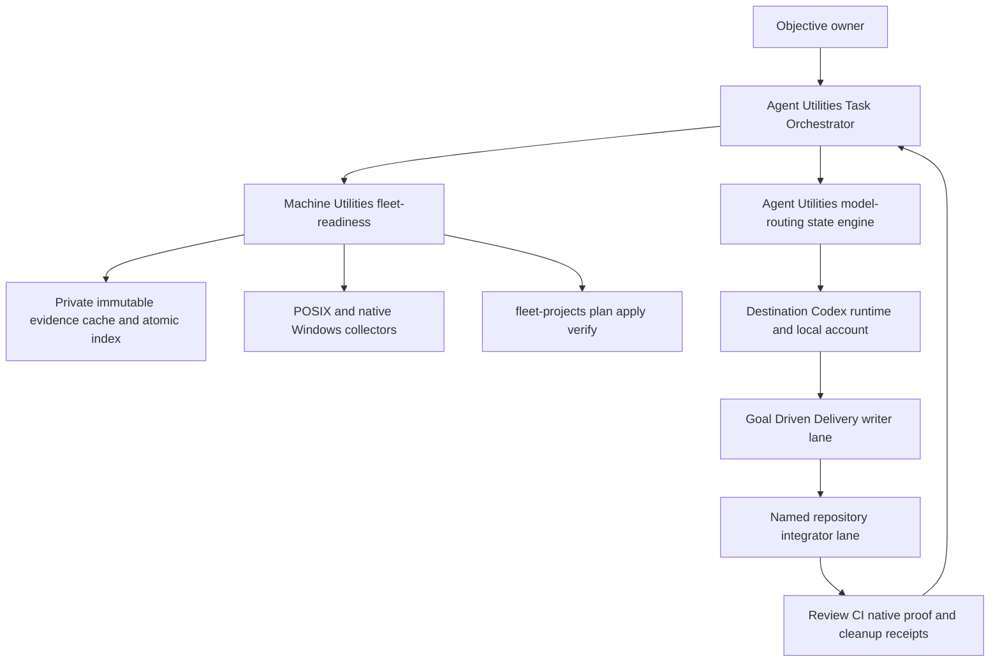
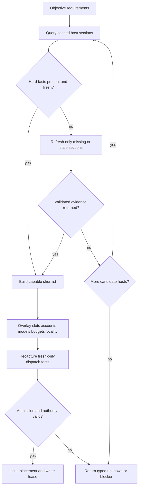
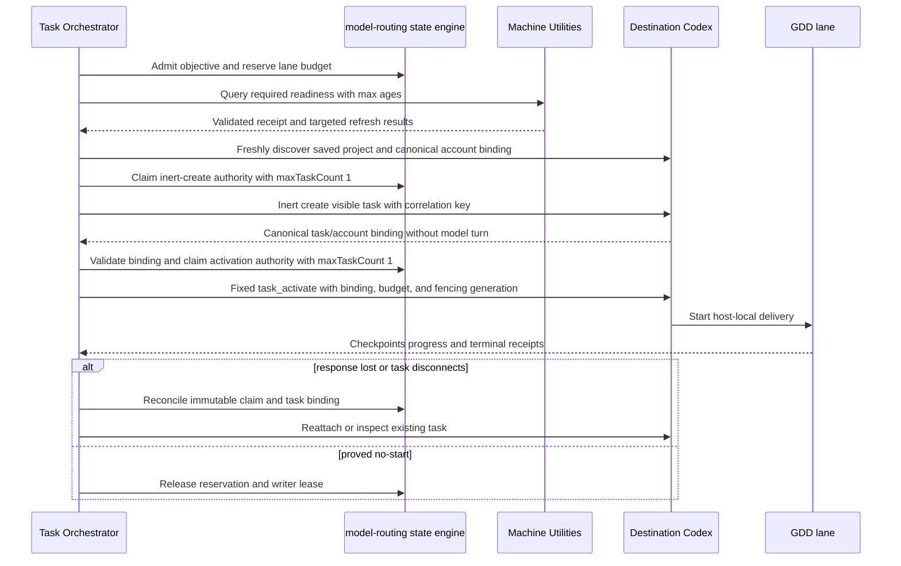

# Fleet Delivery Control Plane - Plan

## Goal Capsule

- **Objective:** Accept one delivery objective, place its work across suitable accounts and hosts, prepare the required repositories and Codex projects, monitor every lane, integrate through one canonical writer, and prove the result on every required native operating-system boundary.
- **Product authority:** The user's objective and explicit approval scopes are authoritative. Task Orchestrator owns objective decisions. Goal Driven Delivery owns one host-local writable lane. Machine Utilities owns fleet evidence and native host actions.
- **Execution profile:** Extend the released Agent Utilities 0.5.10 model-routing state engine and its admission, work-contract, R52 readiness, task-authority, lease, budget, claim, and receipt primitives. Add only the detailed Machine Utilities evidence projection and fleet-objective records that those primitives do not own. Do not add another router, scheduler service, or fleet database.
- **Open blockers:** Remote visible-task dispatch remains unavailable until the destination control surface proves provider-enforced inert create, exact reconciliation, pre/post account binding, KTD16's fixed activation adapter, and a host-owned in-process task-authority attestor plus native receipt importer. Multi-account routing separately remains unavailable until the Codex multi-account plan's real-account proof and deployable fork pass. Missing saved-project registration remains an owner action until Codex exposes a supported API. Cache, readiness, ledger, and local fixture work may proceed, but U5-U8 activation cannot pass without these gates. Current Iris evidence remains negative: WSL timed out twice without mutation, and native Windows returned `model_routing_capability_unavailable` / `trusted_task_authority_attestor_unavailable` without creating a task.
- **Stop condition:** Planning is complete when the plan names the two repository contracts, authority boundaries, lifecycle, failure behavior, release order, and native proof gates without requiring implementation to invent policy.

---

## Product Contract

### Summary

Agent Utilities will become the single objective control plane over the existing delivery workflows. It will select hosts and account-local Codex execution from cached capability evidence, issue bounded leases to host-local writers, monitor receipts, and delegate integration to one named writer. Machine Utilities will remain the fleet evidence and native action plane, adding cache-first targeted refresh and idempotent project-preparation receipts.

### Problem Frame

The released source separates Task Orchestrator, Goal Driven Delivery, and Machine Utilities correctly and now includes the shared model-routing runtime primitives. Task Orchestrator still has no durable fleet-objective record that binds an account, host, checkout, saved project, task, writer, budget, and result. Machine Utilities produces validated snapshots, routed remote-control guidance, and safe sealed operations, but it has no indexed freshness cache or objective-scoped project lease.

The missing runtime contract causes avoidable rescans, weak resume semantics, and ambiguous placement. A host may appear capable without current repository, account, auth, saved-project, or native-OS evidence. A stopped or disconnected task may be restarted without proof that the prior start failed. Cross-host results may be available without a single writer authorized to integrate them.

This work closes those seams without moving orchestration into Machine Utilities, duplicating the model router, editing Codex internal databases, or adding an always-on coordinator.

### Key Decisions

- **Keep one control plane and one host action plane.** Agent Utilities owns objective state and decisions; Machine Utilities owns host evidence and native operations. Governs R1-R30.
- **Use two-stage account placement.** Task Orchestrator selects a host; the destination Codex runtime binds one eligible local account/profile. Governs R10-R13.
- **Cache evidence, never mutation authority.** Machine Utilities may reuse validated facts within their freshness policy, but dispatch and mutation gates recapture their exact preconditions. Governs R4-R8, R15-R17.
- **Delegate integration to a named writer.** Task Orchestrator assigns and verifies integration but never becomes a second Git writer. Governs R3, R24-R27.
- **Stop at unsupported product boundaries.** Missing saved-project registration, login, privilege, entitlement, or native proof returns a resumable owner action or blocker. Governs R2, R11-R12, R16, R25, R29-R30.

### Actors

- A1. **Objective owner:** Supplies the outcome, constraints, terminal state, and any authority beyond ordinary delivery.
- A2. **Task Orchestrator:** Owns objective admission, task graph, placement, leases, budgets, monitoring, reassignment decisions, and final proof synthesis.
- A3. **Goal Driven Delivery lane:** Owns one host-local mutable scope and returns implementation, verification, Git, and terminal receipts.
- A4. **Project integrator:** The one named Goal Driven Delivery lane allowed to integrate accepted outputs for a repository.
- A5. **Machine Utilities:** Owns fleet evidence, targeted refresh, safe project preparation, native transports, sealed mutation, and native proof records.
- A6. **Destination Codex runtime:** Owns fresh saved-project discovery, local account/profile binding, visible task creation, and host-local task execution.

### Requirements

**Objective and authority**

- R1. One user objective must produce an immutable objective ID, epoch, terminal contract, constraint set, and logical-lane dependency graph before mutable work starts. Re-placement appends a new placement/dispatch attempt to the same logical lane; it never rewrites that graph.
- R2. The control plane must track separate authority for discovery, visible-task creation, checkout preparation, saved-project registration, checkpoint push, PR creation, merge, release, authentication, credential movement, ordinary host mutation, and privileged host mutation.
- R3. Within one authoritative state root and controller process epoch, each canonical mutable scope and shared file must have one active fenced writer attempt, and each repository must have one named integration owner. V1 takeover is limited to restarting from that same locked state root after read-only reconciliation; cross-controller replacement/failover is unavailable.

**Fleet evidence and placement**

- R4. Machine Utilities must keep a private index of validated per-host, per-section snapshots with full configuration provenance, a host/section-scoped configuration projection digest, executor identity, controller receipt time, target observation time, completeness, and error state.
- R5. Placement must reuse fresh evidence and refresh only missing or stale sections for shortlisted hosts before widening the search.
- R6. Repository cleanliness, native host identity, authentication used for dispatch, protected-broker readiness, Codex saved-project identity, and all mutation preconditions must be fresh-only evidence.
- R7. Host placement must apply hard platform, repository, capability, auth, account, toolchain, configured trust-tier, and native-proof filters before ranking available slots, locality, expected duration, and cost.
- R8. Native macOS, Linux, WSL, and Windows must remain distinct proof targets, and WSL evidence must never satisfy a native Windows requirement.

**Account, model, capacity, and budget routing**

- R9. Account identity must be distinct from provider, model, host, transport trust domain, browser session, and billing scope.
- R10. Task Orchestrator must select the destination host before the destination runtime selects and persists one eligible local account/profile binding.
- R11. Account credentials and `CODEX_HOME` state must remain host-local and isolated, and the control plane must store only opaque account/profile keys and attestations.
- R12. A configured account label or separate profile must remain `unknown` until current entitlement, control-surface, visibility, and execution evidence proves the requested route on that host.
- R13. All model, account-budget, and task-start admission must reuse the `agent-utilities:model-routing` skill and exact `agent-utilities/model-routing/v1` wire contract. Machine Utilities must project host, task, transport, execution-host, and target-platform facts into the closed content-free `agent-utilities/r52-readiness/v1` record and must not copy routing policy or state.

**Repository and Codex project lifecycle**

- R14. Placement first issues a non-writable host/project-preparation reservation bound to configured sanitized source identity and any sealed preparation authority. Only post-preparation inventory may create an immutable writer-attempt reservation, followed by an append-only dispatch binding. Together they bind stable source repository identity, separate checkout/baseline/scope identity, fresh saved project/task handles, canonical runtime account/profile evidence, writer, controller epoch, fencing generation, and expiry.
- R15. Machine Utilities may clone only a missing configured checkout and fast-forward only a clean checkout after a sealed, approved plan; wrong origin, dirty, detached, ahead, diverged, or conflicting-worktree state must stop.
- R16. Codex saved-project registration must use a supported product capability when one exists; otherwise it must return the exact owner UI action and never edit Codex internal databases. Readiness must model a saved multi-project workspace separately from its primary and member projects. A checkout already owned by a workspace must resolve through that container and selected-project binding rather than create or select a standalone leaf project. Workspace configuration uses a host-neutral logical key that resolves to fresh host-scoped `container_id`, `primary_project_id`, `selected_project_id`, and `selected_role` (`primary` or `member`).
- R17. Workspace/container and project IDs must be freshly discovered before task creation or a work-starting follow-up; the created visible task ID and inventory evidence are discovered and bound only after create and before activation. Every candidate must prove canonical live membership for the exact checkout. Candidate order is an explicit user-selected logical workspace key, the current task's exact same-host workspace when fresh inventory proves the destination checkout is its member, the configured owning workspace, then the configured per-host operations workspace. Projectless creation uses a separate tagged binding only for explicitly repository-independent work; absence or ambiguity never silently invents a scratch project or widens to a parent directory.
- R18. Worktree, branch, task, and ref cleanup must occur only after integration or an explicit ownership transfer, and dirty or unintegrated state must remain visible.

**Dispatch, monitoring, and resume**

- R19. Every durable assignment must use a fresh visible task on its destination project. U1 must prove a provider-enforced inert create operation that persists canonical project/account/task binding without a model turn, tools, network, child dispatch, or mutable action. Activation is a distinct fixed host-owned adapter/dispatch (for example `codex-task-activate` / `task_activate`) bound to that acknowledged task, account, project, controller epoch, fencing generation, and reserved start budget; it consumes its own `maxTaskCount: 1` authority and settlement receipt. The released 0.5.10 router supplies bounded task authority and native settlement primitives but does not itself supply this activation adapter. Its public CLI must continue to reject caller-authored authority or native receipts. Without the inert-create capability, fixed activation adapter, host-owned in-process attestor, and native receipt importer, remote activation is `unknown`.
- R20. Objective and lane state must use the normative transition tables in this plan, with idempotent request IDs, append-only transition receipts, and no respawn after an ambiguous claimed start.
- R21. Clean committed checkpoints must support same-attempt resume and safe cross-host handoff while remaining distinct from PR readiness, review, merge, and completion. Same-attempt resume requires the same task/host/account/writer/fencing generation; cross-host resume creates a new attempt only after safe stop or enforceable transfer.
- R22. Re-placement appends a new attempt and atomically advances fencing only after the old writer is proved no-start/stopped and the provider durably closes that task against future turns, tools, follow-ups, and resume. Otherwise external containment must use a distinct checkout/worktree and ref namespace and separately authorized revocation of the old process/credential/push capability. Idle/quiescent status, acknowledgement, and expiry alone never release `stop_unknown`.
- R23. Agent Utilities must persist the minimum private objective ledger needed to reconstruct tasks, leases, receipts, dependencies, and next actions after restart.

**Integration and proof**

- R24. The project integrator must perform Git integration and repairs; Task Orchestrator may accept, reject, or reassign results but must not edit, commit, push, or merge them itself.
- R25. Completion must include native evidence for every platform and execution context named by the objective, with unknown or unavailable targets reported separately.
- R26. Reusable readiness, project, task, test, review, CI, and native receipts must bind command/toolchain, input/content hashes, result, controller receipt time, target observation time, issuer class, controller-observed transport/session and host identity, task/correlation ID, executor manifest digest, objective/lane/controller epoch/fencing generation, platform, and which fields were locally observed versus remotely asserted.
- R27. Terminal proof must show integrated artifacts, dependency closure, required review and CI state, authorized merge/post-merge evidence when applicable, and safe task/worktree/ref disposition.

**Distribution and release**

- R28. Release order must use two reversible publication transactions. First publish Agent Utilities with its two manifests and all three marketplace version/SHA records, reload it on the Machine Utilities implementation host, then publish Machine Utilities with its two manifests, integrity manifest, and all three marketplace records. Each transaction must preserve dormant compatibility with the previously released counterpart or roll back before activation.
- R29. Fleet release verification must freeze every configured host/native-context cell from the rollout configuration digest, check Codex and Claude independently in each cell, and prove native Windows through native PowerShell rather than WSL.
- R30. Implementation must not modify Compound Engineering or any installed plugin cache; Agent Utilities may override named CE execution stages only through maintained Agent Utilities instructions and public CE inputs.

### Key Flows

- F1. Objective admission and placement
  - **Trigger:** A1 asks for a multi-lane or cross-host outcome.
  - **Actors:** A1, A2, A5, A6.
  - **Steps:** A2 records the objective and authority; queries cached readiness; refreshes only stale candidate facts; filters hosts; and issues a non-writable host/project-preparation reservation.
  - **Outcome:** Every logical lane has a compatible provisional destination, preparation path, and explicit blocker/authority receipt; no writer is active yet.
  - **Covered by:** R1-R14.
- F2. Project preparation and dispatch
  - **Trigger:** A placed lane lacks an exact ready checkout or saved project.
  - **Actors:** A2, A3, A5, A6.
  - **Steps:** A5 plans and verifies the exact safe action; A1 or standing policy approves required mutation; A5 applies and re-inventories; A2 creates the immutable writer-attempt reservation from post-inventory facts; A6 freshly resolves the owning workspace/container plus primary/member saved project and pre-create account attestation; A2 claims inert task creation; A6 persists the canonical post-create task/account/workspace binding without a model turn; A2 validates it and invokes the fixed activation adapter with a distinct `maxTaskCount: 1` authority and reserved start budget.
  - **Outcome:** The destination task starts mutable work against the fenced repository/account/project binding or returns a resumable owner action/quarantine.
  - **Covered by:** R2, R14-R20.
- F3. Monitoring, interruption, and reassignment
  - **Trigger:** A task emits progress, blocks, disconnects, stops, or exceeds a lease/budget boundary.
  - **Actors:** A2, A3, A5, A6.
  - **Steps:** A2 reconciles native task state and receipts; preserves ambiguous claimed work; handles cancellation/revocation; renews or releases attempts; and re-places only after observed stopped/no-start, old-writer relinquishment, or external revocation of old write capability advances fencing.
  - **Outcome:** Work resumes without duplicate mutable writers or double-spend.
  - **Covered by:** R20-R23.
- F4. Integration and cross-OS proof
  - **Trigger:** All dependency-ready lanes have submitted terminal receipts.
  - **Actors:** A2, A3, A4, A5.
  - **Steps:** A2 validates receipts; A4 integrates in dependency order; reviewers inspect the frozen result; A5 supplies required native evidence; A2 verifies the combined terminal contract and cleanup.
  - **Outcome:** One integrated result has per-target proof and no orphaned ownership.
  - **Covered by:** R3, R24-R27.
- F5. Coupled release and fleet rollout
  - **Trigger:** Runtime contract changes pass repository and native gates.
  - **Actors:** A2, A3, A4, A5.
  - **Steps:** Agent Utilities lands first; Machine Utilities lands against that contract; marketplace metadata pins exact releases; every required harness/host is refreshed and verified.
  - **Outcome:** Installed state matches maintained source without cache patching.
  - **Covered by:** R28-R30.

### Acceptance Examples

- AE1. **Covers R4-R6.** Given fresh host and agent evidence but stale project evidence, when the objective needs that project, then only the project section refreshes and the older host/agent observation times remain unchanged.
- AE2. **Covers R5-R7.** Given two cached capable hosts and one newly stale auth record, when placement runs, then the control plane refreshes auth only for shortlisted candidates before expanding to other hosts.
- AE3. **Covers R12-R13.** Given an account label and isolated profile with no real entitlement proof, when a lane requests that account, then routing reports `unknown` and does not silently use another account.
- AE4. **Covers R15-R18.** Given a destination checkout with an unexpected origin or dirty tree, when project preparation runs, then it creates no clone, fetch, worktree, saved-project record, or task and returns the observed conflict.
- AE5. **Covers R16-R17.** Given a valid checkout with no saved project and no supported registration API, when dispatch is requested, then the run pauses with the exact owner registration action and no Codex database write. Given a checkout that is already a member of a saved multi-project workspace, dispatch binds its logical workspace key, host-scoped container, primary project, selected project, and selected role and does not create, select, or display a standalone project for that leaf.
- AE6. **Covers R19-R22.** Given a task creation response is lost after claim, when monitoring resumes, then the control plane reconciles the claimed task/account/project binding and does not create a replacement until no-start or safe transfer is proved.
- AE6a. **Covers R19-R20.** Given an inert task is created against the wrong project, host, account binding, baseline, or scope, when its canonical runtime binding is checked, then the fixed activation adapter is not invoked and provider enforcement guarantees zero model egress and zero mutable action.
- AE6b. **Covers R2, R20, R22.** Given the owner revokes a lane after work starts, when stop cannot be confirmed, then new claims, renewals, egress, integration, and release remain frozen and the scope stays quarantined.
- AE7. **Covers R3, R22, R24.** Given two lanes touch a shared file, when both become ready, then only the named integrator writes the shared file and the other lane supplies a patch or evidence artifact.
- AE8. **Covers R25-R27.** Given Linux, WSL, and native Windows are required, when Linux and WSL pass but native Windows is unreachable, then the objective remains incomplete with native Windows unverified.
- AE9. **Covers R28-R30.** Given Agent Utilities and Machine Utilities both change, when release begins, then Agent Utilities is published first, Machine Utilities is published against its exact contract, and all five version/SHA surfaces remain coherent.

### Success Criteria

- One objective can be reconstructed after controller restart from its objective, lease, dispatch, budget, project, and evidence receipts without respawning an ambiguous task.
- A warm-cache placement refreshes only the stale evidence needed for the selected candidates, while a fleet-parity objective still verifies every configured target.
- Within one authoritative locked state root, competing mutable attempts cannot hold the same canonical scope or integration reservation at the same time; only a reconciled same-root restart is supported.
- Native proof reports one result per frozen configured host, harness, operating system, and execution context.
- Release verification proves exact Agent Utilities/Machine Utilities versions and source provenance in Codex and Claude on every required target.

### Scope Boundaries

**In scope**

- Agent Utilities objective admission, placement, account/model/budget binding, leases, monitoring, integration authority, and terminal proof.
- Machine Utilities evidence indexing, freshness classification, targeted refresh, placement facts, project preparation receipts, and native proof records.
- Cross-repository compatibility tests, release ordering, and operational documentation.

**Deferred to follow-up work**

- An always-on controller, shared SQLite/service database, distributed lock manager, automatic controller failover, or web dashboard.
- Automatic Codex saved-project registration until a supported product API exists.
- Implementation or distribution of the Codex multi-account fork; this plan consumes its proven per-host contract.
- Recurring fleet maintenance scheduling, software-supply-chain update review, global configuration convergence, and context-on-demand activation.

**Outside this plan**

- Editing Compound Engineering, Codex internal databases, or installed plugin caches.
- Moving account credentials between machines, merging account homes, or inferring entitlement from configuration.
- New repository creation, OAuth/device login, privilege enrollment, or expansion of a protected action catalog without their separate approval flows.

### Dependencies and Assumptions

- The Agent Utilities model-routing implementation remains the sole owner of model, account-budget, task-start, and receipt admission.
- Agent Utilities 0.5.10 at `beb0205e7e21160f24bad4c426365f916d2b033c` and Machine Utilities 0.2.18 at `06e12fb9dfc63a4673c771e54e1237979dd1253b` are the inspected implementation baseline. The marketplace pin baseline is `6d3da4b`. Implementation records these or their descendants before freezing fixtures.
- The baseline proves the `agent-utilities/model-routing/v1` public contract, closed `agent-utilities/r52-readiness/v1` projection, work-contract overlays, task/run/project budget reservations, delegated-slot leases, bounded task-authority schema, and fail-closed public CLI. It does not prove a fixed acknowledged-task activation adapter, host-owned task-authority attestor, native receipt importer, provider-enforced inert create, or native Windows secure-state support.
- Provider-enforced inert create, exact create reconciliation, linked pre/post account binding, and KTD16's fixed activation adapter are external capability gates. Until U1 proves them on the current Codex control surface, remote visible-task dispatch and U5-U8 activation remain unavailable; prompt-only acknowledgement, a second `task_create`, and public-CLI import are not fallbacks.
- Machine Utilities validated JSONL snapshots, safe sealed-plan executor, project collector, and native transport boundaries remain authoritative.
- The Codex multi-account plan must pass its U0 real-account/official-client proof and ship a supported host-local binding before multi-account placement can become `ready`.
- Codex saved-project registration has no supported unattended API in the maintained source audited on 2026-08-04.
- Existing user-owned fleet configuration remains the source for hosts, projects, groups, transports, trust tiers, capabilities, and auth requirements.

<!-- ce-section: work-relationships -->
### How This Work Fits Together

This plan owns the fleet delivery control plane across Agent Utilities and Machine Utilities. The surrounding plans remain separate work and may revise independently.

- **Depends on:** `docs/plans/2026-08-03-001-feat-delivery-routing-model-policy-plan.md` for the single router, budget ledger, task-start admission, and CE stage-override contract.
- **Depends on for multi-account readiness:** the Codex repository's `docs/plans/2026-08-02-001-feat-multi-account-fleet-routing-plan.md` and its distribution/maintenance follow-up; single-account routing can proceed independently.
- **Can proceed independently of:** Codex configuration convergence and project-scoped context/capability activation plans.
- **May later consume:** recurring fleet maintenance and supply-chain review receipts, without making that scheduler part of this control plane.

### Sources and Research

- `plugins/agent-utilities/skills/task-orchestrator/SKILL.md` and `plugins/agent-utilities/skills/goal-driven-delivery/SKILL.md` define the current control-plane/lane split.
- `docs/delivery-workflows.md` defines canonical writer, cross-host, monitoring, and integration boundaries.
- `docs/plans/2026-08-03-001-feat-delivery-routing-model-policy-plan.md` defines the shared router, budget, capability, and task-start lifecycle.
- Machine Utilities `plugins/machine-utilities/skills/fleet-readiness/SKILL.md`, `fleet-projects/SKILL.md`, `fleet-inventory/SKILL.md`, and `fleet-agents/SKILL.md` define current readiness and mutation boundaries.
- The Codex repository's `docs/plans/2026-08-02-001-feat-multi-account-fleet-routing-plan.md` defines the still-unproven host-local multi-account contract.

---

## Planning Contract

### Product Contract Preservation

Product Contract restructured with no product-scope change: R13 names the released closed R52 projection, while R19 distinguishes released bounded authority/receipt primitives from the new fixed activation adapter required by the fleet design. KTD16-KTD18 make activation, the released-lease sealing fix, and a reversible single-file state-schema migration explicit implementation work. The product goal and ownership split are unchanged.

### Target Repositories

- **Canonical artifact and control-plane owner:** `agent-utilities`.
- **Fleet evidence and native action dependency:** `machine-utilities`.
- **Release metadata dependency:** the maintained marketplace repository.
- **Read-only dependency:** Compound Engineering. No implementation unit edits it.

### Key Technical Decisions

- KTD1. **Extend the released model-routing transaction instead of creating a second router or state engine.** Reuse its exact `agent-utilities/model-routing/v1` resolve/admit/claim/reconcile lifecycle, `build-work-contract`, task/run/project reservations, `issue-lease`/`accept-lease`/`claim-slot`/`release-lease`/`seal-epoch`, and bounded task-authority records. Migrate the one strict state document from v4 to v5 under the existing lock and atomic temp-file rename so new adapter, authority, budget, objective, lane, and attempt records participate in one validated transaction. V1 has one authoritative state root and controller process epoch; restart uses that same root after reconciliation. Cross-controller replacement/failover is unavailable.
- KTD2. **Machine Utilities owns a controller-local immutable evidence cache with one locked atomic index.** Each entry is keyed by host, section, executor identity, and the digest of only the configuration fields that can affect that host/section; the full configuration digest remains provenance. A same-UID transaction lock or generation compare-and-swap covers read, merge, publish, and pruning so disjoint concurrent updates cannot be lost. No shared database, daemon, or remote cache is added. This satisfies R4-R6.
- KTD3. **Freshness is caller-required and controller-clocked.** Task Orchestrator supplies maximum ages for the facts needed by the current objective. Age and lease expiry use controller receipt time; target timestamps are provenance only, and excessive future skew is invalid evidence. Machine Utilities hard-codes only the fresh-only classes in R6 and returns both times so another caller can choose a stricter policy.
- KTD4. **Placement uses hard filters before scoring.** Machine Utilities reports facts and a configured delivery-slot ceiling. Agent Utilities combines them with active leases, account/model/budget evidence, and objective constraints. Unknown hard requirements reject a candidate; unknown advisory load lowers its rank.
- KTD5. **Keep the detailed readiness receipt separate from its closed router projection.** `machine-utilities.fleet-readiness/v1` carries facts, provenance, freshness, refresh attempts, and blockers. Machine Utilities derives the exact content-free `agent-utilities/r52-readiness/v1` record only at a routing boundary. `agent-utilities.delivery-lease/v1` extends the released lease and task-authority primitives with preparation, writer-attempt, pre-create account, post-create task-binding, transition, and fencing records; later facts create a new record/digest rather than mutating an old one.
- KTD6. **Keep saved-project handles and task handles out of the reusable cache.** Tool availability may be cached, but `list_projects`, project IDs, task IDs, auth used for dispatch, and mutation preconditions are discovered immediately before use per R6 and R17.
- KTD7. **Default to one mutable delivery slot per host unless user-owned config declares a higher ceiling.** Read-only research/review concurrency remains separately budgeted. Slot limits do not replace canonical repository/scope overlap checks inside the locked admission transaction.
- KTD8. **Objective admission narrows the released bounded authority primitive.** Each receipt binds the controller-observed authorizer/source event, objective epoch, operation ID, exact action and target/sealed-plan digest, scope, expiry, consumption count, and revocation/superseding state. The released schema permits `maxTaskCount` from 1 through 32; fleet inert-create and activation operations require exactly `maxTaskCount: 1` and reject broader receipts. Provisioning, auth, registration, repository creation, release, credentials, and privilege remain separately granted per R2.
- KTD9. **The integrator is a lane, not the orchestrator.** Task Orchestrator assigns the integration lease and verifies results; the named Goal Driven Delivery lane performs Git writes and repairs per R3 and R24.
- KTD10. **All account placement is capability-gated through two linked attestations.** Before create, the destination runtime returns host/home, immutable profile/workspace/account binding, entitlement/control-surface evidence, lifecycle version, and creation correlation ID. After inert create, it binds the returned task to that exact attestation. Textual task output is never account proof; unavailable pre/post surfaces make single- or multi-account remote placement `unknown`.
- KTD11. **An ambiguous create or start is reconciled only through a proven provider primitive.** U1 must prove inert create with provider-enforced idempotency/correlation or an exact lookup from a controller-known pre-create binding. Without it, remote dispatch is unavailable and a lost response remains quarantine. Re-placement appends a new attempt and advances fencing only after observed stop/no-start plus durable provider terminal closure, or separately authorized external containment in a distinct checkout/ref namespace with old write capability revoked.
- KTD12. **Release proof ends in fresh processes using resolved released packages.** If a harness exposes a supported task-bound loaded-resource attestation, record it. Otherwise the honest v1 claim is a freshly created process/task plus independently hashed manager-resolved package/skill/contract bytes and a runtime contract exercise; installed-byte evidence is not called loaded-byte attestation.
- KTD13. **Repository, checkout, and scope identities are separate and import-safe.** Stable source identity is an allowlisted host/owner/repository tuple plus object format/digest. Each attempt separately binds baseline object ID, native resolved checkout, and worktree-common-dir identity. Scope locks use stable source identity plus normalized repository-relative paths with explicit filesystem case/Unicode, prefix-overlap, symlink, submodule, and worktree-alias rules.
- KTD14. **Cancellation and revocation fail closed at defined claim boundaries.** Before an integration operation is claimed, revocation prevents it. After claim, the controller freezes subsequent work and reconciles `effect_observed` versus `effect_unknown`; it never claims revocation can undo an irreversible external action. Writer attempts remain `stop_unknown` until observed termination plus durable provider terminal closure, or separately authorized external containment. Applied effects remain in cancellation disposition and are never hidden by cleanup.
- KTD15. **Host-owned runtime embedding is the remote-dispatch activation boundary.** The ordinary public CLI remains a negative capability surface: it cannot mint visible-task authority, import Codex/native receipts, or accept an arbitrary importer. A supported execution host must supply the fixed in-process user-turn attestor and native app-tool receipt importer. Router state mutation remains on a supported controller platform; native Windows is a distinct target and stays `model_routing_capability_unavailable` until its attestor, importer, and secure-state boundaries are positively verified.
- KTD16. **Activation is a new fixed adapter, not a second `task_create`.** Add one host-owned `codex-task-activate` / `task_activate` adapter and dispatch kind that can target only an acknowledged inert task. It binds the canonical task/account/project tuple, controller epoch, fencing generation, work contract, reserved start budget, and a distinct `maxTaskCount: 1` authority; it records claim, effect, native receipt, and settlement. It cannot create a task, switch account/project, or use the public CLI importer path.
- KTD17. **Released leases remain settlement-blocking until their allocations close.** Fix the released epoch/lease invariant at its shared root: a released lease with active slot allocations, nonterminal task/run/project reservations, or unsettled spend still blocks `seal-epoch`. Release forbids new claims but does not erase allocations; reconciliation and settlement remain legal until every child allocation is terminal, after which close/seal may proceed.
- KTD18. **Fleet state uses one crash-safe v5 document and a real downgrade.** The first fleet-capable write validates a nonempty v4 state, transforms it to v5 in memory, and commits the whole state through the released lock/temp/fsync/rename path; a crash leaves one complete v4 or v5 file and rerun is idempotent. All new adapter authority, reservation, budget, objective, lane, attempt, receipt, and replay records live in v5—never a sidecar. Downgrade is allowed only after fleet work is drained, active allocations close, quarantines/effect-unknown states resolve, and new-adapter authorities/reservations settle. It first writes and fsyncs a digest-bound owner-only archive of removed fleet/replay records and records that digest in the host-owned rollback receipt/ledger, then atomically converts v5 to canonical v4: preserve every v4-compatible record and aggregate spend, remove fully settled new-adapter records, and emit no unknown fields. A crash before state replacement leaves v5 and an idempotently reusable archive; after replacement, exact 0.5.10 `validateState` must accept v4 with equivalent non-fleet accounting. Any later v4-to-v5 migration for that state root must authenticate the latest rollback receipt/archive and merge its compact consumed-request, authority-source, objective-epoch, and revocation markers before accepting a fleet command; missing, corrupt, stale, or discontinuous expected history fails closed.

### High-Level Technical Design

#### Component topology

Task Orchestrator is the only objective decision authority. Machine Utilities returns facts and executes approved host actions. Goal Driven Delivery lanes are the only mutable writers.

#### Evidence refresh and placement flow

The cache narrows collection; it never authorizes a mutation or dispatch.

#### Dispatch and recovery sequence

#### Normative objective, logical-lane, attempt, and writer lifecycle

The immutable objective graph contains logical lanes. Each placement or re-placement appends a distinct attempt to one logical lane; attempt closure never rewrites the graph. The following tables, not the diagrams, are normative. Every transition appends an idempotent receipt with controller epoch and fencing generation.

| Attempt state | Allowed event and next state | Writer/activation effect |
|---|---|---|
| `planned` | provisional host chosen -> `preparing`; cancellation -> `cancelled` | no writer |
| `preparing` | post-preparation inventory accepted -> `reserved`; blocked/cancelled -> `released` | non-writable host/project reservation only |
| `reserved` | inert-create authority claimed -> `create_claimed`; proved no-start/cancel -> `released` | slot and canonical scope reserved, no mutable activation |
| `create_claimed` | canonical inert task binding validated -> `acknowledged`; response ambiguous -> `reconciling`; revoke -> `stop_unknown` | provider enforces no model turn/tools/network/mutation |
| `reconciling` | exact supported lookup finds binding -> `acknowledged`; proved no-start -> `released`; otherwise -> `stop_unknown` | replacement forbidden |
| `acknowledged` | activation authority consumed -> `started`; cancel/revoke -> `stopping` | current fencing generation becomes writable |
| `started` | clean checkpoint -> `checkpointed`; accepted report -> `reported`; cancel/revoke -> `stopping`; disconnect -> `stop_unknown` | writer active |
| `checkpointed` | accepted report -> `reported`; same task/host/account/writer/fencing resume -> `started`; cancel/revoke -> `stopping` | cross-host resume requires a new attempt |
| `reported` | integrator accepts -> `integrated`; bounded repair authority plus fresh budget/current binding -> `started`; rejects/conflict -> `quarantined`; cancel/revoke -> `cancellation_disposition` | only same writer/generation may repair |
| `integrated` | cleanup verified -> `settled`; cancel/revoke -> `cancellation_disposition` | record already-applied effects; forbid further merge/release and evidence-destroying cleanup |
| `stopping` | observed stopped/no-start plus durable provider terminal closure -> `released`; closure unavailable -> `stop_unknown` | idle, archived, or otherwise resumable tasks cannot release |
| `stop_unknown` / `quarantined` | observed stop plus durable provider terminal closure, or separately authorized external containment -> `released`; otherwise remains blocked | terminal closure forbids future turns/tools/follow-ups/resume; containment uses a distinct checkout/ref namespace and revokes old process/credential/push capability |
| `cancellation_disposition` | owner records irreversible effects and safe evidence/worktree/ref disposition -> `settled_cancelled`; unconfirmed writer -> `stop_unknown` | no new merge/release; preserve evidence |
| `released` | cleanup/disposition verified -> `settled` | no writer |
| `cancelled` / `settled` / `settled_cancelled` | none | terminal attempt |

Logical-lane aggregation uses the following first-match precedence, making states mutually exclusive:

| Logical-lane state | Ordered aggregation rule |
|---|---|
| `cancelled` | cancellation disposition is complete, every attempt is terminal, and no live authority remains |
| `settled` | one attempt has accepted/integrated output and is `settled`, and all prior attempts have safe disposition |
| `blocked` | latest attempt is `reconciling`, `stop_unknown`, `quarantined`, or `cancellation_disposition`; has a typed owner action; or is terminal without accepted output and lacks new-attempt authority (`retry_authority_required`) |
| `retryable` | latest attempt is terminal without accepted output and an exact new-attempt authority exists |
| `active` | at least one attempt exists and the latest is nonterminal after the earlier rules |
| `planned` | no attempt record exists |

Objective aggregation also uses first-match precedence:

| Objective state | Ordered aggregation rule |
|---|---|
| `cancelled` | objective cancellation/revocation is recorded, every logical lane is `cancelled` or safely `settled`, disposition receipts exist, and no live authority remains |
| `settled` | no objective cancellation is pending; every required logical lane is `settled`; dependency closure, terminal proof, budgets, and authority settlement pass |
| `cancelling` | objective cancellation/revocation is recorded but the full `cancelled` predicate above is not yet satisfied, including pending disposition receipts or live authority |
| `blocked` | at least one required logical lane is `blocked` or has a typed owner action |
| `planned` | every required logical lane is `planned` and no attempt exists |
| `active` | any admitted nonterminal objective not matched above, including mixed settled/planned dependencies or all lanes settled while proof/budget/authority settlement remains |

Expiry prevents renewal but never fences a running process by itself. No new attempt activates while the earlier generation is `create_claimed`, `reconciling`, `acknowledged`, `started`, `checkpointed`, `reported`, `stopping`, `stop_unknown`, `quarantined`, or `cancellation_disposition`.

Integration uses a separate append-only external-operation lifecycle: `admitted -> claimed -> effect_observed -> settled`, with `claimed -> effect_unknown` after a crash/lost response. The exact operation token binds repository, object/ref, target, authority, integrator, and fencing generation. Revocation before `claimed` prevents Git execution. Revocation after `claimed` freezes later merge/release/cleanup but must reconcile the Git effect; `effect_unknown` blocks terminal proof. Tests cover revoke/crash before claim, after claim but before Git, after Git before receipt, and after `effect_observed`.

### Versioned Contract Shapes

#### Machine Utilities readiness receipt

`machine-utilities.fleet-readiness/v1` is an output contract, not a generic query language. It carries:

| Field group | Required content |
|---|---|
| Request identity | request ID, full configuration digest, per-host/section configuration projection digests, requested hosts/groups, required sections, maximum age per section |
| Evidence identity | evidence-set ID, immutable snapshot IDs, executor version and integrity identity, controller receipt time, target observation time/skew disposition, completeness and confidence |
| Host facts | host ID, native platform/architecture, transport, configured groups, delivery-slot ceiling, volatile load/free-space facts when collected |
| Delivery prerequisites | project identity/baseline/dirty state, agent/plugin/skill capability, auth health, saved-project availability without reusable object IDs |
| Freshness | per-section `fresh`, `stale`, `missing`, `partial`, or `fresh-only-required`, plus age and provenance |
| Refresh record | exact host/sections attempted, result, error, prior evidence retained, and whether the shortlist widened |
| Disposition | `ready`, `not_ready`, or `unknown`, with typed blockers and owner actions |

The cache index stores pointers and metadata only. Immutable snapshot bytes remain the evidence authority. A failed refresh retains older evidence with its original times and adds the new failure; it never retimestamps the old fact. The private state root is outside the repository, owned by the current UID, uses `0700` directories and `0600` regular files, rejects symlink/reparse/hardlink traversal, bounds parsed files and strings, and fails closed on owner/mode violations. V1 retains the latest eight unreferenced snapshots per cache key; referenced snapshots are never pruned.

At each model-routing boundary, Machine Utilities reduces this detailed receipt to the released closed `agent-utilities/r52-readiness/v1` shape. The projection contains only `hostReadiness`, `taskReadiness`, and `transportReadiness` states plus evidence digests, and separate opaque `executionHost` and `targetPlatform` identities. Missing, blocked, or unknown facts return `model_routing_capability_unavailable` before selection. Paths, host names, commands, profiles, prompts, and transport assertions never enter the projection.

#### Agent Utilities placement lease

`agent-utilities.delivery-lease/v1` is an append-only family stored with the objective ledger:

| Field group | Required content |
|---|---|
| Preparation reservation | objective/logical-lane/attempt ID, configured sanitized source identity, provisional host/native boundary/transport, readiness set, sealed preparation authority, controller-clock expiry; never grants a writer |
| Writer-attempt reservation | preparation receipt digest, stable source identity, baseline, checkout/worktree-common-dir and canonical scope, writer/integrator, slot/budget, controller epoch, fencing generation, expiry |
| Pre-create account attestation | reservation digest, host/runtime home, immutable profile/workspace/account, entitlement/control-surface/lifecycle evidence, creation correlation ID |
| Post-create dispatch binding | reservation and account-attestation digests; tagged destination binding: either `workspace` with logical workspace key plus fresh host-scoped container, primary project, selected project, and selected role, or `projectless` with `repository_independent: true`; post-create visible task/correlation IDs and owner-visible inventory evidence; canonical task-to-account/destination binding; activation authority; provider/model; executor manifest digest |
| Authority receipt | controller-observed authorizer/source event, objective epoch, operation ID, exact action and target/sealed-plan digest, scope, issued/expiry/consumed/revoked/superseding state |
| Transition/fencing receipt | prior/new state, event/request ID, controller epoch, monotonically increasing fencing generation, controller time, issuer/session/task identity, next action |
| Recovery | decision/claim/attempt/dispatch/receipt IDs, safe checkpoint object/ref, last authenticated evidence, cancellation/stop status, next action |

The contract stores no credentials, prompt bodies, raw/credentialed repository URLs, local paths unnecessary to the destination, or remote output. Its repository identity is the sanitized KTD13 tuple/digest. Remote output remains untrusted until artifact hashes and R26 provenance validate.

The Agent Utilities ledger uses the same owner-only, no-follow state-root rules as the evidence cache. It retains live objectives and referenced receipts indefinitely and settled/cancelled detail for 30 days. Compact hashes of consumed request IDs, authority source events, objective epochs, and superseding/revocation records remain indefinitely, so delayed retries cannot outlive replay protection. Read-only inspect and explicit objective-scoped clear may remove expired detail but never live state or replay markers. Corrupt, oversized, wrong-owner, or partially published state fails closed and requires reconciliation rather than reset.

### Safe checkpoint and integration import

The only accepted lane handoff is a receipt bound to the canonical repository, reservation digest, controller epoch, fencing generation, fixed checkpoint namespace, and a validated full object ID. The integrator invokes Git with argument arrays and option termination, verifies the object is a commit, requires baseline ancestry unless a separately authorized exception names the exact object, and checks changed paths against the canonical leased scope. Patch fallback is bounded, normalized to repository-relative paths, and rejects absolute/dot-segment paths, symlink or submodule escape, oversized input, and option-shaped refs. Protected branches and scoped credentials remain independent enforcement; cooperative fencing is not treated as a security boundary against a compromised writer.

### Authority Matrix

| Action | Default authority from an accepted delivery objective | Additional gate |
|---|---|---|
| Read config, cached evidence, repositories, and task status | Allowed within scope | Secret-bearing fields remain excluded |
| Targeted read-only inventory and capability refresh | Allowed within scope | Auth verification used for dispatch is fresh-only |
| Create the objective graph and bounded local subagents | Allowed within scope | Global and child concurrency limits apply |
| Create planned visible destination tasks | Bounded authority narrowed to `maxTaskCount: 1` from an explicit multi-task/cross-host objective | Proven inert-create primitive, fresh project/pre-create account admission, no first model turn |
| Activate mutable work after acknowledgement | Not implied by task creation | Fixed host-owned activation adapter, canonical dispatch binding, reserved start budget, current fencing generation, and distinct `maxTaskCount: 1` authority |
| Create a lane branch/worktree in an already ready checkout | Ordinary delivery authority | One canonical writer and clean safe baseline |
| Clone or fast-forward a configured remote checkout | Not implicit | Machine Utilities sealed plan plus standing or per-objective approval |
| Register a Codex saved project | Not implicit | Supported API plus explicit scope, otherwise owner UI action |
| Push checkpoint, open PR, merge, or release | Per the reconciled GDD terminal contract | Repository policy and separately named release authority win |
| Login, copy credentials, create a repository, or alter auth | Never inferred | Separate owner action or exact approval flow |
| Ordinary host mutation outside project preparation | Never inferred | Machine Utilities sealed plan and approval |
| Privilege enrollment or protected action expansion | Never inferred | Native human password/UAC and protected policy flow |
| Cancel an objective or revoke lane/operation authority | Objective owner or narrower named authorizer | Freeze new work immediately; supported stop only; unknown stop remains quarantined |
| Transfer a writer attempt | Objective owner or named integration owner through an exact-target transfer receipt | Observed stop plus durable provider terminal closure, or separately authorized process/credential containment plus distinct replacement checkout/ref namespace; transfer authority alone cannot mutate auth/process state |
| Import a checkpoint/patch/ref | Named integration owner only | KTD13 canonical identity, safe-import validation, current fencing, and protected-branch policy |

### Assumptions

- The 0.5.10 `agent-utilities:model-routing` implementation exposes the exact `agent-utilities/model-routing/v1` contract and one private atomic state engine. Fleet activation requires KTD18's atomic v4-to-v5 migration; rollback requires its drained-state v5-to-v4 downgrade accepted by the exact 0.5.10 validator.
- The 0.5.10 public CLI's refusal to mint visible-task authority or import native receipts is intentional. Implementation adds no CLI escape hatch; it depends on a fixed host-owned embedding for positive authority and settlement.
- Native Windows can validate bounded catalog syntax but cannot mutate configured router state until its ACL/reparse attestor exists. A supported controller may target native Windows only with separate R52 execution-host/target-platform identities and positive native task-control evidence.
- A controller-local cache is sufficient for v1. Another controller may recollect evidence rather than sharing cache state.
- Only one process using the authoritative locked state root may allocate mutable work. Controller loss is an availability event; same-root restart requires reconciliation and never infers that expired writers stopped. Cross-controller takeover is unavailable in v1.
- A configured delivery-slot ceiling is more reliable than inferring safe concurrency from CPU load alone; physical load remains advisory.
- The user-owned fleet config can add optional delivery-capacity fields without embedding account credentials or orchestration policy.
- Multi-account binding and unattended saved-project registration may remain unavailable while the rest of the single-account control plane ships.

### Sequencing

1. Start from Agent Utilities 0.5.10 and Machine Utilities 0.2.18, record their exact source/version/marketplace pins, and map the plan onto the released router, R52, bounded authority, lease, work-contract, and receipt APIs. Treat the missing fixed activation adapter, the released-lease epoch-sealing defect, and strict v4 state compatibility as named implementation work under KTD16-KTD18. Missing inert create, exact reconciliation, account attestation, host-owned authority, or native receipt import narrows only the affected remote-dispatch path to `unknown`; it does not justify a duplicate router/store or block cache, fixture, and local-lane work.
2. Freeze the two versioned contract families, canonical fixture artifact, lifecycle tables, safe-import rules, and failure fixtures before either repository changes behavior.
3. Implement Machine Utilities evidence indexing and targeted refresh independently of Agent Utilities placement scoring.
4. Implement objective/lane leases and consume the readiness receipt in Task Orchestrator.
5. Bind Goal Driven Delivery and the named integrator to the lease lifecycle, then add monitor/recovery behavior.
6. Run cross-repository fixtures and native canaries before release metadata changes.
7. Run the Agent Utilities source+marketplace publication transaction and compatibility/dormant-mode proof; reload it on the Machine Utilities host; then run the Machine Utilities source+marketplace publication transaction. Freeze the full configured host x native-context x harness rollout matrix and finish with fresh Codex and Claude runtime revalidation.

---

## Implementation Units

### U1. Freeze the cross-repository control contracts

- **Goal:** Add executable fixtures for the readiness receipt, placement lease, authority matrix, and failure states before changing runtime behavior.
- **Requirements:** R1-R3, R9-R14, R19-R24, R30.
- **KTDs:** KTD1, KTD5, KTD8, KTD10-KTD18.
- **Flows / acceptance:** F1-F3; AE3-AE6b.
- **Dependencies:** Agent Utilities 0.5.10 at `beb0205e7e21160f24bad4c426365f916d2b033c`, Machine Utilities 0.2.18 at `06e12fb9dfc63a4673c771e54e1237979dd1253b`, and marketplace pin `6d3da4b`, or verified descendants preserving their released contracts.
- **Files:**
  - `agent-utilities: plugins/agent-utilities/skills/task-orchestrator/scripts/delivery-contracts.test.mjs`
  - `agent-utilities: plugins/agent-utilities/skills/task-orchestrator/scripts/delivery-contracts.mjs`
  - `agent-utilities: plugins/agent-utilities/references/fleet-delivery-contracts-v1.json`
  - `agent-utilities: plugins/agent-utilities/skills/task-orchestrator/SKILL.md`
  - `agent-utilities: docs/delivery-workflows.md`
  - `machine-utilities: plugins/machine-utilities/scripts/test-machine-utilities`
  - `machine-utilities: plugins/machine-utilities/skills/fleet-readiness/SKILL.md`
- **Approach:**
  1. Map the released router, R52 projection, authority, lease, work-contract, claim, and receipt IDs/state transitions to KTD1, KTD5, and KTD15. Do not redefine them in the fleet contract.
  2. Make Agent Utilities' `plugins/agent-utilities/references/fleet-delivery-contracts-v1.json` the canonical fixture artifact. It contains both v1 contract families and unknown, partial, stale, ambiguous-create, owner-action, cancellation, fencing, provenance, safe-import, and writer-conflict cases.
  3. Add an Agent Utilities fixture export/digest command and a Machine Utilities test input that consumes those exact unmodified bytes. SHA-256 is the compatibility digest; both release receipts record it, but Machine Utilities copies neither the fixture nor model/budget policy.
  4. Freeze KTD13 stable-source/checkout/scope normalization, the normative logical-lane/attempt/integration-operation tables, pre/post-create account fields, detailed-readiness-to-R52 projection, authority/importer bindings, receipt provenance, and the exact provider-enforced inert-create/reconciliation primitive. Freeze KTD16's fixed activation adapter contract, KTD17's lease/seal invariant, and KTD18's single-file v4-to-v5 migration and drained-state downgrade fixtures. Unsupported remote-dispatch primitives block activation, not offline/local contract work, and never gain a prompt or public-CLI fallback.
  5. Run a separately authorized live capability canary with frozen inputs against the real destination control surface. It must prove inert create is zero-turn/zero-tools/zero-network/zero-mutation, bind the canonical project/account/task tuple, activate only through the fixed adapter, and return trusted native receipts. If that live canary cannot run or reconcile exactly, remote activation remains a typed follow-up blocker; repository fixtures are offline proof only.
- **Execution note:** Start with failing contract fixtures; this unit freezes the seam used by all later units.
- **Patterns to follow:** `agent-utilities/model-routing/v1`, provider-task canonical binding metadata, Machine Utilities deterministic JSONL validation, and protected-request idempotency.
- **Test scenarios:**
  - A valid readiness receipt and placement lease validate in both repositories with matching schema/version and ordered identity fields.
  - Unknown account, stale saved project, partial inventory, missing approval, and WSL-for-native-Windows fixtures fail with their typed dispositions.
  - A fixture cannot smuggle credentials, prompt bodies, arbitrary argv, source bytes, or remote output into either contract.
  - Duplicate objective/lane/request IDs or conflicting canonical writers are rejected.
  - Authority for one action, target, epoch, or sealed-plan digest cannot authorize another and cannot replay after consumption/revocation.
  - A correct content hash with the wrong host/session/task/executor/epoch/fencing provenance is rejected.
  - Remote dispatch stays `unknown` unless inert create persists canonical binding with zero first model turn, tools, network, child dispatch, or mutation.
  - Caller-authored public CLI authority, native receipts, callback paths, and arbitrary importers remain rejected; only the fixed host-owned embedding can produce positive task-start evidence.
  - Fleet create and activation reject a released bounded authority with `maxTaskCount` greater than 1.
  - `task_create` cannot serve as activation; only the fixed adapter can activate the already acknowledged binding and settle the reserved start budget.
  - A released lease with active allocations blocks epoch sealing after release, while reconciliation/settlement remains possible until close.
  - A nonempty v4 fixture containing authorities, leases, claims, spend, tombstones, and request results migrates atomically/idempotently to one v5 file. After activation and settlement, crash injection at every migration/downgrade write boundary leaves a recoverable state; drained rollback emits canonical v4 that exact 0.5.10 `validateState` accepts with equivalent non-fleet accounting. A v5-to-v4-to-v5 round trip imports the authenticated archive and continues rejecting prior request, authority-source, objective-epoch, and revocation IDs; missing/corrupt/discontinuous archive history fails closed.
  - The same detailed readiness evidence projects deterministically to one closed R52 record, and any blocked/unknown fact fails before routing selection.
  - Repository aliases, case/Unicode/prefix/symlink/submodule/worktree scope collisions, option-shaped refs, unrelated commits, traversal patches, and oversized imports are rejected.
- **Verification:** Both focused suites fail before the contract lands and pass against the same frozen fixture hashes afterward. The separately authorized live canary is a required remote-activation gate and cannot be replaced by these suites.

### U2. Add the Machine Utilities evidence index and targeted refresh

- **Goal:** Turn existing validated snapshots into a bounded cache that can answer readiness queries and refresh only stale sections.
- **Requirements:** R4-R6, R8, R25-R26.
- **KTDs:** KTD2, KTD3, KTD5, KTD15, KTD18.
- **Flows / acceptance:** F1, F4; AE1, AE2, AE8.
- **Dependencies:** U1.
- **Files:**
  - `machine-utilities: plugins/machine-utilities/scripts/machine-utilities`
  - `machine-utilities: plugins/machine-utilities/skills/fleet-inventory/SKILL.md`
  - `machine-utilities: plugins/machine-utilities/skills/fleet-readiness/SKILL.md`
  - `machine-utilities: plugins/machine-utilities/scripts/test-machine-utilities`
  - `machine-utilities: docs/architecture.md`
- **Approach:**
  1. Add commands that validate and record immutable per-host/per-section snapshots, update the private latest index under one same-UID transaction lock/generation, and query evidence by exact host/section/max-age requirements.
  2. Expand configured groups/all in the controller while keeping each collector invocation exact-host and exact-section.
  3. Preserve prior evidence and its observation time when refresh fails; add a newer error record and return `partial` or `unknown`.
  4. Key eligibility with a host/section configuration projection digest, retain the full configuration digest as provenance, keep the latest eight unreferenced snapshots per key, and prune only files no current index entry references.
  5. Enforce the owner-only/no-follow/bounded-state rules in the readiness contract and compute freshness from controller receipt time with explicit future-skew rejection.
- **Execution note:** Use the existing shell/JQ validation path and atomic file patterns; do not add a database or dependency.
- **Patterns to follow:** Snapshot validation/render/compare, private file checks, atomic output writes, and exit-2 partial evidence.
- **Test scenarios:**
  - A fresh indexed section is returned without invoking collection.
  - A stale project section refreshes without recollecting fresh host and agent sections.
  - Group/all expansion produces one validated exact-host collection per configured member and never invents a host.
  - A failed targeted refresh retains the old record with its old timestamp and adds a retryable error.
  - A relevant configuration projection or executor identity change invalidates only affected entries; an unrelated host change preserves them.
  - Concurrent disjoint index updates both survive; no writer publishes torn state or deletes a referenced snapshot.
  - Wrong owner/mode, symlink/hardlink/reparse traversal, oversized state, corrupt index, excessive future timestamp, and interrupted pruning fail closed.
- **Verification:** Machine Utilities fixture suite proves cache hits, targeted misses, partial retention, invalidation, bounded retention, and private-file safety on macOS and Ubuntu.

### U3. Add capacity facts and the readiness receipt

- **Goal:** Return the hard placement facts and conservative slot capacity Task Orchestrator needs without embedding scheduling policy in Machine Utilities.
- **Requirements:** R4-R8, R25, R29.
- **KTDs:** KTD3-KTD5, KTD7, KTD15.
- **Flows / acceptance:** F1, F4, F5; AE1, AE2, AE8, AE9.
- **Dependencies:** U1, U2.
- **Files:**
  - `machine-utilities: plugins/machine-utilities/config.example.json`
  - `machine-utilities: plugins/machine-utilities/scripts/collect-posix`
  - `machine-utilities: plugins/machine-utilities/scripts/collect-windows.ps1`
  - `machine-utilities: plugins/machine-utilities/scripts/machine-utilities`
  - `machine-utilities: plugins/machine-utilities/skills/fleet-readiness/SKILL.md`
  - `machine-utilities: plugins/machine-utilities/scripts/test-machine-utilities`
- **Approach:**
  1. Add optional per-host mutable delivery-slot ceiling and trust-tier fields with conservative defaults of one and the existing configured trust domain.
  2. Emit aligned POSIX/Windows capacity evidence for native platform/architecture, available memory, development-root free space, and advisory load when the OS exposes it safely.
  3. Have `fleet-readiness` compose the detailed v1 receipt from cached and freshly collected records while keeping saved-project, auth-for-dispatch, repository cleanliness, and native identity fresh-only.
  4. At a routing boundary, derive the released closed R52 record from the detailed receipt. Keep `executionHost` separate from `targetPlatform`, reject any non-ready required fact before selection, and retain the detailed receipt outside router state as the evidence authority.
- **Patterns to follow:** Existing aligned POSIX/PowerShell record kinds, logical capability reconciliation, and `ready`/`not ready`/`unknown` synthesis.
- **Test scenarios:**
  - Missing slot configuration yields one mutable slot without changing read-only reviewer capacity.
  - POSIX and Windows fixtures emit the same required capacity fields with platform-specific evidence.
  - Missing advisory load does not reject an otherwise capable host, but unknown free space rejects work with a declared space floor.
  - WSL and native Windows remain separate candidates and proof boundaries.
  - Saved-project and auth records older than the dispatch request are marked fresh-only rather than reused.
  - A darwin execution host targeting native Windows produces distinct opaque identities; WSL target evidence cannot be relabeled as Windows.
- **Verification:** Machine Utilities tests and native collector parse gates prove schema parity and conservative fallback behavior.

### U4. Extend Agent Utilities objective, lease, and placement state

- **Goal:** Persist the immutable objective/logical-lane graph and append idempotent preparation and writer attempts using the existing model-routing state engine.
- **Requirements:** R1-R3, R7, R9-R14, R20-R23.
- **KTDs:** KTD1, KTD4, KTD5, KTD7, KTD8, KTD10-KTD18.
- **Flows / acceptance:** F1-F3; AE3-AE7.
- **Dependencies:** U1, U3.
- **Files:**
  - `agent-utilities: plugins/agent-utilities/scripts/model-routing.mjs`
  - `agent-utilities: plugins/agent-utilities/scripts/model-routing.test.mjs`
  - `agent-utilities: plugins/agent-utilities/skills/model-routing/SKILL.md`
  - `agent-utilities: plugins/agent-utilities/skills/task-orchestrator/SKILL.md`
  - `agent-utilities: plugins/agent-utilities/skills/task-orchestrator/scripts/delivery-contracts.test.mjs`
- **Approach:**
  1. Add objective, logical-lane, append-only attempt, controller-epoch, preparation/writer, pre-create attestation, dispatch-binding, transition, fencing, cancellation, and receipt records to KTD18's strict v5 state under the existing private state lock. Preserve current resolve/admit/claim/reconcile, bounded task-authority, work-contract, and delegated-slot behavior while v5 is active.
  2. Filter readiness candidates by hard constraints, then rank by available configured slots, active leases, account/model/budget admission, locality, duration, and cost.
  3. Issue a non-writable preparation reservation, then create the immutable writer-attempt reservation only from post-preparation inventory. Append pre-create account attestation and post-create dispatch binding; never mutate an earlier record.
  4. Canonicalize repository/scope identity and check slot/scope overlap in the same locked transaction. Bind every mutable receipt and transition to controller epoch and fencing generation.
  5. Reuse the released replay-safe task-authority, lease, and claim primitives where their scopes match. Require `maxTaskCount: 1` for create/activate, fix KTD17 at the shared lease/seal invariant, and add only fleet-operation fields the released records do not express. Preserve owner-only state, 30-day settled detail plus indefinite compact replay markers, and same-root restart reconciliation. Reject cross-controller takeover and native Windows state mutation in v1.
  6. Implement atomic/idempotent v4-to-v5 migration and the real KTD18 downgrade. Permit downgrade only after fleet work and adapter records are settled and quarantines/effect-unknown states are resolved; fsync the digest-bound fleet archive and rollback-ledger receipt before atomically publishing canonical v4. On any later upgrade, require and authenticate the latest archive chain, merge compact replay markers before admission, and fail closed on missing/corrupt/discontinuous history. Prove exact 0.5.10 `validateState` accepts downgraded v4 and that v5-to-v4-to-v5 preserves accounting and replay rejection.
- **Execution note:** Extend the existing locked transaction and contention tests; do not create a second lock file or state root.
- **Patterns to follow:** Model-routing request idempotency, budget reservations, bounded task authority narrowed per operation, and provider-task metadata receipts.
- **Test scenarios:**
  - Repeating objective admission with the same request ID returns the same objective and leases.
  - Two concurrent admissions cannot reserve the same last host slot or writer scope.
  - A second controller/state root cannot allocate or declare takeover; only a reconciled restart holding the authoritative state-root lock proceeds.
  - A hard platform/capability/auth requirement removes a host before scoring.
  - An unknown advisory load ranks below known-idle evidence but remains eligible.
  - Single- or multi-account placement with no canonical runtime attestation returns `unknown` without substituting the primary account or trusting task prose.
  - Restart reconstruction returns the same objective graph, dependencies, lease states, and next actions.
  - Wrong-owner/corrupt/oversized ledger state and stale authority/fencing records fail closed without reset or replay.
  - Native Windows state mutation returns `secure_state_unsupported`; a supported controller cannot use that result as native target readiness or task authority.
  - Releasing a lease with active slot/task/run/project allocations forbids new claims but does not permit epoch sealing or prevent later settlement; seal succeeds only after every allocation closes.
  - Migration, activation, settlement, crash recovery at every state/archive write boundary, restart, drained downgrade, and authenticated re-upgrade preserve all v4-compatible authorities, leases, claims, spend, tombstones, request results, and compact fleet replay markers; exact 0.5.10 validation passes during downgrade and old fleet IDs remain rejected after re-upgrade.
- **Verification:** Agent Utilities model-routing and delivery-contract tests prove atomic admission, deterministic ranking, lease exclusivity, account isolation, and restart reconstruction.

### U5. Bind project preparation and fresh Codex task creation

- **Goal:** Prepare safe checkouts, resolve saved projects/accounts freshly, and start each lane against its exact lease.
- **Requirements:** R2, R14-R19, R30.
- **KTDs:** KTD5, KTD6, KTD8, KTD10, KTD11, KTD13, KTD15, KTD16.
- **Flows / acceptance:** F2; AE3-AE6b.
- **Dependencies:** U3, U4.
- **Files:**
  - `agent-utilities: plugins/agent-utilities/skills/task-orchestrator/SKILL.md`
  - `agent-utilities: plugins/agent-utilities/skills/goal-driven-delivery/SKILL.md`
  - `agent-utilities: plugins/agent-utilities/skills/task-orchestrator/scripts/delivery-contracts.test.mjs`
  - `machine-utilities: plugins/machine-utilities/skills/fleet-projects/SKILL.md`
  - `machine-utilities: plugins/machine-utilities/references/codex-remote-control.md`
  - `machine-utilities: plugins/machine-utilities/scripts/test-machine-utilities`
- **Approach:**
  1. Task Orchestrator issues a non-writable host/project-preparation reservation and, when authorized, delegates a sealed clone or clean fast-forward plan to Machine Utilities.
  2. Machine Utilities returns post-inventory bound to stable source, baseline, canonical checkout/worktree/scope, dirty state, and config/executor digests; only then does Agent Utilities mint the writer-attempt reservation.
  3. Immediately before inert create, the destination runtime resolves the host-neutral logical workspace key and freshly discovers each candidate's host-scoped container, primary project, selected project, selected role, and KTD10 pre-create single- or multi-account attestation. Candidate precedence is explicit, fresh same-host current membership, configured checkout ownership, then the configured per-host operations workspace, but every candidate must prove canonical live membership for the exact checkout before selection. Never carry an ID across hosts, infer membership from a leaf path alone, widen to a parent directory, or use projectless creation for repository work. Missing project readiness enters step 5 repair; missing authority attestor, native receipt importer, or account attestation returns the released typed unavailable result.
  4. Invoke the U1-proven inert/idempotent create with the final title supplied in the create request. After create and before activation, freshly discover the visible task ID and verify owner-visible inventory reports the intended host, tagged destination binding, exact path, and title. Append that canonical post-create task/account/destination binding and validate the workspace variant's objective/logical key/container/primary/selected project/selected role/account/baseline/scope, or the projectless variant's objective/repository-independent declaration/account/scope. Then invoke only KTD16's fixed activation adapter with its separately claimed `maxTaskCount: 1` authority, reserved start budget, current epoch/fencing, and native settlement. Never use a second `task_create`, public-CLI importer, or unrouted native task as activation.
  5. Missing registration, canonical membership, or operations workspace enters project-readiness repair. A supported registration API may repair one exact workspace/project/member target under one-shot scoped authority, followed by fresh resolution from step 3; otherwise return the exact owner UI action. Missing login enters account-readiness owner action, not project repair. A lost create response uses only the proven exact reconciliation primitive; otherwise the lane remains owner-resolved quarantine.
- **Patterns to follow:** `fleet-projects` conservative Git rules, `record-codex-readiness`, remote-control chunk/identity validation, and GDD frozen-lane acknowledgement.
- **Test scenarios:**
  - A missing configured checkout produces a sealed clone plan but no mutation before approval.
  - Wrong origin, dirty, detached, ahead, diverged, or conflicting-worktree state blocks before task creation.
  - A missing saved project returns an owner action and never edits Codex databases.
  - A checkout that belongs to a multi-project workspace resolves to that container and selected project; it never appears as a newly synthesized standalone leaf. Selecting the primary records `selected_project_id == primary_project_id` with `selected_role: primary`; a member records `selected_role: member`.
  - A same-host related child reuses the current logical workspace selection only when fresh destination inventory proves the exact checkout is an existing member. A cross-host child resolves the same host-neutral key to fresh destination IDs and records both the key and host-scoped identities; it never reuses a source ID.
  - A repository-independent task may use the tagged projectless binding only when the contract says so; its title is supplied during creation, and post-create task ID plus owner-visible inventory are bound before activation.
  - Duplicate path records that differ only by platform-specific case or normalization are ambiguous until the destination runtime returns one canonical live identity; a stale or rejected ID is never retried as if it were current.
  - Missing canonical membership enters one exact readiness repair and fresh re-resolution; only unavailable or failed authorized repair returns typed unavailable with the exact owner action.
  - Missing login enters account readiness and cannot be satisfied by project registration authority.
  - A stale cached project ID is ignored; the fresh host/path/source match is used.
  - The canonical runtime binding and objective acknowledgement must match lane, host/home, account/profile, task, repository, baseline, and scope before activation; task prose alone never proves account identity.
  - A wrong pre/post account or project binding causes zero first-turn model egress and zero mutation because inert create is provider-enforced.
  - A task cannot consume another lane's authority or budget claim.
  - A broader released authority (`maxTaskCount > 1`), a mismatched binding, or an unsettled start budget is rejected before activation.
  - A host without the fixed task-authority attestor or native receipt importer returns `model_routing_capability_unavailable` / `trusted_task_authority_attestor_unavailable` and creates no task.
- **Verification:** Cross-repository fixtures prove the checkout receipt and fresh task binding. U1's separately authorized live canary is required before remote activation may be called supported. Native Windows task creation remains native, never falls back to WSL, and stays unavailable until positive native embedding evidence replaces the recorded Iris limitation.

### U6. Implement monitoring, recovery, integration, and proof aggregation

- **Goal:** Drive every lane to a verified terminal state without duplicate writers, unsafe retries, or inferred native proof.
- **Requirements:** R3, R19-R27.
- **KTDs:** KTD1, KTD8, KTD9, KTD11, KTD13-KTD18.
- **Flows / acceptance:** F3, F4; AE6-AE8.
- **Dependencies:** U4, U5.
- **Files:**
  - `agent-utilities: plugins/agent-utilities/skills/task-orchestrator/SKILL.md`
  - `agent-utilities: plugins/agent-utilities/skills/goal-driven-delivery/SKILL.md`
  - `agent-utilities: plugins/agent-utilities/scripts/model-routing.mjs`
  - `agent-utilities: plugins/agent-utilities/scripts/model-routing.test.mjs`
  - `agent-utilities: plugins/agent-utilities/skills/task-orchestrator/scripts/delivery-contracts.test.mjs`
  - `machine-utilities: plugins/machine-utilities/skills/fleet-readiness/SKILL.md`
- **Approach:**
  1. Reconcile task and receipt state on every monitor pass and after controller restart.
  2. Reconcile ambiguous creates only through the U1-proven primitive; otherwise retain `stop_unknown`. Re-place by appending a new attempt only after observed stop/no-start plus durable provider terminal closure, or separately authorized external containment advances fencing.
  3. Process cancellation/revocation through KTD14 and the normative state tables; expiry alone never releases a running writer.
  4. Assign integration to one GDD lane and accept other results only through the safe checkpoint/import contract. Persist the exact Git operation token and `admitted/claimed/effect_observed/effect_unknown/settled` receipts around each irreversible action.
  5. Aggregate R26-authenticated receipts against the objective matrix and keep unavailable/untrusted targets incomplete.
  6. Archive parent-owned tasks only after integration/transfer and safe task/worktree/ref cleanup.
- **Patterns to follow:** Current Task Orchestrator monitoring ledger, GDD merge/post-merge tail, Codex bounded waits, protected request result lookup, and cleanup-codex read-only inspection.
- **Test scenarios:**
  - A lost create-task response reattaches only with the proven exact primitive; absent that primitive it stays quarantined and never duplicates.
  - A proved pre-start host failure releases the reservation and permits deterministic re-placement.
  - A started attempt cannot be replaced until stopped/no-start plus durable provider terminal closure is observed, or separately authorized external containment uses a distinct checkout/ref and revokes old process/credential write capability; idle/quiescent status, quarantine, and acknowledgement alone remain blocking.
  - Same-attempt resume requires identical task/host/account/writer/fencing; cross-host resume appends a new attempt.
  - Reported repair requires integrator authority, fresh budget admission, current binding, and the same writer/fencing generation.
  - Revocation before integration claim prevents Git; revocation/crash after claim reconciles `effect_observed` or blocks in `effect_unknown`, records applied effects, and preserves evidence.
  - Cancellation before claim, after ambiguous create, during work, and during integration freezes the correct authorities; unknown termination remains blocking.
  - Two reported lanes with one shared file are serialized through the integration owner.
  - A checkpoint alone cannot satisfy review-ready, merged, or completed state.
  - WSL proof cannot fill a native Windows matrix cell; fixture proof cannot fill a required native canary cell.
  - Dirty or unintegrated work remains visible and prevents archive/lease release.
  - A stale fencing generation, forged provenance, unsafe ref/object/patch, or out-of-scope changed path is rejected.
- **Verification:** Agent Utilities behavioral fixtures cover every lane state and failure transition; an objective-status report maps each terminal requirement to evidence or a typed blocker.

### U7. Align documentation and cross-repository validation

- **Goal:** Make the ownership split, approval boundaries, cache behavior, recovery contract, and proof matrix discoverable and test-pinned.
- **Requirements:** R1-R30.
- **KTDs:** KTD1-KTD18.
- **Flows / acceptance:** F1-F5; AE1-AE9.
- **Dependencies:** U2-U6.
- **Files:**
  - `agent-utilities: AGENTS.md`
  - `agent-utilities: README.md`
  - `agent-utilities: docs/delivery-workflows.md`
  - `agent-utilities: plugins/agent-utilities/skills/task-orchestrator/scripts/delivery-contracts.test.mjs`
  - `agent-utilities: plugins/agent-utilities/skills/task-orchestrator/scripts/delivery-contracts.mjs`
  - `machine-utilities: AGENTS.md`
  - `machine-utilities: README.md`
  - `machine-utilities: docs/architecture.md`
  - `machine-utilities: plugins/machine-utilities/scripts/test-machine-utilities`
- **Approach:**
  1. Replace stale `Delivery Director` terminology with Task Orchestrator in maintained docs.
  2. Document the detailed Machine Utilities readiness receipt, its closed R52 projection, the fleet delivery extension, two-stage account placement, fresh-only exceptions, host-owned embedding boundary, authority matrix, and no-daemon/no-database boundary.
  3. Document the Agent Utilities-owned canonical fixture path, SHA-256 export, and exact producer-to-consumer commands that feed its unmodified bytes to Machine Utilities tests.
  4. Keep user examples credential-free and portable.
- **Patterns to follow:** Existing delivery workflow decision tables, Machine Utilities architecture record vocabulary, and manifest/frontmatter validation.
- **Test scenarios:**
  - Searches find no maintained guidance that creates a second Director or assigns objective scheduling to Machine Utilities.
  - Both repositories name the same contract versions, fixture digest, state vocabulary, and two-transaction release/rollback order.
  - Documentation keeps saved-project registration, authentication, credentials, privilege, and release approvals separate.
  - No maintained source contains a plugin-cache path as an edit target or a maintainer-local host/account secret.
- **Verification:** Documentation/frontmatter/JSON validation and focused contract tests pass in both repositories with `git diff --check` clean.

### U8. Release in dependency order and run fresh-task revalidation

- **Goal:** Publish compatible plugin releases and prove a newly created task consumes them end to end.
- **Requirements:** R25-R30.
- **KTDs:** KTD5, KTD8, KTD10-KTD18.
- **Flows / acceptance:** F5; AE8, AE9.
- **Dependencies:** U7, the old/new compatibility matrix in both skew directions, and all configured native canaries.
- **Files:**
  - `agent-utilities: plugins/agent-utilities/.codex-plugin/plugin.json`
  - `agent-utilities: plugins/agent-utilities/.claude-plugin/plugin.json`
  - `machine-utilities: plugins/machine-utilities/.codex-plugin/plugin.json`
  - `machine-utilities: plugins/machine-utilities/.claude-plugin/plugin.json`
  - `machine-utilities: plugins/machine-utilities/integrity.json`
  - `marketplace: .agents/plugins/marketplace.json`
  - `marketplace: .agents/plugins/plugin-versions.json`
  - `marketplace: .claude-plugin/marketplace.json`
- **Approach:**
  1. Treat Agent Utilities 0.5.10 / Machine Utilities 0.2.18 as the old compatibility baseline, not the target fleet-control release. Prove the matrix: baseline/baseline remains unchanged; new AU/baseline MU stays dormant and preserves old behavior; baseline AU/new MU rejects only new control requests while preserving old behavior; new AU/new MU activates v1. Before any source rollback, satisfy KTD18's drain/quarantine/effect-unknown gate and archive the extension digest.
  2. Transaction A: land Agent Utilities, update its two manifests and all three marketplace version/SHA entries, publish, verify, and install/reload it on the Machine Utilities implementation host. If this transaction fails before B begins, roll back Agent Utilities source and all three marketplace pin/version records together, then verify baseline AU/baseline MU.
  3. Land Machine Utilities against the released Agent Utilities fixture digest, regenerate integrity, then Transaction B updates its two manifests and all three marketplace entries, publishes, verifies, and reloads it. Once B begins, rollback first restores Machine Utilities source, its two manifests, integrity record, and all three marketplace records; then prove baseline MU with new AU is dormant and compatible. Only after that proof and KTD18's state drain may a separately authorized rollback restore Agent Utilities and its marketplace records.
  4. At rollout admission, expand the full configured fleet from a recorded config digest into immutable host x native-context x harness cells. Every configured macOS, Linux, WSL, and native Windows context gets separate Codex and Claude cells; missing/unknown/unreachable cells keep rollout incomplete.
  5. For each harness, U8 first probes a supported task-bound loaded-resource attestation. When available, bind it to task/invocation ID. Otherwise bind a fresh process/task receipt to independently hashed manager-resolved package/skill/contract bytes and runtime contract exercise, and label the evidence honestly as resolved-package plus fresh-runtime proof, not loaded-byte attestation. Inventory remains a separate gate.
  6. Create a fresh Codex Task Orchestrator objective with reloaded plugins. Exercise cache lookup, one targeted refresh, placement, project/account binding, and a non-destructive host-local lane.
  7. Under explicit local test-artifact authority, create a controller-local temporary bare repository and two bounded worktrees with no remote and no push credentials. Seed a recorded canonical baseline; run one leased writer that creates a deterministic commit and a separately named integrator that safely imports/verifies it; prove only the integrator writes the shared target, then remove the temporary refs/worktrees/repository with a cleanup receipt. Any remote fixture/push requires separate repository/host authority.
  8. Run a fresh Claude invocation that resolves both changed plugin skills and validates the exact contract/fixture version; aggregate both harnesses and the frozen native matrix into terminal proof.
- **Execution note:** This is a release and runtime proof unit; repository tests cannot substitute for the fresh-task gate.
- **Patterns to follow:** Current five-artifact release coupling, exact executor integrity verification, routine marketplace refresh, and native PowerShell verification.
- **Test scenarios:**
  - Machine Utilities refuses a control request when the installed Agent Utilities contract version is missing or incompatible.
  - Both old/new skew directions preserve documented dormant/legacy behavior and execute the specified rollback without corrupting state.
  - Transaction-A failure restores Agent Utilities source and marketplace records as one ordered rollback procedure with separate source and marketplace receipts, then verifies their combined coherent state. Transaction-B failure restores Machine Utilities manifests/integrity/marketplace first, verifies baseline-MU/new-AU dormant compatibility, and only then permits optional AU rollback after fleet v5 state is drained and downgraded.
  - Marketplace version metadata and pinned SHAs match both released source commits.
  - Codex and Claude provide supported task-bound loaded-resource attestation when available; otherwise each frozen target records only fresh-runtime plus independently resolved-package evidence, exactly as KTD12 permits.
  - Fresh Codex and Claude receipts use supported task-bound loaded-resource attestation when available; otherwise they prove fresh runtime plus independently resolved package bytes without overstating that those bytes were loaded.
  - The fresh objective cannot reuse authoring-task state; its disposable writer-to-integrator canary enforces fencing, safe import, shared-file serialization, and cleanup.
  - Any missing native target, stale installed plugin, contract mismatch, or cache-only success keeps the rollout incomplete.
  - A WSL timeout or native Windows `model_routing_capability_unavailable` result records a distinct incomplete fleet cell with no mutation; neither blocks unrelated macOS/Linux cells nor counts as a successful Windows canary.
- **Verification:** Both publication transaction receipts, compatibility/rollback matrix, marketplace pins, frozen fleet cells, per-host/harness inventory plus fresh runtime receipts, disposable integration canary, and fresh-task objective report form one traceable proof bundle.

---

## System-Wide Impact

- **Authority:** Objective execution gains explicit task, writer, integration, project, release, credential, and privilege boundaries instead of deriving them from a configured capability.
- **State:** Agent Utilities remains the only owner of objective, route, budget, task-start, and writer-lease state. Machine Utilities stores evidence only.
- **Operations:** Warm-cache placement becomes cheaper and faster, while every mutation and dispatch retains fresh preconditions.
- **Compatibility:** Existing single-host delivery remains the safe fallback. Remote single-account, multi-account, and saved-project automation are capability-gated on canonical runtime attestations, not inferred from configuration or task prose.
- **Security:** Credentials, prompt bodies, raw/credentialed repository sources, remote output, and privileged authority do not enter either cross-repository contract.

### Risks and Mitigations

| Risk | Mitigation |
|---|---|
| The new objective ledger duplicates or races model-routing state | Extend the same locked transaction and idempotency IDs; add contention and restart fixtures in U4 |
| A second controller creates split-brain writers | V1 rejects cross-controller takeover; only one locked authoritative state root and reconciled same-root restart may allocate |
| Cached readiness becomes stale authority | Make mutation, auth-for-dispatch, project IDs, dirty state, native identity, and broker readiness fresh-only per R6 |
| A lost response starts duplicate paid or mutable work | Preserve claimed ambiguous starts and reconcile by immutable task binding per KTD11 |
| The fleet plan duplicates released routing, lease, or authority primitives | Treat Agent Utilities 0.5.10 as the baseline contract; extend only the objective, placement, project, fencing, and detailed evidence gaps in KTD1/KTD5 |
| A second `task_create` is mistaken for activation | KTD16 adds one fixed acknowledged-task activation adapter and rejects create semantics, broader authority, rebinding, or missing start-budget settlement |
| A released lease seals its epoch while child allocations remain active | KTD17 keeps released leases settlement-blocking until every slot/reservation/spend record is terminal and adds the shared-root regression fixture |
| Fleet records make strict v4 state unreadable or rollback loses accounting | KTD18 uses one atomic v5 state, tests nonempty migration plus activation/settlement crash boundaries, and permits downgrade only after drain to canonical v4 accepted by exact 0.5.10 validation |
| A public CLI fixture is mistaken for positive native dispatch authority | Keep the CLI fail-closed and require the fixed host-owned attestor/importer plus native action receipt per KTD15 |
| Multi-account labels overstate current capability | Require host-local U0 evidence and return `unknown`; never substitute accounts |
| Task Orchestrator becomes a hidden central writer | Give the integration lease to one GDD lane and test that the orchestrator never performs Git writes |
| Two repositories drift on contract semantics | Freeze shared fixtures/hashes first and block incompatible consumer releases |
| Native CI is mistaken for operational proof | Require explicit native matrix receipts and fresh post-release task proof |
| The cache grows without bound or corrupts under concurrency | Keep bounded immutable history, atomic index replacement, private ownership, and referenced-file-safe pruning |
| Expiry or revocation fails to stop a stale writer | Cooperative fencing on every mutable receipt plus protected branches/scoped credentials; unknown stop stays blocking |
| A forged remote receipt or unsafe Git handoff passes hash checks | R26 controller-observed provenance plus KTD13 safe import and changed-path containment |
| Partial plugin publication strands the fleet | Two marketplace-coupled transactions, both skew-direction tests, dormant activation, and explicit rollback |

### Deferred Implementation Questions

- Exact command names and internal helper boundaries may follow the released model-routing implementation as long as KTD1 keeps one state engine and the exact `agent-utilities/model-routing/v1` plus the two public fleet v1 contracts remain unchanged.
- The optional physical load metrics may vary by operating system; missing advisory metrics must preserve the KTD4 ranking behavior.
- Automatic saved-project registration may replace the owner action only after a documented Codex API is available and receives its own authority and fresh-identity tests.

---

## Released Baseline and Revalidation Evidence

- Agent Utilities 0.5.10 baseline: `beb0205e7e21160f24bad4c426365f916d2b033c`; final focused suites passed 166/166 with zero P0/P1/P2 quality findings and zero P0/P1 security findings.
- Machine Utilities 0.2.18 baseline: `06e12fb9dfc63a4673c771e54e1237979dd1253b`; normal compatibility passed 1/1 against Agent Utilities 0.5.10.
- Marketplace pin baseline: `6d3da4b`.
- Three configured macOS hosts verified Agent Utilities 0.5.10 and Machine Utilities 0.2.18.
- Iris WSL timed out twice with no mutation. Its detailed disposition is `unknown` with a timeout observation; no successful or failed native operation may be inferred.
- Iris native Windows returned detailed disposition `not_ready` with blocker `trusted_task_authority_attestor_unavailable`; its projected R52 disposition is `blocked` through `model_routing_capability_unavailable`, and no task receipt exists because no task was created. This proves the fail-closed boundary, not native task readiness.
- The frozen handoff did not include Iris attempt/receipt IDs or observation timestamps, so those observations cannot be freshness-checked. The next bounded check must capture attempt ID, receipt ID when present, controller and target observation times, configuration projection digest, executor manifest digest, host identity, and native execution-context digest. Do not invent the missing metadata or relabel either result as current readiness.
- These Iris limitations do not block planning, cache/index work, local contract fixtures, or supported-host development. They remain blocking evidence only for a terminal claim that requires those exact WSL or native Windows cells.

---

## Adversarial Review Record

The frozen round-1 plan was reviewed in three separate read-only agent contexts: architecture/feasibility/lifecycle/failure/native OS; security/authority/account isolation; and coherence/scope/distribution/verification/completeness. Full-document cross-model review was not run because it would disclose the plan to another provider. All 28 confidence-75-or-higher findings were actionable and applied; overlapping findings remain listed separately to preserve independent evidence.

| ID | Finding | Disposition in this revision |
|---|---|---|
| AR1 | Controller-local state could not guarantee global writer exclusivity | Applied, then strengthened in round 2: R3/KTD1 support only one locked state root and same-root restart; cross-controller takeover is unavailable |
| AR2 | Required lifecycle contradicted recovery states | Applied: R20 now points to separate normative lane/objective transition tables; quarantine remains blocking |
| AR3 | Lost task-create response lacked a reconciliation key | Applied: KTD11/U1 require a proven exact idempotency/lookup primitive or owner-resolved quarantine |
| AR4 | Acknowledgement occurred after work-starting creation | Applied, then strengthened in round 2: R19/U1/U5 require provider-enforced inert create and a separate first-turn authority |
| AR5 | Atomic replacement could lose concurrent index updates | Applied: KTD2/U2 lock or generation-CAS the complete read/merge/publish/prune transaction |
| AR6 | Full config digest defeated targeted reuse | Applied: R4/KTD2/U2 use host/section projection digests and keep full digest as provenance |
| AR7 | Freshness/expiry lacked a clock contract | Applied: KTD3 uses controller receipt time and rejects excessive future skew; expiry never proves stop |
| AR8 | Staged release lacked compatibility and rollback | Applied: R28/U8 define both skew directions, dormant activation, two transactions, and rollback |
| AR9 | Repository identity was undefined across operating systems | Applied: KTD13 defines sanitized repository/worktree/path identity and cross-OS collision fixtures |
| AR10 | Single-account fallback lacked a proof surface | Applied: KTD10 gates single- and multi-account routing on canonical runtime attestation |
| SR1 | Operation authority records were replayable/underspecified | Applied: KTD8 and the authority-receipt shape bind source event, action/target, epoch, expiry, consumption, and revocation |
| SR2 | Stale writers had no fencing mechanism | Applied: R22/KTD11 require monotonic fencing on every mutable transition and handoff |
| SR3 | Abort/revoke/termination authority was absent | Applied: KTD14, authority matrix, lifecycle, and U6 define cancel/revoke/stop-unknown behavior |
| SR4 | Task prose could masquerade as account proof | Applied: KTD10/U5 accept only canonical destination-runtime binding metadata |
| SR5 | Hashes lacked authenticated receipt provenance | Applied: R26 and U1/U6 bind controller-observed issuer/session/host/task/executor/epoch/fencing evidence |
| SR6 | Git commit/patch/ref import was unsafe | Applied: KTD13 safe-import contract validates namespace/object/ancestry/path/size/escape conditions |
| SR7 | Private cache/ledger controls were not mechanical | Applied: owner-only/no-follow roots, bounds, fail-closed validation, eight-snapshot and 30-day retention rules |
| SR8 | Writer-scope overlap lacked canonical path semantics | Applied: KTD13 normalization plus same-transaction overlap fixtures in U1/U4 |
| CR1 | Wrong exact model-routing wire identifier | Applied: skill name and `agent-utilities/model-routing/v1` wire identifier are now distinct everywhere |
| CR2 | Lifecycle vocabulary and objective aggregation conflicted | Applied with AR2: normative lane transitions and objective aggregation are explicit |
| CR3 | Immutable lease required future task handles | Applied: KTD5/R14 use append-only preparation, writer-attempt, pre-create account, and post-create task-binding records |
| CR4 | U1 omitted its released model-routing prerequisite | Applied: U1 records and blocks on the released source commit/version |
| CR5 | Marketplace coupling conflicted with release order | Applied: U8 has separate Agent Utilities and Machine Utilities marketplace-coupled transactions |
| CR6 | Cross-repository fixture artifact was unspecified | Applied: Agent Utilities owns one canonical JSON fixture and SHA-256 producer-to-consumer path |
| CR7 | Rollout matrix could select a convenient subset | Applied: R29/U8 freeze every configured host x native-context x harness cell from a config digest |
| CR8 | Fresh task did not attest active runtime/package state or Claude | Applied, then narrowed honestly in round 2: U8 uses supported task-bound attestation or fresh-runtime plus independently resolved-package proof, and executes both harnesses |
| CR9 | End-to-end gate skipped real writer/integrator flow | Applied: U8 adds a disposable deterministic writer-to-integrator canary and cleanup proof |
| CR10 | Lease both required and forbade repository source | Applied: contracts use a sanitized tuple/digest and exclude raw URLs, credentials, and source bytes |

Round 2 re-reviewed every affected section. It found 15 actionable second-order issues; all were applied:

| ID | Re-review finding | Disposition in this revision |
|---|---|---|
| AR2-1 | Dormant prior allocator could resume after takeover | Cross-controller takeover removed from v1; only same-root locked restart is supported |
| AR2-2 | Transfer could release an unconfirmed writer | Transfer now requires old-writer relinquishment or external checkout/ref/credential enforcement |
| AR2-3 | Acknowledgement task was not mechanically read-only | U1 must prove provider-enforced inert create with zero first-turn model/tools/network/mutation |
| AR2-4 | Repository identity mixed source, checkout, and baseline | KTD13 splits stable source identity from attempt-specific checkout/baseline and scope locks |
| AR2-5 | Account attestation required a task before creation | KTD10 splits pre-create account attestation from post-create task binding |
| AR2-6 | Cross-host checkpoint resume could bypass transfer | R21/table restrict same-attempt resume; cross-host resume appends a safely fenced attempt |
| AR2-7 | Reported repair had no transition or authority | Table/U6 add bounded same-writer repair with integrator authority, fresh budget, and current binding |
| AR2-8 | Thirty-day pruning weakened replay safety | Compact consumed request/source-event/epoch/revocation hashes are retained indefinitely |
| SR2-1 | Two-phase create still relied on prompt compliance | Resolved with the same provider-enforced inert-create capability gate as AR2-3 |
| SR2-2 | Reported/integrated revocation was absent | Normative table adds cancellation disposition, atomic integration-race handling, and evidence preservation |
| SR2-3 | Transfer authority and containment were absent | Authority matrix requires exact-target owner/integrator grant plus relinquishment or external enforcement |
| CR2-1 | Re-placement lacked a legal append-only model | Objective graph now owns logical lanes; each placement/re-placement is an append-only attempt |
| CR2-2 | Writer reservation preceded checkout preparation | Non-writable preparation reservation now precedes post-inventory writer-attempt reservation |
| CR2-3 | Loaded-byte proof assumed an unsupported primitive | U8 probes supported attestation and otherwise states only fresh-runtime/resolved-package proof |
| CR2-4 | Disposable canary lacked repository authority/substrate | U8 uses explicit local test-artifact authority, temporary no-remote bare repo/worktrees, and bounded cleanup |

Round 3 found six remaining actionable issues; all were applied:

| ID | Final regression finding | Disposition in this revision |
|---|---|---|
| AR3-1 | Inert create was an unnamed blocker to the core path | Goal capsule, assumptions, sequencing, and U1 now make it an explicit external proof/release gate; prompt fallback is forbidden |
| AR3-2 | U8 still unconditionally claimed loaded versions | U8 test wording now follows KTD12's conditional attestation versus narrower fresh-runtime/resolved-package proof |
| SR3-1 | Cancellation could not atomically win around external Git | Added integration operation claim/effect/effect-unknown lifecycle and honest revocation linearization |
| SR3-2 | Cooperative writer relinquishment was not containment | Only observed stop plus durable provider terminal closure, or separately authorized distinct-checkout/ref plus process/credential revocation, releases unknown stop |
| CR3-1 | Logical-lane aggregation rules overlapped | Added first-match precedence with mutually exclusive `cancelled/settled/blocked/retryable/active/planned` rules |
| CR3-2 | Objective aggregation compared lane state to attempt states | Objective `blocked` now consumes only logical-lane `blocked` plus typed owner actions |

Round 4 closure found and resolved two final issues:

| ID | Closure finding | Disposition in this revision |
|---|---|---|
| SR4-1 | Quiescence did not prevent later reactivation | Release now requires durable provider terminal closure forbidding future turns/tools/follow-ups/resume, or full external containment |
| CR4-1 | Objective aggregation still overlapped | Added objective-level first-match precedence and cancellation predicates, distinct from successful settlement |

Round 5 closure resolved four table-completeness findings: `stopping` now requires durable terminal closure; an unsuccessful terminal attempt without retry authority maps to logical-lane `blocked/retry_authority_required`; objective `active` is the total catch-all for ordinary mixed dependency or terminal-proof settlement phases after higher-priority states; and any recorded but incompletely disposed cancellation remains `cancelling` rather than falling through to `active`.

Final closure receipts contain zero actionable findings from all three independent contexts: architecture/feasibility, security/authority, and coherence/completeness. The remaining items below are explicit external capability or trust assumptions, not unresolved plan contradictions.

Fresh released-runtime revalidation used two independent minimal-context reviewers, the maximum authorized for this assignment. Both reviewed the frozen handoff against Agent Utilities 0.5.10, Machine Utilities 0.2.18, and the released routing/orchestration behavior. They found nine actionable issues:

| ID | Released-runtime finding | Disposition in this revision |
|---|---|---|
| RR1 | Released `task_create` semantics cannot provide the plan's second-phase activation | R19/KTD16/U1/U5 now require a fixed acknowledged-task activation adapter with binding, budget, authority, receipt, and settlement tests |
| RR2 | Released leases could be released while active allocations no longer blocked epoch sealing | KTD17/U1/U4 require release to forbid new claims while allocations still block seal and remain settleable |
| RR3 | Strict v4 state had no safe migration or rollback path | KTD18/U1/U4/U8 use one atomically written v5 document and a drained-state downgrade that archives fleet records, preserves v4-compatible accounting, and must pass exact 0.5.10 validation |
| RR4 | Released task authority is bounded multi-use, not intrinsically one-use | R19/KTD1/KTD8/U1/U4/U5 require `maxTaskCount: 1` for fleet create/activate and reject broader receipts |
| RR5 | Offline fixtures could not prove provider-enforced inert create | U1/U5 separate offline contract fixtures from an authorized live zero-turn/zero-mutation capability canary; remote activation remains blocked without it |
| RR6 | Verification gates lacked executable commands, working directories, and actual CI applicability | The Verification Contract now names exact local commands and limits hosted workflow claims to the three Machine Utilities jobs that exist |
| RR7 | Implementation-unit traceability and terminal evidence were incomplete | Every U1-U8 entry now maps requirements, KTDs, flows/acceptance examples; the completion matrix names artifacts, gates, and allowed blocked outcomes |
| RR8 | Coupled rollback order was ambiguous after Machine Utilities publication began | U8 restores MU manifests/integrity/marketplace first, proves baseline-MU/new-AU dormant compatibility, then permits optional AU rollback after state drain |
| RR9 | Iris results were too coarse and lacked freshness provenance | The baseline section records exact detailed/projected dispositions, no-task evidence, and the missing IDs/timestamps/digests required from the next bounded check |

The same two reviewers then re-reviewed only affected sections. Seven original findings closed immediately; three second-order findings were applied and the affected text was checked again:

| ID | Affected-section re-review finding | Disposition in this revision |
|---|---|---|
| RC1 | A v4 sidecar could not atomically coordinate new adapter authority/budget records with the released single-file transaction | KTD1/KTD18/U1/U4 now use one strict v5 state and an explicit drained-state downgrade accepted by exact 0.5.10 `validateState` |
| RC2 | Frontmatter validation still named no executable validator | The Verification Contract now provides the exact dependency-free repository-root Ruby command and explicit path arguments |
| RC3 | Cross-repository Transaction A rollback was incorrectly called atomic | U8 now requires one ordered rollback procedure, separate source/marketplace receipts, and combined coherent-state verification |
| RC4 | A later re-upgrade could omit archived compact replay markers and admit delayed fleet IDs | KTD18/U1/U4 require an authenticated rollback-receipt/archive chain on re-upgrade and a v5-to-v4-to-v5 replay-rejection fixture |

The final affected-section closure checks found zero actionable contradictions.

Round-1 residual assumptions remain explicit: a root/admin-compromised host cannot provide trusted native proof; protected branches and scoped credentials must contain a writer that bypasses cooperative fencing; controller loss blocks new mutable work until reconciled same-root restart; multi-account and unattended project registration remain unavailable until their supported runtime surfaces ship.

---

## Verification Contract

| Gate | Scope | Required evidence |
|---|---|---|
| Agent Utilities focused routing tests | U1, U4, U6 | From Agent Utilities root: `node --test plugins/agent-utilities/scripts/model-routing.test.mjs`; required cases include admission/idempotency, KTD17 release/seal/settlement, v4-to-v5 migration, activation/settlement crash boundaries, drained downgrade through exact 0.5.10 `validateState`, authenticated v5-to-v4-to-v5 replay rejection, authority bounds, restart, and failure fixtures |
| Agent Utilities delivery contracts | U1, U4-U7 | From Agent Utilities root: `node --test plugins/agent-utilities/skills/task-orchestrator/scripts/delivery-contracts.test.mjs`; required cases include lifecycle, fixed activation adapter, fencing, cancellation, safe import, and policy checks |
| Canonical fixture export/consume | U1, U7-U8 | From Agent Utilities root: `node plugins/agent-utilities/skills/task-orchestrator/scripts/delivery-contracts.mjs export --output plugins/agent-utilities/references/fleet-delivery-contracts-v1.json`; record SHA-256. From Machine Utilities root, run its suite with `AGENT_UTILITIES_ROOT=<absolute Agent Utilities checkout>` and reject altered bytes/digest |
| Machine Utilities fixture suite | U1-U3, U5, U7 | From Machine Utilities root: `plugins/machine-utilities/scripts/test-machine-utilities`; required cases include cache, freshness, group expansion, capacity, project, partial, provenance, and contract fixtures |
| Released router compatibility | U1, U3-U5 | From Machine Utilities root: `AGENT_UTILITIES_ROOT=<absolute Agent Utilities checkout> AGENT_UTILITIES_MODEL_ROUTER="$AGENT_UTILITIES_ROOT/plugins/agent-utilities/scripts/model-routing.mjs" AGENT_UTILITIES_PLUGIN_MANIFEST="$AGENT_UTILITIES_ROOT/plugins/agent-utilities/.codex-plugin/plugin.json" node --test plugins/machine-utilities/scripts/model-routing-compat.test.mjs`; preserve closed R52, fail-closed CLI, authority/importer, and execution-host/target-platform boundaries |
| Source and document validation | U7-U8 | From each changed repository root, parse each changed Markdown file with frontmatter using `ruby -ryaml -rdate -e 'ARGV.each { |p| s=File.read(p); y=s.match(/\A---\n(.*?)\n---\n/m)&. or abort("#{p}: missing frontmatter"); YAML.safe_load(y, permitted_classes: [Date]) }' <changed-markdown-paths>`; run `jq empty <changed-json-paths>` for changed JSON/integrity/manifests and `git diff --check`. Verify every documented existing path with `test -e <path>` at its pinned source commit; explicitly label planned new paths |
| Hosted CI | U2-U8 | Machine Utilities required checks `validate / posix (ubuntu-latest)`, `validate / posix (macos-latest)`, and `validate / windows` pass at its release commit. Agent Utilities has no corresponding required validation workflow in the released baseline; its two exact local suites above are the source gate unless implementation deliberately adds a workflow |
| Live inert-create/activation capability canary | U1, U5, U8 | Through the separately authorized destination app-tool/runtime surface, freeze config/executor/host/context/input digests; prove inert create has zero turn/tools/network/mutation, reconcile exact project/account/task binding, activate only through KTD16, and record trusted native claim/effect/settlement receipts. Unavailable or ambiguous evidence leaves remote activation blocked |
| Cross-repository compatibility | U1, U4-U8 | Run baseline/baseline, new-AU/baseline-MU dormant, baseline-AU/new-MU guarded, and new/new active fixtures plus the exact Transaction A/B rollback sequence against recorded source and fixture digests |
| Native fleet matrix | U3, U5-U8 | Every frozen configured host x native-context x Codex/Claude cell has inventory and fresh runtime evidence; WSL is separate from native Windows. Missing Iris identifiers/timestamps must be recaptured before those cells can become current |
| Fresh-runtime post-release gate | U8 | A new Codex objective, fresh Claude invocation, and local disposable writer-to-integrator canary prove supported task-bound attestation or the explicitly narrower fresh-runtime/resolved-package claim and emit authenticated v1 receipts |

Verification receipts must identify their input commit or content hash. A rerun is required only when a later change invalidates that input. Any release-facing change after the frozen cross-repository gate invalidates the fresh-task proof.

### Completion traceability

| Unit | Required terminal artifact | Mandatory gates | Permissible blocked disposition |
|---|---|---|---|
| U1 | Frozen v1 fixture/digest, adapter/authority/lifecycle/state-extension contracts, and live-canary receipt | AU routing + delivery suites; MU consume/compatibility; live capability canary | Offline contracts may complete, but remote activation remains `blocked` with the exact missing inert-create/adapter/attestor/importer evidence |
| U2 | Validated private cache/index and targeted-refresh receipts | MU fixture suite; posix hosted jobs | `unknown` per host/section with preserved prior evidence and retry metadata |
| U3 | Detailed readiness receipt and deterministic closed R52 projection | MU fixture/compatibility suites; three MU hosted jobs | `not_ready` or `unknown` per exact native cell; never substitute WSL for Windows |
| U4 | Reconstructable objective/lane/attempt state plus v4-to-v5 migration, drained downgrade, and authenticated re-upgrade receipts | AU routing + delivery suites, including KTD17/KTD18 crash, exact-0.5.10 validation, and replay round-trip regressions | State corruption, ownership conflict, missing archive history, or undrained downgrade remains fail-closed; no reset/takeover |
| U5 | Prepared-project receipt, canonical inert task binding, fixed activation and native settlement receipt | Cross-repository fixtures plus live activation canary | Owner action or typed unavailable result; no prompt/CLI/task-create fallback |
| U6 | Objective status/proof bundle with reconciled attempts, integration effects, and cleanup ownership | AU routing + delivery suites; safe-import/cancel/restart fixtures | `stop_unknown`, `effect_unknown`, quarantine, or missing native proof remains terminally blocking |
| U7 | Updated portable maintained docs plus canonical fixture export/consume instructions | Frontmatter, JSON/integrity, path, whitespace, AU suites, MU suite | Documentation cannot claim a capability whose executable gate is unavailable |
| U8 | Two publication transaction receipts, exact pins, compatibility/rollback matrix, frozen fleet proof, and fresh-runtime receipts | All prior gates; MU hosted checks; per-cell native/runtime proof | Release/rollout remains incomplete with exact missing cell, rollback, authority, or state-drain action; partial success is not completion |

---

## Definition of Done

- The released Task Orchestrator accepts one objective and reconstructs its graph, authority, leases, budget, tasks, receipts, blockers, and next actions after restart.
- Machine Utilities returns validated cache-first readiness and refreshes only stale required sections while keeping all R6 facts fresh-only.
- Placement proves hard capability/OS/project/auth/account requirements before ranking capacity, locality, duration, and cost.
- Every mutable scope has one writer lease and every repository has one integration lease owned by a GDD lane.
- Cross-controller takeover is unavailable; a same-root restart cannot allocate until read-only reconciliation records all live tasks/worktrees/refs. Expiry alone never releases a running writer.
- Dirty, divergent, wrong-origin, missing-saved-project, login, entitlement, and privilege states stop at their documented boundaries without destructive fallback.
- Ambiguous task creates/starts reattach only through a proven exact provider primitive or remain quarantined; they are never silently replayed.
- Acknowledgement-only creation cannot mutate; activation uses KTD16's fixed acknowledged-task adapter, distinct `maxTaskCount: 1` authority, reserved start budget, and native settlement after canonical project/account/task binding validation.
- Released lease release forbids new claims but cannot permit epoch seal while allocations or spend remain unsettled. Migration uses one atomic v5 document; rollback requires drained fleet state, a fsynced authenticated fleet archive/receipt, canonical v4 conversion, equivalent non-fleet accounting, and exact 0.5.10 validation. Re-upgrade must restore compact replay markers before fleet admission.
- The detailed readiness receipt projects into the released closed R52 record without copying paths, host names, prompts, commands, or routing policy into router state.
- Public CLI requests cannot mint visible-task authority or import native receipts; positive remote dispatch requires the fixed host-owned in-process attestor and importer.
- Cancellation/revocation freezes new claims, renewals, egress, integration, and release, and unknown stop remains blocking.
- Cross-OS completion contains separate macOS, Linux, WSL, and native Windows evidence for every required target.
- Agent Utilities and Machine Utilities each land through its own marketplace-coupled publication transaction; compatibility and rollback are proven in both skew directions.
- Codex and Claude independently execute against the resolved released packages in every frozen fleet cell, including native Windows verification through native PowerShell.
- A fresh post-release Codex objective, fresh Claude invocation, and local disposable writer-to-integrator canary complete the frozen fleet matrix. Proof uses supported task-bound loaded-resource attestation or the explicitly narrower fresh-runtime plus resolved-package evidence; authoring-session state, self-reported paths, inventory-only, or cache-only evidence cannot satisfy this gate.
- Compound Engineering and installed plugin caches remain unchanged.
- Abandoned experiments, duplicate contracts, orphaned tasks, stale writer leases, and unowned worktrees/refs are absent from the final diffs and proof bundle.
