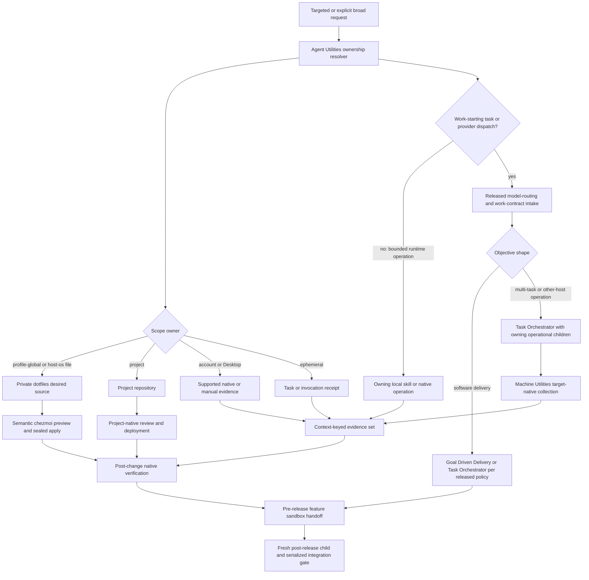
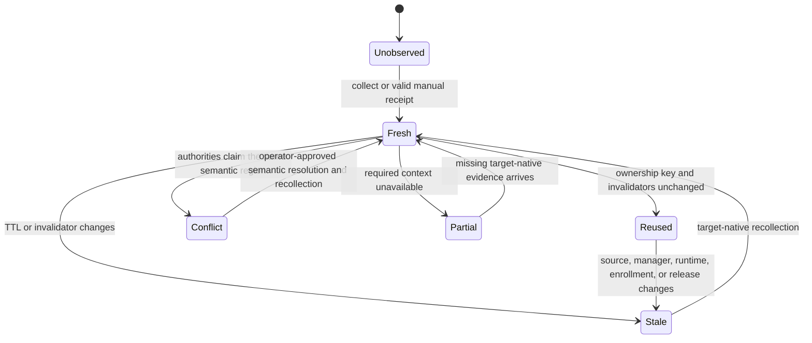

# Codex Configuration Ownership and Fleet Sync - Plan

## Goal Capsule

- **Objective:** Add one ownership-aware contract for auditing and reconciling safe Codex configuration across profiles, accounts, hosts, operating systems, projects, and transient task state.
- **Canonical owner:** Agent Utilities owns scope classification, resolution, evidence lifecycle, orchestration, and cross-repository receipts.
- **Dependent owners:** Machine Utilities implements target-native collection and guarded fleet execution. The private dotfiles repository owns portable desired configuration and semantic source reconciliation.
- **Default path:** Audit only the requested setting, profile, account, and host. Reuse fresh evidence when its complete ownership key still matches.
- **Broad path:** Enumerate the configured fleet only after the user explicitly asks for a broad audit or reconciliation.
- **Safety boundary:** Never copy complete Codex state, credentials, MCP configuration, Desktop databases, plugin caches, or arbitrary TOML. Never infer native Windows from WSL.
- **Released baseline:** Build on Agent Utilities `0.5.10` and Machine Utilities `0.2.18`; reuse their model-routing, task-authority, configured-fleet, native-readiness, and sealed-execution contracts.
- **Implementation boundary:** The feature's pre-release delivery phase ends at a reviewed sandbox handoff. It does not publish, reload feature releases, collect fleet completion receipts, or perform canonical integration.
- **Post-release terminal state:** A separately authorized fresh child may integrate only after maintained sources land in dependency order, feature releases resolve through native managers, release/fleet receipts are fresh, integration payloads are byte-identical to the reviewed releases, affected validation and independent rereview pass, and the integration owner serializes final acceptance.

---

## Product Contract

**Product Contract preservation:** Created from the bounded configuration, Agent Utilities, and Machine Utilities audits; R/A/F/AE identifiers are stable for implementation and must not be renumbered. The audit corrections to R5/R39 separate project-owned instructions from profile-global trust policy without expanding product scope.

### Summary

The feature separates five configuration scopes and assigns one owner to each mutable value. Agent Utilities resolves the scope and coordinates evidence. Machine Utilities observes and executes on configured targets. The private dotfiles source expresses portable desired state. Repository-owned project configuration stays with its project. Runtime flags, task choices, and remote-control session state remain ephemeral.

The first delivery is intentionally narrow. It adds no general configuration service, no database, no direct arbitrary TOML writer, and no private Desktop-state scraper. Existing native managers, Machine Utilities collectors, and chezmoi remain the execution authorities.

### Problem Frame

Codex settings currently appear in several surfaces with different authority: user `config.toml`, optional project configuration, account authentication, Desktop enrollment, task/thread choices, plugin manager state, and installed cache bytes. A flat host-level comparison can collapse multiple profiles or accounts and can mistake a cache or active task for current configuration authority.

Machine Utilities already collects allowlisted top-level TOML settings on POSIX and native Windows, but its records are keyed by host rather than profile/account context. It treats Codex Desktop Remote enablement as manual evidence and plugin-manager output as stronger than cache observation. Agent Utilities `0.5.10` already owns model and transport routing, configured-fleet orchestration, one-use visible-task authority, immutable work contracts, and canonical-writer boundaries, but it does not expose a configuration-ownership contract. Machine Utilities `0.2.18` already projects target-native readiness and sealed execution. The private dotfiles source already owns the rendered user config and requires semantic, path-scoped reconciliation.

### Actors

- A1. **Operator:** Requests a targeted or broad audit, approves a reconciliation scope, and resolves ambiguous semantic conflicts.
- A2. **Agent Utilities controller:** Resolves ownership, selects audit breadth, validates evidence freshness, coordinates dependent repositories, and issues the final receipt.
- A3. **Machine Utilities collector/executor:** Collects host-native evidence and applies only sealed, supported target operations.
- A4. **Private dotfiles source:** Owns portable desired values, host conditions, rendered previews, and source history.
- A5. **Project repository:** Owns project-scoped Codex configuration and its normal review lifecycle.
- A6. **Codex/Desktop/native managers:** Own runtime, login, plugin activation, supported Desktop state, and reload behavior.

### Requirements

#### Scope and ownership

- R1. Classify every requested value as `profile-global`, `account`, `host-os`, `project`, or `ephemeral` before collection or reconciliation.
- R2. Bind every observation to a stable profile context and host; bind account-scoped evidence to an opaque configured `codex_account_alias` without persisting email, organization, token, or subscription identifiers.
- R3. Keep one canonical writer per value and reject a plan when two sources claim the same semantic region.
- R4. Treat desired values observed during planning as snapshot evidence, not reusable product defaults.
- R5. Keep repository instructions and routing files under the project repository; keep `[projects."..."]` trust entries in profile-global configuration as machine-local policy; keep ephemeral launch/task choices outside portable configuration.

#### Audit modes and evidence

- R6. Default to a fast targeted audit of the requested setting and exact context; broad fleet enumeration requires an explicit broad request.
- R7. Reuse cached evidence only while its full ownership key, producer identity, source digest, resolver identity, and freshness class remain valid.
- R8. Preserve `present`, `absent`, `drifted`, `unknown`, `unavailable`, `partial`, and `conflict` as distinct states.
- R9. Include observed value only for an allowlisted non-secret semantic key; otherwise emit metadata, digest, or an exclusion reason.
- R10. Key comparisons by host, OS boundary, profile, configured `codex_account_alias` when applicable, kind, and logical setting ID so contexts never collapse.
- R11. Produce a bounded receipt that identifies scope, authority, producer, execution host, target platform, evidence source, observed time, freshness, digest, confidence, no-task state, and unresolved gaps without embedding secret values.

#### Desktop, account, task, and plugin truth

- R12. Collect Codex Desktop state only through a supported structured interface or a fresh explicit manual receipt; unsupported state remains `unavailable` or `manual-required`.
- R13. Keep Desktop Remote enrollment, authenticated account/profile identity, remote-control enrollment, saved project, task/thread identity, and task-selected model/effort as separate evidence fields.
- R14. Never treat an active remote task, thread ID, saved project, or reachable host as proof of the requested account/profile identity or Desktop enrollment.
- R15. Treat the native plugin manager/resolver as active-plugin truth; cache contents are read-only low-confidence artifacts and never become synchronization targets.
- R16. Invalidate plugin-derived evidence when manager state, active version, resolver root, plugin version, or reload receipt changes.

#### Reconciliation and platform boundaries

- R17. Reconcile portable profile-global and host-conditional values through the private dotfiles source and semantic chezmoi analysis only.
- R18. Require rendered content or digest, mapped source path, live/source history, host conditions, and preview for each selected target before apply.
- R19. Stop on same-region conflict or ambiguous intent; timestamps are evidence and never precedence.
- R20. Use only exact targeted native operations and sealed preconditions for apply; do not add arbitrary TOML, Desktop preference, registry, or cache writers.
- R21. Execute native Windows collection and proof in native PowerShell through its configured transport; WSL evidence can describe only the WSL context.
- R22. Keep account authentication and native credential-store enrollment per machine unless a separately approved secure enrollment path owns it.

#### Privacy and secret exclusion

- R23. Exclude credentials, cookies, tokens, environment values, `$CODEX_HOME/auth.json` contents, keychain/credential-store contents, MCP server tables, secret-bearing URLs, Desktop internal databases, transcripts, and arbitrary unallowlisted TOML.
- R24. Keep user-owned inventory outside plugin source and package artifacts; maintained repositories contain schema, contracts, tests, and examples only.
- R25. Reject unsafe, oversized, control-bearing, symlinked, or unexpectedly owned config/evidence inputs before parsing or use.

#### Delivery, release, and closure

- R26. Ship the new Agent Utilities ownership contract before dependent Machine Utilities advertises it, then publish coupled marketplace metadata from exact maintained-source revisions.
- R27. Resolve installed behavior through native managers after release; never patch or infer activation from installed plugin caches.
- R28. Reload or start a fresh task only through the supported native lifecycle and host-attested authority, then prove the loaded contract/version with a target-local canary.
- R29. Rebase each dependent implementation onto its then-current canonical base, adapt to intervening changes, rerun affected verification, and obtain fresh review before canonical integration.
- R30. Do not claim fleet completion until every requested host/profile/account context has a fresh target-bound receipt or a Machine Utilities-owned unresolved envelope; unresolved evidence satisfies matrix accounting but not fleet-complete status.

#### Complete surface classification and operating modes

- R31. Classify feature previews and runtime feature status; model, reasoning, and service defaults; global and project instruction hierarchy; skills; plugin enablement versus resolved payload/cache; Desktop preferences and Remote state; executable/config roots; credential references; project instructions and trust; and prompt/session bodies before collecting evidence.
- R32. Make `audit`, `preview`, and `apply` explicit machine-checkable modes. `audit` is strictly read-only; `preview` may render proposed managed-source output but cannot apply; `apply` alone may invoke a supported writer.
- R33. Require `apply` to carry fresh one-use authorization bound to the canonical owner, exact contexts, exact paths, desired content digests, and sealed preconditions. The target-native writer atomically claims and records authorization consumption before mutation; drift, a prior approval, a preview, or a stale receipt never authorizes mutation.
- R34. Keep Agent Utilities V1 stateless. It may use invocation-local evidence and caller-supplied versioned Machine Utilities snapshots written atomically with owner-only mode or equivalent ACL; it adds no store, ledger, watcher, or daemon. Corrupt, tampered, partial-write, producer-mismatched, or context-mismatched receipts are unusable and require recollection.
- R35. Collect internal SQLite evidence only as target-native diagnostics with read-only/query-only access and emit schema, safe counts, and digests only. Internal rows cannot establish account ownership, Desktop enrollment, or `present`; unsafe, unsupported, locked without a safe snapshot, or schema-incompatible access returns `unavailable`.
- R36. Support an optional explicit `codex_account_alias` in each Machine Utilities context, unique per host/profile and never derived from account data. Omission makes no account-specific claim; duplicates fail validation; existing configurations migrate as one unaliased profile context.
- R37. End the feature's pre-release delivery phase at sandbox handoff with reviewed source artifacts only; do not perform release, fleet rollout, or canonical integration in the same task.
- R38. Require a distinct post-release fresh child to resolve and reload released Agent Utilities through the native manager, validate release/fleet receipts, prove integration payloads byte-identical to the rebased and reviewed releases, rerun affected validation and independent review, then serialize canonical integration. Any payload change returns to release publication.
- R39. Do not assume a repository-local Codex config file exists. Repository instructions/routing files are project-owned; absolute-path trust entries remain machine-local profile policy even when they name a project.

### Setting Scope and Ownership Matrix

| Surface | Scope | Canonical writer | Evidence authority/form | Reconciliation or exclusion |
|---|---|---|---|---|
| Model, reasoning, plan reasoning, service tier, and update defaults | `profile-global` | Private dotfiles source for managed profiles; otherwise user-owned config | Target-native allowlisted parse bound to exact config root | Semantic source merge, render-only preview, then separately authorized targeted chezmoi apply |
| Feature previews and runtime feature status, including removed/experimental classifications | Configured override is `profile-global`; runtime classification is `host-os` | Managed config source for overrides; native Codex release for runtime status | Allowlisted config parse plus native feature resolver/version receipt | Reconcile only supported overrides; report removed/unknown status and never copy runtime-generated flags |
| Global default instructions and prompt files | `profile-global` | User-managed instruction/prompt source | Paths, ownership, digest, and hierarchy only; bodies excluded unless an exact non-secret file is explicitly requested | Semantic managed-source path; never bulk-copy prompt bodies |
| Repository instructions and routing files | `project` | Project repository | Repository-native content/revision and project test/review receipt | Project-native review and deployment only; never chezmoi |
| Project trust entries keyed by absolute path | `profile-global` machine-local policy | User-owned config or explicit host-conditioned dotfiles source | Target-native allowlisted key/path digest | Do not infer repository ownership; reconcile only through the profile owner |
| Standalone skills | `profile-global` | User skill source/installer | Entry-point presence, source identity, version/digest, and resolver visibility | Use supported installer/source workflow; no cache-derived activation |
| Plugin enablement | `profile-global` with resolver/runtime dependency | Native plugin manager plus user config | Native resolver reports installed/enabled/version/root | Reconcile through manager/config owner; manager result wins |
| Plugin payload and cache bytes | `host-os` artifact | Native plugin manager/cache lifecycle | Digest/path/mtime may explain residue only | Read-only observation; never activate, repair, publish, or synchronize cache |
| Desktop preferences and Remote state | `host-os`; enrollment portions may be `account` | Supported Desktop/OS owner | Supported structured status, otherwise fresh manual receipt or `unavailable` | Supported UI/lifecycle only; no undocumented plist/database writer |
| Executable, bundle, config-root, and managed-home paths | `host-os` / profile identity | Native installer, launcher, or account-profile manager | Target-native resolved paths, ownership, executable identity, and digest | Reconcile only through the owning installer/launcher; paths are evidence, not portable defaults |
| Login, credentials, credential-store choice, and credential references | `account` plus `host-os` storage | Native authentication/credential owner | Login method/status or opaque alias/digest only | Reauthenticate/enroll per machine; exclude token, cookie, keychain, environment value, and auth-file bodies |
| CLI flags, task-selected model/effort, temporary environment, thread/session identity | `ephemeral` | Invoking workflow/runtime | Current invocation receipt | Never synchronize; expires with invocation/task |
| Prompt, transcript, history, and session bodies | `ephemeral` / sensitive history | Native runtime/user | Existence/count/digest only when explicitly needed | Excluded from snapshots, plans, fixtures, logs, and reconciliation |

### Key Flows

- F1. **Fast targeted audit**
  - **Trigger:** A1 names a setting, host, profile, or account context without asking for fleet-wide coverage.
  - **Actors:** A1, A2, A3
  - **Steps:** Resolve scope and owner; select fresh keyed evidence or collect the smallest native section; compare only the requested semantic key; return drift and exclusions.
  - **Covered by:** R1-R16, R23-R25, R31-R32, R34-R36, R39
- F2. **Explicit broad audit**
  - **Trigger:** A1 requests all configured hosts, profiles, or accounts.
  - **Actors:** A1, A2, A3, A6
  - **Steps:** Resolve configured contexts; collect each POSIX and Windows context natively; preserve unavailable/manual Desktop evidence; aggregate without collapsing identities.
  - **Covered by:** R6-R16, R21-R25, R30-R32, R34-R36, R39
- F3. **Portable setting reconciliation**
  - **Trigger:** Audited desired and observed values differ for a managed profile-global or host-conditional key.
  - **Actors:** A1, A2, A3, A4
  - **Steps:** Inspect source/live semantics and history; stop or merge; preview each selected context; seal exact targets; apply natively; collect post-state.
  - **Covered by:** R3-R5, R17-R25, R31-R34, R36, R39
- F4. **Release and fleet closure**
  - **Trigger:** Maintained source changes pass repository verification.
  - **Actors:** A2, A3, A4, A6
  - **Steps:** Rebase/adapt isolated feature refs, validate and review them, then publish byte-frozen compatible releases without canonical-base integration; start a fresh post-release child through the released routing and authority contracts; resolve and reload released Agent Utilities through the manager; validate release/fleet receipts; prove integration payload identity; rerun affected validation and independent rereview; serialize canonical integration. Any payload change returns to release publication.
  - **Covered by:** R26-R30, R34, R37-R38

### Acceptance Examples

- AE1. **Covers R1-R11.** A request for `model_reasoning_effort` on one macOS profile reads only that allowlisted key and returns a context-keyed receipt; it does not enumerate the fleet or emit nearby MCP configuration.
- AE2. **Covers R2, R10, R13-R14.** Two Codex profiles on one host produce separate records even when they share a login or task host; a task ID never substitutes for either profile identity.
- AE3. **Covers R6-R11.** A broad audit is run only after the request names broad scope and returns one explicit state per configured context, including partial and unavailable results.
- AE4. **Covers R12-R14.** When no supported Desktop interface exists, the result says `manual-required`; a reachable remote task does not convert that state to `present`.
- AE5. **Covers R15-R16, R27-R28.** Manager output identifies one active plugin version while an older cache directory remains. The manager version wins, the cache is reported as low-confidence residue, and a fresh task canary proves the loaded release.
- AE6. **Covers R17-R20.** Source and live files changed in disjoint semantic regions. The source merge preserves both, every target preview matches intent, and only exact approved paths apply.
- AE7. **Covers R19-R20.** Source and live values changed in the same semantic region with ambiguous intent. Reconciliation stops without applying, adding, or selecting the newest timestamp.
- AE8. **Covers R21.** WSL is reachable but native Windows evidence is unavailable. Windows remains unresolved and no WSL result is relabeled as native proof.
- AE9. **Covers R23-R25.** Fixtures place credentials, MCP secrets, control text, and oversized values beside allowlisted settings. None reaches stdout, receipts, caches, or plans, and unsafe inputs fail closed.
- AE10. **Covers R26-R30.** A dependent branch advances after review. The implementation rebases, adapts, reruns affected tests, receives fresh review, and publishes exact releases. The post-release child reloads manager-resolved releases, integrates only byte-identical payloads through the canonical owner, and reports partial rather than complete when one target receipt is missing.
- AE11. **Covers R5, R39.** A repository instruction changes. It follows repository-native review/deployment and verification; chezmoi is never invoked. A profile trust entry naming that repository remains separate machine-local policy.
- AE12. **Covers R32-R33.** Audit and preview detect drift but cannot write. Apply succeeds only with an unused authorization matching the exact owner, contexts, paths, desired digests, and current sealed preconditions; replay or any mismatch fails closed.
- AE13. **Covers R33-R34.** Agent Utilities validates a protected Machine Utilities snapshot and authorization envelope without retaining state. The target-native writer atomically claims the authorization; a second process, a partial prior attempt, or a no-op replay is rejected without repeating mutation.
- AE14. **Covers R21, R35.** Two SQLite stores exist and the newer timestamp belongs to the inactive store. Process/open-file evidence may select a live diagnostic source for schema/count/digest-only queries, but neither store establishes account ownership or Desktop enrollment. Unsafe access or missing native Windows access returns `unavailable`; WSL is not substituted.
- AE15. **Covers R2, R36.** Two contexts on one host/profile declare the same `codex_account_alias` and validation fails. An existing config with no alias migrates as one unaliased profile and makes no account-specific claim; the alias never populates model-routing provider `accountScope`.
- AE16. **Covers R26-R30, R37-R38.** The pre-release delivery phase stops at sandbox handoff after rebased/adapted refs are reviewed, validated, and published as byte-frozen releases. A later fresh child is admitted only by released host-attested routing, resolves the feature release through the manager, verifies release/fleet receipts, preserves unavailable target-native contexts as unresolved, proves integration payload identity, reruns affected validation and independent rereview, then enters serialized canonical integration. A payload change returns to publication.

### Scope Boundaries

**In scope**

- One Agent Utilities ownership/resolution contract and thin skill entrypoint.
- Account/profile-aware Machine Utilities setting records and comparison inputs.
- Supported-interface or explicit-manual Desktop evidence.
- Semantic private-dotfiles ownership and exact target apply.
- Cross-repository release, reload, receipt, and canonical-integration gates.

**Outside this product's identity**

- A general-purpose configuration management service or database.
- Automatic account switching, subscription routing, or credential distribution.
- Full TOML, MCP, Desktop database, registry, keychain, or cache synchronization.
- Reverse engineering undocumented Desktop storage.
- Direct arbitrary TOML/Desktop writers or cache repair.
- Treating WSL as native Windows.
- A long-lived Agent Utilities evidence store, ledger, watcher, or daemon.

---

## Planning Contract

### Key Technical Decisions

- KTD1. **Agent Utilities owns one versioned ownership contract.** Add `agent-utilities/codex-config-ownership/v1` behind a thin skill and dependency-free resolver. Machine Utilities and dotfiles consume the contract but do not copy its classification, cache, or receipt rules. (session-settled: user-directed — chosen over making Machine Utilities canonical: the user assigned orchestration and contract ownership to Agent Utilities.)
- KTD2. **The default is a targeted resolver path.** Resolution starts from an exact requested key/context and expands only on explicit broad scope. This keeps routine audits fast and prevents accidental fleet/account enumeration.
- KTD3. **Context identity is composite and typed.** The record key includes host, OS boundary, profile, optional opaque account alias, kind, and logical ID. Remote enrollment and task/thread identity remain adjacent evidence rather than identity substitutes.
- KTD4. **Evidence is content-minimized and invalidation-driven.** Persist only allowlisted semantic values or digests plus provenance. Invalidate on any ownership-key, source, resolver, manager, runtime, profile, enrollment, or release input change instead of maintaining a background watcher.
- KTD5. **Native resolvers outrank cache observations.** Plugin manager output and verified installed executor identity define active state. Cache directories can explain residue or infer low-confidence timing but cannot authorize writes, activation, or reconciliation.
- KTD6. **Desktop evidence stays supported or manual.** A structured supported interface may produce a receipt. Otherwise the contract records a fresh explicit manual observation or `manual-required`; it never reads undocumented databases.
- KTD7. **Chezmoi remains the only portable file reconciliation engine.** Agent Utilities decides ownership and scope; private dotfiles owns desired source; Machine Utilities applies only sealed native operations. No new TOML mutation library is needed.
- KTD8. **Cross-repository release is compatibility-ordered.** Agent Utilities contract integration and distribution precede Machine Utilities adoption. Marketplace metadata binds exact source revisions, and post-release proof uses resolver-selected installed artifacts rather than cache paths.
- KTD9. **Canonical integration revalidates moving branches.** Every repo unit must adapt to its current base and receive review on the adapted diff before the integration owner accepts combined evidence. Prior review never survives a material rebase automatically.
- KTD10. **Modes are capabilities, not labels.** Audit has no writer capability, preview can render but not apply, and apply requires a sealed authorization matching exact mutation inputs. The target-native writer owns atomic one-use consumption; observed drift never escalates mode.
- KTD11. **Agent Utilities V1 is stateless.** Reuse is limited to invocation-local evidence and caller-supplied versioned Machine Utilities atomic snapshots protected by owner-only mode or equivalent ACL. Invalid receipts trigger recollection, not repair or persistence.
- KTD12. **Internal SQLite evidence is diagnostic-only.** Target-native read-only/query-only queries emit only schema, counts, and digests; process/open-file evidence may select the relevant diagnostic store. Only a supported structured interface or manual receipt can establish account or Desktop state.
- KTD13. **Account aliasing is explicit and non-derived.** `codex_account_alias` is optional, unique per host/profile, and supplied by user-owned inventory. No alias means no account claim; it never maps to model-routing provider `accountScope`.
- KTD14. **Pre-release and post-release authority are separate tasks.** The feature's pre-release delivery task stops at sandbox handoff. A fresh post-release child owns manager-resolved reload proof, receipts, released-payload identity proof, affected validation/rereview, and serialized canonical integration.
- KTD15. **Delivery routing and configuration operations stay separate.** Software implementation, release, and integration use released model-routing, Goal Driven Delivery, and Task Orchestrator policy. Runtime `audit`, `preview`, and `apply` stay in `codex-config-sync` and their Machine Utilities, native-manager, project, or chezmoi owner; model-routing runs only before a work-starting task/provider dispatch.
- KTD16. **Machine Utilities owns target-bound routing-attempt envelopes.** A remote task attempt binds producer/version, attempt, host/profile, execution host, target platform, readiness/input digest, deadline, canonical status, nested cause, and no-task evidence. Public CLI diagnostics remain causes, not reusable fleet receipts or fallback authority.
- KTD17. **The target-native writer owns authorization consumption.** Agent Utilities validates the bounded authorization envelope but retains no replay state. Machine Utilities or the canonical native writer atomically claims `authorization_id`, sealed plan, and context before mutation and records terminal, partial, and no-op consumption.
- KTD18. **One frozen wire fixture joins Agent Utilities and Machine Utilities.** The fixture owns request/response commands, canonical JSON/digests, error states, `profile_id`, optional `codex_account_alias`, snapshot-key migration, and profile selection. Machine Utilities emits the protected snapshot; Agent Utilities consumes it without copying collector logic.
- KTD19. **Released and integrated payloads are byte-identical.** U5 publishes only rebased feature refs with frozen plugin-tree, manifest, and integrity digests. Any payload-changing U6 adaptation invalidates release evidence and returns to U5 for new versions, pins, compatibility checks, installs, and canaries.

### Released Runtime Baseline

- Agent Utilities `0.5.10` at `beb0205e7e21160f24bad4c426365f916d2b033c` is the planning baseline. Its final suite passed `166/166`, with no P0/P1/P2 quality findings and no P0/P1 security findings.
- Machine Utilities `0.2.18` at `06e12fb9dfc63a4673c771e54e1237979dd1253b` is the target-native baseline. Its normal compatibility gate passed `1/1`.
- Marketplace commit `6d3da4b` couples those released versions. Installed plugin caches remain read-only observations and are not source or activation authority.
- Three macOS hosts resolved Agent Utilities `0.5.10` and Machine Utilities `0.2.18` through native managers.
- Iris WSL timed out twice without mutation. Iris native Windows returned `model_routing_capability_unavailable` and `trusted_task_authority_attestor_unavailable`; no task was created. These observations preserve baseline limitations but are not target-bound product receipts; U6 requires fresh Machine Utilities envelopes.

### High-Level Technical Design

The diagram defines the authoritative ownership and evidence lifecycle.

Evidence uses this lifecycle:

### Evidence Key and Invalidation Contract

The resolver key contains only bounded identifiers and digests:

- Contract version and audit mode.
- Host ID and OS boundary (`macos`, `linux`, `wsl`, or `windows-native`).
- Profile ID and config-root digest; optional opaque `codex_account_alias` kept separate from provider account scope.
- Scope, logical setting ID, and canonical owner.
- Collector/resolver version and active plugin-manager identity.
- Source revision/rendered digest when source-managed.
- Observed time, freshness class, confidence, and evidence method.
- Separate Desktop enrollment, remote-control enrollment, saved-project, and task/thread fields when requested.

Evidence becomes stale when any keyed field changes, its freshness window expires, the manager-active plugin changes, a reload receipt supersedes it, or a manual observation is withdrawn. Cache directory timestamps do not extend freshness.

### Mode and Authorization Contract

| Mode | Allowed effects | Required input | Receipt |
|---|---|---|---|
| `audit` | Read allowlisted files/status and safe SQLite metadata only | Exact requested contexts and logical setting IDs | Read-only evidence; no desired-state or writer capability |
| `preview` | All audit effects plus maintained-source rendering/diff | Exact owner, contexts, proposed source revision, and desired digests | Rendered digest and conflict/precondition result; no apply capability |
| `apply` | Invoke only the canonical supported writer for sealed targets | Fresh authorization bound to owner, contexts, paths, desired digests, preview receipt, and current preconditions | Writer-claimed authorization plus per-target post-state; cross-process replay and mismatch fail closed |

Mode is validated before collection or dispatch. The resolver never upgrades a request because drift exists. Authorization is invalid after first use, expiry, owner/context/path/digest mismatch, changed preconditions, changed source revision, or changed executor identity.

### Stateless Evidence Reuse

Agent Utilities keeps only invocation-local objects. Reusable input is a caller-supplied, schema-versioned Machine Utilities snapshot created atomically and protected by mode `0600` or a platform-equivalent owner-only ACL. The envelope binds producer version, host/OS/profile/account context, collection mode, source/resolver identities, creation time, integrity digest, and completeness. A failed parse, integrity mismatch, unsupported version, unsafe ownership/ACL, partial write, producer mismatch, or context mismatch makes the snapshot unusable; recollect instead of repairing it.

Authorization consumption is not Agent Utilities state. The target-native writer atomically claims the authorization and sealed plan before its first effect, then records terminal, partial, or no-op consumption so a fresh process cannot replay it. Crash recovery resumes from that writer-owned record and never repeats a completed mutation blindly.

### Verified Local Schema Basis

The implementation must preserve these audited seams without treating their current values or row counts as defaults:

- `$CODEX_HOME/config.toml` is profile-global configuration; an alternate `CODEX_HOME` changes the configuration, auth, state, plugin, and skill root together.
- `$CODEX_HOME/auth.json` contains account credentials and `tokens.account_id`; collection may report login method or an opaque digest/alias but never credential contents.
- `$CODEX_HOME/state_5.sqlite` may expose diagnostic schema differences between enrollment and thread rows, but it is undocumented internal state. It cannot prove account ownership, Desktop enrollment, or runtime presence.
- Diagnostic SQLite collection is target-native and sets read-only/query-only before inspecting `sqlite_master`, schema columns, safe row counts, or opaque digests. It never emits URLs, account IDs, titles, prompts, previews, paths, or message bodies.
- More than one state database can exist. Process/open-file ownership and expected schema select the live store, not filename or newest timestamp. WAL/lock state must be consumed only through a supported safe read path; otherwise report `unavailable`. Stale secondary stores remain evidence, never write targets.
- Desktop global state can aggregate multiple account enrollment and remote-host records in one machine-local container. It does not replace per-profile auth or state authority.
- The native plugin resolver reports active enablement and version. Installed cache directories can contain inactive, duplicated, or stale payloads and are not ownership or activation evidence.

### Failure and Recovery Contract

| Failure | Required behavior | Recovery |
|---|---|---|
| Unknown or ambiguous owner | Block reconciliation | Correct the user-owned ownership map and recollect |
| Same-region source/live conflict | Emit `conflict`; do not choose by timestamp | Operator resolves intent, source is merged, all selected targets preview again |
| Unsupported Desktop evidence | Emit `manual-required` or `unavailable` | Capture a fresh manual receipt or add a supported structured interface |
| Profile/account identity mismatch | Reject evidence for the requested context | Re-resolve the exact configured profile/account and recollect |
| Host routing or task authority unavailable | Preserve a Machine Utilities target-bound unresolved envelope with the CLI cause nested; do not dispatch | Restore host-owned readiness or the trusted user-turn attestor, then obtain a fresh route and one-use claim |
| Manager/cache disagreement | Manager wins; cache remains residue evidence | Reload/update through the manager, then run a fresh-task canary |
| Native Windows unavailable | Keep Windows unresolved | Restore native task/PowerShell transport; never substitute WSL |
| Stale or mismatched executor | Stop before apply | Deliver the compatible release through normal manager flow and verify identity |
| Partial post-apply inventory | Preserve authoritative partial receipt | Repair only the failed context and recollect; do not repeat successful writes blindly |
| Invalid snapshot or receipt | Treat as unusable; do not merge or repair | Recollect from the target-native producer with safe ownership and atomic write |
| SQLite schema/lock/WAL cannot be read safely | Return `unavailable`; do not copy or bypass locks | Restore supported native access or collect through a supported safe snapshot path |
| Apply authorization stale, replayed, or mismatched | Target-native writer rejects before mutation | Re-preview current source/preconditions and obtain new exact one-use authorization |
| Dependent base advanced | Stop canonical integration | Rebase, adapt, rerun affected gates, and obtain fresh review |
| Rollout regression | Stop remaining rollout | Restore the prior maintained source revision through normal release ownership, target-preview the reversal, and collect recovery receipts |

### Sequencing

1. Freeze the Agent Utilities ownership contract and tests on the released `agent-utilities/model-routing/v1` baseline.
2. Add the thin Agent Utilities entrypoint and reuse the existing model-routing, Goal Driven Delivery, and Task Orchestrator seams without copying or modifying their policy.
3. Implement Machine Utilities context-aware collection against the frozen contract.
4. Implement the private-dotfiles ownership data and semantic rendering changes.
5. Stop the feature's pre-release delivery task at sandbox handoff; no canonical integration occurs there.
6. In a separately authorized release task, rebase/adapt isolated feature refs onto current canonical bases, review and validate them, then publish byte-frozen compatible releases without merging target base branches.
7. Start a fresh post-release child only after released host-attested routing admits it. Reload manager-resolved artifacts, collect target-native fleet receipts, preserve unavailable contexts, prove the integration refs are byte-identical to the released payloads, rerun affected validation and independent rereview, then pass the serialized canonical integration gate. Any payload change returns to step 6 with new versions and pins.

---

## Implementation Units

### U1. Agent Utilities ownership resolver and receipt schema

- **Goal:** Implement the canonical scope, ownership, fast/broad audit, evidence-key, invalidation, and receipt contract.
- **Requirements:** R1-R16, R23-R25, R31-R34, R36, R39; F1-F2; AE1-AE5, AE9, AE11-AE13, AE15; KTD1-KTD6, KTD10-KTD13, KTD17-KTD18.
- **Repo:** Agent Utilities.
- **Files:** `plugins/agent-utilities/references/codex-config-ownership.md`; `plugins/agent-utilities/scripts/codex-config-ownership.mjs`; `plugins/agent-utilities/scripts/codex-config-ownership.test.mjs`; `plugins/agent-utilities/scripts/fixtures/codex-config-ownership-v1.json` (new).
- **Approach:** Use dependency-free Node and bounded JSON inputs. Freeze the shared AU/MU request, response, canonical-digest, error, profile, alias, and snapshot-key fixture before implementation expands. Implement pure classification, keying, mode admission, authorization-envelope validation, redaction, and receipt rendering. Keep all state invocation-local; the resolver never consumes authorization, reads credentials, starts tasks, invokes providers, writes settings, contacts hosts, or creates a store/ledger/daemon.
- **Test scenarios:** Every matrix surface and scope; targeted versus explicit broad admission; audit/preview cannot write; drift cannot escalate mode; authorization-envelope exact-match, expiry, and changed-precondition failures; writer-consumption fields remain opaque; two profiles and `codex_account_alias` values; remote enrollment/thread/profile separation; source/manager/runtime/reload invalidators; corrupt/tampered/mismatched snapshot rejection; unknown and partial preservation; secret/control/oversize rejection; cache cannot outrank manager truth.
- **Verification:** The focused Node test passes offline with no network, provider, credential, host, or cache mutation.
- **Dependencies:** None.

### U2. Agent Utilities skill and orchestration adoption

- **Goal:** Expose the versioned contract and keep runtime configuration operations in their owning skill/native seams while reusing released software-delivery and remote-dispatch policy.
- **Requirements:** R1-R7, R11-R22, R26-R39; F1-F4; AE1-AE16; KTD1-KTD19.
- **Repo:** Agent Utilities.
- **Files:** `plugins/agent-utilities/skills/codex-config-sync/SKILL.md`; `plugins/agent-utilities/skills/codex-config-sync/agents/openai.yaml`; `plugins/agent-utilities/skills/task-orchestrator/scripts/delivery-contracts.test.mjs`; `plugins/agent-utilities/.codex-plugin/plugin.json`; `plugins/agent-utilities/.claude-plugin/plugin.json`; `README.md`.
- **Approach:** Add one thin public skill that calls U1. Execute bounded local `audit`, `preview`, and `apply` through their Machine Utilities, native-manager, project, or chezmoi owner without GDD. Invoke model-routing and its immutable work contract only at a work-starting task/provider boundary. Reuse Task Orchestrator for independently resumable or other-host operations, with children using the owning operational skill; reuse GDD only for repository software-delivery children.
- **Patterns to follow:** `plugins/agent-utilities/skills/model-routing/SKILL.md`; `plugins/agent-utilities/skills/goal-driven-delivery/SKILL.md`; `plugins/agent-utilities/skills/task-orchestrator/SKILL.md`.
- **Test scenarios:** A bounded local audit/preview/apply stays in the owning operational skill and never enters GDD; independently resumable or other-host operations enter Task Orchestrator with operational children; software-delivery children follow released GDD/Task Orchestrator policy; public CLI task creation fails closed without trusted authority; unavailable target-native readiness emits a Machine Utilities unresolved envelope and creates no task; `codex_account_alias` never populates provider `accountScope`; concurrent writers are rejected; project files never route through chezmoi; audit/preview receipts cannot authorize apply; the pre-release handoff cannot claim release/integration.
- **Verification:** U1, model-routing, and delivery-contract tests pass; manifest/frontmatter checks expose the new skill in both harnesses; documentation names one public ownership contract without duplicating released routing constants.
- **Dependencies:** U1.

### U3. Machine Utilities context-aware native inventory

- **Goal:** Extend fleet inventory and comparison so every safe Codex setting and Desktop/account evidence item is bound to an exact context.
- **Requirements:** R2, R6-R16, R21-R25, R30-R31, R33-R36; F1-F2; AE1-AE5, AE8-AE9, AE13-AE15; KTD3-KTD6, KTD11-KTD13, KTD16-KTD18.
- **Repo:** Machine Utilities.
- **Files:** `plugins/machine-utilities/config.example.json`; `plugins/machine-utilities/scripts/machine-utilities`; `plugins/machine-utilities/scripts/collect-posix`; `plugins/machine-utilities/scripts/collect-windows.ps1`; `plugins/machine-utilities/scripts/model-routing-compat.test.mjs`; `plugins/machine-utilities/scripts/test-machine-utilities`; `plugins/machine-utilities/references/agent-settings-and-auth.md`; `plugins/machine-utilities/skills/fleet-agents/SKILL.md`; `plugins/machine-utilities/skills/fleet-inventory/SKILL.md`; `.github/workflows/validate.yml`; `README.md`; `docs/architecture.md`.
- **Approach:** Extend existing `agent_artifacts.settings` collectors with the frozen U1 wire fixture, explicit `profile_id`, optional `codex_account_alias`, profile selection, and snapshot-key migration. Machine Utilities emits protected snapshots and target-bound routing-attempt envelopes without executing AU classification. The target-native writer atomically consumes apply authorization and records terminal, partial, and no-op outcomes. SQLite remains diagnostic-only; supported/manual Desktop evidence stays authoritative.
- **Test scenarios:** Existing single-profile configs migrate unaliased; unique aliases succeed and duplicates fail; aliases are never derived or mapped to provider scope; alternate roots do not cross-read; POSIX/native Windows records match the shared fixture; a second process cannot replay a terminal, partial, or no-op authorization; WSL timeout and native-Windows routing failure remain separate target-bound envelopes; internal SQLite cannot emit `present`, account ownership, or Desktop enrollment; unsafe snapshots fail closed; cache-only plugins stay low confidence; surrounding secrets never emit.
- **Verification:** `plugins/machine-utilities/scripts/test-machine-utilities` passes on POSIX and native Windows CI; ownership compatibility validates the exact AU feature contract and shared fixture rather than only the baseline semantic version.
- **Dependencies:** U1 contract frozen; U2 public skill metadata available before release advertisement.

### U4. Private dotfiles ownership and semantic reconciliation

- **Goal:** Express portable desired settings and host/profile conditions in maintained chezmoi source without copying account, Desktop, or ephemeral state.
- **Requirements:** R1-R5, R17-R25, R30-R33, R39; F3; AE6-AE9, AE11-AE12; KTD7, KTD10.
- **Repo:** Private dotfiles.
- **Files:** `dot_codex/modify_private_config.toml`; `run_onchange_after_20-windows-codex-env.ps1.tmpl`; `scripts/render-review`; `scripts/preapply-check`; `scripts/check-remote-readiness`; `tests/codex-config-ownership.bats` (new).
- **Approach:** Add only allowlisted portable and explicit host-conditional values to the existing modifier and Windows run-onchange patterns. Use `scripts/render-review` for semantic per-target preview and preserve unrelated source/live edits. Apply only after the target-native writer atomically claims the sealed authorization. Keep aliases, credentials, Desktop enrollment, task state, prompt/session bodies, plugin cache paths, and project-owned instructions out of rendered global config.
- **Test scenarios:** Profile-global render; current POSIX/Windows render-review parity; Windows run-onchange idempotence; account/ephemeral/project-instruction exclusions; project changes never invoke chezmoi; trust entries remain profile policy; unlisted TOML preservation; disjoint merge; same-region conflict stop; audit/preview no-apply; apply requires writer-claimed authorization and rejects cross-process replay; native Windows tested as Windows rather than WSL.
- **Verification:** Chezmoi source validation and pre-apply checks pass; rendered output for every selected context matches the approved semantic values; no secret material appears in diffs or fixtures.
- **Dependencies:** U1 ownership matrix; U3 context IDs agreed before fleet rollout.

### U5. Isolated feature-release publication and compatibility coupling

- **Goal:** Build and publish exact compatible Agent Utilities and Machine Utilities feature releases from isolated sandbox/release refs without merging target base branches or using cache-derived authority.
- **Requirements:** R26-R28, R37-R38; F4; AE5, AE10, AE16; KTD5, KTD8, KTD14-KTD19.
- **Repo:** Agent Utilities, Machine Utilities, and Marketplace.
- **Files:** Agent Utilities `plugins/agent-utilities/.codex-plugin/plugin.json` and `plugins/agent-utilities/.claude-plugin/plugin.json`; Machine Utilities `plugins/machine-utilities/.codex-plugin/plugin.json`, `plugins/machine-utilities/.claude-plugin/plugin.json`, `plugins/machine-utilities/integrity.json`, `plugins/machine-utilities/scripts/model-routing-compat.test.mjs`, `plugins/machine-utilities/scripts/test-machine-utilities`, and `.github/workflows/validate.yml`; Marketplace `.agents/plugins/marketplace.json`, `.agents/plugins/plugin-versions.json`, `.claude-plugin/marketplace.json`, and `README.md` only if catalog identity changes.
- **Approach:** Rebase/adapt the isolated Agent Utilities feature ref onto its current base before publication, review and validate it, then freeze its plugin-tree and manifest digests. Build the Machine Utilities release only after ownership compatibility targets that exact AU contract, fixture, exports, and source revision; freeze its plugin-tree, manifest, and integrity digests before publishing exact marketplace pins. U6 may integrate only byte-identical payloads.
- **Test scenarios:** The released `0.5.10`/`0.2.18` baseline does not satisfy the ownership compatibility gate by version alone; an absent or incompatible AU fixture/export blocks dependent publication; exact compatible releases succeed; a stale source or marketplace revision is rejected; Codex and Claude resolve the same digests; installed cache residue never satisfies activation proof; U5 cannot publish pre-rebase bytes, merge a target base branch, claim fleet completion, or accept final state.
- **Verification:** Each repository's manifest, integrity, and catalog validation passes; clean-profile installs resolve the expected active version through native managers in both harnesses.
- **Dependencies:** U1-U4 complete and reviewed on isolated sandbox refs.

### U6. Fresh post-release reload, receipt, and serialized integration gate

- **Goal:** In a distinct fresh child after release authorization, prove the released feature on every requested context and prevent stale review or partial rollout from becoming canonical integration.
- **Requirements:** R26-R30, R37-R38; F4; AE5, AE8, AE10, AE16; KTD8-KTD9, KTD14-KTD19.
- **Repo:** Agent Utilities, Machine Utilities, Marketplace, and Private dotfiles.
- **Files:** `plugins/agent-utilities/skills/codex-config-sync/SKILL.md`; `plugins/agent-utilities/skills/task-orchestrator/scripts/delivery-contracts.test.mjs`; Machine Utilities `plugins/machine-utilities/scripts/test-machine-utilities`; Private dotfiles `scripts/check-remote-readiness`; release evidence remains external to maintained source.
- **Approach:** Start only after compatible feature releases exist and released model-routing admits a fresh child with host-attested authority. Resolve and reload Agent Utilities through the native manager, then collect fresh Machine Utilities target-bound attempt and fleet envelopes per requested context. Rebase integration refs without changing released payload bytes, prove plugin-tree/manifest/integrity digest equality, and rerun affected validation and independent rereview before serialized acceptance. Any payload change returns to U5 for new releases and receipts.
- **Patterns to follow:** `plugins/agent-utilities/skills/model-routing/SKILL.md`; `plugins/agent-utilities/skills/task-orchestrator/SKILL.md`; Machine Utilities `plugins/machine-utilities/skills/fleet-agents/SKILL.md`.
- **Test scenarios:** Pre-release handoff cannot enter U6; a stale or unreleased AU feature contract fails; manager-active version differs from cache; a fresh child reloads the released contract; missing trusted task authority creates no task; public CLI causes appear only inside a target-bound unresolved envelope; WSL timeout and native-Windows failure remain separate; stale baseline Iris observations cannot satisfy U6; a content-changing rebase invalidates U5 and loops back; byte-identical rebase reruns affected review; serialized integration admits only one canonical writer.
- **Verification:** Cross-repository focused tests pass on their adapted revisions; independent review covers the final diffs; every requested context has a fresh Machine Utilities target-bound receipt or unresolved envelope; integration payload digests equal the reviewed releases; no installed cache or credential changes appear in maintained-source diffs.
- **Dependencies:** U5 distributions available; U1-U4 frozen.

---

## Verification Contract

| Gate | Scope | Pass condition |
|---|---|---|
| Agent Utilities resolver | U1 | `node --test plugins/agent-utilities/scripts/codex-config-ownership.test.mjs` passes offline with privacy and invalidation fixtures |
| Mode/authorization safety | U1-U4 | Audit is read-only, preview renders without apply, AU validates but does not consume authorization, and the target-native writer atomically rejects cross-process replay before mutation |
| AU/MU wire and snapshot safety | U1, U3 | The shared fixture freezes commands, fields, canonical digests, errors, profile/alias identity, and snapshot migration; invalid protected snapshots are recollected and AU creates no persistent state |
| SQLite diagnostic safety | U3 | Target-native read-only/query-only tests cover schema drift, lock/WAL safety, safe counts/digests, and prove internal state cannot establish account ownership, Desktop enrollment, or `present` |
| Routing and task authority | U2, U6 | `node --test plugins/agent-utilities/scripts/model-routing.test.mjs` proves immutable work contracts, trusted one-use task authority, fail-closed public CLI behavior, and target-native readiness binding without routing local config operations through GDD |
| Orchestration contracts | U2, U6 | `node --test plugins/agent-utilities/skills/task-orchestrator/scripts/delivery-contracts.test.mjs` proves software-delivery placement, operational-child routing, writer ownership, and final receipt gating without copied model policy |
| Dual-harness metadata | U2, U5 | Both Agent Utilities manifests expose the same skill/version contract and validate structurally |
| Machine Utilities suite | U3, U5, U6 | `plugins/machine-utilities/scripts/test-machine-utilities` passes on POSIX and hosted native Windows with context parity, writer-consumption, target-bound unresolved envelopes, ownership compatibility, and secret-exclusion fixtures |
| Dotfiles render | U4, U6 | `scripts/preapply-check` and focused render fixtures pass for every selected host/profile; semantic preview has no unresolved conflict |
| Project ownership negative | U2, U4 | Repository instruction/routing changes use project-native review/deployment and tests; no chezmoi preview or apply is dispatched |
| Marketplace coupling | U5 | Both harness catalogs and the version ledger bind exact reviewed source revisions, shared ownership contract/fixture, and compatible versions |
| Released payload identity | U5-U6 | Rebased release refs freeze plugin-tree, manifest, and integrity digests; canonical integration proves byte equality or returns to U5 for new releases and receipts |
| Native reload canary | U6 | Manager-resolved released Agent Utilities and Machine Utilities versions load in a fresh supported runtime/task without reading cache paths |
| Fleet evidence matrix | U6 | Every requested context has a fresh Machine Utilities target-bound receipt or unresolved envelope; WSL never satisfies native Windows and unresolved rows never count as fleet-complete |
| Pre-release boundary | U2, U5 | The feature's pre-release delivery task emits sandbox handoff only and cannot claim release, reload, fleet completion, or canonical integration |
| Post-release canonical integration | U6 | A fresh child proves manager-resolved released Agent Utilities, release/fleet receipts, byte identity with the reviewed release payloads, affected validation, and independent rereview before serialized acceptance |
| Privacy negative scan | U1-U6 | No credential, token, cookie, environment value, MCP secret, auth file content, Desktop database content, transcript, or arbitrary TOML persists or emits |

Verification is layered. Focused unit tests run at each unit boundary. Full repository, native-platform, clean-profile, release, reload, and fleet gates run after the relevant revisions freeze. Any material rebase, contract change, manifest change, or receipt invalidator reruns the affected gates and review.

---

## Assumptions

- Agent Utilities can publish the ownership contract after the `0.5.10` baseline and before dependent repositories advertise feature compatibility.
- Plan integration grants no implementation, release, fleet-mutation, or feature-integration authority; those effects require separately authorized delivery tasks.
- Machine Utilities' current allowlisted collectors and sealed execution path remain the native collection/apply seam; the work extends their context key rather than replacing them.
- The private dotfiles repository remains separately authorized maintained source and can add semantic fixtures without importing credentials, account identifiers, or fleet inventory.
- File evidence is content-addressed and reusable only while its full key is unchanged. Native runtime and manual Desktop evidence default to one audit invocation unless the contract assigns a shorter explicit invalidation event.
- Repository verification can run with synthetic aliases and fixtures; no live credential, paid provider call, or Desktop database is needed for automated tests.

## Open Questions

- **Non-blocking:** Which supported structured Desktop fields, if any, are available on each release/platform? V1 falls back per field to a fresh manual receipt or `unavailable`; this cannot delay the ownership contract.
- **Release-time:** Which versions supersede the `0.5.10`/`0.2.18` baseline as the first compatible ownership-sync pair? Freeze them only after final adapted diffs pass affected tests and fresh review.

---

## Definition of Done

- U1-U6 are integrated through their canonical repository owners with no unresolved launch-blocking question.
- `agent-utilities/codex-config-ownership/v1` is the only public ownership/resolution contract.
- The scope matrix is implemented and context keys prevent host/profile/account collapse.
- Every required settings surface is classified with its writer, evidence form, and reconciliation/exclusion boundary.
- Fast targeted audit is the default; broad enumeration occurs only on explicit request.
- Audit and preview cannot mutate; the target-native writer atomically consumes exact fresh authorization and rejects cross-process replay before mutation.
- Runtime configuration operations stay in `codex-config-sync` and the owning Machine Utilities, native-manager, project, or chezmoi seam; GDD is never used for a local audit/preview/apply.
- Software implementation, release, integration, and any work-starting remote/provider dispatch reuse released `agent-utilities/model-routing/v1`, GDD, and Task Orchestrator policy at their owning boundaries.
- Visible task creation requires trusted one-use authority and target-native readiness. Public CLI diagnostics are nested causes inside Machine Utilities target-bound envelopes and never authorize alternate dispatch.
- Agent Utilities V1 has no long-lived state; reusable Machine Utilities snapshots are versioned, atomic, owner-only, and invalid input is recollected.
- SQLite inspection is target-native, read-only/query-only, metadata-only, and diagnostic-only; it cannot establish account ownership or Desktop enrollment.
- Optional `codex_account_alias` values are explicit and unique per host/profile; unaliased contexts make no account-specific claim and aliases never populate provider account scope.
- Desktop, remote enrollment, profile/account identity, saved project, and task/thread state remain distinct evidence.
- Native plugin managers define active plugin truth; caches remain read-only observations.
- Machine Utilities preserves its current single-profile compatibility and adds POSIX/native-Windows context parity.
- Private dotfiles owns only portable desired settings and reconciles them semantically with per-target previews.
- No arbitrary TOML, Desktop preference, registry, credential-store, MCP, or plugin-cache writer exists.
- Agent Utilities ships before dependent Machine Utilities compatibility is advertised; the shared wire fixture, compatibility test, both harness manifests, and marketplace metadata remain coupled to exact reviewed source.
- Every requested context has a fresh Machine Utilities target-bound receipt or unresolved envelope; unresolved evidence never counts as fleet-complete.
- Release refs are rebased and adapted before publication. Canonical integration is byte-identical to released payloads, or new versions, pins, installs, receipts, tests, and review are produced.
- The feature's pre-release delivery task stops at sandbox handoff; a distinct fresh post-release child proves reload, release/fleet receipts, adaptation, affected validation/rereview, and serialized canonical integration.
- Failure and recovery paths preserve authoritative partial results and do not repeat successful mutations blindly.
- Abandoned scaffolding, duplicate contracts, temporary fixtures, generated secrets, and dead-end implementation attempts are absent from final diffs.
- Documentation, examples, manifests, tests, and runtime receipts agree on ownership, scope, evidence, and terminal state.

---

## Appendix

### Current Source Anchors

These paths are implementation breadcrumbs. Observed versions, host counts, configured setting values, and current branch revisions are snapshot evidence only and must be refreshed before implementation or release.

- Agent Utilities `plugins/agent-utilities/skills/model-routing/SKILL.md`, `plugins/agent-utilities/references/model-routing.md`, `plugins/agent-utilities/skills/goal-driven-delivery/SKILL.md`, and `plugins/agent-utilities/skills/task-orchestrator/SKILL.md` own current model, transport, authority, lane, writer, integration, and terminal-state rules.
- Agent Utilities `plugins/agent-utilities/scripts/model-routing.test.mjs` owns the public CLI fail-closed, trusted-attestor, readiness, work-contract, and receipt-binding regression surface.
- Agent Utilities `plugins/agent-utilities/skills/task-orchestrator/scripts/delivery-contracts.test.mjs` is the focused orchestration contract test.
- Machine Utilities `plugins/machine-utilities/scripts/machine-utilities` owns config validation, worker projection, collection orchestration, snapshot comparison, sealed plans, and apply gates.
- Machine Utilities `plugins/machine-utilities/scripts/collect-posix` and `plugins/machine-utilities/scripts/collect-windows.ps1` own allowlisted setting collection and manager-versus-cache evidence.
- Machine Utilities `plugins/machine-utilities/scripts/model-routing-compat.test.mjs` and `.github/workflows/validate.yml` own the released AU/MU compatibility and CI seam to extend for the shared ownership fixture.
- Machine Utilities `plugins/machine-utilities/references/agent-settings-and-auth.md` owns the current supported-setting and manual Desktop evidence boundary.
- Private dotfiles `dot_codex/modify_private_config.toml` is the mapped source for the current user Codex config.
- Private dotfiles `run_onchange_after_20-windows-codex-env.ps1.tmpl` and `scripts/render-review` are the current native-Windows and semantic-render patterns; no new generic data file is assumed.
- Agent Utilities and Machine Utilities plugin manifests plus Marketplace catalogs own distribution identity; installed plugin caches are not maintained source.
- Revalidation baseline: Agent Utilities `0.5.10` (`beb0205e7e21160f24bad4c426365f916d2b033c`), Machine Utilities `0.2.18` (`06e12fb9dfc63a4673c771e54e1237979dd1253b`), and Marketplace `6d3da4b`. The verified macOS fleet and the unresolved Iris WSL/native-Windows observations are evidence for this baseline, not target-bound receipts or completion proof for the planned feature.
