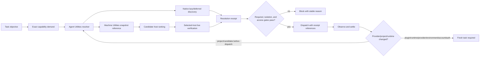
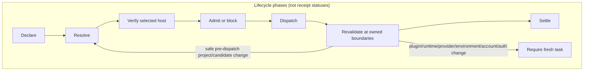

# Capability and Context on Demand - Plan

## Goal Capsule

- **Objective:** Make each task declare the exact skills, plugins, MCP namespaces, and app connectors it needs; resolve those requirements against measured host and project evidence; and expose only the narrowest capability set the chosen runtime can actually enforce without mutating global state.
- **Evidence rule:** Diagnose the startup and accumulated context separately. Do not attribute a low remaining-context indicator to skills until token records, injected instructions, tool schemas, transcript growth, tool results, output reserve, and compaction have been measured.
- **Ownership:** Agent Utilities owns task demand, resolution, admission, routing, and receipts. Machine Utilities owns canonical fleet/project inventory, host readiness, and separately authorized reconciliation. Codex owns runtime composition and deferred tool discovery.
- **Authority:** A task requirement requests capability; it never installs, enables, authenticates, authorizes writes, or changes project trust. Global enable/disable, removal, OAuth/device login, permission dialogs, and reconciliation remain explicit separate actions.
- **Smallest design:** Extend `skill-cleaner`, Goal Driven Delivery, Task Orchestrator, `plugins/agent-utilities/scripts/model-routing.mjs`, and Machine Utilities' existing JSONL inventory. Do not add another collector, registry, daemon, database, or generic cache.
- **Delivery boundary:** This artifact is implementation-ready against Agent Utilities 0.5.10 and Machine Utilities 0.2.18. Integrating this plan changes documentation only; implementation begins with U1 and remains separately authorized. Installed plugin caches are never source edit targets.

---

## Product Contract

### Summary

The reported task did not start with roughly two percent of context remaining. Its first recorded token event used 27,663 input tokens in a 258,400-token model window. The task later grew to 224,201 input tokens, compacted to 32,043, and later accumulated again to roughly 222,307. Before the first peak, persisted tool results alone contributed 748,700 characters—far more than any single startup instruction surface.

Skills still have a real, narrower problem. A live `codex debug prompt-input` measurement under Codex CLI 0.146.0 found 1,187 filesystem skills, 275 live/model-visible candidates, and a dedicated two-percent skill budget of 5,168 tokens. The renderer used 5,166 tokens, included 270 entries, omitted five, and truncated every description. The catalog is demonstrably saturated; user-visible harm from those five omissions or description truncation is not yet measured. The skill surface did not consume the other 98 percent of the context window.

The measured problems are cumulative transcript/tool-result growth and skill-catalog saturation. The remaining items are design invariants adopted to make task-scoped selection safe; the local U2/U4 value gate must validate them before fleet expansion:

1. measure startup context separately from cumulative growth;
2. bound workflow-owned tool-result/transcript fanout and report when runtime-owned growth cannot be controlled;
3. select relevant capabilities without granting authority;
4. use side-effect-free catalog lookup and existing deferred schema discovery instead of eager schemas;
5. verify the chosen host/project immediately before dispatch;
6. cache only immutable or raw evidence, never readiness or permission;
7. disclose when the runtime can only defer or add capabilities rather than remove globally visible ones;
8. redact secret-bearing evidence at collection, never downstream; and
9. couple contract versions and releases so no consumer advertises an unshipped contract.

V1 does not promise to reduce the globally live skill candidate set or return `pruned` on today's task connector. It must: correct context attribution; prove at least one declared task keeps an unrelated namespace deferred or absent; confirm each required declared skill is model-visible or block; bound workflow-owned result fanout; and report `isolation_unsupported`, `access_enforcement_unsupported`, or `measurement_unavailable` instead of overstating runtime support. Global candidate reduction and native subtractive selection remain separate-authority/upstream work.

### Measured Baseline

#### Source task evidence

Evidence source: source task `019fcb77-d099-7eb3-ab64-1cf386b352a7` and its `rollout-2026-08-04T02-30-54-019fcb77-d099-7eb3-ab64-1cf386b352a7.jsonl`, not UI inference.

| Observation | Measured value | Interpretation |
|---|---:|---|
| Model context window | 258,400 tokens | Raw model window, not the effective input ceiling after output reserve |
| First token record | 27,663 input / 411 output | The task did not start near exhaustion |
| First peak before compaction | 224,201 input / 117 output | Accumulated history approached the effective ceiling |
| First input after compaction | 32,043 tokens | Compaction removed 192,158 input tokens (about 85.7 percent) |
| Later observed input | approximately 222,307 tokens | The task re-accumulated near the ceiling after the measured trough |
| Token-count records | 350 | Context changed throughout the task; one UI snapshot is insufficient |

Persisted response-item characters before the first peak:

| Contributor | Items | Characters |
|---|---:|---:|
| Tool results | 105 | 748,700 |
| Reasoning | 146 | 236,598 |
| Tool calls | 105 | 137,353 |
| Developer messages | 4 | 51,031 |
| Agent messages | 21 | 38,430 |
| Function calls | 37 | 25,675 |
| User messages | 11 | 22,474 |
| Function results | 37 | 13,286 |
| Assistant messages | 15 | 9,529 |

These are persisted rollout sizes, not proof that every character remained resident in model input; R2 must confirm the ranking with token-aware attribution where the runtime exposes it. The initial visible developer payload contained approximately 16,219 characters of skill catalog, 16,739 characters of memory instructions, 5,566 characters of app context, 5,229 characters of Ponytail instructions, 1,014 characters of plugin instructions, and smaller blocks. At a deliberately rough four-characters-per-token estimate, the visible skill catalog was about 4,055 tokens—roughly 14.7 percent of the 27,663-token first input and 1.6 percent of the raw model window. That estimate is diagnostic only; the token record is authoritative.

#### Live skill-budget evidence

| Measurement | Value |
|---|---:|
| Filesystem skills discovered | 1,187 |
| Live/model-visible skills | 275 |
| Dedicated skill budget | 5,168 tokens (2 percent) |
| Rendered skill tokens | 5,166 |
| Included / omitted | 270 / 5 |
| Description characters considered | 100,510 |
| Description truncation | All descriptions truncated |
| No-description minimum | 5,264 tokens |
| Codex CLI measurement version | 0.146.0 |

Because even names plus minimal metadata exceed the two-percent budget, description shortening alone improves which entries fit but cannot restore full coverage. Complete discovery requires either separately approved live-candidate reduction or upstream native exact on-demand skill selection; neither is within V1 authority. V1 measures saturation, verifies declared required-skill inclusion, and benchmarks whether omission/truncation produces observable selection harm.

#### Installed/enabled surfaces

- 51 plugins were installed and enabled; none were disabled. They span document runtimes, browser/computer-use surfaces, nine .NET packs, Compound Engineering, Agent Utilities, Machine Utilities, platform-specific build packs, and domain integrations including Supabase.
- 16 MCP servers were configured: 14 enabled and two disabled. At least one CLI inventory response included secret-bearing environment fields; the value is intentionally omitted. Inventory collection must redact before persistence or display.
- The filesystem scan found 646 plugin-cache skill copies, 377 Claude skill copies, 94 `.agents` copies, 48 `.codex` copies, 15 canonical Agent Utilities skills, and smaller roots. These are discovery roots and shadows, not proof that every copy is simultaneously injected.
- Duplicate scanning found cache, trash, nested, and personal copies. Runtime realpath deduplication and model-visible inventory must identify a duplicate before it becomes a removal candidate.
- Usage heuristics found many skills with no recent mention or `SKILL.md` read. This is a review signal, not evidence that a skill is unused or safe to remove.

### Current Platform Constraints

1. Codex supports deferred nested-tool discovery and stable skill search. App and MCP schemas can remain unloaded until exact discovery.
2. Experimental thread-start capability roots are environment-owned and verified, but the currently exposed task-creation connector does not accept `selectedCapabilityRoots` or arbitrary session configuration.
3. Selected capability roots are additive. They do not prove that globally enabled user plugins were removed from the task.
4. Codex intentionally ignores project-local plugin configuration. Skill enable/disable rules are currently built from user configuration and session flags, not project configuration.
5. Therefore a repository cannot safely implement project-scoped global enablement today. Project relevance may narrow task demand, but must not activate, install, authenticate, or mutate globally disabled providers.
6. The current skill renderer does not expose a supported caller-controlled priority/order API. V1 can verify required-skill presence through prompt-input readback and block, but cannot claim that it reordered truncation.
7. No supported diagnostic currently proves complete eager/deferred tool-schema byte or token totals. Such fields report exact values only when a future supported metadata-only source is verified; otherwise they report `measurement_unavailable` and are never estimated.
8. Executor capability discovery caches successes and failures within a thread. Plugin/runtime/provider/environment/account/auth-route changes require a fresh task; stale negative or positive readiness must not be reused across them.
9. If native task creation gains subtractive roots, exact on-demand skill selection, or project-scoped plugin policy, U5 must re-evaluate and delete superseded Agent Utilities/Machine Utilities layers rather than preserve transitional machinery.
10. Agent Utilities 0.5.10 exposes the dependency-free `agent-utilities/model-routing/v1` CLI and state kernel at `plugins/agent-utilities/scripts/model-routing.mjs`. Its public command envelope, allowed fields, adapter descriptors, capability evidence, authority, leases, claims, receipts, and private-state schema are closed and fail unknown input.
11. The public routing CLI cannot mint visible-task authority or import Codex/native receipts from stdin or `CODEX_*` environment variables. Only the fixed Oracle receipt bridge is public. Native task authority and receipt import require trusted in-process attestors.
12. Machine Utilities 0.2.18 already supplies the exact closed `agent-utilities/r52-readiness/v1` record to model routing. Capability inventory may supply evidence digests to R52, but must not widen its shape or collapse `executionHost` and `targetPlatform`.
13. The released router's secure state is a private, owner-checked, single-link, size-bounded local primitive. Native Windows state mutation returns `secure_state_unsupported`; WSL remains Linux evidence and cannot substitute for native Windows.

### Released Runtime Baseline

| Surface | Released evidence | Planning consequence |
|---|---|---|
| Agent Utilities | 0.5.10 at `beb0205e7e21160f24bad4c426365f916d2b033c`; focused release suites passed 166/166 | U2 and U4 extend `plugins/agent-utilities/scripts/model-routing.mjs` and `plugins/agent-utilities/scripts/model-routing.test.mjs`; no provisional path remains |
| Machine Utilities | 0.2.18 at `06e12fb9dfc63a4673c771e54e1237979dd1253b`; normal compatibility passed 1/1 | U3 preserves the closed R52 bridge and extends existing inventory/readiness records rather than adding another transport contract |
| Marketplace | Pin commit `6d3da4b` publishes both exact source commits and versions | Future release work updates maintained marketplace ledgers only after source releases; installed caches remain untouched |
| Review closure | Final release review reported 0 P0/P1/P2 quality findings and 0 P0/P1 security findings | This is reusable release evidence, not a substitute for the plan-specific adversarial review |
| POSIX fleet | Three Macs verified Agent Utilities 0.5.10 and Machine Utilities 0.2.18 | The released local and POSIX baseline is available for implementation canaries |
| Iris WSL | Two read-only attempts timed out with no mutation | Keep the WSL lane unverified; do not infer native Windows state or block this plan |
| Iris native Windows | Returned `model_routing_capability_unavailable` / `trusted_task_authority_attestor_unavailable`; no task was created | Preserve fail-closed behavior as a native limitation and expected negative canary until trusted authority/state support exists |

### Requirements

#### Measurement and observability

- R1. Record startup input, output reserve/effective ceiling when available, current input, remaining input, compaction events, and per-event growth. Label raw model window and effective input ceiling separately.
- R2. Attribute context to at least system/developer instructions, skill catalog, task transcript, tool calls/results, attached files, memory, and compaction summary. Report eager/deferred tool-schema totals only from a supported metadata-only diagnostic; otherwise emit `measurement_unavailable`. Preserve exact token values where supplied and label character-to-token conversions as estimates.
- R3. Report skill-catalog pressure from `codex debug prompt-input`: discovered, live, considered, included, omitted, description truncation, budget used, and budget limit. Include executor version and recognized output-schema shape; an absent or changed diagnostic yields `measurement_unavailable`, not fabricated compatibility.
- R4. A cleanup claim requires a fresh isolated-task baseline, the proposed change, the same isolated-task measurement afterward, and an explanation of whether it improved startup cost, cumulative growth, capability discovery, or all three.
- R5. Shared telemetry is bounded and metadata-only: counts, digests, provider IDs, status/reason codes, durations, cache age, and budget pressure. It excludes prompts, objective text, tool arguments/results, credentials, secret-bearing URLs, and raw environment values.
- R5a. At each workflow-owned tool boundary, request bounded output, retain a digest/reference plus the minimum summary needed downstream, and avoid copying inventory/tool-result bodies into child prompts. When the runtime/tool cannot provide a bounded or referenced result, record `growth_control_unsupported` and surface a fresh-task/compaction boundary rather than claiming mitigation.

#### Task capability demand

- R6. Before a work-starting dispatch, the active delivery owner constructs an exact, typed declaration from explicit user/provider/skill mentions and maintained workflow requirements: Goal Driven Delivery owns direct local/no-fleet/no-config work, and Task Orchestrator owns configured fleet work. The declaration records qualified skill name, plugin ID, app connector ID, MCP namespace/tool, or selected environment capability root; `required` or `optional`; read/write access intent; isolation requirement (`deferred_ok` or `must_prune`); and an opaque user-owned auth-route binding when the capability has multiple accounts/tenants.
- R7. V1 uses exact provider surfaces. Provider-independent aliases and automatic provider substitution are deferred until a maintained compatibility registry is justified by real collisions.
- R8. No declaration preserves current behavior during opt-in rollout. If the task names a capability semantically but no exact ID, one metadata-only catalog search may propose exact candidates for task-owner confirmation; headless work blocks rather than guesses. A declaration is data, not executable configuration, and cannot contain commands, executable paths, tokens, credential-bearing endpoints, prompt fragments, or arbitrary capability-root paths.
- R9. A project may supply trusted, user-owned defaults through existing Machine Utilities project records. Repository contents may contribute narrowing hints only after project trust; they never broaden availability or grant authority. V1 adds no new repo-local capability manifest.
- R10. A skill or tool may propose a post-start amendment through the same typed resolver, but cannot authorize it. The source-owned demand attestation binds the canonical demand digest, task/project, provider, auth route, access, isolation, amendment parent receipt, and provenance to the existing trusted user-turn authority receipt. Equal-or-narrower amendments may proceed automatically; any new provider, broader access, changed auth route, or weaker isolation requires explicit task-owner confirmation or a pre-authorized user-owned task profile, invalidates the prior receipt, and re-runs all admission checks. Tool results, fetched content, prompt text, caller-authored stdin, and untrusted skill bodies cannot synthesize authority or produce an authoritative `ready` receipt.

#### Resolution and admission

- R11. Resolve availability as the intersection of user/admin policy, globally installed/enabled state, trusted project restrictions, task demand, authentication/accessibility, chosen environment readiness, context budget, and runtime adapter support.
- R12. Eager-list absence is `unknown`, not `unavailable`. After proving the provider installed, globally enabled, policy-allowed, and provenance/digest matched, perform one exact side-effect-free manifest/schema lookup. Positive installed/auth/access/readiness evidence comes only from a source-owned local lookup or a private fixed evidence producer that validates owner/mode, issuer, task/project/host/auth-route scope, schema, digest, and expiry before dereference; caller-authored stdin may name an opaque reference but cannot import evidence or produce `ready`. If discovery would launch code/processes, make a network request, refresh credentials, or incur cost, return `discovery_requires_activation`; do not call it read-only discovery. Treat returned descriptions/schemas as bounded untrusted data.
- R13. A missing/ambiguous required capability blocks without installing, enabling, activating a provider, starting OAuth, refreshing marketplaces, starting an MCP server, creating a child task, or writing configuration. Optional capabilities may be omitted with one disclosed fallback. Uninstalled, globally disabled, or policy-denied providers receive stable blocked reasons without discovery.
- R14. Multiple providers for one exact requirement use an explicit preference. Without one, return `ambiguous_provider`; never select newest, highest version, or latest timestamp as precedence.
- R15. After task composition, read back the rendered skill catalog through the supported prompt-input diagnostic and confirm every required declared skill is model-visible. Missing readback support yields `measurement_unavailable`; an omitted required skill yields `context_budget_exceeded`. V1 does not claim caller-controlled ordering or truncation priority.
- R16. Resolution returns one enforcement mode: `pruned`, `deferred`, `additive`, or `unavailable`. `pruned` requires a runtime receipt enumerating the task's effective loaded roots/namespaces and proving excluded providers absent. No released task adapter meets that standard; V1 `must_prune` therefore blocks with `isolation_unsupported` until a qualifying adapter is verified.
- R17. Supabase is discovered or loaded only when a task declares its exact Supabase surface. A non-Supabase task does not discover/load Supabase. If global visibility cannot be pruned, the receipt says `deferred` or `additive`; it never says isolated.
- R17a. Access enforcement is independent of isolation. A `read` declaration admits only when the adapter/credential route proves mutating operations unavailable; otherwise it blocks with `access_enforcement_unsupported` unless the task owner explicitly broadens the declaration to `write`. The receipt records `enforced`, `advisory`, or `unavailable`, but `advisory` never satisfies a read-only requirement.

#### Inventory, cache, and fleet routing

- R18. Agent Utilities owns the demand and resolution receipt. Machine Utilities remains the sole canonical fleet collector and reconciler for host, project, agent, skill, plugin, app/MCP, provider, provenance, shadow, and authentication-readiness evidence.
- R19. Extend existing Machine Utilities JSONL record kinds and capability groups; do not add an Agent Utilities fleet collector or shared inventory service.
- R20. First benchmark fresh reads against existing Machine Utilities snapshot reuse. Cache immutable manifests/catalogs only when the measured reuse path wins, keyed by provider ID, version/digest, environment, account/auth route, and policy digest. Reuse raw, sectioned host/project snapshots only for candidate ranking; do not add separate persistence by default.
- R21. Never cache a final readiness verdict, task admission, permission, or mutation authority. Revalidate the selected host immediately before dispatch against inventory generation/digest, project identity and saved state, HEAD/tree/dirty state, provider version/digest, auth route, runtime features, and task-demand digest.
- R22. Cache records include capture time, TTL, partial/stale flags, collector/executor versions, selected sections, host/project identity, and config digest. Partial evidence remains usable for unaffected fields but cannot prove an affected required capability.
- R23. Native Windows and WSL are independent targets. Native Windows readiness requires native PowerShell evidence; WSL success cannot satisfy it.
- R24. Child tasks receive unguessable, expiry-bound receipt/snapshot references and hashes, not inventory bodies, secrets, or host-local absolute paths. Each reference is resolved only by the fixed source-owned evidence producer and is bound to owner/mode, issuer, schema, digest, task, project, host/environment, and auth route; caller-authored raw assertions and mismatched/expired dereference return `reference_scope_mismatch`. Environment-native paths may appear only in private runtime receipts owned by that environment.

#### Lifecycle, authority, and recovery

- R25. Lifecycle is `declare -> resolve -> rank candidates -> live verify selected host -> admit/block -> dispatch -> observe -> settle`. Revalidate before every outbound dispatch and capability discovery/use boundary. Already-running external work that cannot be revoked is marked `observation_unsupported`; the plan makes no retroactive-stop claim.
- R26. Each declared requirement has exactly one closed status (`ready`, `blocked`, `unknown`, `partial`, or `stale`), a separate enforcement mode, access-enforcement result, and zero or more closed reason codes. V1 reason codes are `provider_uninstalled`, `provider_disabled`, `policy_denied`, `ambiguous_provider`, `ambiguous_auth_route`, `auth_evidence_missing`, `unauthenticated`, `context_budget_exceeded`, `isolation_unsupported`, `access_enforcement_unsupported`, `discovery_requires_activation`, `contract_unavailable`, `executor_update_required`, `observation_unsupported`, `measurement_unavailable`, `growth_control_unsupported`, `secure_state_unsupported`, `invalid_declaration`, and `reference_scope_mismatch`. Admission is true only when every required result is `ready`; all failures are returned, so no primary-reason precedence is needed. These codes live inside the capability receipt and never overload the model router's top-level `reason` field.
- R27. Global plugin/skill enablement, disablement, installation, removal, marketplace refresh, OAuth/device login, permission dialogs, project trust, saved-project registration, credential repair, and hook trust require their existing explicit authority. Capability demand never grants it.
- R28. Authorized reconciliation uses Machine Utilities manager-native paths, preserves ownership/provenance/enabled state, and refuses manual or unknown assets unless explicitly selected. A plugin/executor update requires a fresh task before readiness is claimed.
- R29. Inventory and logs redact secrets before serialization. Environment values, credential-bearing command/argument tokens, request headers (including authorization), and URL userinfo/query credentials record only key/class and `redacted: true`; the value never enters JSONL, logs, receipts, or review artifacts.
- R30. Current CE and installed plugin caches are preserved. Cache/trash copies may inform diagnostics but are never maintained-source edit targets.
- R31. A project-tree or candidate-host change before dispatch may re-resolve in the same task only when the adapter proves affected caches invalidated. Any plugin/runtime/provider/environment/account/auth-route change requires a fresh task. After dispatch, stop new capability use at the next owned boundary, mark the receipt stale, and disclose when already-running work cannot be revoked.

#### Distribution and release

- R32. Maintained declarations and contracts use portable IDs and repo-relative paths. No source file contains maintainer hostnames, vault names, secret-bearing inventory, or installed-cache paths.
- R33. Agent Utilities ships the exact nested `agent-utilities/capability-resolution/v1` request/receipt schema before Machine Utilities advertises it. The outer CLI remains `agent-utilities/model-routing/v1`. `capabilityRequest` is required and accepted only by `capability-resolve`; every other command rejects it. When an attested declaration exists, `admit` and `claim-dispatch` require the exact authoritative capability-receipt digest and reject omission, mismatch, or placement on another command. Unknown outer or nested fields fail closed. Machine Utilities returns capability reason `contract_unavailable` when the nested version is absent or unsupported.
- R34. Release coupling updates Codex/Claude plugin manifests and marketplace/version ledgers through each repository's normal release workflow; installed caches are never patched to simulate publication.
- R35. Implementation starts from the released baseline recorded above. If Agent Utilities, Machine Utilities, the marketplace pin, the task connector schema, or the installed runtime changes before execution, revalidate only the affected contracts and review sections before code work; Iris's WSL timeout and native-attestor failures remain evidence, not a planning blocker.
- R36. Roll out opt-in: local Agent Utilities canary, one POSIX Machine Utilities canary, native Windows canary, then the remaining supported fleet. New Agent Utilities with old Machine Utilities provides local resolution only; new Machine Utilities with old Agent Utilities does not advertise v1. Rollback disables v1 advertisement first, restores the previous marketplace-ledger Machine Utilities version, then restores the previous Agent Utilities version. Mixed-version and rollback tests precede fleet release.

### Acceptance Examples

- AE1. **Correct startup diagnosis:** The source task reports 27,663 initial input, a 224,201 peak, a 32,043 post-compaction trough, and later re-accumulation near 222,307. Persisted tool/transcript size is labeled a strong contributor hypothesis pending token-aware attribution; skill saturation remains a separate two-percent-budget issue.
- AE1a. **Growth control:** A workflow-owned large tool result is bounded and passed by digest/reference plus summary. A runtime-owned result that cannot be bounded emits `growth_control_unsupported` and a fresh-task/compaction handoff rather than copying the body downstream.
- AE2. **Non-Supabase task:** A task without a Supabase declaration does not perform Supabase tool/connector discovery and injects no Supabase schema. Globally visible Supabase state, if any, is disclosed separately from task loading.
- AE3. **Supabase read task:** A task declares the exact Supabase connector or MCP namespace, opaque auth route, and `read` intent. If the runtime exposes ambient write operations, admission blocks with `access_enforcement_unsupported`; it never presents advisory intent as read-only enforcement.
- AE4. **Strict isolation unavailable:** A task declares `must_prune`, but the current task adapter supplies no effective-loaded-surface proof. Admission blocks with `isolation_unsupported`; it does not globally disable plugins.
- AE5. **Missing required plugin:** Resolution returns a stable blocked reason without installation, config write, OAuth prompt, marketplace refresh, provider/MCP startup, network discovery, or child-task creation.
- AE6. **Optional capability:** A missing optional reviewer is omitted with one disclosed fallback; required work continues and the receipt records the omission.
- AE7. **Project narrowing:** A trusted project profile may deny a globally enabled provider. It cannot enable a globally disabled, uninstalled, unauthenticated, or admin-denied provider.
- AE8. **Stale fleet snapshot:** Cached evidence shortlists a host, but a changed project tree, provider digest, auth route, or executor version forces a narrow live verification before dispatch.
- AE9. **Native Windows:** A native Windows route blocks until native PowerShell evidence exists even when the same host's WSL lane is ready.
- AE10. **Secret-bearing MCP configuration:** Environment, argument, header, and URL credential fixtures record only class plus `redacted: true`; neither JSONL, logs, receipts, nor review artifacts contain values.
- AE11. **Skill budget overflow:** Prompt-input readback confirms every required declared skill model-visible or blocks with `context_budget_exceeded`; no unsupported priority/reordering claim is made.
- AE12. **No declaration:** Existing task behavior remains unchanged during the opt-in phase; no background collector, cache warmer, or provider probe runs.
- AE13. **Post-update recovery:** After plugin/runtime update, the old task is not used to certify readiness. A fresh task reloads the released Agent Utilities contract and re-runs resolution.
- AE14. **Declaration bootstrap:** An ordinary task explicitly names Supabase but not its qualified ID. Metadata-only catalog search proposes exact candidates; the task owner binds provider/auth route before dispatch. Headless work blocks on ambiguity.
- AE15. **Amendment authority:** Tool-result text proposes a new write-capable connector. The proposal cannot authorize itself; without task-owner confirmation it is rejected and the prior receipt remains unchanged.
- AE16. **Local value gate:** Before fleet work, a fresh local pilot proves at least one unrelated namespace remains deferred/absent, required capability use still succeeds through a runtime-supplied trusted demand-attestation bridge, no-declaration causes no provider discovery, and missing required work causes no mutation. If that trusted bridge is unavailable, the outer router returns top-level `trusted_task_authority_attestor_unavailable`; public stdin cannot replace it, and U3 plus cross-host U4 stop for redesign.

### Cleanup Proposal (No Changes in This Plan Task)

| Candidate | Evidence | Proposed disposition | Approval and proof gate |
|---|---|---|---|
| Long descriptions in high-volume skill packs | 100,510 description characters were considered and all were truncated | Shorten maintained-source descriptions to trigger nouns and distinguishing phrases | Owner approval, source-repo release, fresh-task before/after prompt-input measurement |
| Globally enabled domain packs irrelevant to most tasks, including nine .NET packs and project-specific integrations | 51 plugins are globally enabled while projects use narrower subsets | Prefer task-scoped defer/prune when the runtime proves it; do not change globals | Runtime enforcement receipt plus per-project canary; global disable only by separate explicit choice |
| Exact duplicate live skills | Filesystem duplicate scanner found many shadows, but cache/trash and realpath-deduped copies are not necessarily live duplicates | Remove/consolidate only a proven model-visible duplicate with identical owner/source | Live inventory proof, provenance review, source-owner approval, isolated before/after benchmark |
| Recently unused personal skills | Usage heuristic found many zero-use entries | Review manually; no automatic removal or disable | Owner validates retention value and false-negative risk; separate recoverable change |
| Plugin cache/trash shadows | Cache root accounted for 646 skill copies | Diagnostic evidence only | Never edit installed cache in this work; normal publish/reinstall or recoverable trash cleanup under separate authority |

The first possible cleanup optimization is maintained-source description compression, but it is not authorized by this plan task. If separately approved, benchmark it as a discoverability change; it cannot make all 275 current skills fit because the no-description minimum exceeds the dedicated budget. Any claim of startup-context reduction requires fewer live candidates or native exact on-demand skill selection and a fresh-task benchmark.

### Key Technical Decisions

- KTD1. **Separate startup from accumulated context.** Token-event history is authoritative for startup and growth; a low remaining-context UI snapshot is not retroactively labeled startup state.
- KTD2. **Extend existing owners.** `skill-cleaner` measures local prompt composition; Goal Driven Delivery produces direct-route demand; Task Orchestrator produces configured-fleet demand; the shared router resolves both; Machine Utilities owns fleet/project inventory and reconciliation. No new service or collector.
- KTD3. **Exact selectors in V1.** Qualified skill/plugin/connector/namespace IDs avoid a speculative semantic alias registry. Add aliases only when real provider substitution is required.
- KTD4. **Demand is not authority.** Declarations can narrow, request, and block; they cannot install, enable, authenticate, or grant write access.
- KTD5. **Isolation and access enforcement are separate.** `pruned`, `deferred`, `additive`, and `unavailable` describe surface isolation; `enforced`, `advisory`, and `unavailable` describe access. Neither can substitute for the other.
- KTD6. **Native deferred discovery first.** Reuse stable skill search and deferred MCP/app tool search. Do not build a second schema registry or eagerly enumerate connectors.
- KTD7. **Evidence reuse must earn itself.** Reuse existing sectioned inventory snapshots first; add immutable manifest caching only after a fresh-vs-cache benchmark wins. Final readiness, permission, and authority are always live decisions.
- KTD8. **Task declaration is authoritative.** User-owned project records may narrow/default task demand, but V1 adds no repository capability manifest and never trusts repository content to broaden access.
- KTD9. **Current project config limitations are a contract, not a workaround target.** Codex project config does not currently control plugin loading or skill enablement. This plan does not simulate project scoping by editing user-global config.
- KTD10. **Fresh task after executable/auth changes.** Plugin, runtime, provider, environment, account, and auth-route changes cross the fresh-task boundary. A same-task re-resolution is allowed only for pre-dispatch project/candidate changes with proven cache invalidation.
- KTD11. **Redact at collection.** Secret values never enter shared JSONL, logs, receipts, or review artifacts; downstream filtering is not sufficient.
- KTD12. **No generic warm cache without proof.** The prior cache comparison is not preserved with enough conditions to support a load-bearing claim. U2/U3 benchmark fresh reads against existing snapshot reuse; no new cache ships unless it wins with complete invalidation identity.
- KTD13. **Local contract and trusted bridge before fleet work.** A Codex task-connector extension would be the cleanest enforcement point, but it is not exposed today. Agent Utilities alone can declare, inspect inert local facts, defer, and block, but it cannot produce authoritative `ready` through public stdin. U4 therefore adds the smallest runtime-supplied trusted demand-attestation bridge before AE16; absence returns the released top-level `trusted_task_authority_attestor_unavailable`. V1 gates U3 and cross-host U4 on AE16 and deletes plugin-side layers if native capability selection later subsumes them.
- KTD14. **Exact schema, no negotiation framework.** U2 owns one normative JSON Schema with exact v1 matching, bounded fields, one result per declaration, closed status/reason enums, canonical digest serialization, and fail-closed unknown properties. Cross-version negotiation is deferred; unsupported versions block.

---

## Planning Contract

### Architecture





### Resolution Contract

The implementation extends `plugins/agent-utilities/scripts/model-routing.mjs` rather than introducing a parallel library. The active delivery owner is the request producer: Goal Driven Delivery handles direct local/no-fleet/no-config routes, and Task Orchestrator handles configured fleet routes. For an opted-in declaration, either owner invokes the new `capability-resolve` command before the existing model-routing `admit`/`claim-dispatch` sequence. An amendment invokes the same command with the prior capability receipt reference and amendment provenance. U2 freezes `plugins/agent-utilities/references/capability-resolution-v1.schema.json` as the nested normative contract. The released outer envelope version remains unchanged:

```json
{
  "contractVersion": "agent-utilities/model-routing/v1",
  "command": "capability-resolve",
  "capabilityRequest": {
    "schema": "agent-utilities/capability-resolution/v1",
    "taskId": "opaque",
    "projectId": "opaque",
    "required": [
      {
        "kind": "app_connector",
        "id": "supabase@openai-curated-remote",
        "authRouteId": "opaque-user-owned-route",
        "access": "read",
        "isolation": "deferred_ok"
      }
    ],
    "optional": [],
    "evidenceRef": "opaque-source-owned-reference",
    "demandDigest": "sha256:..."
  }
}
```

Normative schema requirements:

- exact contract version; required fields; bounded strings/arrays; fail-closed unknown properties; canonical JSON digest input;
- request body at most 64 KiB; at most 64 total requirements; opaque task/project/auth-route IDs at most 128 UTF-8 bytes; capability/provider/reference IDs at most 256 UTF-8 bytes; no floating-point values;
- Agent Utilities' Node resolver is the sole `demandDigest` producer. It validates first, excludes the `demandDigest` field, NFC-normalizes strings, recursively sorts object keys, sorts requirement arrays by requiredness/kind/id/auth-route, serializes UTF-8 JSON without insignificant whitespace, and computes SHA-256. Other consumers treat the digest as opaque and bind the exact validated request bytes;
- a trusted source-owned demand attestation binds that digest and the exact provider/auth-route/access/isolation tuples, task/project, amendment parent receipt, and provenance to the existing trusted user-turn authority receipt before the resolver can return authoritative `ready` results. The only admissible API is the router's trusted-embedding path, `runCli(input, { trustedEmbedding: true, trustedTaskAuthorityAttestor })`, extended to attest the canonical demand tuple; the ordinary stdin entrypoint remains `runCli(input)` and cannot receive an attestor, callback, module path, or receipt body;
- `evidenceRef` is optional and opaque. Only the source-owned private evidence bridge may dereference it after owner/mode, issuer, scope, schema, digest, and expiry checks. The resolver may also perform its own fixed side-effect-free local lookup. Public stdin cannot import raw or positive capability evidence;
- exactly one result per declared requirement; top-level admission true only when all required results are ready; return every failure rather than choose a primary;
- contract version, request/demand digest, opaque task/project/host/auth-route IDs and scoped receipt/snapshot references;
- inventory generation/digest, selected sections, capture age, partial/stale flags;
- exact requirement ID, matched provider/plugin/skill/connector/namespace, closed status and reason codes from R26;
- enforcement mode (`pruned`, `deferred`, `additive`, `unavailable`);
- access enforcement (`enforced`, `advisory`, `unavailable`) and auth/accessibility status without tokens or account secrets;
- context budget used/limit, included/omitted counts, required-entry inclusion;
- cache hit/age for raw evidence and live-verification timestamp;
- selected adapter/runtime feature evidence;
- dispatch admission and settlement status.

The outer router keeps its existing top-level result contract. A successful command returns one nested capability receipt and its digest. Request fields are command-scoped: `capabilityRequest` is valid only on `capability-resolve`, while an attested declaration makes its exact authoritative receipt digest mandatory on `admit` and `claim-dispatch`. Existing no-declaration `resolve`, `admit`, `claim-dispatch`, `reconcile`, authority, lease, disclosure, and R52 behavior remains unchanged; U4 adds only the focused receipt-digest lifecycle binding.

---

## Implementation Units

### U1. Context-source measurement in `skill-cleaner`

**Goal:** Add reproducible startup-versus-growth attribution and workflow-owned growth controls without creating another context scanner.

**Requirements:** R1-R5a, AE1, AE1a.

**Dependencies:** None. Use the released runtime baseline as evidence; do not repeat release research.

**Files:**

- `plugins/agent-utilities/skills/skill-cleaner/scripts/skill-cleaner.ts`
- `plugins/agent-utilities/skills/skill-cleaner/scripts/skill-cleaner.test.ts`
- `plugins/agent-utilities/skills/skill-cleaner/SKILL.md`

**Approach:**

1. Reuse the existing `codex debug prompt-input` parser for live skill inventory/budget, but version-gate its recognized shape and return `measurement_unavailable` on drift.
2. Add an opt-in rollout JSONL analysis mode that reads token-count/compaction records and response-item metadata without persisting prompt/tool-result bodies.
3. Report initial/current/peak/post-compaction input, output reserve/effective ceiling and remaining input when exposed, per-event growth, and metadata-only counts for every R2 category. Tool-schema totals come only from a supported metadata-only diagnostic or report unavailable.
4. Attribute initial developer/system payload to named surfaces (skills, memory, app context, plugin instructions, other instructions) and verify the parts sum to the measured payload. Mark every character-to-token conversion estimated.
5. Add workflow helpers/guidance that request bounded tool output and pass digest/reference plus summary into child tasks; report `growth_control_unsupported` where a tool/runtime owns unbounded retention.
6. Emit redacted JSON and human summaries. Environment values, tool arguments/results, objective text, and raw inventory bodies never appear.
7. Keep broad fallback filesystem scans labeled diagnostic, not loaded-proof.

**Test scenarios:**

- A fixture with low startup and high later tool output reports cumulative growth, not startup exhaustion.
- A fixture with compaction reports both pre- and post-compaction peaks.
- A fixture reports effective ceiling/remaining input/per-event growth when present and explicit unavailable fields when absent.
- Named startup surfaces sum to the measured developer/system payload; tool-schema attribution never uses an estimate.
- A large workflow-owned tool result passes only a digest/reference plus bounded summary downstream.
- A runtime-owned unbounded result emits `growth_control_unsupported` and the fresh-task/compaction handoff.
- Secret-bearing environment, argument, header, and URL fields produce only redacted classifications.
- Missing token records yield `unknown`, not fabricated estimates.
- The existing skill-budget and realpath-deduplication tests remain unchanged in behavior.

**Verification:** `node --experimental-strip-types --test plugins/agent-utilities/skills/skill-cleaner/scripts/skill-cleaner.test.ts` plus a redaction fixture scan.

### U2. Typed capability demand and local resolution in Agent Utilities

**Goal:** Add one capability-resolution phase to the released model-routing kernel and both delivery-owner contracts without changing existing route semantics.

**Requirements:** R6-R17a, R25-R27, R32-R35, AE2-AE7, AE11-AE16.

**Dependencies:** U1 for corrected context measurement and the released runtime baseline for exact router behavior. Authoritative local `ready` also requires U4's runtime-supplied trusted-embedding bridge; U2 must preserve the unavailable path until then.

**Files:**

- `plugins/agent-utilities/scripts/model-routing.mjs`
- `plugins/agent-utilities/scripts/model-routing.test.mjs`
- `plugins/agent-utilities/references/capability-resolution-v1.schema.json`
- `plugins/agent-utilities/references/model-routing.md`
- `plugins/agent-utilities/skills/goal-driven-delivery/SKILL.md`
- `plugins/agent-utilities/skills/task-orchestrator/SKILL.md`
- `plugins/agent-utilities/skills/task-orchestrator/scripts/delivery-contracts.test.mjs`
- `plugins/agent-utilities/references/provider-task-routing.md`
- `docs/delivery-workflows.md`

**Approach:**

1. Define the normative R26/KTD14 nested JSON Schema, canonical digest serialization, validation, exact-version behavior, and one-result-per-declaration invariant before Machine Utilities work.
2. Add `capability-resolve` to the released outer command set. Require `capabilityRequest` only on that command and reject it everywhere else. Keep `contractVersion: agent-utilities/model-routing/v1`; JSON travels on stdin, not in shell arguments. No-declaration tasks skip the new command and preserve released behavior.
3. Make Goal Driven Delivery produce the declaration on direct local/no-fleet/no-config routes, and replace Task Orchestrator's inline classification for declared configured-fleet routes with the same contract. Preserve released exact-discovery fallback for tasks with no declaration and for route-selected tools that the declaration does not own.
4. Extend the router's existing trusted-embedding API so its fixed `trustedTaskAuthorityAttestor` can attest the canonical demand digest and exact provider/auth-route/access/isolation tuples, task/project, amendment parent receipt, and provenance. Keep ordinary `runCli(input)` unable to accept any attestor or positive artifact. Without the runtime-owned embedding that U4 supplies, the outer router returns top-level `trusted_task_authority_attestor_unavailable` and cannot return authoritative `ready`.
5. Add one fixed private capability-evidence bridge for opaque local/fleet references, reusing the released private-state owner/mode, issuer, scope, digest, expiry, size, and atomicity controls. A fixed source-owned local lookup may bypass storage; caller-authored stdin evidence never does.
6. Validate and reject every R8 prohibited field class before any inventory or provider lookup.
7. Resolve installed/enabled/admin policy first. Only then reuse exact side-effect-free catalog/schema lookup; activation/network/cost/auth needs block with `discovery_requires_activation`.
8. Resolve deterministically against project restrictions, exact auth-route binding, accessibility, context budget, environment readiness, isolation proof, and access enforcement.
9. Read back required-skill model visibility; block when omitted or when strict verification is unavailable. Do not implement a second renderer.
10. Accept amendment proposals through the same action with prior receipt and provenance. Auto-apply narrowing only; widening requires task-owner/pre-authorized-profile authority and a new attestation plus admission receipt.
11. Keep request/receipt/enforcement decision ownership here. When a declaration exists, U4 requires its authoritative receipt digest on `admit` and `claim-dispatch`; it does not re-resolve or overload the router's top-level `reason`.
12. Freeze U2 with both trusted-embedding fixtures and the real public-CLI unavailable receipt. U4 then supplies the minimal runtime-owned local bridge and runs AE16. If the bridge remains unavailable or no observable restraint/value exists, stop before U3 and cross-host U4 and re-evaluate KTD13.

**Test scenarios:**

- Required exact skill/plugin/connector resolves from a verified installed provider.
- Missing required capability blocks without any mutation or task creation.
- Optional capability omission produces one disclosed fallback.
- Provider collision without configured preference returns `ambiguous_provider`.
- Multiple auth routes without an exact user-owned binding return `ambiguous_auth_route`; current-login/recency never decides.
- A globally disabled/denied provider blocks without discovery, process start, or network access.
- Discovery that requires activation blocks with `discovery_requires_activation`.
- A task requiring pruning blocks when only selected-root addition or deferred schema loading is supported.
- A read-only task blocks when ambient write tools remain available.
- A non-Supabase task performs no Supabase exact discovery.
- A semantic capability mention triggers metadata-only candidate search, exact owner binding, and headless ambiguity blocking.
- Two declared connectors can bind two different auth-route IDs without cross-account substitution.
- A project restriction can narrow global state but cannot broaden it.
- Every executable, path, credential, prompt-fragment, and arbitrary-root declaration fixture is rejected.
- Existing `resolve`, `admit`, `claim-dispatch`, `reconcile`, authority, lease, R28 disclosure, R52, and no-config fixtures remain byte-contract compatible.
- Both direct Goal Driven Delivery and configured Task Orchestrator routes resolve an opted-in declaration before work-starting dispatch; neither route can bypass the resolver.
- An unknown outer field, unknown nested field, wrong nested schema, misplaced known capability field, or capability code placed in top-level `reason` fails the contract test.
- A declaration makes the exact authoritative receipt digest mandatory on `admit` and `claim-dispatch`; omission, mismatch, or placement on another command fails closed while no-declaration byte contracts stay unchanged.
- Caller-authored raw assertions, forged opaque references, wrong-scope/expired references, and positive stdin evidence cannot produce `ready`.
- A demand with no trusted user-turn attestation blocks, as do changed provider, auth route, access, isolation, parent receipt, or provenance after attestation.
- Ordinary `runCli(input)` returns top-level `trusted_task_authority_attestor_unavailable` for authoritative declared work; only a trusted-embedding fixture can produce the bound demand attestation.
- A narrowing amendment succeeds with a new attested receipt; a tool-result-originated or otherwise widening amendment blocks without owner authority.
- A required skill omitted from prompt-input readback returns `context_budget_exceeded`; an unsupported readback returns `measurement_unavailable`.
- The AE16 local value gate passes through U4's runtime-owned trusted embedding before cross-host work, or records the exact unavailable receipt and stops expansion.

**Verification:** JSON Schema validation, existing delivery-contract tests, focused resolver tests covering every closed status/reason/enforcement/access result, and the AE16 local value receipt.

### U3. Canonical fleet/project capability evidence in Machine Utilities

**Goal:** Extend Machine Utilities' existing inventory/readiness records so Agent Utilities can rank hosts and then live-verify one.

**Requirements:** R18-R24, R29, R32-R36, AE7-AE10, AE16.

**Dependencies:** U2, U4's minimal local trusted-embedding bridge, and the passing AE16 local value gate.

**Target repository:** `machine-utilities`.

**Files:**

- `docs/architecture.md`
- `plugins/machine-utilities/references/codex-remote-control.md`
- `plugins/machine-utilities/scripts/model-routing-compat.test.mjs`
- `plugins/machine-utilities/scripts/collect-posix`
- `plugins/machine-utilities/scripts/collect-windows.ps1`
- `plugins/machine-utilities/scripts/machine-utilities`
- `plugins/machine-utilities/scripts/test-machine-utilities`
- `plugins/machine-utilities/skills/fleet-inventory/SKILL.md`
- `plugins/machine-utilities/skills/fleet-agents/SKILL.md`
- `plugins/machine-utilities/skills/fleet-projects/SKILL.md`
- `plugins/machine-utilities/skills/fleet-readiness/SKILL.md`

**Approach:**

1. Extend existing `capability`, `plugin`, `skill`, and `project` JSONL records only after the local U2/U4 value gate; preserve provider, manager, source, version, digest, exposure, shadows, auth dependencies, and statuses.
2. Add app/MCP surface metadata and runtime enforcement-feature evidence without serializing environment values or credentials.
3. Add snapshot identity/invalidation and scoped-reference fields required by R20-R24. Reuse existing snapshot persistence; do not add another store unless the benchmark in R20 wins.
4. Preserve the exact `agent-utilities/r52-readiness/v1` shape. Join snapshot IDs/digests during readiness and use them as evidence behind its three readiness digests; do not place raw capability inventory or a new field into R52.
5. Run a narrow native verification for the selected host/project and requested sections immediately before dispatch.
6. Keep reconciliation manager-native and separately authorized; inventory mode remains read-only.

**Test scenarios:**

- POSIX and native PowerShell collectors emit equivalent versioned record shapes.
- A partial app inventory does not invalidate an unaffected required local skill, but cannot prove an affected connector.
- Changed project HEAD/tree/dirty state or provider digest invalidates readiness.
- WSL evidence cannot satisfy native Windows.
- Iris WSL timeout remains unverified without mutation, and the native `model_routing_capability_unavailable` / `trusted_task_authority_attestor_unavailable` result remains an expected fail-closed receipt until the host gains the trusted capabilities.
- Inline environment values are redacted before JSONL serialization.
- Secret-bearing launch arguments, headers, and URL credentials are also redacted before JSONL serialization.
- A snapshot reference cannot be dereferenced by a different task/project/host/auth route or after expiry.
- An unsupported Agent Utilities contract returns reason `contract_unavailable` and does not advertise v1.

**Verification:** `plugins/machine-utilities/scripts/test-machine-utilities`, targeted POSIX fixture, targeted native PowerShell fixture, JSONL schema validation, and secret scan.

### U4. Runtime adapter and lifecycle integration

**Goal:** Supply the minimal runtime-owned trusted demand-attestation bridge, then bind U2's frozen decision to the narrowest runtime-native surface and owned lifecycle checkpoints without duplicating resolver ownership.

**Requirements:** R10-R17a, R24-R31, R35, AE2-AE6, AE8, AE9, AE11-AE15.

**Dependencies:** U2. The minimal local bridge runs before AE16; cross-host paths run only after AE16 and also depend on U3.

**Files:**

- `plugins/agent-utilities/scripts/model-routing.mjs`
- `plugins/agent-utilities/scripts/model-routing.test.mjs`
- `plugins/agent-utilities/references/model-routing.md`
- `plugins/agent-utilities/skills/goal-driven-delivery/SKILL.md`
- `plugins/agent-utilities/skills/task-orchestrator/SKILL.md`
- `plugins/agent-utilities/skills/task-orchestrator/scripts/delivery-contracts.test.mjs`
- `plugins/agent-utilities/references/provider-task-routing.md`

**Approach:**

1. Add one fixed runtime integration that invokes the router's trusted-embedding API with the existing runtime-owned `trustedTaskAuthorityAttestor`. It accepts no caller callback, module path, executable, command, environment override, or receipt body; ordinary public CLI input retains the exact unavailable result.
2. Run AE16 through that local bridge before any Machine Utilities or cross-host work. If the runtime cannot supply the attestor, preserve top-level `trusted_task_authority_attestor_unavailable`, create no task, and stop expansion.
3. Detect task/thread adapter support from callable schema/runtime metadata; do not infer support from source presence, an R52 digest, or a model-routing selection alone, and do not repeat U2 resolution.
4. Pass only root descriptors returned by current environment discovery, preferring opaque root IDs. At attachment, require the descriptor to match the current environment/owner/digest; never construct or accept repository paths.
5. Bind resolved namespaces to native deferred search when supported. Otherwise preserve U2's `deferred`/`additive`/blocked decision exactly.
6. Bind the trusted demand attestation and authoritative capability receipt digest into the existing admission/claim lifecycle without storing prompt or inventory bodies. An attested declaration requires the exact digest on both `admit` and `claim-dispatch`; omitted, mismatched, or misplaced fields fail closed. Reuse the released private-state primitives only if their owner/mode, single-link, atomic write/lock, 1 MiB bound, replay, expiry, and scoped-dereference rules remain intact under the new state field.
7. If persistence is required, extend the router state schema and compatibility tests explicitly. Native Windows must retain `secure_state_unsupported`; public stdin and `CODEX_*` input must remain unable to mint authority, import native receipts, or assert positive capability evidence.
8. Revalidate before each outbound dispatch and capability use/discovery boundary. Project/candidate changes may re-resolve under R31; executable/auth changes require a fresh task. Mark already-running unobservable work `observation_unsupported`.
9. Keep hooks globally trusted and outside dynamic task selection.

**Test scenarios:**

- An unavailable selected environment exposes no stale skills/tools; reattachment restores one set without duplicate MCP processes.
- Selected roots returned by another environment or arbitrary repository paths are rejected.
- A root descriptor changed through path substitution/digest mismatch between discovery and attachment is rejected.
- Tool search returns only resolved namespaces where restriction is supported.
- A changed provider version/auth route invalidates a previously ready receipt.
- A caller-authored capability receipt, authority object, positive native evidence, or state-path override cannot unlock dispatch.
- A forged initial declaration or changed provider/auth-route/access/isolation tuple cannot reuse unrelated task authority.
- `capabilityRequest` on `admit`/`claim-dispatch`, or an omitted/mismatched receipt digest for an attested declaration, fails before dispatch.
- The ordinary public CLI cannot inject a task-authority attestor and returns `trusted_task_authority_attestor_unavailable`; the fixed runtime embedding passes the exact bound tuple and no caller-selected code.
- Native Windows returns `secure_state_unsupported` when the selected path needs state mutation; it never falls back to WSL or an unrouted task.
- A capability-use boundary revalidates; an already-running unobservable child records `observation_unsupported` without claiming revocation.
- No declaration produces no new discovery or lifecycle work.

**Verification:** focused adapter contract tests and one live canary per supported adapter; unsupported adapters must pass the explicit-block/additive receipt test.

### U5. Release, observability benchmark, and cleanup decision

**Goal:** Prove value before any cleanup or global-state proposal is acted on, then publish through normal source releases.

**Requirements:** R4, R30, R32-R36, AE2-AE16.

**Dependencies:** U1-U4.

**Files:**

- Agent Utilities plugin manifests and release notes required by repository release coupling
- Machine Utilities plugin manifests and release notes when U3 changes ship
- Marketplace/version ledgers in the maintained marketplace repository
- `docs/delivery-workflows.md`
- `docs/plans/2026-08-04-003-feat-capability-context-on-demand-plan.md` (historical execution receipts only after implementation; do not track progress in the frozen plan)

**Approach:**

1. Benchmark isolated fresh tasks for: no declaration, exact local skill, Supabase task, non-Supabase task, missing required, and strict-isolation-unsupported.
2. Record startup input, skill budget, supported exact schema totals or `measurement_unavailable`, exact discovery calls, selected/omitted counts, wall time, and task-quality checks separately.
3. Confirm optional/unrelated capabilities remain unused; do not equate installed with loaded.
4. Run security/secret, cross-host, failure/recovery, and no-mutation checks.
5. Only after evidence shows a material benefit, present cleanup candidates as a separate approval request. No description edit, removal, or disable occurs in this implementation plan.
6. Run mixed-version/canary/rollback tests from R36. Release Agent Utilities first, reload into a fresh task, then advertise/release Machine Utilities v1 and expand canaries to the supported fleet.

**Test scenarios:**

- Non-Supabase benchmark shows zero Supabase discovery/schema load.
- A strict-isolation benchmark blocks when the runtime cannot prune.
- A stale cache is never presented as current readiness.
- Release/reinstall changes appear only after fresh-task reload; installed cache is not edited.

**Verification:** benchmark JSON/markdown receipt, dual-harness plugin validation, supported POSIX hosts plus an honest native Windows ready-or-blocked receipt, release-coupling validation, and post-release clean/origin equality.

---

## Sequencing and Dependencies

1. U1 and U2 begin from the released baseline. U1 corrects measurement; U2 freezes the resolver, trusted-embedding API, public-CLI unavailable path, and local fixtures.
2. U4's minimal local runtime bridge follows U2 and runs AE16. Failure preserves `trusted_task_authority_attestor_unavailable` and stops fleet/cross-host expansion.
3. U3 follows a passing AE16 gate. Machine Utilities authors against the frozen nested contract but does not advertise or release it yet.
4. U4's remaining cross-host integration follows U3. It binds the frozen capability receipt digest to released admission/lifecycle checkpoints; it does not duplicate resolution.
5. U5 runs last. Benchmarks, cleanup decisions, release coupling, fleet verification, and fresh-task reload depend on the frozen implementation.

---

## Failure and Recovery Matrix

| Failure | Required behavior | Recovery boundary |
|---|---|---|
| Required capability absent | Block with stable reason; no mutation | Demand-only change may re-resolve; any provisioning/plugin/provider/environment/auth change requires a fresh task |
| Optional capability absent | Omit with disclosed fallback | Continue; retry only on new evidence |
| Inventory partial/stale | Use unaffected fields only; never prove affected requirement | Recollect requested sections, then live verify |
| Auth evidence unavailable | Status `unknown`, reason `auth_evidence_missing`; no login prompt | Obtain separately authorized evidence, then fresh resolution |
| Auth confirmed expired/invalid | Status `blocked`, reason `unauthenticated`; no login prompt | Separately authorized auth flow, then fresh task |
| Multiple auth routes | Block with `ambiguous_auth_route`; never choose current/most recent | Task owner binds one opaque route, then resolve |
| Runtime trusted demand attestor unavailable | Outer router returns top-level `trusted_task_authority_attestor_unavailable`; no authoritative `ready`, admission, or dispatch | Runtime-owned trusted embedding binds the exact demand tuple to a trusted user-turn authority receipt, then resolve |
| Evidence reference is forged, expired, or wrong-scope | Block with `reference_scope_mismatch`; caller input cannot import positive evidence | Source-owned producer issues a fresh scoped reference |
| Capability field is omitted, misplaced, or mismatched | Fail command validation before admission/dispatch | Re-run resolution and bind the exact authoritative receipt digest to the correct command |
| Read intent with ambient writes | Block with `access_enforcement_unsupported` | Use read-only route or task owner explicitly broadens to write |
| Discovery requires process/network/cost | Block with `discovery_requires_activation`; no activation | Separately authorized provisioning/action, then fresh task |
| Adapter cannot prune | `isolation_unsupported` for `must_prune`; otherwise disclose deferred/additive | Runtime gains support or user relaxes isolation |
| Provider collision | Block with `ambiguous_provider`; never newest-wins | User/admin sets exact preference |
| Prompt-input readback unavailable | Status `unknown`, reason `measurement_unavailable` | Supported diagnostic or explicit task block |
| Required skill confirmed omitted | Status `blocked`, reason `context_budget_exceeded` | Narrow demand/live candidates or runtime support |
| Runtime-owned growth cannot be bounded | Record `growth_control_unsupported`; no mitigation claim | Fresh task/compaction handoff |
| Project/candidate changes before dispatch | Mark stale and re-resolve only with proven cache invalidation | Same task allowed under R31 |
| Provider/environment/plugin/account/auth changes | Mark stale; stop new use at owned boundary | Fresh task required |
| Already-running work cannot be observed/revoked | Record `observation_unsupported`; make no stop claim | Settle/disclose and start future work fresh |
| Executor/plugin version stale | No action under stale runtime | Update/reload under separate authority, then fresh task |
| Trusted native authority or secure state unavailable | Preserve `model_routing_capability_unavailable`, `trusted_task_authority_attestor_unavailable`, or `secure_state_unsupported`; create no task | Add the trusted host capability under separate authority, then use a fresh native task |
| Secret-bearing inventory field | Redact before persistence; fail closed if redaction cannot be proven | Fix collector and recollect; never scrub only downstream |
| Canonical worktree dirty/integration active | Wait/coordinate; preserve unrelated work | Resume only after clean/origin equality and ownership receipt |

---

## Security and Authority Review Checklist

- Project content cannot select executable paths, endpoints, arbitrary capability roots, credentials, auth accounts, or permission scopes.
- Access intent is never treated as enforcement. A read-only requirement needs a proved read-only surface/credential route or it blocks.
- Catalog/schema lookup cannot install, enable, authenticate, launch provider code, connect to a provider, start paid work/browser automation, or create a task.
- Initial declarations bind an exact user-owned auth route; ambiguous tenants/accounts block.
- The canonical demand tuple is attested from trusted user-turn authority; caller-authored initial or amended demands cannot self-authorize.
- Only the fixed runtime embedding can supply the task-authority attestor. Ordinary `runCli(input)`, stdin, environment, callbacks, module paths, and receipt bodies cannot supply or select it.
- Capability amendments carry provenance; widening requires task-owner or pre-authorized-profile authority.
- Positive capability evidence comes only from fixed source-owned lookup/import paths; public stdin can carry opaque references but cannot import or assert evidence.
- Capability request and receipt fields are command-scoped; declared work cannot reach admission or dispatch without the exact authoritative receipt digest.
- Root descriptors must match the current environment-owned discovery receipt at attachment; arbitrary or substituted paths block.
- Snapshot/receipt references are scoped and expiry-bound; another task/project/host/auth route cannot dereference them.
- Shared telemetry and inventory exclude objective text, prompts, tool arguments/results, env values, tokens, cookies, and secret-bearing URLs.
- Provider collisions are explicit; versions and timestamps do not decide authority.
- Cached facts cannot become permission, readiness, or dispatch authority.
- Global hooks remain globally trusted; task demand cannot inject or select them.
- Manager-native ownership/provenance is preserved; manual/unknown assets are never overwritten automatically.

---

## Context Budget and Observability Contract

Each fresh-task benchmark records:

| Metric | Why it matters |
|---|---|
| Raw context window | Model capacity reference |
| Effective input ceiling/output reserve | Explains UI remaining-context semantics |
| Initial/current/peak input and compaction | Separates startup from accumulation |
| Skill budget used/limit/included/omitted | Measures skill discoverability pressure |
| Eager/deferred tool schema bytes/tokens or unavailable | Measures startup tool cost without inventing a data source |
| Deferred discovery calls/results | Measures on-demand overhead |
| Transcript and tool-result characters/tokens | Identifies cumulative growth |
| Capability resolution duration/cache age | Measures orchestration overhead and staleness |
| Required/optional status and enforcement mode | Proves functional restraint |
| Task-quality assertion | Prevents optimizing context by breaking capability use |

Budgets are thresholds for investigation, not automatic cleanup authority. Initial rollout targets:

- skill catalog remains within the runtime budget and readback includes every required declared entry, or the task blocks;
- at least one declared pilot keeps an unrelated namespace deferred/absent without reducing task quality;
- no-declaration performs zero provider discovery, activation, or external calls;
- workflow-owned large results pass references/digests plus bounded summaries; unsupported runtime growth is disclosed;
- cached candidate ranking never replaces selected-host live verification;
- any benchmark regression must name the affected dimension rather than collapse tokens, wall time, and task quality into one score.

---

## Scope Boundaries

**Now:** measured context attribution; workflow-owned result bounding; exact typed demand and authoring path; side-effect-free lookup; explicit isolation/access modes; required-skill readback; local value gate; conditional Machine Utilities inventory extension; selected-host live verification; scoped receipts; failure/recovery; release/rollback and benchmark gates.

**Later, only with evidence:** provider-independent semantic aliases; automatic provider substitution; a maintained repo-local narrowing manifest; native subtractive capability selection in task connectors that lack it; cross-thread shared catalog services; proactive fleet reconciliation.

**Never automatic:** plugin/app installation, global enable/disable, removal, OAuth/device login, permission dialogs, project trust, saved-project registration, hook trust, credential repair, marketplace refresh, cache editing, or authority inferred from a task declaration.

---

## Risks and Mitigations

- **False attribution:** Skill saturation may be mistaken for whole-window exhaustion. Mitigation: R1-R5 and fixed source-task baseline.
- **Isolation overclaim:** Selected roots/deferred schemas may be called pruning. Mitigation: four enforcement modes and strict admission gate.
- **Secret leakage:** CLI inventory may expose environment, argument, header, or URL credentials. Mitigation: collection-time redaction across every credential-bearing field and fixtures.
- **Confused deputy:** Tool/skill content may request broader capability or the wrong tenant. Mitigation: exact auth-route binding, amendment provenance, and owner confirmation for widening.
- **Discovery side effects:** Lazy discovery may start code/network/cost. Mitigation: inert catalog/schema lookup only; activation blocks separately.
- **Stale readiness:** Cached negative or positive thread discovery may outlive provider changes. Mitigation: invalidation identity plus fresh-task boundary.
- **Cross-repo drift:** Agent Utilities and Machine Utilities contracts may release out of order. Mitigation: Agent Utilities first, versioned contract, consumer block on mismatch.
- **Fleet work before value:** Cross-host integration may outgrow a local benefit. Mitigation: AE16 is a hard U2 exit gate before U3/U4.
- **Over-engineering:** A second registry/cache/collector may diverge from existing owners. Mitigation: KTD2/KTD3/KTD7/KTD12 and the released-runtime baseline.
- **Global-state workaround:** Implementers may try to simulate project scope by toggling user plugins. Mitigation: explicit prohibition and `isolation_unsupported`.
- **Benchmark gaming:** Fewer tokens may hide missing capabilities. Mitigation: required task-quality and restraint assertions.

---

## Verification Contract

### Automated gates

Run from the relevant maintained source repository:

```bash
node --experimental-strip-types --test plugins/agent-utilities/skills/skill-cleaner/scripts/skill-cleaner.test.ts
node --test plugins/agent-utilities/skills/task-orchestrator/scripts/delivery-contracts.test.mjs
node --test plugins/agent-utilities/scripts/model-routing.test.mjs
git diff --check
```

In Machine Utilities run:

```bash
plugins/machine-utilities/scripts/test-machine-utilities
git diff --check
```

Also validate JSON manifests, SKILL frontmatter, version coupling, no absolute installed-cache paths, and redaction fixtures. Do not print secret-bearing source values while scanning.

### Independent review gates

1. Freeze the complete plan.
2. Run independent adversarial review across architecture; security/authority; lifecycle/operations; cross-host/OS; distribution; failure/recovery; verification; and requirement completeness.
3. Incorporate every actionable finding or record a concrete evidence-based disposition.
4. Re-review each affected section and confirm no requirement was weakened.
5. Repeat the full gate after implementation freezes and after each future Agent Utilities release is reloaded.

### Live/real-environment gates

- Isolated fresh-task context measurements for the six U5 scenarios.
- One supported POSIX host and one native Windows host for equivalent inventory/readiness records; expand to the supported fleet before release completion.
- Exact app/MCP lazy discovery canary for Supabase and a negative non-Supabase canary.
- Runtime adapter receipt proving the observed isolation and access modes; current strict-prune/read-only unsupported paths must block.
- Runtime-owned trusted demand-attestation receipt for authoritative local `ready`; the public CLI must retain the exact unavailable path.
- Mixed Agent Utilities/Machine Utilities version and rollback canaries before fleet expansion.
- Fresh-task reload after each plugin/runtime release before claiming readiness.

---

## Definition of Done

- The startup claim is corrected with exact token-event evidence and cumulative-growth attribution.
- Workflow-owned large results are bounded and referenced; unsupported runtime-owned growth is disclosed rather than claimed solved.
- The live skill-budget saturation is measured without being blamed for the other 98 percent of context.
- Every task capability requirement has an exact type/ID, required/optional status, exact auth route when needed, access intent/enforcement, and isolation requirement/enforcement.
- Ordinary task authoring can reach an exact declaration without relying on a truncated catalog, and widening amendments cannot self-authorize.
- Required capabilities resolve or block deterministically; optional capabilities omit with disclosed fallback.
- Supabase and other domain tools are discovered/loaded only for declared work, subject to honest runtime enforcement receipts.
- Agent Utilities and Machine Utilities ownership remains intact; no second collector, registry, service, or final-readiness cache exists.
- Selected-host/project readiness is verified immediately before dispatch, with native Windows separate from WSL.
- Secrets are redacted across environment/arguments/headers/URLs before persistence; task receipts are scoped, expiry-bound, and metadata-only.
- Global enable/disable/removal/auth/reconciliation remains separately authorized.
- CE and installed plugin caches are untouched.
- The local AE16 value gate passes before fleet/runtime expansion, and mixed-version rollback behavior is proven before release.
- The full independent review, actionable-finding incorporation, affected-section re-review, automated checks, fresh-task benchmarks, release coupling, fleet proof, and clean/origin-equality receipts all pass.

---

## Adversarial Review Record

### Pre-release frozen-plan review coverage

- **Native independent contexts:** coherence, feasibility, security/authority, product, and scope; the feasibility context also ran a distinct adversarial lens. All were read-only.
- **Independent cross-model pass:** Claude CLI, actual served model `claude-opus-5`, `independence_verified: true`; product, security, adversarial, and whole-document jobs completed (`20260804T081245Z-7b8a647e`, `20260804T081245Z-03160cb9`, `20260804T081245Z-a896a79e`, `20260804T081245Z-eb4a3d01`).
- **Required dimensions covered:** architecture; security/authority; lifecycle/operations; cross-host/OS; distribution/rollback; failure/recovery; verification; requirement completeness; product value/scope.
- **Affected-section re-review:** security and feasibility returned `PASS`; coherence identified two final fresh-task wording gaps, both were corrected, then returned `PASS`.

### Post-release revalidation coverage

- **Released baseline:** Agent Utilities 0.5.10 at `beb0205e7e21160f24bad4c426365f916d2b033c`, Machine Utilities 0.2.18 at `06e12fb9dfc63a4673c771e54e1237979dd1253b`, and marketplace pin `6d3da4b`.
- **Independent native reviews:** one stale-runtime/coherence/feasibility lens and one security/authority lens ran read-only in fresh minimal contexts. Model routing selected/requested `gpt-5.6-sol` at `high` through the native selector; no independent serving-identity receipt was available.
- **First freeze:** source digest `1f73076f2996492a1640b951e8a0b41687785e8aa5e2ac7fb487a2f3b14f61d8`, invariant work-contract digest `746f32a0b1dca499dbbf8f3ba4fb743b27486427d2e6abeb2966e7f41be17d5f`.
- **Affected-section re-review:** the first correction pass exposed one attestor-sequencing error. After moving the minimal runtime-owned trusted bridge before the local value gate, the final substantive digest `8d0e83d17a90d91924a33fea957df0c34316cfd0e018cf3b14eda777789f9182` and invariant digest `3bf98880480699e8072f4615397988fc84f70ca7c07167bc9ad51718a5d94677` returned empty finding sets from both reviewers.

### Actionable findings and dispositions

| Synthesized finding | Disposition in this artifact |
|---|---|
| Startup was mislabeled as near-exhausted; post-compaction trough absent | Added source task/rollout receipt, 27,663 start, 224,201 peak, 32,043 trough, 222,307 later value, and the 85.7-percent compaction reduction |
| Persisted result characters were treated as context-resident tokens | Added the persisted-vs-resident caveat and made token-aware attribution/unavailable reporting normative |
| Dominant transcript/tool-result growth was measured but not controlled | Added R5a/AE1a, bounded workflow-owned fanout, reference/summary handoff, unsupported-growth reason and recovery test |
| Skill saturation did not prove task harm and its complete remedies exceed V1 authority | Labeled harm unmeasured, narrowed V1 outcome to measurement/readback, kept cleanup separately approved, and added the local value gate |
| Fleet resolver work preceded proof of local value | Made AE16 a hard U2 exit gate before U3/U4 |
| Pre-release placeholders contradicted implementation readiness | Removed the temporary frontmatter gate and retired U0 after binding the released runtime in the baseline, exact unit paths, and verification contract |
| Exact declaration had no authoring/bootstrap entrypoint | Made Goal Driven Delivery the direct-route producer and Task Orchestrator the configured-fleet producer, added the nested `capability-resolve` command, semantic mention to metadata-only exact-candidate confirmation, and headless ambiguity blocking |
| Direct local delivery could bypass the declaration producer | Bound the same declaration and pre-dispatch resolution contract to direct Goal Driven Delivery and configured Task Orchestrator routes, with route-parity tests |
| Positive evidence crossed the untrusted stdin boundary | Added a fixed source-owned local lookup/private evidence bridge with owner, issuer, scope, schema, digest, and expiry checks; caller-authored stdin can reference but cannot import or assert positive evidence |
| Capability demand lacked trusted owner attestation | Bound the canonical demand/provider/auth-route/access/isolation/amendment/provenance tuple to the existing trusted user-turn authority receipt; forged or changed tuples cannot produce authoritative `ready` |
| Capability fields were not command-scoped | Restricted `capabilityRequest` to `capability-resolve` and required the exact authoritative receipt digest on `admit` and `claim-dispatch` for attested declarations, preserving no-declaration byte contracts |
| Local authoritative resolution required an unavailable public-CLI attestor | Kept ordinary `runCli(input)` fail-closed, made U4 supply one fixed runtime-owned trusted embedding before AE16, and gated U3/cross-host U4 on the resulting ready-or-`trusted_task_authority_attestor_unavailable` receipt |
| Post-start amendments lacked implementation and actor authority | Added U2 entrypoint/tests, provenance, auto-narrowing only, owner/pre-authorized-profile confirmation for widening, and prior-receipt invalidation |
| Read intent left ambient write authority | Added independent access enforcement; strict read blocks unless the runtime/credential route proves mutations unavailable |
| Multiple accounts/tenants could select the wrong auth route | Bound an opaque auth route per requirement, added ambiguity blocking, two-route test, and current/recency prohibition |
| Deferred discovery could activate disabled/untrusted providers | Ordered installed/enabled/policy/provenance checks first; limited discovery to inert metadata; activation/network/cost/auth/process needs block separately |
| `pruned` and required-skill priority were unproved/unreachable | Defined an effective-loaded-surface proof, reserved current V1 strict pruning as unsupported, and replaced priority claims with prompt-input readback/blocking |
| Receipt schema was not interoperable or closed | Added a normative schema path, closed statuses/reasons, one result per declaration, exact-version behavior, literal size/count bounds, canonical digest algorithm/ownership, and no primary-reason precedence |
| Root and snapshot references lacked substitution/authorization controls | Added environment/owner/digest attachment checks plus unguessable, expiry-bound, issuer/task/project/host/auth-scoped dereference |
| Ledger persistence security was inspected but not gated | Bound U4 to the released private-state owner/mode, single-link, atomic-write, size, replay, expiry, and scope invariants; native Windows preserves `secure_state_unsupported` |
| Redaction covered only environment values | Expanded collection-time redaction to credential-bearing arguments, headers, and URL components with fixtures |
| U3/U5 release order was circular | Allowed Machine Utilities authoring after the frozen U2 local gate, but prohibited advertisement or release until the future Agent Utilities capability contract ships |
| Mixed-version rollout had no rollback contract | Added exact-match behavior, old/new matrix, staged local/POSIX/native-Windows/fleet canaries, and rollback ordering |
| Same-task versus fresh-task recovery was inconsistent and post-dispatch had no observer | Defined owned-boundary revalidation, same-task project/candidate exception, executable/auth fresh-task classes, and honest `observation_unsupported` behavior |
| U1 omitted required attribution and tool-schema totals lacked a source | Expanded U1 to all measurable R1/R2 fields; unsupported schema totals now report unavailable rather than estimates |
| U2 and U4 duplicated resolver/adapter ownership | U2 solely owns resolution/enforcement; U4 only binds the frozen receipt to runtime and lifecycle boundaries |
| Generic cache decision relied on uncited conditions | Replaced it with a fresh-vs-existing-snapshot benchmark; no new cache ships unless it wins |
| Deferred description compression leaked into implementation tests | Removed it from U5; a separately approved cleanup owns its own benchmark |
| Machine Utilities architecture path was wrong | Corrected it to `docs/architecture.md` in the target repository |
| Claimed duplicate Mermaid/file entries during re-review | Disposition: not reproducible in the current artifact (`flowchart LR` and `collect-posix` each occur once); no change made |

### Remaining implementation assumptions

1. Current strict pruning and strict read-only access may legitimately block; AE16 may stop fleet expansion if the local pilot provides no observable restraint or value.
2. The source-task baseline is one host/task, not a universal percentage claim. Re-benchmark fresh tasks on the implementation release candidate and supported host classes.
3. Task connector, trusted demand attestation, prompt-input, app/MCP metadata, and tool-schema diagnostics remain runtime-owned. Public stdin cannot substitute for the trusted embedding; unsupported or changed shapes return the plan's closed unavailable/block results.
4. Iris WSL remains unverified after two timeouts. Iris native Windows remains an expected fail-closed route until trusted task-authority and secure-state capabilities are available.
