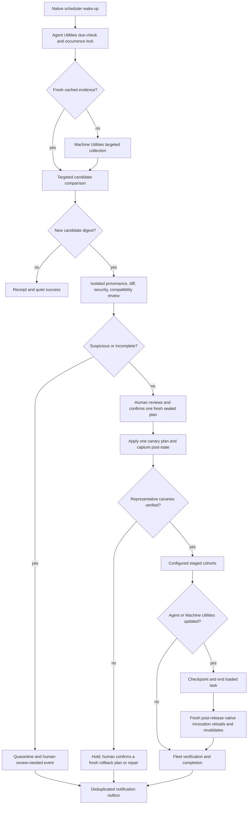

# Scheduled Fleet Update Maintenance - Plan

## Goal Capsule

- **Objective:** Build a deterministic, inspectable recurring maintenance control plane that discovers updates without standing mutation authority, reviews their provenance and risk, and rolls ready candidates through representative canaries and staged fleet cohorts using Machine Utilities' existing sealed execution path.
- **Authority:** Read-only discovery and review may run unattended. In the initial release, every host mutation requires a human to contemporaneously confirm one fresh exact Machine Utilities sealed-plan ID. Schedulers, agents, and stored receipts hold no reusable mutation authority; deferred approvals or policy leases require a later, separately approved design.
- **Execution profile:** Host-native schedulers are authoritative wake-up mechanisms. Agent Utilities owns policy, review, evidence, and rollout sequencing; Machine Utilities owns host inventory, native execution, and post-state evidence. Codex automation and CI are optional review surfaces, never correctness dependencies.
- **Released baseline:** Begin implementation from Agent Utilities 0.5.10 at `beb0205e7e21160f24bad4c426365f916d2b033c`, Machine Utilities 0.2.18 at `06e12fb9dfc63a4673c771e54e1237979dd1253b`, and marketplace publication `6d3da4b3b5b165d252dd598ae052539850001b34`. Preserve the released model-routing and remote-control fail-closed behavior as a dependency, not as maintenance authority.
- **Stop condition:** Stop before mutation whenever provenance, review, compatibility, rollback posture, host preconditions, scheduler ownership, human decision context, or executor freshness is missing or has changed.
- **Tail ownership:** Agent Utilities owns the canonical contract and control plane. Machine Utilities is a versioned dependency delivered first where required. Marketplace publication, scheduler enrollment, notifications, and live fleet changes remain separately authorized delivery work.

---

## Product Contract

### Summary

The system separates recurring discovery from update authority. One native scheduler on the configured controller wakes a stable verified launcher, which resolves the dependency-free Agent Utilities runner from one exact configured provider. The runner computes whether work is due, admits one deterministic occurrence, reuses fresh cached evidence, and asks Machine Utilities only for stale or impacted inventory sections. New candidate digests enter provenance, source-diff, security, compatibility, and rollback review. Ready candidates become per-host Machine Utilities sealed plans; a human starts a distinct interactive invocation for each canary, cohort host, or rollback, and immutable receipts record outcomes without granting reusable authority. No chat, Codex task, CI run, scheduler definition, stored receipt, or old prompt is itself authority to mutate a host.

### Problem Frame

Claire's fleet spans macOS, Linux, WSL, and native Windows; Codex and Claude are separate harnesses; package, plugin, skill, and application managers have different discovery, self-update, approval, and rollback semantics. Existing Machine Utilities already provides deterministic inventory and sealed execution, while Agent Utilities already contains a weekly source-refresh workflow and orchestration patterns. The missing layer is a durable, reviewable lifecycle that joins those capabilities without introducing another package engine, daemon, database, or plugin-cache synchronization path.

The principal hazard is not scheduling a command. It is avoiding split-brain ownership and stale authority when native schedulers, Codex automation, CI, package-manager metadata refresh, application self-updaters, and returning offline hosts overlap. The control plane therefore makes recurrence idempotent, treats all discovered content as untrusted data, binds readiness and human decision evidence to exact reviewed content, and requires a fresh executor after Agent Utilities or Machine Utilities updates itself.

### Requirements

#### Scheduling and lifecycle

- R1. Use launchd on macOS, systemd timers on Linux/WSL, and native Task Scheduler on Windows as portable native trigger adapters; permit cron only as a Linux/WSL fallback. In v1, activate exactly one adapter on the configured control host. Inventory target-host schedulers read-only and keep the other adapters as tested controller-portability options; defer per-target activation until a canonical ingestion use case exists. Version-gate optional systemd splay features. Configure Task Scheduler with `StartWhenAvailable`, a bounded execution limit, and `IgnoreNew`; definitions invoke one shared due-check runner and contain no package-manager or plugin-manager update command.
- R2. Support exactly one configured control host for canonical aggregation in the initial release, using existing authenticated Machine Utilities transports and a dedicated least-privilege scheduled identity scoped only to read-only collection, evidence storage, and plan rendering. It has no apply/protected-entrypoint credential. Each mutation uses a separate human-controlled account or credential that the scheduled identity cannot read, invoke, or delegate. Host-local discovery may report advisory state where native facts require it, but canonical mutation eligibility always comes from a fresh control-host collection. Scheduled/human identity lifecycles and canary groups live in trusted user-owned Machine Utilities configuration, never maintained source.
- R3. Assign a deterministic occurrence ID from a canonical schedule schema containing revision, timezone, normalized calendar expression, DST gap/overlap policy, catch-up horizon, and a stable controller-and-schedule-derived offset. Concurrent or late triggers for the same occurrence deduplicate; schedule edits create a new revision; missed intervals collapse into one catch-up discovery rather than replaying every missed run.
- R4. Model the lifecycle as `discover -> review -> compatibility -> ready_for_confirmation -> canary -> staged apply -> verify -> complete`, with explicit `blocked`, `expired`, `deferred_offline`, `partial`, `rollback_required`, and `rolled_back` states. Readiness never authorizes apply; confirmation exists only inside one interactive Machine Utilities invocation and leaves an audit-only decision receipt.
- R5. Codex Scheduled may summarize evidence or surface review work, but local correctness must not depend on Codex Desktop running, a task remaining open, or chat history. Any optional visible Codex task dispatch must use `agent-utilities/model-routing/v1` with host-attested R52 readiness, one-use task authority, and a native receipt importer. The public routing CLI cannot mint that authority or import native receipts and must fail closed. Web tasks may review public-source artifacts but cannot be assumed to access local folders or private hosts.
- R6. CI may discover and review public upstream source and run hermetic compatibility tests. It receives no fleet credentials and no host mutation authority; its scheduled timing is advisory rather than exact. Scheduled CI runs use the default branch, avoid peak-hour boundaries, record a last-success alarm, and retain a manual dispatch path.

#### Inventory, caching, and update domains

- R7. Reuse Machine Utilities' `collect`, `validate`, `render`, and `compare` paths and their targeted `packages`, `agents`, and `startup` sections. Do not build a second fleet collector in Agent Utilities.
- R8. Cache a successful full baseline per host and section with observation time, evidence identity, collector version, policy version, freshness deadline, manager-metadata observation age, metadata freshness deadline, and configured refresh owner. Routine runs query only due sources and impacted targets; full scans occur only for bootstrap, schema/policy changes, missing evidence, manual audits, or expired baselines. Expired manager metadata produces `metadata_stale`, never a false “no updates” result.
- R9. A stale, partial, low-confidence, or error-bearing snapshot may support reporting but may not authorize mutation. A returning offline host must recapture affected sections, verify fresh preconditions, and reseal its plan.
- R10. Inventory Homebrew/Linuxbrew formulae and casks, APT packages and unattended-upgrade ownership, WinGet packages and source/pin state, configured Mac App Store or application-native update ownership, and global npm packages used as tools or plugin installers. Unsupported discovery must be reported as an explicit coverage gap, not absence of updates.
- R11. Inventory Codex and Claude runtime versions and self-update settings separately; Codex and Claude marketplace catalog source, update policy, pins, installed plugin versions, enablement, and installed payload evidence separately; Agent Utilities and Machine Utilities release tuples; exact npm-delivered plugin/tool versions and registry provenance; skills CLI/skills.sh locks plus the fleet's own source/ref/path/hash/scope record and installer version; JSM skills, pins, candidates, and auto-update job state; and configured standalone/manual skills.
- R12. Inventory every existing auto-update owner that can race the control plane, including JSM, Claude runtime updates, Codex startup-update settings, Ubuntu unattended upgrades, Homebrew metadata behavior, application-native updaters, and Agent Utilities' Oracle invocation-time self-repair. Choose exactly one owner mode per target: `observe_external`, `control_plane`, or `disabled_by_separate_change`.
- R13. Treat metadata refresh that changes local manager state, including `brew update`, `apt-get update`, WinGet source refresh/agreement acceptance, and registry/catalog refresh, as mutation. Assign each manager a refresh owner: `observe_external`, `human_metadata_only`, or `unsupported`. A read-only scheduled run may use fresh cached metadata but may not smuggle refresh through discovery; missing, unknown, or overdue ownership yields `metadata_stale` and blocks candidate completeness.

#### Provenance and review

- R14. Keep observed, candidate, accepted, and desired versions distinct. A candidate identity binds manager/provider, package or plugin identity, source URL, mutable ref resolved to an immutable revision, artifact/tree digest, manifest and permission surface, target harnesses, and affected host groups.
- R15. For Agent Utilities and Machine Utilities releases, verify the atomic tuple of source manifest version, source commit, Claude catalog entry, Codex pinned source SHA, marketplace version ledger, installed manager version, integrity manifest, and installed file hashes. Each plugin's integrity scope follows its own R40/existing executor contract. Disagreement blocks promotion.
- R16. Treat changelogs, diffs, manifests, prompts, skills, plugins, archives, binaries, and manager output as inert untrusted data. Fetch and inspect candidates in isolated no-secret workspaces before any candidate code, hook, install script, MCP server, app, tool, or prompt is loaded or executed.
- R17. Reuse a prior review only when candidate digest, source identity, review-policy version, reviewer implementation version, relevant permission surface, and advisory-source snapshot/freshness are unchanged. Record changelog coverage, source diff base/head, advisory database/source/version/retrieval time, stale or unavailable disposition, license/source changes, and reviewer disposition.
- R18. Quarantine suspicious changes: source identity, owner, maintainer, or signer changes; mutable or missing pins; missing/invalid provenance; digest mismatch; new or changed executable/binary/archive content; hooks, MCP servers, apps, tools, permissions, network domains, install/lifecycle scripts, dependencies, credential access, obfuscation/minified blobs, removals/renames, or manager/provider conversion. A matched unfixed advisory at or above the configured severity threshold, or advisory evidence stale/unavailable beyond policy freshness, also blocks promotion pending explicit human clearance bound to the candidate digest. Third-party CI actions require full commit SHA pins and least-privilege workflow permissions.
- R19. Preserve existing upstream-review patterns in `upstreams.json`, `UPSTREAM.md`, and the compiled weekly imported-skill workflow, but do not copy its stale marketplace-release assumption. Source refresh and marketplace publication remain distinct evidence-linked stages.
- R31. Run reviewed candidate code only in a disposable no-secret compatibility sandbox with network disabled by default. Policy declares required coverage by candidate class: maintained skills/plugins/runtimes run their owned contract/smoke suites; package/store candidates without owned suites run provider exact-install, activation/health, and payload-postcondition fixtures for every affected native manager/harness cell; data-only metadata changes run deterministic schema/static checks. Bind the result to candidate, class, toolchain, test-suite, isolation, policy, and required platform/manager/harness matrix digests. Missing required coverage blocks `ready_for_confirmation` unless R21's narrow human waiver applies.

#### Approval, rollout, recovery, and reporting

- R20. The initial release has no durable or unattended mutation authority. Agent Utilities may render evidence and the exact Machine Utilities command but has no apply dispatch. At each canary, cohort, or rollback step, a human starts Machine Utilities under R2's separate human-controlled account/credential and contemporaneously confirms one fresh sealed-plan ID after reviewing the candidate, review, compatibility, target, rollback capability, policy, and expiry evidence. The scheduled identity has neither this credential nor an allowlisted path to invoke it; a pseudo-terminal, piped stdin, stored receipt, prompt, or scheduled entrypoint cannot substitute. The resulting decision receipt is audit evidence only; any changed binding requires fresh collection, resealing, and confirmation. Signed deferred approvals, leases, renewals, and automatic rollback authority require a separate post-dry-run plan and explicit policy approval.
- R21. Reserve human-only authority for creating or widening unattended policy; accepting new sources, signers, hooks, permissions, network access, privilege, passwords/UAC/OAuth/terms, broker enrollment or upgrade, major/runtime/OS updates, migrations, reboots, suspicious-review overrides, offline-host waivers, compatibility-coverage waivers, and repair after a rollback becomes unavailable or fails. Unsupported rollback is non-waivable for forward apply in v1. A compatibility waiver is candidate-digest-bound, reasoned, scoped to named matrix cells, expiring, and cannot waive failed tests, suspicious review, provenance, exact-install, rollback support, activation, or postcondition gates; any completion that depends on it is `completed_with_waivers`.
- R22. Require a representative canary for every affected native OS, manager, and Codex/Claude harness. Compute the dimension map from configured fleet evidence. A dimension with exactly one eligible host is `single_host_dimension` and requires one human acknowledgement per policy version; other missing representation is `no_canary_available` and blocks promotion unless a human explicitly approves one named first target as both canary and cohort member. A canary failure blocks all later cohorts.
- R23. Deliver each host mutation through a distinct interactive Machine Utilities invocation using a fresh snapshot, sealed single-host plan, precondition verification, exact operation, and post-inventory receipt. Agent Utilities prepares and later reads evidence but never dispatches apply. Scheduled work must never use `fleet-agents`' routine named-marketplace refresh as standing authority.
- R24. Determine rollback capability before forward confirmation and record the previous exact pin/digest, artifact availability, manager-native reinstall recipe, and required configuration snapshot. Before apply, Machine Utilities stages the retained artifact and configuration snapshot into a target-local private store, binds their digest/path and provider consumption recipe to the forward plan plus a rollback-capability record, and verifies availability; the control-host R42 copy alone is insufficient. After failure, recapture authoritative post-state and seal an exact rollback plan that references and reverifies that record, artifact digest/path, snapshot, and recipe, then require a new R20 invocation and confirmation. When staging, safe capture, provider consumption, or downgrade is unavailable, record `unsupported`, hold the rollout, and request repair authority instead of inventing a generic rollback.
- R25. Treat offline hosts as `deferred_offline`. Retry with bounded backoff and a maximum staleness notification; do not count WSL evidence as native Windows proof, and do not declare fleet completion until every required native target is verified or covered by a human-issued, digest-bound, reasoned, scoped, expiring waiver. Preserve a timed-out WSL collection as transport evidence. Preserve `model_routing_capability_unavailable` from the Machine Utilities readiness/embedding boundary separately from `trusted_task_authority_attestor_unavailable` at the host authority-attestor boundary. These limitations do not block discovery-only implementation or independent Mac evidence, but they block Iris routed/native-Windows coverage and ordinary fleet completion. Retry the authority path only after relevant host or adapter evidence changes. Waived completion is `completed_with_waivers`, never ordinary `completed`.
- R26. Persist immutable per-run JSON/JSONL artifacts under a configured private/XDG state root, with SHA-256 links, no-follow creation, file-and-directory durability sync, and atomic same-volume index replacement. Resolve configuration paths once, require absolute paths beneath approved roots, and reject traversal, symlinks, reparse points, unsafe ownership, or unsafe permissions before reading or writing. Use one writer per ledger; define stale-lock recovery, disk-watermark failure, and hash-linked retention/compaction that never removes unresolved authority, partial, rollback, or audit evidence; make indexes rebuildable from receipts; never commit fleet state or write installed plugin caches.
- R27. Drive notifications from a deduplicated local durable outbox. Notify only on human action needed, suspicious quarantine, overdue offline host, canary/rollout/rollback failure, partial state, and completion, plus an optional fleet-currency digest reporting candidate age and counts by unapplied, blocked, `observe_external`, and unsupported states. Record local schedule/host heartbeat, last-success SLO, dead-letter, and recovery evidence. Report `deadman_unconfigured`; an authenticated observer transport and external sink are a separately approved follow-on plan after an observer is selected. Delivery failure never changes maintenance state.
- R28. Update Agent Utilities or Machine Utilities last in any batch. Either update invalidates every prepared sealed plan and decision context. Checkpoint, end the loaded invocation, reload the released plugin, and prove its full release tuple and fleet receipt. The fresh process may revalidate candidate, review, compatibility, rollback-capability, and schedule evidence, but must return each remaining target to `ready_for_confirmation`, recollect, reseal, and require a new R20 invocation before apply.
- R29. Make the post-release revalidation gate independently resumable. A fresh native process/invocation using the configured R33 `runner_provider` and its current integrity-verified Agent Utilities version—newly installed only when Agent Utilities changed—must consume the release/fleet receipt, record its exact provider/path/version/pin/integrity and policy identity, and either issue `revalidated` evidence or leave the rollout blocked. `revalidated` never revives an old sealed plan or decision context; R28's recollect/reseal/confirmation path remains mandatory. Codex may launch or observe this process but is not required, and the pre-release process cannot self-certify it.
- R30. Keep this planning delivery non-mutating except for the plan artifact in its task-owned worktree. Implementation may not install/update packages, enroll schedulers, edit caches, contact people, or mutate hosts without the later approvals defined here.
- R32. Pin one configured controller identity and epoch. Before every ordinary or protected apply, Machine Utilities writes a target-local reservation binding operation, controller epoch, target, sealed plan, and executor identity; completed duplicates are no-ops and active/conflicting attempts fail closed. A second controller is unsupported until R45's human takeover changes the epoch.
- R33. Schedule through maintained POSIX and native Windows launcher artifacts that Machine Utilities atomically installs at a configured stable path outside versioned plugin caches. Require one configured `runner_provider` selecting the exact Codex or Claude manager/source tuple; bind its resolved path, version, source pin, integrity, runtime, source/installed launcher digests, active/prior versions, and destination. Fail closed without an exact match and never fall back between providers. The other harness remains independent verification evidence. Payload self-update leaves the launcher unchanged, while launcher updates can restore the prior verified version.
- R34. Inventory scheduler scope, session/login dependency, user/profile availability, credential mechanism, wake capability, logged-off eligibility, working directory, runtime path, and privilege context per native target. Unsupported execution context is `scheduler_runtime_unavailable`, not a successful enrollment.
- R35. The control host is the sole canonical writer and pulls fresh evidence through existing authenticated Machine Utilities transports. Host-local receipts remain advisory and are never ingested as mutation preconditions; a returning host is recollected. This removes the need for a new push/spool protocol in the initial release.
- R36. Write a target-local reservation before invoking a manager and terminal evidence afterward. A crash with possible side effect but no authoritative post-state becomes `indeterminate_after_mutation` and cannot retry until fresh authoritative evidence or explicitly approved repair resolves it.
- R37. Make scheduler activation a separately authorized lifecycle after implementation: preview, install, verify, disable, uninstall, and restore the prior definition by exact per-OS definition digest, with post-install inventory and recovery evidence.
- R38. Apply manager-specific provenance profiles: Homebrew tap commit plus bottle/cask checksum and upstream URL; APT signed origin/Release identity plus package hash; WinGet source, manifest, installer hash, and pin; npm integrity, signature/provenance, and lifecycle surface; Codex/Claude marketplace and plugin source identities separately; skills exact tree digest plus installer identity; JSM catalog/source/installer identity; Mac App Store product/build/receipt identity; and configured native updater signer/feed/artifact identity. A native/app-store updater stays `observe_external` or `unsupported_for_control_plane_apply` until its profile exists. Missing required evidence blocks review rather than collapsing into a manager-neutral pass.
- R39. Require a provider-specific exact-install contract before control-plane apply: immutable candidate selector, pinned installer/runtime identity, immutable catalog/source/artifact identity, and exact installed version plus payload-digest postconditions. Providers that expose only mutable “latest/update” commands are `unsupported_for_control_plane_apply` and remain discovery-only until a later exact mechanism exists; contemporaneous human confirmation does not make a mutable target exact.
- R40. Give Agent Utilities a deterministic release-integrity manifest and generator/verifier covering the maintenance skill, contract, runner, stable launcher/verifier, manifests, and verifier itself. Bind its digest to the released source pin and require it for fresh-process revalidation, matching Machine Utilities' existing executor-integrity boundary.
- R41. Make deterministic fetch, immutable hashing, archive/path validation, and static policy checks authoritative review inputs. AI/agent source review is advisory only and cannot issue a `reviewed` disposition or mutation-authority evidence; prompt-bearing, executable, or suspicious changes require explicit human clearance bound to the candidate digest.
- R42. Define a retained-artifact record for the Agent Utilities control-host store and the Machine Utilities target-local private staging store: no-follow native-safe acquisition/staging, content digest and source, plan references, provider consumption recipe, corruption/substitution checks before forward apply and rollback, deadline/attempt bindings, and reference-counted retention. Garbage collection cannot race or delete any unresolved, ready, partial, rollback, or audit reference.
- R43. Bound untrusted acquisition and materialization by downloaded bytes, Git depth/object count, expanded bytes, file count, archive nesting/expansion ratio, per-file size, sparse-file allocation, inode use, CPU, and wall-clock limits. Fail closed and clean the isolated workspace on limit or cleanup failure.
- R44. For untrusted upstream, advisory, registry, and catalog acquisition, allow only approved HTTPS source identities; disable ambient Git/SSH credential helpers and inherited proxies, validate every redirect and resolved address against loopback/link-local/private-network denial, and bind the final source identity. Treat every response as inert untrusted data. R2/R35 fleet collection is a separate egress class restricted to exact configured target identities over existing authenticated Machine Utilities transports and may reach their configured private addresses. Approved local sources use separate no-follow path rules.
- R45. Recover from permanent control-host loss only through an explicit human-authorized controller identity/epoch change: revoke the prior controller, reconstruct or restore canonical receipts, advance target-local fencing generations, and run discovery-only reconciliation before creating any new plan or apply.
- R46. Record boot/session and last-seen clock evidence. A backward jump or excessive skew creates `time_untrusted`, blocks expiry/freshness-dependent planning and every apply, and permits only read-only discovery until a fresh trusted-time receipt restores mutation eligibility.
- R47. A newer reviewed candidate for the same provider/target marks older unapplied stages `superseded`. Returning hosts discover the newest eligible desired version; hosts already changed by an older rollout enter explicit reconciliation rather than replaying obsolete versions.

### Acceptance Examples

- AE1. **Covers R1-R6.** Native and Codex triggers fire for one interval while Codex Desktop later quits; one occurrence is admitted, the other records a duplicate no-op, and discovery completes without Codex.
- AE2. **Covers R3-R4, R9, R25.** A host misses three intervals, returns once, captures fresh impacted sections, and refuses an expired plan rather than replaying three updates.
- AE3. **Covers R8-R9, R17.** An unchanged candidate with fresh impacted inventory reuses review and compatibility receipts without a full fleet scan; a policy-version change invalidates that reuse.
- AE4. **Covers R10-R13.** Homebrew reports cached candidates without an implicit metadata refresh; an existing JSM or unattended-upgrade owner is reported as a collision and no duplicate update is planned.
- AE5. **Covers R14-R19.** A plugin adds a hook, MCP server, executable, or network permission; the source is quarantined in a no-secret workspace and no host plan is sealed.
- AE6. **Covers R15.** A marketplace version changes without the Codex source SHA, or installed Agent Utilities/Machine Utilities bytes differ from their integrity manifests; release verification blocks.
- AE7. **Covers R20-R23.** The candidate or host precondition changes after readiness or plan rendering; apply fails closed before mutation and later cohorts remain blocked.
- AE8. **Covers R22, R25.** Codex succeeds but Claude fails on macOS, and native Windows is offline while WSL is reachable; later stages block, Windows remains deferred, and harness results remain distinct.
- AE9. **Covers R24.** A canary began with verified target-local rollback staging, but the retained artifact later fails re-verification; status becomes `rollback_required:failed`, later cohorts freeze, and only an explicitly authorized repair may proceed.
- AE10. **Covers R26-R27.** A process dies after operation N and a notification sink is unavailable; resume uses receipts and fresh post-state without rerunning N, while the outbox retries independently by event ID.
- AE11. **Covers R28-R29.** Machine Utilities updates itself; the loaded process checkpoints and exits. A fresh post-release Agent Utilities native invocation verifies the release/fleet receipt and revalidates all remaining bindings before any later cohort runs.
- AE12. **Covers R16-R18.** Malicious instructions in a changelog or inventory field remain data, receive a suspicious disposition, and execute nothing.
- AE13. **Covers R32, R35-R36, R45.** A scheduled control-host run overlaps an interactive apply, or a copied configuration attempts to reuse an old controller epoch; Machine Utilities admits one target-local reservation, rejects the conflict, and an interrupted admitted operation becomes indeterminate rather than being replayed.
- AE14. **Covers R33-R34, R37.** A logged-out Mac, stopped WSL distribution, and logged-off Windows profile report their actual scheduler eligibility; an unchanged stable launcher starts the newly released payload, and activation can restore the exact prior definition.
- AE15. **Covers R39-R41.** A manager whose update command resolves mutable latest content cannot run unattended; catalog or installer drift blocks exact apply, and an agent's favorable review cannot clear a prompt-bearing candidate without the required human receipt.

### Current Maintained Mechanisms and Gaps

This is a planning snapshot from 2026-08-04. Installed versions and scheduler observations are evidence, not desired state; implementation must refresh them through targeted collection.

The released baseline passed 166/166 Agent Utilities tests, the Machine Utilities normal compatibility check, and final quality/security reviews with no P0-P2 quality or P0-P1 security findings. Three Macs reported Agent Utilities 0.5.10 and Machine Utilities 0.2.18. Iris WSL timed out twice without mutation. At the native path, Machine Utilities reported `model_routing_capability_unavailable` for unavailable readiness/embedding capability and the host routing integration reported `trusted_task_authority_attestor_unavailable`; no task was created. These distinct receipts constrain the first coverage census. They do not block implementation of the discovery-only control plane, but Iris remains deferred and cannot satisfy native-Windows or fleet-completion gates.

| Surface | Maintained mechanism today | Existing behavior or gap | Plan consequence |
|---|---|---|---|
| Imported Agent Utilities skills | `upstreams.json`, `UPSTREAM.md`, `.github/workflows/refresh-imported-skills.md`, compiled `.lock.yml` | Weekly GitHub discovery, exact tree comparison, untrusted-input guidance, draft PR; no explicit suspicious-diff, approval, canary, or rollback ledger | Reuse source ledger and review-only posture; add shared review evidence rather than a second importer |
| Fleet inventory | Machine Utilities `collect`, `validate`, `render`, `compare` | Targeted package/agent/startup sections, deterministic JSONL, confidence and retryability | Make it the sole inventory provider and add freshness/cache metadata above it |
| Fleet mutation | Machine Utilities `seal-plan`, precondition verification, apply paths, protected broker, post-inventory | Exact single-host plan and partial post-state; many managers have no rollback primitive | Compose existing executor; add rollout gates and honest rollback capability records |
| Homebrew/Linuxbrew | Formula/cask installed and candidate inventory; sealed manager-native upgrades | Collector can use manager metadata; metadata-refresh boundary needs explicit settlement; casks may self-update | Record metadata age and choose external or human metadata-only refresh ownership; stale metadata is a visible gap |
| APT | Installed and cached candidate inventory; sealed upgrades | Ubuntu unattended-upgrades may already own security and metadata refresh | Inventory timer/config/log ownership, record metadata age, and avoid dual control |
| WinGet | Export and validated upgrade table; protected pinned module path | Unverified output is nonactionable; source refresh/agreement and package self-update complicate ownership | Preserve validation and pins; record source age; make refresh agreement and manual app owners explicit gates |
| Application stores/updaters | Homebrew casks cover some apps | Mac App Store and arbitrary native updater coverage are not implemented | Report `unsupported` unless a configured installed provider exists; do not add a speculative universal app updater |
| Codex/Claude runtimes | Runtime version plus selected settings | Claude may update on startup/while running; Codex update-on-startup setting is not completion evidence | Track runtime owner, candidate, applied version, and restart activation separately per harness |
| Codex/Claude plugins | Provider-specific manager, marketplace, version, enablement, source pin | Manager-native update operations exist; installed caches are runtime evidence only | Verify and update through managers; never synchronize or edit cache directories |
| Routed Codex remote control | Agent Utilities 0.5.10 model router plus Machine Utilities 0.2.18 remote-control contract | Public CLI has no host-owned task authority or native receipt importer; R52 readiness and native target identity fail closed before dispatch | Reuse the released router and host embedding; never add a parallel dispatcher, caller-minted authority, WSL fallback, or public-CLI bypass |
| Agent/Machine Utilities | Paired source manifests plus marketplace catalogs/version ledger; Machine Utilities integrity manifest | Repository head, released version, pinned SHA, installed version, and bytes can differ legitimately | Model one release tuple and verify every element; self-update last with post-release revalidation |
| skills CLI/skills.sh | `.agents/.skill-lock.json` source and folder hash | Installer version/update availability not captured; `npx skills` is not pinned in current Machine Utilities execution | Record installer identity before trusting results; retain manager-native lock/source semantics |
| JSM | Offline skill inventory, version, pin, candidate metadata; native auto-update scheduler | Current local evidence showed a healthy daily launchd job with `install_new=false`; collectors do not fully expose job state | Extend inventory and assign ownership before the control plane touches JSM-managed skills |
| npm-delivered tools/plugins | Oracle fallback pins `@steipete/oracle@0.17.0`; npm can report global outdated packages | No fleet-wide global npm inventory; Oracle self-repairs at invocation time | Inventory configured global packages and special self-healing owners; never blanket-upgrade all globals |
| Native schedulers | Machine Utilities inventories launchd, systemd, cron, Task Scheduler, Startup folders, Run keys | Architecture promises Codex automation/agent-manager jobs beyond visible collector coverage; generic scheduler mutation is intentionally absent | Close or narrow the inventory claim; later enrollment is a separate previewable operation |
| Notifications | Weekly source-refresh draft PR and task progress | No maintenance outbox or dedupe ledger | Add local durable events first; external delivery adapter only after explicit configuration |

### Scope Boundaries

- This plan owns the Agent Utilities maintenance contract, review/policy runner, durable evidence model, and staged control flow.
- This plan treats Machine Utilities collector, scheduler-evidence, and native-execution work as a versioned dependency delivered in its repository.
- This plan does not add a daemon, service database, universal package abstraction, generic scheduler editor, notification SaaS, or new package dependency.
- This plan does not replace manager-native installs, Machine Utilities sealed plans, protected broker boundaries, chezmoi, or existing source-refresh automation.
- Installed Codex/Claude plugin caches remain read-only evidence. Ordinary payload changes use source release and manager-native reinstall/update.
- Fleet hostnames, groups, credentials, notification addresses, schedule times, and policy grants stay in user-owned external configuration/state.
- No live package update, scheduler enrollment, external notification, host mutation, or cache edit belongs to this planning task.

---

## Planning Contract

### Key Technical Decisions

- KTD1. **One native wake-up, portable adapters.** V1 activates the adapter matching the configured controller; launchd, systemd timers, Task Scheduler, or cron all target the same runner contract. The runner owns catch-up, dedupe, and expiry, which keeps controller migration portable without a daemon or fleet-wide scheduler deployment.
- KTD2. **Agent Utilities controls; Machine Utilities executes.** Agent Utilities owns lifecycle and authority evidence. Machine Utilities remains the sole host collector, plan sealer, protected-operation boundary, and post-state verifier; the cross-repository seam is a versioned artifact contract, not shared implementation.
- KTD3. **Files before a database.** Immutable canonical JSON/JSONL receipts plus a small durable atomic index are sufficient for this fleet and remain inspectable by humans and agents. The initial release has one configured controller; target-local reservations provide operation idempotency and epoch-based takeover safety. A database and active multi-controller protocol are deferred until measured need.
- KTD4. **Discovery is never mutation authority.** Scheduled prompts, receipts, and the existing named-marketplace refresh exception are not reusable approvals. The initial release crosses apply only through contemporaneous human confirmation of one fresh Machine Utilities plan ID; durable leases are deferred.
- KTD5. **One owner per target.** Existing auto-updaters are first-class inventory. The control plane refuses a candidate when ownership overlaps or is unknown, rather than racing a native updater.
- KTD6. **Content-addressed reuse.** Candidate, review, compatibility, decision, and plan evidence is keyed by immutable digests and versioned policy identities. TTL decides when host evidence is fresh; content identity decides when review can be reused.
- KTD7. **CI and Codex advise.** CI handles public-source discovery and hermetic tests; Codex automation renders summaries or opens review work. Neither stores fleet truth or applies private-host changes.
- KTD8. **Canaries are dimensional.** A first host is not sufficient. The canary set must cover every affected native OS, manager, and harness, and any failure closes the stage gate.
- KTD9. **Rollback claims are manager-specific and human-confirmed.** Retained verified artifacts enable a fresh exact rollback plan where the manager supports it. Unsupported downgrade is a planned outcome requiring hold and repair authority, not a generic or automatic command path.
- KTD10. **Self-update creates a hard invocation boundary.** Agent Utilities and Machine Utilities update last. Their loaded code cannot validate its own replacement. Before launcher activation, one fresh provider-resolved, integrity-verified interactive invocation proves the new tuple; after activation, every revalidation starts through the stable verified launcher.
- KTD11. **Secrets never enter review.** Upstream content is reviewed as inert data in a no-secret workspace. Reports keep useful package/version/provenance detail but omit tokens, credentials, environment values, prompt bodies, and private file contents.
- KTD12. **Scheduler enrollment stays separate.** The feature can render and verify schedule definitions, but installing or changing them is a focused previewable operation after implementation, with its own approval and definition digest.
- KTD13. **Released routing remains a fail-closed optional edge.** The maintenance runner does not call the public model-routing CLI to obtain fleet authority. The supported controller execution host, distinct from the target platform, owns router state, the one-use authority attestor, and native receipt import. Machine Utilities remains the sole sender. Windows and WSL observations are target evidence only; if the execution host cannot support secure router state or the attestors, optional visible Codex work is unavailable while native scheduler discovery continues independently.

### Scheduler and Control-Host Decision Matrix

| Option | Runs without Codex Desktop | Missed-run behavior | Fleet/local access | Determinism and role |
|---|---:|---|---|---|
| launchd | Yes, while host is available | Calendar jobs delayed by sleep may run on wake; powered-off intervals need runner catch-up | Native macOS user context | Controller adapter when the configured controller is macOS |
| systemd timer | Yes | Calendar timers catch up after sleep; `Persistent=true` catches one powered-off interval | Native Linux/WSL user context | Controller adapter when Linux/WSL is selected; version-gate stable splay options |
| cron | Yes | Missed sleep/off intervals are normally lost | Native POSIX user context | Controller fallback only; runner supplies catch-up/idempotency |
| Windows Task Scheduler | Yes | `StartWhenAvailable` can run after a missed time | Native Windows user context | Controller adapter when Windows is selected; bounded execution plus `IgnoreNew` |
| Codex local scheduled task | No; computer and Codex Desktop must be running for reliable local work | Product-managed | Local folders only on that machine | Optional summary/review trigger, never authoritative |
| Codex web task | Yes for hosted work | Product-managed | No private local folders or fleet reach by assumption | Optional public-source review/notification |
| GitHub Actions schedule | Yes | Can be delayed or dropped under load; default-branch and inactivity rules apply | Repository/public-source context | Existing upstream discovery and CI tests; offset from peak boundaries, alarm on last success, retain manual dispatch |
| Always-on control host | Yes while host and connectivity are available | Runner records last occurrence and catches up once | Aggregates configured host receipts | Preferred fleet coordinator, with host-local collectors for native/private facts |

### High-Level Technical Design

### Artifact and State Contract

The Agent Utilities contract uses a configured private state root. It defines schemas and hashes; Machine Utilities produces or consumes only the versioned seam artifacts.

| Artifact | Minimum binding | Lifecycle purpose |
|---|---|---|
| Schedule/run receipt | schedule ID, intended interval, occurrence ID, trigger type, runner/policy version | Dedupe, catch-up, audit |
| Inventory section | host/native target, section, snapshot ID, evidence identity, collector/executor identity, confidence, observed/fresh-until | Cache and preconditions |
| Candidate ledger | observed/candidate/accepted/desired versions, manager/provider, immutable source/artifact identity, affected targets, auto-update owner | Discovery and provenance |
| Review receipt | candidate digest, base/head diff, changelog/advisories/license, suspicious flags, policy/reviewer versions, disposition | Trust gate |
| Compatibility receipt | candidate digest, test-suite digest, platform/harness/manager matrix, result | Canary eligibility |
| Decision receipt | exact Machine Utilities plan ID, candidate/review/compatibility/target evidence, human confirmation time, result | Audit evidence; never reusable authority |
| Sealed-plan link/result | Machine Utilities plan ID/digest, fresh snapshot, operations, host result, post-inventory | Native apply evidence |
| Rollout receipt | cohort/stage, canary dimensions, operation IDs, state transition, blockers | Resume and stage gates |
| Rollback receipt | capability, retained artifact, fresh rollback plan/decision binding, attempt/result or unsupported reason | Recovery truth |
| Retained artifact | content/source digest, native-safe store location, bound plan references, integrity/retention state | Exact rollback material and safe garbage collection |
| Release/fleet receipt | source/manifests/catalogs/pin/integrity/installed evidence per host/harness | Self-update boundary |
| Revalidation receipt | fresh Agent Utilities identity, consumed release receipt, rechecked bindings, disposition | Post-release resume authority |
| Notification event | deterministic event ID, redacted payload, state transition, attempts/result | Delivery without state coupling |
| Target reservation | configured controller epoch, target, operation/plan, executor, terminal/indeterminate state | Operation idempotency and takeover fencing |

### State and Concurrency Rules

1. The occurrence lock admits one local writer for a schedule interval. Before mutation, R32's target-local reservation verifies the one configured controller epoch; a duplicate is a no-op and any other controller/conflict fails closed.
2. Each operation ID binds candidate, target, stage, and sealed-plan digest. A target-local reservation precedes the manager side effect; resume consults terminal receipts and authoritative fresh post-state, and never retries `indeterminate_after_mutation` automatically.
3. Index writes follow R26's native ownership, path-safety, durability, and retention contract; receipts are append-only. An index can be rebuilt and cannot override contradictory receipts.
4. A changed candidate, review policy/advisory snapshot, compatibility matrix/toolchain/test suite, permission surface, human decision context, host scope, rollback capability, executor identity, or plan invalidates the sealed plan and requires new human confirmation.
5. Independent discovery failures may continue. Apply failures remain isolated within an admitted stage, but a failed canary gate prevents every later stage.
6. A host returning from `deferred_offline` rejoins at discovery, never at apply. An old decision receipt remains audit-only and cannot resume execution.
7. A release/fleet receipt is necessary but insufficient after self-update; R29's fresh-native-invocation revalidation receipt is the only resume edge.
8. Host-local receipts never advance canonical mutation state. The control host recollects through R35; controller replacement follows R45 reconciliation.
9. `time_untrusted` permits read-only discovery only. `superseded` closes older unapplied stages without deleting their evidence.

### Sequencing

1. Freeze the shared contract, then land all Machine Utilities inventory, reservation, recovery, launcher/scheduler, and revalidation seam changes as one dependency-first capability release and verify its tuple on required native targets.
2. Build Agent Utilities read-only discovery, review, native operator status, local outbox, and coverage census. Release a discovery-only pilot and collect real fleet evidence without manager or scheduler mutation.
3. Gate compatibility and human-controlled rollout work on the census identifying at least one `control_plane` target with exact-install and meaningful compatibility coverage; otherwise stop at discovery/reporting as the honest product.
4. Compose fresh human-confirmed Machine Utilities plans into canary/cohort receipts, offline/supersession state, rollback preparation, and post-release revalidation.
5. Release Agent Utilities through normal source/marketplace coupling. Initial revalidation may be started interactively; once scheduler activation is separately approved, install the stable launcher and native schedule, observe a natural discovery run, and run one real canary update under a separate exact human confirmation as terminal operational proof.

---

## Implementation Units

### U1. Define the Agent Utilities maintenance contract

- **Target repo:** Agent Utilities.
- **Goal:** Establish the minimum versioned contract needed for read-only lifecycle, evidence, native operator handoff, and the Machine Utilities seam.
- **Requirements:** R1-R9, R14-R29, R31-R36, R38-R47.
- **Dependencies:** None.
- **Files:** `plugins/agent-utilities/references/fleet-maintenance-contract.md`, `plugins/agent-utilities/skills/fleet-maintenance/SKILL.md`, `plugins/agent-utilities/skills/fleet-maintenance/scripts/fleet-maintenance.mjs`, `plugins/agent-utilities/skills/fleet-maintenance/scripts/fleet-maintenance.test.mjs`, `plugins/agent-utilities/integrity.json`, `plugins/agent-utilities/scripts/update-integrity`.
- **Approach:** Add a thin orchestration skill and one dependency-free Node runner with a minimal native operator surface: status, candidate evidence, plan handoff, defer/reject, resume, and recovery status. Plan handoff only renders the exact Machine Utilities command for a human-started interactive invocation; the runner contains no apply dispatch and never stores reusable authority. Notifications carry stable identifiers accepted by these commands. Follow `cleanup-codex.mjs` patterns for canonical JSON hashing, private XDG state, atomic replacement, and exact locking. Freeze only the schedule/run, inventory, candidate, state/invalidation, redaction, path-safety, and minimum Machine Utilities capability contracts consumed by U2/U3. Add compatibility, decision, retained-artifact, reservation, and launcher-integrity schemas in their owning units through the same version negotiation.
- **Test scenarios:**
  - Canonically equivalent records hash identically; changed source, permission, target, or policy fields change the candidate digest.
  - Concurrent triggers admit one writer and produce one deterministic duplicate receipt.
  - A corrupt index rebuilds from valid receipts; a corrupt or conflicting receipt blocks rather than being ignored.
  - Secrets and prompt bodies are rejected from schema fixtures and rendered summaries.
  - The Agent Utilities integrity generator is deterministic, includes itself and every maintenance entrypoint, and detects a changed installed byte.
  - POSIX symlink/mode/owner and Windows reparse/ACL fixtures reject unsafe roots; sync/write fault injection, stale locks, and disk watermarks fail closed.
  - Retention/compaction reconstructs the same chain and cannot collect unresolved authority, partial, rollback, retained-artifact, or audit references.
  - The scheduled/native runner has no apply dispatch; piped stdin and forged decision receipts cannot cross into Machine Utilities execution.
- **Verification:** Focused tests prove deterministic hashes, native path safety, durable atomic recovery, retention, occurrence dedupe, state-transition validation, version negotiation, integrity, and redaction without network or host access.

### U2. Close Machine Utilities discovery and ownership gaps

- **Target repo:** Machine Utilities.
- **Goal:** Supply the missing read-only evidence required by U1 without broadening mutation authority.
- **Requirements:** R7-R13, R15, R25-R26, R34-R35, R39.
- **Dependencies:** U1 contract fixtures.
- **Files:** `plugins/machine-utilities/scripts/collect-posix`, `plugins/machine-utilities/scripts/collect-windows.ps1`, `plugins/machine-utilities/scripts/machine-utilities`, `plugins/machine-utilities/scripts/test-machine-utilities`, `plugins/machine-utilities/config.example.json`, `plugins/machine-utilities/skills/fleet-inventory/SKILL.md`, `plugins/machine-utilities/skills/fleet-agents/SKILL.md`, `docs/architecture.md`, `plugins/machine-utilities/integrity.json`.
- **Approach:** Extend existing package/agent/startup records with scheduler definition/run identity, Codex automation visibility where supported, JSM auto-update job state, installer/tool identity for skills CLI and JSM, configured npm globals, runtime/plugin candidates, package pins/source identity, and auto-update owner. Produce a per-target coverage census across every named surface: owner mode, provenance-profile status, exact-install eligibility, rollback capability, and native/harness coverage. Preserve R5/KTD13's routed-task boundary and exact limitation receipts. Characterize whether manager discovery mutates metadata; return `unsupported`, `unavailable`, or `requires_metadata_refresh` instead of performing it.
- **Test scenarios:**
  - POSIX and native Windows fixtures emit equivalent contract fields while retaining platform-specific scheduler evidence.
  - WSL cannot satisfy a native Windows target; a desktop-task-required target remains explicit.
  - `brew`, APT, WinGet, skills CLI, JSM, and npm discovery stubs cannot mutate fixture state or accept source agreements; npm candidates retain exact versions and signature/provenance results.
  - Existing auto-update jobs and conflicting owner declarations produce actionable collision records.
  - Partial or malformed manager output stays non-actionable with structured retryability.
  - The coverage census accounts for every named target and cannot classify mutable-only providers as unattended/exact-install eligible.
  - Missing R52 readiness or the host-owned embedding returns `model_routing_capability_unavailable`; an unavailable authority attestor records `trusted_task_authority_attestor_unavailable`. Fixtures assert the emitting layers separately, create no visible task, and keep WSL evidence separate from native Windows.
- **Verification:** The complete Machine Utilities suite passes on macOS/Linux/Windows CI; `update-integrity` produces zero residual diff; targeted collection remains deterministic; installed artifacts retain owner-only POSIX modes or Windows ACLs.

### U3. Implement cached due discovery and provenance ledgers

- **Target repo:** Agent Utilities.
- **Goal:** Turn scheduler wake-ups into bounded targeted discovery and content-addressed candidate evidence.
- **Requirements:** R1-R15, R26, R35, R45-R47.
- **Dependencies:** U1, U2 released capability.
- **Files:** `plugins/agent-utilities/skills/fleet-maintenance/SKILL.md`, `plugins/agent-utilities/skills/fleet-maintenance/scripts/fleet-maintenance.mjs`, `plugins/agent-utilities/skills/fleet-maintenance/scripts/fleet-maintenance.test.mjs`, `plugins/agent-utilities/references/fleet-maintenance-contract.md`.
- **Approach:** Add due computation, per-section TTL, ETag/ref/digest comparison, impact mapping, baseline invalidation, temporal-trust checks, candidate supersession, and R35 control-host pull. Invoke Machine Utilities only through its installed capability and configured transport for due hosts/sections. Apply R5/KTD13 to optional visible-task dispatch; never reproduce model routing, mint authority in caller JSON, or fall back through the public CLI, SSH, or WSL. Preserve repository head, released manifest version, catalog pin, installed version, and executor bytes as distinct facts. Report unsupported manager coverage and self-updater collisions rather than silently expanding scope.
- **Test scenarios:**
  - Fresh unchanged sections and candidate digests cause no full scan or review.
  - Bootstrap, schema change, expired evidence, and manual audit select the minimum required sections.
  - Three missed intervals collapse into one catch-up occurrence.
  - A stale partial snapshot can render a report but cannot advance to `ready_for_confirmation`.
  - Iris-equivalent WSL timeouts and native authority/capability failures preserve distinct limitation receipts and do not prevent independent Mac evidence from advancing its own discovery state. Iris remains deferred, blocks native-Windows/fleet-completion gates, and retries only after relevant host or adapter evidence changes.
  - Repository head drift without a released/pinned version is reported as unreleased source, not an update candidate.
- **Verification:** Hermetic fake-clock/manager tests prove bounded selection, content-addressed reuse, unsupported-state reporting, and zero update operations.

### U4. Add isolated source review and suspicious-change gates

- **Target repo:** Agent Utilities.
- **Goal:** Produce reusable, security-relevant review receipts for open-source skills, plugins, runtimes, and installers before compatibility or confirmation readiness.
- **Requirements:** R14-R19, R21, R26, R38, R41, R43-R44.
- **Dependencies:** U1, U3.
- **Files:** `plugins/agent-utilities/skills/fleet-maintenance/SKILL.md`, `plugins/agent-utilities/skills/fleet-maintenance/scripts/fleet-maintenance.mjs`, `plugins/agent-utilities/skills/fleet-maintenance/scripts/fleet-maintenance.test.mjs`, `plugins/agent-utilities/references/fleet-maintenance-contract.md`, `upstreams.json`, `UPSTREAM.md`, `.github/workflows/refresh-imported-skills.md`, `.github/workflows/refresh-imported-skills.lock.yml`.
- **Approach:** Reuse the current upstream pin/diff workflow for discovery and draft-source work, but do not let its agentic networked review emit authoritative dispositions. Build authoritative receipts from R44-constrained deterministic fetch/hash, R43 resource limits, archive/symlink traversal validation, manager-specific R38 static profiles, immutable source identity, manifests, permissions, dependency/install/lifecycle changes, executable/binary/archive additions, advisory snapshot/freshness, changelog coverage, license, and explicit human clearance where R41 requires it. Treat candidate text as data and never invoke it during review. Keep compiled workflow regeneration and source PR creation in the existing path; correct the stale in-repo marketplace assumption instead of extending it.
- **Test scenarios:**
  - A normal source-only patch with unchanged permissions can become `reviewed` with a reusable receipt.
  - New hook, MCP server, app/tool, network domain, executable, archive, install script, obfuscation, source owner/identity, unsigned npm artifact, or mutable CI action ref yields quarantine.
  - Mutable tag movement resolves to a new immutable identity and invalidates prior review.
  - Malicious changelog/prompt text cannot alter instructions, execute a fixture command, or convert AI advice into authoritative clearance.
  - Candidate digest equality with a changed review-policy version forces re-review.
  - Redirect, DNS-rebinding, inherited credential-helper/proxy, private-address, archive-bomb, oversized-repository, sparse-file, inode, CPU, and timeout fixtures fail closed and clean up.
- **Verification:** Fixture repositories cover benign, suspicious, tampered, and prompt-injection diffs; compiled workflow validation remains deterministic; review runs with no fleet credentials.

### U10. Produce compatibility evidence before confirmation readiness

- **Target repo:** Agent Utilities, with disposable CI/native test environments.
- **Goal:** Turn reviewed candidates into exact compatibility receipts before they can become ready for human plan confirmation.
- **Requirements:** R17, R20, R22, R31, R43.
- **Dependencies:** U1-U4.
- **Files:** `.github/workflows/fleet-maintenance-compatibility.yml`, `plugins/agent-utilities/skills/fleet-maintenance/SKILL.md`, `plugins/agent-utilities/skills/fleet-maintenance/scripts/fleet-maintenance.mjs`, `plugins/agent-utilities/skills/fleet-maintenance/scripts/fleet-maintenance.test.mjs`, `plugins/agent-utilities/skills/fleet-maintenance/scripts/run-compatibility-posix`, `plugins/agent-utilities/skills/fleet-maintenance/scripts/run-compatibility-windows.ps1`, `plugins/agent-utilities/references/fleet-maintenance-contract.md`.
- **Approach:** Add the versioned compatibility schema in this unit. Materialize only the already-reviewed candidate within R43 limits in a disposable unprivileged no-secret runner with network disabled by a proven platform adapter, validate archive and symlink traversal, and permit only audited test entrypoints. The workflow supplies no repository/fleet secrets; the POSIX and Windows adapters attest their egress and isolation mechanism before candidate execution. A matrix cell without proven secret and egress isolation is `unsupported`, not executed. Select R31's required suite by candidate class and run it across the affected OS/architecture/manager/Codex/Claude matrix, binding candidate, class, runner image, isolation attestation, toolchain, test-suite, policy, result, freshness, and coverage digests. Separately approved network access produces a distinct non-authoritative exploratory result, not the R31 receipt; only R21's narrow, expiring human waiver can settle missing—not failed—coverage.
- **Test scenarios:**
  - A reviewed candidate with complete required matrix coverage produces one reusable receipt.
  - Missing OS, architecture, manager, or harness coverage remains blocked rather than inferred from another cell.
  - A package without an owned suite must pass provider exact-install, activation/health, and payload-postcondition fixtures; a data-only change runs only its declared static/schema contract.
  - A scoped waiver can cover one missing matrix cell, cannot cover a failed or suspicious cell, and yields only `completed_with_waivers`.
  - Changed test suite, toolchain/image, policy, freshness, or candidate digest invalidates the receipt and downstream readiness.
  - Candidate code cannot see fleet credentials, host state, or the network unless a separate exact test capability authorizes it.
  - A platform adapter unable to attest no-secret/egress isolation marks the cell unsupported without starting candidate code.
- **Verification:** Hermetic matrix fixtures prove adapter isolation attestations, digest binding, coverage gates, expiry, and fail-closed network/secret behavior.

### U5. Bind human confirmation to existing sealed execution

- **Target repos:** Agent Utilities control plane and Machine Utilities execution contract.
- **Goal:** Convert reviewed candidates into exact per-host plans without creating a second executor or standing scheduler authority.
- **Requirements:** R20-R24, R26, R32, R36, R39, R42.
- **Dependencies:** U1-U4, U10.
- **Files (Agent Utilities):** `plugins/agent-utilities/skills/fleet-maintenance/SKILL.md`, `plugins/agent-utilities/skills/fleet-maintenance/scripts/fleet-maintenance.mjs`, `plugins/agent-utilities/skills/fleet-maintenance/scripts/fleet-maintenance.test.mjs`, `plugins/agent-utilities/references/fleet-maintenance-contract.md`.
- **Files (Machine Utilities):** `plugins/machine-utilities/scripts/machine-utilities`, `plugins/machine-utilities/scripts/apply-windows.ps1`, `plugins/machine-utilities/scripts/privilege-broker-posix`, `plugins/machine-utilities/scripts/privilege-broker-windows.ps1`, `plugins/machine-utilities/scripts/update-integrity`, `plugins/machine-utilities/integrity.json`, `plugins/machine-utilities/config.example.json`, `plugins/machine-utilities/scripts/test-machine-utilities`, `plugins/machine-utilities/skills/fleet-update/SKILL.md`, `plugins/machine-utilities/skills/fleet-agents/SKILL.md`.
- **Approach:** Add the decision, retained-artifact, and target-reservation schemas in this unit. Agent Utilities presents evidence and renders the exact Machine Utilities command; the human uses R2's separate credential to start the invocation and contemporaneously confirm that plan ID. The resulting decision receipt records what was reviewed but is never apply input and cannot be replayed by a scheduler. Machine Utilities atomically writes R32's reservation inside the existing ordinary or protected execution boundary before side effects and emits terminal or R36-indeterminate evidence. Before forward confirmation, Agent Utilities acquires and reverifies R42's control-host artifact, then Machine Utilities stages and verifies the exact artifact/configuration snapshot in its target-local private store and binds it to the forward plan and rollback-capability record. After a qualifying failure, Machine Utilities recaptures post-state and seals a new exact rollback plan that reverifies and references that record and needs a new human-credential invocation and confirmation. Require R39's immutable selector, installer identity, and strict installed version/payload postcondition; otherwise keep the provider discovery-only. Forbid the named-marketplace refresh exception in scheduled mode and preserve remote-control boundaries.
- **Test scenarios:**
  - Candidate, review, compatibility, host, permission, rollback, policy, or plan drift forces a new sealed plan and new human confirmation before apply.
  - A forged decision receipt, old chat instruction, schedule definition, persisted prompt, pseudo-terminal, piped stdin, or unattended runner cannot satisfy Machine Utilities' live exact-plan confirmation; the scheduled identity lacks the human credential and Agent Utilities exposes no apply dispatch.
  - A scheduled control-host run, interactive apply, or copied old controller state contends; one target reservation wins and duplicate/conflict outcomes are deterministic.
  - Termination before invocation, during manager execution, after success, or during terminal-receipt write produces a safe no-op, known result, or `indeterminate_after_mutation`, never blind retry.
  - Privilege, source agreements, major updates, migrations, reboot, or unsupported rollback always stop for human authority.
  - Scheduled marketplace discovery cannot enter the current routine-refresh shortcut.
  - Catalog/source or installer drift between seal and apply blocks, and a merely present/changed postcondition cannot satisfy exact install; mutable-only providers remain discovery-only even with human confirmation.
  - Missing target-local staging, retained artifact substitution/corruption, garbage collection during an unresolved rollout, expired deadline, or exceeded rollback attempt limit blocks recovery.
- **Verification:** Cross-contract fixtures prove that decision receipts grant no authority, only the live Machine Utilities plan confirmation crosses apply, target-side reservation is inside the existing protected boundary, rollback requires a new plan/confirmation, write-ahead recovery and retained-artifact safety fail closed, and existing Machine Utilities sealed-plan/protected-operation tests stay authoritative.

### U6. Implement dimensional canaries, cohorts, offline resume, and rollback truth

- **Target repo:** Agent Utilities, consuming Machine Utilities single-host results.
- **Goal:** Sequence ready plans safely across heterogeneous hosts and preserve a resumable fleet truth without reusable apply authority.
- **Requirements:** R22-R27.
- **Dependencies:** U5.
- **Files:** `plugins/agent-utilities/skills/fleet-maintenance/SKILL.md`, `plugins/agent-utilities/skills/fleet-maintenance/scripts/fleet-maintenance.mjs`, `plugins/agent-utilities/skills/fleet-maintenance/scripts/fleet-maintenance.test.mjs`, `plugins/agent-utilities/references/fleet-maintenance-contract.md`.
- **Approach:** Resolve representative canaries and cohorts from the U2 coverage census and external Machine Utilities configuration. Gate each stage on all required OS/architecture/manager/harness dimensions, required activation/health checks, and an explicit soak exit receipt. Record `single_host_dimension` acknowledgement per policy version, and represent `no_canary_available`, offline, superseded, unsupported rollback, failed rollback, compatibility-waived, and offline-waived targets explicitly. Before each canary, cohort host, or rollback, present and require human confirmation of a fresh Machine Utilities sealed-plan ID. After failure, seal the exact rollback plan from fresh post-state and the retained accepted artifact; never synthesize or automatically execute a downgrade.
- **Test scenarios:**
  - macOS Codex success plus Claude failure blocks the cohort.
  - Native Windows offline with WSL online stays `deferred_offline` and cannot satisfy the Windows dimension.
  - Returning hosts restart at targeted discovery; superseded candidates and old decision receipts cannot resume.
  - A failed canary blocks later stages; only a fresh eligible rollback plan with new human confirmation can run.
  - A single-host dimension records the configured acknowledgement; missing representation produces `no_canary_available` and needs a named first-target decision.
  - Install success without effective loader activation, health checks, or completed soak cannot advance.
  - Unsupported or failed rollback leaves a durable repair-required state.
- **Verification:** Fake fleet scenarios cover mixed OS/harness results, the single-host dimension path, offline return, supersession, compatibility/offline waivers, partial post-state, stage isolation, and human-confirmed manager-specific rollback.

### U7. Add scheduler definition previews and durable notifications

- **Target repos:** Agent Utilities for runner/outbox; Machine Utilities for definition evidence.
- **Goal:** Make recurring operation deployable and observable without turning schedule or delivery configuration into implicit authority.
- **Requirements:** R1-R6, R12, R26-R27, R30, R33-R34, R37.
- **Dependencies:** U2, U3, U6.
- **Files (Agent Utilities):** `plugins/agent-utilities/skills/fleet-maintenance/SKILL.md`, `plugins/agent-utilities/skills/fleet-maintenance/scripts/fleet-maintenance.mjs`, `plugins/agent-utilities/skills/fleet-maintenance/scripts/fleet-maintenance.test.mjs`, `plugins/agent-utilities/skills/fleet-maintenance/scripts/fleet-maintenance-launcher`, `plugins/agent-utilities/skills/fleet-maintenance/scripts/fleet-maintenance-launcher.ps1`, `plugins/agent-utilities/references/fleet-maintenance-contract.md`, `plugins/agent-utilities/integrity.json`, `README.md`.
- **Files (Machine Utilities):** `plugins/machine-utilities/config.example.json`, `plugins/machine-utilities/scripts/machine-utilities`, `plugins/machine-utilities/scripts/manage-maintenance-schedule`, `plugins/machine-utilities/scripts/manage-maintenance-schedule-windows.ps1`, `plugins/machine-utilities/scripts/collect-posix`, `plugins/machine-utilities/scripts/collect-windows.ps1`, `plugins/machine-utilities/scripts/update-integrity`, `plugins/machine-utilities/scripts/test-machine-utilities`, `plugins/machine-utilities/integrity.json`, `docs/architecture.md`.
- **Approach:** Add the launcher-integrity schema in this unit. Maintain POSIX and PowerShell launcher templates in Agent Utilities. Machine Utilities' native schedule lifecycle commands install one controller launcher atomically at a configured stable user-owned destination, bind source/installed/active/prior digests, and restore the prior launcher on failed update. The launcher resolves and integrity-verifies exactly R33's configured `runner_provider` through an absolute non-login runtime and never falls back to the other harness. Render canonical launchd/systemd/cron/Task Scheduler definition previews around R3's schedule schema and that launcher; bind controller identity, provider, session/profile/credential/wake/logged-off eligibility, definition, working directory, environment allowlist, runtime, privilege, and provenance. Keep live installation for U11; target-host scheduler handling remains read-only inventory. Add local heartbeat/SLO receipts and a deduplicated outbox/dead-letter renderer. Report `deadman_unconfigured`; do not design or contact an external observer or sink in v1. Codex automation consumes summaries only.
- **Test scenarios:**
  - Canonical vectors fix expected occurrence IDs across DST gaps/overlaps, timezone and schedule-revision changes, sleep, reboot, and duplicate wake-ups; unsupported systemd splay options are omitted by version and Windows `IgnoreNew` prevents queued overlap.
  - Definition drift in command, environment, path, or privilege is reported and blocks mutation.
  - Logged-out macOS, stopped WSL, and logged-off Windows fixtures report `scheduler_runtime_unavailable` unless the configured scope/profile/credential mode is genuinely eligible.
  - The unchanged stable launcher resolves and starts the newly released verified payload after self-update.
  - Missing, divergent, or ambiguous `runner_provider` evidence fails closed; Codex and Claude copies are never silently substituted.
  - Codex Desktop absent and CI delayed do not stop native discovery.
  - Notification delivery fails and retries by event ID without changing rollout state or duplicating successful delivery; stale heartbeat/outbox state is locally visible while `deadman_unconfigured` remains explicit.
  - Rendered definitions contain no package command, secret, host credential, or standing mutation authority.
- **Verification:** Platform fixtures validate semantic equivalence and drift evidence; notification tests use a local fake sink only. No live scheduler or external contact is touched.

### U8. Enforce self-update checkpoint and post-release revalidation

- **Target repos:** Agent Utilities and Machine Utilities.
- **Goal:** Prevent a loaded pre-release runtime from certifying or continuing after its own orchestrator/executor changes.
- **Requirements:** R15, R23, R28-R29, R33, R40.
- **Dependencies:** U1-U7.
- **Files (Agent Utilities):** `plugins/agent-utilities/skills/fleet-maintenance/SKILL.md`, `plugins/agent-utilities/skills/fleet-maintenance/scripts/fleet-maintenance.mjs`, `plugins/agent-utilities/skills/fleet-maintenance/scripts/fleet-maintenance.test.mjs`, `plugins/agent-utilities/skills/fleet-maintenance/scripts/fleet-maintenance-launcher`, `plugins/agent-utilities/skills/fleet-maintenance/scripts/fleet-maintenance-launcher.ps1`, `plugins/agent-utilities/references/fleet-maintenance-contract.md`, `plugins/agent-utilities/integrity.json`, `plugins/agent-utilities/scripts/update-integrity`, `README.md`, `plugins/agent-utilities/.codex-plugin/plugin.json`, `plugins/agent-utilities/.claude-plugin/plugin.json`.
- **Files (Machine Utilities):** `plugins/machine-utilities/scripts/machine-utilities`, `plugins/machine-utilities/scripts/test-machine-utilities`, `plugins/machine-utilities/integrity.json`, `plugins/machine-utilities/.codex-plugin/plugin.json`, `plugins/machine-utilities/.claude-plugin/plugin.json`.
- **Approach:** Mark Agent/Machine Utilities candidates last in their batch. After verified install, emit a checkpoint and release/fleet receipt, invalidate every prepared plan/decision, and refuse further state transitions in the loaded process. Before launcher activation, the operator starts one fresh native Agent Utilities invocation interactively from R33's configured provider; after activation, the verified stable launcher starts subsequent revalidation invocations from that same provider. The fresh process records exact provider/path/version/pin/integrity plus policy identity, revalidates reusable candidate/review/compatibility/rollback-capability/schedule evidence, and returns remaining targets to `ready_for_confirmation`; it must recollect and reseal rather than revalidate an old plan. Per KTD13, Machine Utilities is the sole sender and lifecycle owner for any optional fresh routed task, including routed follow-ups and cleanup; Codex task control is never required for native revalidation. Couple each release through both source manifests and the separate marketplace catalogs/pin/version ledger; verify native host and Codex/Claude outcomes independently. Use Agent Utilities 0.5.10 at `beb0205e7e21160f24bad4c426365f916d2b033c`, Machine Utilities 0.2.18 at `06e12fb9dfc63a4673c771e54e1237979dd1253b`, and marketplace `6d3da4b3b5b165d252dd598ae052539850001b34` as the implementation baseline, then require fresh evidence for every later tuple.
- **Test scenarios:**
  - The pre-release process cannot issue `revalidated` or continue a later cohort after either plugin changes.
  - A fresh process with mismatched Agent Utilities integrity, installed bytes, marketplace pin, version ledger, policy, or decision context leaves the rollout blocked.
  - Provider mismatch or fallback from the configured Codex/Claude source tuple leaves the rollout blocked.
  - Missing host-owned task authority or native receipt import leaves optional Codex observation unavailable without blocking the native revalidation process.
  - A fresh process with a complete release/fleet receipt rechecks reusable evidence, invalidates old plans/decisions, and resumes only at recollection before `ready_for_confirmation`.
  - Machine Utilities integrity and installed executor identities are included in the revalidation digest.
  - A provider-specific install failure remains partial and cannot be hidden by success in the other harness.
- **Verification:** Process-boundary fixtures prove stale code cannot self-certify; release-coupling checks cover source manifests, three marketplace ledgers, exact source SHA, integrity, and per-host/per-harness installed evidence.

### U9. Document, release, and prove the system without enabling it

- **Target repos and order:** Machine Utilities source, release, marketplace publication, and required native verification first; Agent Utilities source and release second; fresh-process revalidation third; activation separately under U11.
- **Goal:** Ship the contract and implementation with reproducible proof while leaving live schedule enrollment and fleet policy disabled until explicitly approved.
- **Requirements:** R1-R47.
- **Dependencies:** U1-U8, U10.
- **Files (Agent Utilities):** `README.md`, `docs/delivery-workflows.md`, `plugins/agent-utilities/.codex-plugin/plugin.json`, `plugins/agent-utilities/.claude-plugin/plugin.json`.
- **Files (Machine Utilities):** `README.md`, `docs/architecture.md`, `plugins/machine-utilities/integrity.json`, `plugins/machine-utilities/.codex-plugin/plugin.json`, `plugins/machine-utilities/.claude-plugin/plugin.json`.
- **Approach:** Document ownership, supported managers, gaps, scheduler prerequisites, state location, human plan-confirmation flow, canary dimensions, rollback limitations, offline behavior, notification redaction, and recovery. Land the complete Machine Utilities seam as one dependency-first release before Agent Utilities consumes it. Use normal source PRs during implementation, then couple each merged source SHA through the marketplace repository. Keep schedule definitions as previews and default policy to discovery/review only. V1 stores no reusable mutation authority: every canary, cohort host, and rollback uses a fresh sealed plan with contemporaneous human confirmation; unattended leases remain absent until a separately approved design exists.
- **Test scenarios:**
  - A clean install with no state bootstraps a read-only baseline and cannot apply.
  - Documentation and contract fixtures agree on supported managers, authority, states, and recovery.
  - Plugin caches, host configuration, notification sinks, and scheduler stores are absent from source diffs.
  - Marketplace version, both harness catalogs, pinned source SHA, installed version, and required integrity evidence agree after release.
- **Verification:** Focused Agent Utilities tests, the full Machine Utilities suite, hosted OS matrix, manifest/frontmatter/JSON validation, compiled workflow check, integrity zero-diff check, source/marketplace coupling, and per-native-host/per-harness read-only post-install inventory all pass.

### U11. Activate and prove native schedules under separate approval

- **Target repos:** Agent Utilities activation runbook/receipts and Machine Utilities scheduler lifecycle commands/evidence; live host configuration remains user-owned.
- **Goal:** Make the implemented recurring system operational with one reversible controller-native enrollment while retaining cross-OS portability proof.
- **Requirements:** R1-R6, R29, R33-R34, R37.
- **Dependencies:** U7-U9 and successful initial interactive R29 revalidation.
- **Files:** `plugins/agent-utilities/skills/fleet-maintenance/SKILL.md`, `plugins/agent-utilities/skills/fleet-maintenance/scripts/fleet-maintenance-launcher`, `plugins/agent-utilities/skills/fleet-maintenance/scripts/fleet-maintenance-launcher.ps1`, `plugins/agent-utilities/references/fleet-maintenance-contract.md`, `README.md`, `plugins/machine-utilities/skills/fleet-inventory/SKILL.md`, `plugins/machine-utilities/scripts/machine-utilities`, `plugins/machine-utilities/scripts/manage-maintenance-schedule`, `plugins/machine-utilities/scripts/manage-maintenance-schedule-windows.ps1`, `plugins/machine-utilities/scripts/collect-posix`, `plugins/machine-utilities/scripts/collect-windows.ps1`, `plugins/machine-utilities/scripts/update-integrity`, `plugins/machine-utilities/scripts/test-machine-utilities`, `plugins/machine-utilities/integrity.json`, `docs/architecture.md`.
- **Approach:** After the initial interactive R29 receipt, and under a new exact control-host definition approval, inventory and back up the prior definition and launcher; use Machine Utilities' separate preview/install/verify/disable/uninstall/restore lifecycle commands to atomically install the source-digest-bound launcher and previewed native definition only on the configured controller. Bind and verify R33's exact `runner_provider`, read back and semantically compare the artifacts, manually trigger once, verify occurrence/duplicate/identity/exit receipts, then observe the next natural or catch-up discovery run. After that receipt, run one separately approved low-risk real canary through R2/R20 on a target whose rollback artifact, configuration snapshot, target-local staging, and provider consumption recipe have all been proven supported. Verify exact apply and postconditions, then exercise the sealed rollback when the chosen provider permits a safe nondestructive proof; an unsupported rollback target cannot satisfy terminal operational proof. After activation, the launcher owns later R29 starts. Target-host schedules remain read-only inventory; additional host activation and external observer/notification sinks require separate designs and approvals.
- **Test scenarios:**
  - Read-back mismatch or ineligible session/profile/credential context fails enrollment and restores the prior definition.
  - Manual trigger proves launcher identity, receipt, duplicate handling, and exit propagation; the next natural/catch-up run proves scheduler behavior.
  - Disable/uninstall/restore is idempotent and post-inventory matches the expected prior or absent state.
  - No enrollment approval can authorize a package/plugin update, notification recipient, or non-controller host schedule.
  - The terminal canary cannot start until a natural discovery receipt and proven target-local rollback staging exist; exact apply/postconditions and safe rollback receipts complete the proof.
- **Verification:** Fixtures prove launchd/systemd/cron/Task Scheduler portability; one separately approved controller acceptance proves definition/provider identity, execution context, manual/natural runs, and exact recovery; one separately approved supported-rollback canary proves the real manager path. No host is enrolled or mutated by the plan-delivery task.

---

## System-Wide Impact

### Interaction Graph

- The controller's native scheduler calls the stable verified launcher with canonical schedule identity and external config/state paths. The launcher never hard-codes, derives, or writes an installed cache path; each run asks the configured provider manager to resolve the installed payload, binds and verifies the returned exact path/version/pin/integrity tuple, and executes that payload read-only.
- Agent Utilities reads its receipts, decides which inventory is stale or impacted, and invokes installed Machine Utilities capabilities.
- The control host pulls deterministic host/native-target JSONL through existing authenticated Machine Utilities transports; Agent Utilities records hashes and lifecycle decisions but does not reinterpret low-confidence records as facts.
- Per R5/KTD13, optional visible Codex tasks cross only Machine Utilities' released host-owned routing embedding after all R52 readiness facts are `ready`; `executionHost` and `targetPlatform` remain separate.
- Public-source CI may populate candidate/review evidence. A control host may consume it only after verifying immutable source and artifact digests.
- Agent Utilities presents one fresh exact Machine Utilities plan and its bound evidence to the human. Only the contemporaneous Machine Utilities confirmation crosses apply; decision receipts remain audit-only. Machine Utilities verifies exact provider targeting and writes the target-local reservation before apply.
- Machine Utilities post-state feeds stage gates. Stage transitions create redacted outbox events; notification delivery never feeds authority back.
- Agent/Machine Utilities self-update breaks the graph at a checkpoint. Before launcher activation, one provider-resolved, integrity-verified interactive process reconnects it through R29; after activation, every reconnect starts through the verified launcher.

### Failure Propagation

- Discovery failures are target-local and may coexist with successful independent evidence, but affected candidates remain ineligible.
- Review, readiness, or compatibility failure blocks that candidate across all hosts.
- Canary failure blocks every downstream cohort for that rollout; sibling canaries may finish only if already admitted and independent.
- Later-cohort failure produces `partial`, freezes remaining hosts, invalidates prepared plans, and permits only fresh collection, resealing, and a new interactive recovery confirmation.
- A crash with possible manager side effects and unavailable authoritative post-state becomes `indeterminate_after_mutation`; it freezes that target and cannot retry automatically.
- Notification failure leaves lifecycle state unchanged.
- State corruption blocks the affected ledger unless receipts rebuild it unambiguously; ambiguity is never resolved by newest timestamp.

### Data Integrity and Privacy

- All durable identifiers are content-addressed or deterministic, with versioned schemas and canonical serialization.
- Fleet state is private user data outside source repos and caches; POSIX owner/mode/no-follow checks and Windows owner-only ACL/reparse-point checks protect the root.
- No secret, environment dump, prompt body, auth file, or private source content enters receipts, CI artifacts, or notifications.
- Timestamps establish freshness, not precedence. Conflicting semantic evidence blocks for reconciliation.

### Distribution and Compatibility

- Source changes follow Agent Utilities and Machine Utilities paired-manifest release rules; marketplace repository ledgers and exact source pins publish only merged commits.
- Machine Utilities capability version is checked before Agent Utilities consumes new fields. Older installed versions fail with a dependency requirement, not partial behavior.
- The starting dependency tuple is Agent Utilities 0.5.10, Machine Utilities 0.2.18, and marketplace commit `6d3da4b3b5b165d252dd598ae052539850001b34`. Later implementation must preserve the router's authority/receipt contract and revalidate the tuple instead of treating the released test counts as permanent proof.
- Codex and Claude manager behavior, installation state, and activation are verified independently on every configured native target.
- POSIX remote collection uses login-shell semantics where required. Native Windows proof comes from PowerShell/native transport, never WSL inference.

---

## Operational Model

### Suggested Cadence

- Controller-native due-check: daily with one stable controller/schedule-derived offset; only targeted inventory due under R8 runs.
- Public-source and advisory discovery: daily for security metadata, weekly for ordinary source drift, plus manual on demand.
- Human-action and suspicious-change notifications: event-driven from durable state changes.
- Successful/no-change reporting: one weekly digest, not per-host noise.
- Schedule and host heartbeats: each admitted occurrence; local status reports overdue SLOs and `deadman_unconfigured` until a separately approved external observer exists.
- Full baseline audit: monthly or after collector/schema/policy change; never every scheduled wake-up.

Cadence values remain user configuration. Correctness depends on occurrence IDs, freshness, and expiry, not wall-clock punctuality.

### Rollout Policy

1. Review exact candidate evidence and prepare one fresh sealed canary plan.
2. Select representative canaries from configured groups for each affected OS, architecture, manager, and harness; stop at `no_canary_available` unless a human nominates the first target.
3. Human-confirm and apply one fresh sealed plan at a time through Machine Utilities; verify exact installed payload, loader activation/health, and a configurable soak exit receipt.
4. Advance through configured cohorts only when every required dimension is green.
5. Defer offline targets and block ordinary completion until return; a human waiver yields only `completed_with_waivers`.
6. Update Agent/Machine Utilities last, checkpoint, and require fresh-native-invocation post-release revalidation before final completion.

### Recovery

- Resume from immutable operation and post-state receipts, not from the last chat message.
- Consult target-local reservations; never replay `indeterminate_after_mutation` without authoritative post-state or newly confirmed repair.
- Rebuild indexes only when receipts agree; otherwise quarantine the ledger for manual reconciliation.
- Recollect and reseal after host return, executor update, policy change, candidate supersession, or any changed decision binding.
- Use only a fresh-state sealed rollback plan backed by the retained, reverified accepted artifact and a new human confirmation. Unsupported rollback becomes an explicit repair workflow.
- Preserve protected-broker drain/restore behavior only for that broker; do not generalize it to packages or plugins.

---

## Verification Contract

| Gate | Scope | Done signal |
|---|---|---|
| Contract and ledger | Agent Utilities focused Node test | Canonical digests, transitions, lock/dedupe, atomic recovery, redaction, and schema negotiation pass |
| Read-only inventory | Machine Utilities full test suite | POSIX/native Windows fixtures cover managers, schedulers, auto-update owners, unsupported states, and no mutation |
| Executor integrity | Machine Utilities runtime sources | Integrity regeneration leaves zero diff and executor verification passes |
| Source security | Candidate fixture repositories | Benign, suspicious, tampered, prompt-injection, signer/source, permission, binary, and lifecycle changes receive expected dispositions |
| Compatibility | Disposable no-secret matrix | Reviewed candidates prove bound OS/architecture/manager/harness/toolchain/test-suite coverage with network off by default |
| Human confirmation boundary | Cross-contract fixtures | Stored receipts, prompts, and schedules grant no authority; only live confirmation of the current exact Machine Utilities forward/rollback plan crosses apply, and drift forces a new plan |
| Routed remote-control boundary | Agent Utilities model-routing and Machine Utilities remote-control fixtures | Missing R52 readiness/embedding yields `model_routing_capability_unavailable`; missing host authority attestation yields `trusted_task_authority_attestor_unavailable`; both create no task, and public CLI, SSH, Windows target evidence, or WSL never substitute |
| Manager coverage | Homebrew/cask, APT, WinGet, npm, skills CLI, JSM, Codex/Claude fixtures | Discovery, pins, owner conflicts, metadata authority, provider separation, and unsupported rollback are explicit |
| Exact provider apply | Manager-native fixtures | Immutable candidate/installer/catalog identities and exact installed version/payload postconditions pass; mutable-only providers stay discovery-only |
| Scheduler semantics | launchd/systemd/cron/Task Scheduler fixtures | Canonical vectors survive duplicate triggers, sleep/offline catch-up, reboot, DST, timezone/schedule revision, and session/profile eligibility |
| Controller and interactive contention | Scheduled, copied-state, and interactive fixtures with target-local journal | One reservation wins; stale epochs and conflicts fail closed; crash windows resolve to terminal evidence or `indeterminate_after_mutation` without replay |
| Fleet lifecycle | Fake heterogeneous fleet | Dimensional canary, staged cohorts, partial failure, offline return, waiver, and rollback/repair states behave deterministically |
| Process boundary | Fresh-process integration fixture | Pre-release runtime cannot self-certify; new runtime consumes release/fleet receipt and revalidates every binding |
| Hosted OS matrix | Machine Utilities macOS/Linux/Windows CI plus Agent Utilities tests | All supported native code paths pass without live packages, schedulers, caches, hosts, or networks |
| Release coupling | Source and marketplace repositories | Paired manifests, Claude catalog, Codex pin, version ledger, installed versions, and integrity evidence agree |
| Agent Utilities integrity | Source and installed payload | Deterministic manifest covers launcher/verifier/runner/contract/manifests and rejects byte drift before revalidation |
| Schedule activation | Separately approved controller-native acceptance | Exact definition installs, reads back, triggers, runs naturally/catches up, and can disable/uninstall/restore |
| Post-release fleet proof | Configured native hosts and both harnesses | Read-only targeted inventory proves released versions/pins/bytes; offline targets remain deferred rather than inferred |
| Source hygiene | Both source repositories | Documentation/frontmatter/JSON validate, compiled workflow is current, `git diff --check` passes, and no unrelated/cache/config mutation appears |

### Required Adversarial Scenarios

1. A scheduled control-host run, an interactive apply, copied old controller state, and a Codex automation contend; one current-epoch operation reservation wins while Codex grants no authority.
2. Scheduler definition drifts to a different command, working directory, environment, or privilege context.
3. A manager refresh mutates metadata during purported read-only discovery.
4. An external auto-updater changes a target between review, readiness, confirmation, canary, and later cohort.
5. A candidate tag, signer, source, permission, or digest changes after readiness or plan rendering.
6. Malicious inventory, changelog, manifest, prompt, or package metadata attempts instruction injection.
7. A process dies before/after the manager action but before receipt/index update.
8. A canary fails with unsupported or failed rollback while other hosts are reachable.
9. Native Windows is offline but WSL and a protected machine task are partially available.
10. Codex and Claude resolve different marketplace versions or activation times.
11. Agent Utilities or Machine Utilities changes mid-rollout and the old invocation tries to continue.
12. A fresh post-release native invocation sees an incomplete release/fleet receipt or changed decision context and refuses revalidation.
13. Notification content contains credentials or delivery retries duplicate an event.
14. Receipt/index corruption, disk-full atomic-write failure, and clock rollback occur.
15. GitHub schedule is delayed/dropped or Codex Desktop is closed; native correctness is unaffected.
16. A decision receipt is forged or replayed by the unattended user; Machine Utilities still requires live confirmation of the current exact plan.
17. A mutable catalog, registry, installer, or “latest” command changes after seal but before apply.
18. An AI source reviewer recommends acceptance of a prompt-bearing malicious candidate.
19. Advisory host-local receipt replay, gap, conflict, or untrusted file copy occurs; the control host recollects authoritative evidence instead of ingesting it.
20. The public routing CLI receives caller-authored readiness or authority JSON and refuses to mint visible-task authority or import a native receipt.
21. Iris-equivalent WSL collection times out while native Windows lacks the trusted task-authority attestor; the WSL transport receipt, Machine Utilities `model_routing_capability_unavailable`, and host `trusted_task_authority_attestor_unavailable` remain distinct, leave zero mutation and zero created task, defer Iris, and keep other hosts independently reportable.

---

## Definition of Done

- Native schedulers can wake the same deterministic read-only runner without Codex Desktop, a daemon, or embedded update commands.
- Agent Utilities owns one versioned maintenance contract and durable lifecycle; Machine Utilities remains the sole collector and sealed executor.
- Cached targeted discovery covers the named manager/plugin/skill/runtime surfaces and reports unsupported or externally owned surfaces honestly.
- Provenance, source diff, changelog/advisory, suspicious-change, compatibility, human decision, canary, staged rollout, offline, rollback, and notification evidence is inspectable and content-bound.
- No candidate mutates a host without live human confirmation of the current exact Machine Utilities plan and Machine Utilities precondition verification; stored receipts confer no authority.
- Codex/Claude, POSIX/native Windows, source/release/pin/installed, and auto-update-owner evidence remain distinct.
- Optional Codex remote-control work preserves the released R52, one-use authority, and native receipt boundary; unavailable routing never blocks the native scheduler or becomes inferred Windows evidence.
- Agent/Machine Utilities self-update always ends the loaded invocation. Before launcher activation, one fresh provider-resolved, integrity-verified interactive process revalidates the release/fleet receipt; after activation, every such process starts through the stable verified launcher. Neither path revives old plans or decision contexts.
- Hermetic tests and hosted native OS validation cover the required adversarial scenarios without touching live packages, schedulers, caches, hosts, networks, or people; then, after a natural scheduled discovery receipt, one separately approved low-risk canary with proven target-local rollback support proves the real exact-install, postcondition, and safe rollback path.
- Source and marketplace releases satisfy their coupling rules; read-only fleet receipts prove installed state per native host and harness.
- Live scheduler enrollment, external notification sinks, and any broader fleet rollout occur only in later explicitly approved work.
- Initial release supports contemporaneous human confirmation of one fresh plan at a time; it implements no approval issuer, stored mutation credential, unattended lease, or automatic rollback.

---

## Risks and Dependencies

| Risk or dependency | Mitigation / stop rule |
|---|---|
| Split-brain controllers | One configured controller epoch, target reservations, explicit takeover reconciliation, and conflicts that fail closed |
| Standing natural-language or stored authority | Only live confirmation of the current exact Machine Utilities plan crosses apply; prompts, schedules, and receipts never do |
| Supply-chain prompt injection or malicious lifecycle code | Isolated no-secret inert-data review, suspicious gates, no candidate execution before review |
| Mutable or inconsistent release metadata | Resolve immutable source/artifact identity and verify the full source/catalog/pin/version/integrity tuple |
| Existing self-updaters race rollout | Inventory and select one owner; unknown or overlapping ownership blocks |
| False rollback confidence | Precompute manager-specific capability; require retained verified artifact; unsupported becomes repair-required |
| Offline and partially reachable hosts | Defer, back off, recapture/reseal on return; native Windows is never inferred from WSL |
| Loaded stale plugin after self-update | Hard checkpoint and fresh-native-invocation R29 gate; old process has no resume transition |
| Forged or replayed decision evidence | Decision receipts are audit-only and rejected as apply input; drift requires a new sealed plan and live confirmation |
| Mutable provider install target | R39 exact selector/installer/catalog/payload contract; discovery-only when the manager cannot pin |
| Dead scheduler or outbox | Local heartbeat/SLO status and `deadman_unconfigured`; a second-failure-domain observer is a separate design after a sink exists |
| Scheduler drift or local tampering | Inventory definition digest and execution context; drift blocks mutation |
| State loss/corruption or disk exhaustion | Immutable receipts, atomic indexes, mode/ownership checks, rebuild only when unambiguous, fail closed on write error |
| Clock/DST/sleep variance | Intended-interval occurrence IDs and runner catch-up rather than scheduler timestamp trust |
| Notification leak or delivery confusion | Redacted deterministic events; delivery result cannot change maintenance state |
| Machine Utilities contract/release dependency | Version negotiation and dependency-first release; do not partially interpret unknown fields |
| Manager output/behavior changes | Strict validated adapters, confidence/retryability, fixture updates, and unsupported fail-closed state |
| Public router or remote-control authority unavailable | Preserve the exact emitting-layer receipt, create no task, continue independent native discovery, keep affected native coverage deferred, and retry only after the host-owned readiness/authority/receipt capability changes |

---

## Open Questions

### Resolved During Planning

- **Which scheduler is authoritative?** Host-native schedulers, with a configured always-on control host for aggregation. Codex and CI remain advisory.
- **Does this require a daemon or database?** No. One due-check runner plus immutable JSON/JSONL receipts and an atomic index is sufficient until measured contention says otherwise.
- **Where does implementation live?** Agent Utilities owns the contract/control plane; Machine Utilities owns targeted inventory and sealed native execution.
- **Can existing auto-updaters continue?** Only under an explicit `observe_external` ownership record. Overlap or unknown ownership blocks control-plane apply.
- **Can the system promise rollback for all managers?** No. Unsupported downgrade is a first-class stop state.
- **Can an updating Agent Utilities task continue after updating itself?** No. A fresh reloaded post-release task must independently revalidate.
- **Can the public routing CLI create or settle a fleet task?** No. Visible creation requires the host-owned authority attestor and native receipt importer; the maintenance design treats that route as optional and fail-closed.

### Deferred to Implementation Configuration

- Exact schedule windows, jitter, freshness TTLs, soak durations, offline thresholds, control host, canary/cohort membership, and notification destinations are user-owned configuration. Defaults must be conservative and discovery-only.
- Which optional installed application providers are enabled beyond Homebrew casks and WinGet remains host configuration. Missing providers report unsupported coverage and do not justify a new dependency.
- The U2 discovery-only census must establish actual host/dimension counts, manager refresh owners, and at least one exact `control_plane` candidate before rollout implementation proceeds; none is assumed by this plan.
- Any external dead-man observer, unattended policy lease, active multi-controller protocol, or automatic rollback requires a separate human-approved design after dry-run evidence. Initial delivery has none of these.

---

## Sources and References

### Repository Evidence

- `AGENTS.md` - Agent Utilities delivery and release ownership.
- `plugins/agent-utilities/skills/task-orchestrator/SKILL.md` - orchestration, fleet evidence, and Machine Utilities handoff patterns.
- `plugins/agent-utilities/skills/model-routing/SKILL.md`, `plugins/agent-utilities/references/model-routing.md` - released R52, one-use task-authority, public-CLI, native receipt, and provider boundaries.
- `plugins/agent-utilities/skills/cleanup-codex/scripts/cleanup-codex.mjs` - dependency-free private state, locking, canonical evidence, and atomic update patterns.
- `upstreams.json`, `UPSTREAM.md`, `.github/workflows/refresh-imported-skills.md`, `.github/workflows/refresh-imported-skills.lock.yml` - existing pinned upstream discovery and review-only workflow.
- Machine Utilities `AGENTS.md`, `docs/architecture.md`, `plugins/machine-utilities/skills/fleet-inventory/SKILL.md`, `plugins/machine-utilities/skills/fleet-update/SKILL.md`, `plugins/machine-utilities/skills/fleet-agents/SKILL.md` - fleet ownership, safety, and documented inventory behavior.
- Machine Utilities `plugins/machine-utilities/scripts/machine-utilities`, `collect-posix`, `collect-windows.ps1`, `test-machine-utilities`, and `integrity.json` - existing targeted collection, sealed plans, native execution, tests, and executor provenance.
- Machine Utilities `plugins/machine-utilities/references/codex-remote-control.md` - released remote-control transport, native Windows, host-owned authority, and no-fallback contract.
- Marketplace `.agents/plugins/marketplace.json`, `.agents/plugins/plugin-versions.json`, and `.claude-plugin/marketplace.json` - provider catalogs, version ledger, and exact source pins.

### Official Platform and Manager References

- [OpenAI Codex automations](https://learn.chatgpt.com/docs/automations) - local-versus-web execution and Codex-running constraint.
- [Apple Scheduling Timed Jobs](https://developer.apple.com/library/archive/documentation/MacOSX/Conceptual/BPSystemStartup/Chapters/ScheduledJobs.html) - launchd/cron and sleep behavior.
- [systemd.timer](https://www.freedesktop.org/software/systemd/man/latest/systemd.timer.html) - calendar timers, persistence, versioned splay, and wake semantics.
- [Windows Task Scheduler StartWhenAvailable](https://learn.microsoft.com/en-us/windows/win32/taskschd/taskschedulerschema-startwhenavailable-settingstype-element), [multiple-instance policy](https://learn.microsoft.com/en-us/windows/win32/api/taskschd/ne-taskschd-task_instances_policy), and [task settings](https://learn.microsoft.com/en-us/windows/win32/taskschd/tasksettings) - missed-run catch-up, overlap, and execution limits.
- [GitHub Actions scheduled events](https://docs.github.com/en/actions/reference/workflows-and-actions/events-that-trigger-workflows) - default-branch, delay/drop, inactivity, and actor constraints.
- [Homebrew manpage](https://docs.brew.sh/Manpage.html) and [FAQ](https://docs.brew.sh/FAQ) - metadata/update behavior, casks, pins, and self-updating apps.
- [Claude Code setup](https://docs.anthropic.com/en/docs/claude-code/getting-started) - startup/periodic runtime auto-update behavior.
- [npm global package updates](https://docs.npmjs.com/updating-packages-downloaded-from-the-registry/), [`npm ci`](https://docs.npmjs.com/cli/v11/commands/npm-ci/), [package provenance](https://docs.npmjs.com/viewing-package-provenance/), and [`npm audit signatures`](https://docs.npmjs.com/cli/v11/commands/npm-audit/) - exact installs, lock enforcement, registry provenance, and signature checks.
- [skills CLI README](https://github.com/vercel-labs/skills/blob/main/README.md) - lock, list, update, and canonical-symlink behavior.
- [WinGet overview](https://learn.microsoft.com/en-us/windows/package-manager/winget/) - package source, pin, and upgrade model.
- [Ubuntu automatic updates](https://documentation.ubuntu.com/server/how-to/software/automatic-updates/) - unattended-upgrades ownership and logs.
- [Plugins in Codex](https://help.openai.com/en/articles/20001256-plugins-in-codex/) - marketplace refresh, plugin access, and security review guidance.
- [Claude plugin discovery](https://code.claude.com/docs/en/discover-plugins) and [marketplace management](https://code.claude.com/docs/en/plugin-marketplaces) - plugin executable-risk, marketplace source, auto-update policy, and last-good behavior.
- [GitHub secure use reference](https://docs.github.com/en/actions/reference/security/secure-use-reference#using-third-party-actions) - full-SHA action pins, source review, and least-privilege workflow permissions.
