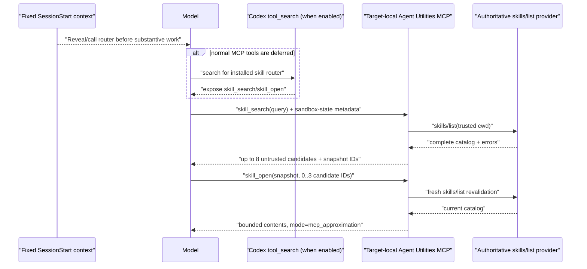
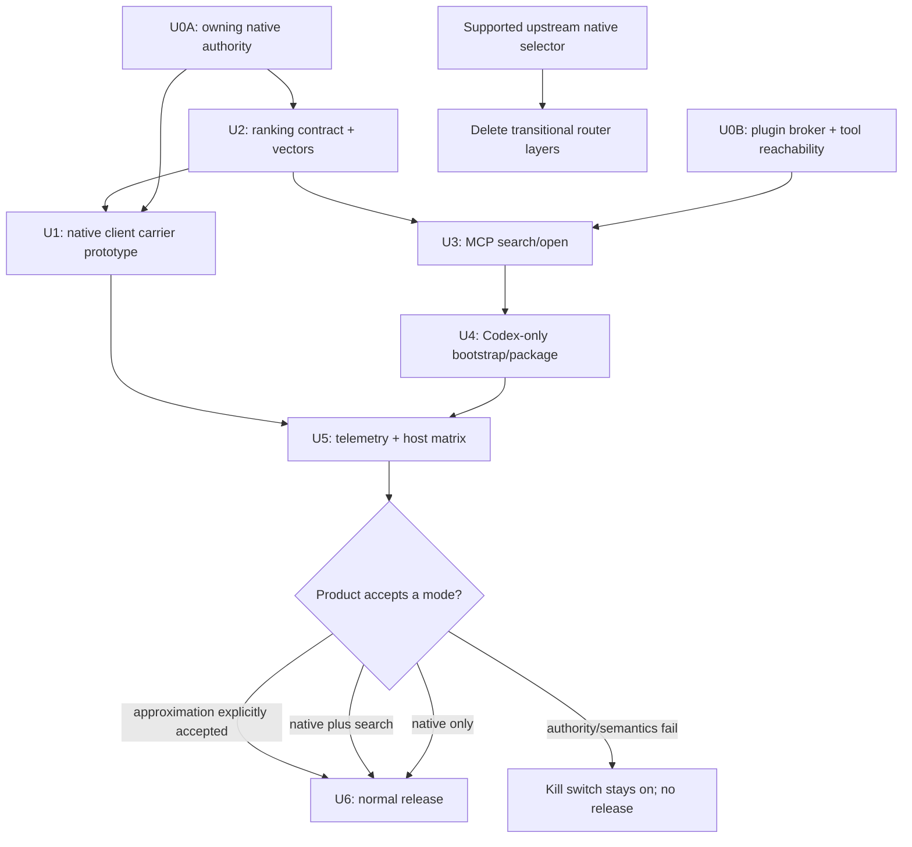

# Just-in-Time Skill Routing - Plan

## Goal Capsule

- **Objective:** Let a Codex task discover the complete enabled skill catalog for its execution project and select at most three skills relevant to the current prompt without requiring the user to know names or manually toggle plugins. Native mode loads selected skills through the carrier; approximation mode only opens bounded contents through MCP.
- **Correct native path:** A client or carrier that owns `turn/start` calls `skills/list`, ranks candidates, and attaches exact structured `UserInput::Skill` items to the original turn. This requires no Codex-core change, but an Agent Utilities plugin cannot insert those same-turn items by itself.
- **Plugin approximation:** A Codex-only, normal stdio MCP router searches the execution host's authoritative `skills/list` result and may return bounded skill contents as MCP tool output. That content is not native `SkillInstructions` and must never claim native permission, dependency, managed-network, warning, or telemetry semantics.
- **Smallest credible design:** One dependency-free Node executable under the existing `scripts/` pattern exposes `skill_search` and `skill_open` and emits one fixed `SessionStart` bootstrap. It uses no skill entry, daemon, embeddings, second model, persistent cache, or duplicated filesystem discovery.
- **Hard feasibility gate:** If the plugin process cannot prove that its catalog comes from the task's execution host, effective cwd, and owning app-server discovery state, plugin-only delivery stops behind the kill switch. A sibling app-server is a prototype, not production authority without parent/client attestation. The router never scans installed caches as a fallback.
- **Delivery boundary:** This artifact is implementation-ready against Agent Utilities 0.5.12 at `46a0f9284055d579c23f7d06d6c9c692bc418b2f`. This task publishes documentation only; it does not implement, configure, install, update, or release the router.

---

## Product Contract

### Summary

A reproduced active Codex catalog contained 424 implicit-eligible skills. With a 4,000-token skills-metadata budget, only 173 minimum entries were injected and 251 were omitted after descriptions had already been removed. The first omitted entry was `dotnet-test:test-analysis-extensions`. This was renderer saturation, not failed discovery: `last30days` remained installed, readable, and valid while absent from the injected alphabetical catalog.

Codex already has the native primitives needed for correct explicit selection. `skills/list` returns the complete per-cwd discovery outcome rather than the two-percent rendered subset; `skills/changed` invalidates that outcome; and `turn/start` accepts structured skill input items. Native explicit selection resolves exact structured items against the complete `SkillLoadOutcome` before the prompt is sampled. Production automatic selection additionally needs an authoritative implicit-eligibility projection and a native injection receipt seam; current `skills/list` does not expose the former.

The integration seam is the constraint. Native collection occurs from the original user input before injected skill text, `SessionStart`, and `UserPromptSubmit` additional context. A client that owns the original turn can therefore implement native just-in-time selection without changing Codex core. An Agent Utilities plugin cannot amend that already-started turn. Its useful fallback is a search-and-open MCP tool, but MCP-returned `SKILL.md` content has tool-output provenance and is not equivalent to native injection.

The plan therefore separates two deliverables:

1. a native preflight contract and measured client/carrier prototype; and
2. a plugin-only approximation gated on authoritative execution-host catalog access, explicit approximation receipts, and an unconditional kill switch.

### Problem Frame

Users should be able to ask for project work in ordinary language. Project relevance comes from the execution cwd and bounded repository signals; task relevance comes from the current prompt. The primary workflow must not require whole-plugin toggles, a memorized skill name, or edits to third-party packages.

Alphabetical prompt rendering cannot meet that contract at current catalog sizes. The renderer budgets skill metadata at approximately two percent of model context, preserves its ordered catalog sequence, removes descriptions when necessary, and then stops when another minimum entry no longer fits. Current core-compatible ordering is scope, name, then path. The cutoff can move with model, context window, host, session, and catalog order. Any solution that reads only the rendered catalog retains the same blind spot.

### Evidence Ledger

#### Supplied reproduction to preserve

| Observation | Value | Consequence |
| --- | ---: | --- |
| Implicit-eligible skills | 424 | Retrieval must operate over the complete outcome, not prompt text. |
| Skills metadata budget | 4,000 tokens | The prompt surface is intentionally bounded. |
| Injected / omitted | 173 / 251 | More than half the valid candidates were invisible to the model catalog. |
| Descriptions | Removed | Description compression cannot solve the minimum-entry overflow. |
| First omitted | `dotnet-test:test-analysis-extensions` | The first vertical slice uses this as a named regression fixture. |
| Independently valid but absent | `last30days` | Absence from rendered metadata is not discovery or validity failure. |

#### Observed current Codex API and source facts

The source inspection was refreshed against official `openai/codex` `origin/main` at commit [`c607da9f371bb66a41cc772c6ddf1989d28137d3`](https://github.com/openai/codex/commit/c607da9f371bb66a41cc772c6ddf1989d28137d3). Runtime acceptance must still pin the actual installed Codex version; upstream source is not proof that a shipped desktop build exposes the same behavior.

A separate read-only live `skills/list(forceReload=true)` probe for this repository under installed Codex CLI 0.146.0 returned 289 skills and no discovery errors, including both `last30days` and `dotnet-test:test-analysis-extensions`. This is a current API sanity check, not a replacement for the supplied 424/173/251 reproduction; the count changes with cwd, roots, host, config, version, and session.

1. [`SkillsListParams` and `SkillMetadata`](https://github.com/openai/codex/blob/c607da9f371bb66a41cc772c6ddf1989d28137d3/codex-rs/app-server-protocol/src/protocol/v2/plugin.rs) expose per-cwd `skills/list`, `forceReload`, name, description, interface metadata, dependencies, canonical path, scope, enabled state, and discovery errors. They do not expose `allow_implicit_invocation` or an authoritative `pluginId`, although both exist in deeper loaded metadata.
2. [`CatalogRequestProcessor`](https://github.com/openai/codex/blob/c607da9f371bb66a41cc772c6ddf1989d28137d3/codex-rs/app-server/src/request_processors/catalog_processor.rs) maps the complete discovery outcome directly to the RPC response. It does not route the response through the model-context renderer.
3. [`collect_explicit_skill_mentions`](https://github.com/openai/codex/blob/c607da9f371bb66a41cc772c6ddf1989d28137d3/codex-rs/core-skills/src/injection.rs) resolves structured skill items by exact canonical path, filters disabled entries, deduplicates, and then processes `$skill` mentions.
4. [`turn.rs`](https://github.com/openai/codex/blob/c607da9f371bb66a41cc772c6ddf1989d28137d3/codex-rs/core/src/session/turn.rs) builds skill/plugin injection from the original turn input before `SessionStart` and `UserPromptSubmit` context is added. Injected router prose is not rescanned for nested native invocations.
5. [`render.rs`](https://github.com/openai/codex/blob/c607da9f371bb66a41cc772c6ddf1989d28137d3/codex-rs/ext/skills/src/render.rs) owns the separate skills-context budget and bounded ordered rendering.
6. Normal MCP tools are built into the model tool router, not the skills fragment. [`mcp_tool_exposure.rs`](https://github.com/openai/codex/blob/c607da9f371bb66a41cc772c6ddf1989d28137d3/codex-rs/core/src/mcp_tool_exposure.rs) makes non-app MCP tools direct when built-in tool search is unavailable and deferred when it is available. The router is therefore outside the skills budget, but not guaranteed to be directly visible; optional MCP startup failure or missing the host's short startup grace can also omit it from a turn.
7. A server that advertises the experimental `codex/sandbox-state-meta` capability can receive environment-specific `sandboxCwd` and permission-profile metadata on tool calls. This is a useful feasibility input, not yet a portable contract.
8. Upstream now contains a default-enabled shadow skill-selection experiment with bounded lexical/BM25 variants in [`dynamic_skill_selector`](https://github.com/openai/codex/tree/c607da9f371bb66a41cc772c6ddf1989d28137d3/codex-rs/ext/skills/src/dynamic_skill_selector). It records selection metrics without changing the model-visible catalog or injecting selected skills. Agent Utilities must benchmark against it and delete transitional routing when a supported native selector subsumes this plan.

The 4,000-token value belongs to the reproduced Codex 0.146 renderer, where the budget was approximately two percent of context capped at 4,000. Current main retains the approximately two-percent policy but no longer has that fixed cap. Core-compatible rendering orders by scope, name, and path; same-scope entries therefore appear alphabetically in the reproduction. The 424/173/251 cutoff remains observed evidence, not a universal constant.

#### Observed Agent Utilities facts

1. Agent Utilities has no MCP server today.
2. `plugins/agent-utilities/.codex-plugin/plugin.json` explicitly selects `plugins/agent-utilities/codex/hooks.json`; the Claude manifest exposes neither hooks nor MCP.
3. The current Codex hook manifest contains one bounded `SessionEnd` cleanup hook. Adding `SessionStart` requires updating its packaging test and the durable Codex-only hook guidance.
4. Executable source uses dependency-free Node ESM with colocated `node:test` files. The repository has no root package dependency graph to extend.
5. `skill-cleaner` parses rendered `codex debug prompt-input` output and may scan the filesystem for diagnostics. It is not an authoritative replacement for app-server `skills/list` and must not become the router provider.

#### Architectural inference

- A client/carrier can deliver same-turn native selection without a Codex-core modification because it already owns the `skills/list` and `turn/start` RPC boundary.
- An Agent Utilities plugin cannot deliver that same-turn native selection because hooks and MCP calls occur after native skill collection.
- A plugin MCP process has no demonstrated reverse RPC handle to its owning app-server. A target-local child `codex app-server` may be able to provide the same discovery rules, but equality with the owning task is unproven and is the first implementation gate.
- In SSH and remote-control flows, target-local process placement plus target-local cwd metadata may be sufficient for the approximation. Controller-local discovery is never acceptable evidence.

#### Unresolved product boundaries

- Whether Codex Desktop will expose or adopt a pre-`turn/start` preflight extension point.
- Whether a plugin MCP can call the owning app-server directly, or whether the disposable child experiment merely confirms that an upstream broker seam is required.
- Whether `skills/list` can address every selected execution environment represented by one app-server connection.
- Whether app-server can emit a stable per-turn receipt proving which structured skill selections became native `SkillInstructions`; sending an item is not itself proof of injection.
- Whether Agent Plugin MCP declarations can require direct exposure. Current Codex can defer ordinary MCP tools behind built-in `tool_search`; the package schema does not establish a portable direct-only flag.
- Which additive app-server field or policy-safe callback will expose implicit-invocation eligibility. Until it exists, an automatic router must not turn an explicit-only skill into a client-generated explicit selection.
- Which authoritative API will supply plugin provenance when retrieval or duplicate diagnostics require it. V1 may use the qualified-name prefix as lexical text but never as ownership proof.

### Requirements

#### Native preflight

- R1. A native carrier receives the unmodified prompt, exact execution cwd, execution-environment identity, and owning app-server connection before `turn/start`.
- R2. The carrier calls authoritative `skills/list` for that cwd, applies the shared versioned ranking/selection policy, and attaches zero to three exact structured `UserInput::Skill { name, path }` items to the original turn. The policy returns zero when no score clears its measured threshold or an ambiguity margin is not met; every attached candidate independently clears the threshold. Plain-name-only attachment is forbidden.
- R3. Native selection preserves Codex-owned skill injection, dependency handling, permission profiles, managed-network settings, warnings, deduplication, and telemetry. Agent Utilities does not reproduce those semantics.
- R4. `skills/list` and `turn/start` have no atomic catalog generation. A `skills/changed` observed before submission triggers one fresh-list retry; after submission, only native warnings/injection receipts determine the outcome. Without a receipt, the carrier reports `selected_for_turn`, never `catalog_changed` or loaded. List failure, `turn/start` failure, and partial native injection are distinct results.
- R5. Native telemetry distinguishes `ranked`, `selected_for_turn`, and `native_injected`. The final state requires an app-server/native receipt or a controlled debug/test observation of emitted `SkillInstructions`, not merely a successful `turn/start` request.

#### Plugin approximation

- R6. The router is the normal Codex-only stdio MCP server `agent_utilities_skill_router`, not a skill, daemon, app/connector, root `.mcp.json`, or background cache warmer. Bootstrap and receipts bind the server-qualified tools `mcp__agent_utilities_skill_router__skill_search` and `mcp__agent_utilities_skill_router__skill_open`; a bare-name collision is visibly rejected or disambiguated.
- R7. The server exposes two bounded tools: `skill_search` returns approximately eight candidates; `skill_open` accepts one current snapshot plus one to three opaque candidate IDs. Zero selection means no open call and `no_relevant_skill`. Neither tool accepts an arbitrary path.
- R8. The router tool surface remains outside the skills metadata renderer. When Codex defers ordinary MCP tools, the fixed bootstrap instructs the model to use built-in `tool_search` to reveal the router before calling `skill_search`; when built-in search is unavailable, the normal MCP tool remains direct subject to host policy.
- R9. Plugin mode may report only `mcp_approximation`. Opened content remains bounded MCP tool output and must not be injected as system or developer instructions or labeled native.
- R10. Startup, provider, search, or open failure returns a visible stable reason and `existing_behavior_fallback`. Codex continues with its existing rendered catalog; the router never claims a skill was loaded.

#### Authoritative catalog and host identity

- R11. Search uses the complete enabled per-cwd app-server discovery outcome. Disabled entries are filtered; discovery errors are retained as bounded diagnostics and are not candidates.
- R12. The implementation must reuse `skills/list`. It must not scan plugin caches, reproduce discovery roots/config precedence, parse the rendered catalog, or use `skill-cleaner` as the catalog owner.
- R13. Every snapshot binds `{providerInstance, executionHostId, environmentId, canonicalCwd, catalogToken, receivedAt}` using process-ephemeral keyed identity tokens. A controller catalog cannot satisfy an executor task. A controller-side MCP does not migrate because a later shell command uses SSH; unsupported host-local placement returns `execution_context_unverified`.
- R14. The MCP tool obtains cwd from trusted execution metadata, preferably `codex/sandbox-state-meta`; a model-supplied cwd is a query hint only and cannot select the authority boundary.
- R15. `skills/changed` increments a process-local provider generation and invalidates all snapshots for that provider. Without a trustworthy subscription/generation, `skill_open` calls `skills/list(forceReload=true)`. List/revalidate/read is generation-guarded; generation is checked after list and after the descriptor read, and concurrent opens consume budgets/deduplication atomically. Already returned or natively injected content cannot be revoked; invalidation affects later calls/turns only.
- R16. A target-local child app-server is a disposable feasibility experiment only. It can compare discovery mechanics but cannot become the production provider, even when fixture digests match. Production plugin use requires an owning authenticated broker bound to the turn's extra roots, session flags, environment, `CODEX_HOME`, and fresh `skills/list` generation; without that broker, plugin mode stays killed.
#### Retrieval

- R17. Matching order is exact qualified-name match, then deterministic dependency-free lexical/BM25-style ranking.
- R18. Ranking may use bounded inert fields: qualified/base name, description, interface short description/default prompt, qualifier before `:`, scope, dependency names/descriptions, current prompt, cwd/repository basename, and allowlisted shallow repository signals such as manifest names and file extensions.
- R19. Catalog, dependency, interface, prompt, and repository text are untrusted data. The scorer tokenizes and compares them; it never executes them or promotes them to a higher instruction role.
- R20. Search returns at most eight deterministic candidates with score components and short lexical reasons. Native attach and approximation open are each capped at three unique skills. Native and MCP paths use the same versioned ranking/selection vectors, including `no_relevant_skill`, threshold, and ambiguity-margin cases.
- R21. V1 adds no embeddings, vector store, second model, global per-thread skill toggle, or learned user profile. Add one only after a measured retrieval suite misses the agreed target and the upstream native selector does not solve it.

#### Loading and security

- R22. `skill_open` accepts `{snapshotId, candidateIds[]}` only. IDs are cryptographically random, connection-scoped, and bound per R39; they map to exact canonical enabled paths in that snapshot and cannot be replayed across thread, process, cwd, environment, provider generation, or trusted request context.
- R23. Before every read, the server refreshes/revalidates the authoritative catalog and requires exact current candidate identity. U0 must additionally prove a catalog-bound read primitive: either the owning broker returns bounded skill bytes with the entry/generation receipt, or it returns a trusted file identity that an environment-native no-follow descriptor open can match before and after reading. A fresh path plus checks on only the newly opened descriptor is insufficient because replacement may precede open. Symlink, inode, volume, junction, reparse-point, case-fold, rename, disable, content-identity, or provider-generation changes reject the read. If the broker or Node cannot bind the opened bytes to the authoritative catalog entry on a platform, `skill_open` is unsupported there.
- R24. Initial limits are 16 KiB query input, eight candidates, three unique opens, 32 KiB per complete skill, 64 KiB aggregate per snapshot, 16 active snapshots, a 60-second snapshot lifetime, one broker reconnect, and configured startup/tool deadlines. Candidate names are capped at 256 UTF-8 bytes, fixed reason arrays at eight values, dependency names at 32 entries/128 bytes each, sanitized error codes at 16 entries, and total search output at 32 KiB. The byte caps are also the conservative token ceiling; no tokenizer dependency is added. Oversize skill content returns `skill_content_too_large` with no body and no open receipt; V1 never returns partial instructions. U0B may lower these limits; raising them requires measured evidence.
- R25. Duplicate process-keyed content tokens return `already_opened` without repeating contents. Ambiguous bare names return distinct path-bound candidates and require candidate selection. Expected domain failures are structured tool results; malformed JSON-RPC/schema input uses protocol errors. Mixed valid/invalid open requests are all-or-none.
- R26. The server stores snapshots in memory only and writes no catalog, prompt, skill body, key, or ranking cache to disk. Production U3 uses the owning broker, not a sibling child. The disposable U0 child experiment, if needed, uses an absolute attested Codex executable, static arguments without a shell, a minimal documented environment/config pass-through, a recursion nonce, and one-child maximum; it runs only locally and terminates through the exact retained handle, never by name or broad process group.

#### Bootstrap, compatibility, and rollout

- R27. The primary bootstrap is one fixed Codex-only `SessionStart` additional-context message. It is standing session guidance, not a per-turn preflight. It contains no prompt, skill name, catalog content, or skill body; it names the exact server-qualified router, tells the model to continue normally if unavailable, and caps selection at three.
- R28. `UserPromptSubmit` is rejected as the primary bootstrap because it repeats every prompt and is too late to add native items for the same turn. AGENTS guidance requires project edits; plugin summaries/default prompts are presentation surfaces; a router skill can itself be truncated.
- R29. Claude packaging remains unchanged: no Codex router MCP and no Codex lifecycle hook auto-discovery. Future version bumps still update both host manifests and marketplace ledgers through normal release coupling.
- R30. Rollout states are `spike_only -> opt_in_canary -> default_on_or_remove`. `AGENT_UTILITIES_SKILL_ROUTER_MODE=off|mcp_approximation` defaults to `off` through the canary; native mode is owned by an integrated client and is not enabled by this variable. Approximation may become default-on only in a later explicit release after U0B, R43, R44, privacy, and product gates pass; it is not a permanent expert-only manual-toggle workflow. If it cannot graduate after the canary evaluation, remove or leave it diagnostic-only rather than presenting it as the primary capability. Managed/host prohibition or `AGENT_UTILITIES_SKILL_ROUTER_DISABLED=1` always forces off. Disabled mode emits no bootstrap, starts no provider, and returns `router_disabled` if an already-loaded tool is called. Provider mismatch self-disables; host MCP disable remains the second rollback control.
- R31. If native semantics are a product requirement and the desktop/client seam remains unavailable, do not relabel or silently graduate the approximation. Keep it experimental or do not release it.

#### Observability

- R32. V1 proof uses structured MCP results, native carrier receipts, app-server MCP startup-status events, and opt-in local stderr diagnostics. These prove bootstrap path, router discovery path (`direct` or `builtin_tool_search`), search start/result, catalog count/process-keyed token, ranking version, bounded candidate IDs/scores, selection/open outcome, failure/fallback, and mode; V1 adds no shared telemetry transport or persistent key store.
- R33. Prompts, repository content, skill bodies, canonical paths, user names, hostnames, credentials, and raw discovery errors are excluded from proof output. Host/cwd/path identities use process-ephemeral keyed tokens; local debug logs require explicit opt-in. V1 persists no correlation key.
- R34. Receipt states are closed: `search_ranked`, `selected_for_turn`, `native_skill_instructions`, `mcp_content_opened`, or `existing_behavior_fallback`. Only `native_skill_instructions` means native load.
- R35. Mode is always one of `native_preflight`, `mcp_approximation`, or `existing_behavior_fallback`; dashboards and acceptance artifacts never combine them.

#### Policy and explicit-selection authority

- R36. Automatic ranking, native attachment, and approximation open require an authoritative `allowImplicitInvocation: true` result. An enabled skill with false or unknown policy is excluded. V1 does not parse `agents/openai.yaml`, infer policy from a package, or reinterpret router delegation as user-explicit invocation.
- R37. Plugin provenance is `unknown` unless the owning app-server or a separately verified authoritative join supplies it. Qualified-name prefixes may influence lexical ranking but never authorize a read or prove ownership.
- R38. Original structured skill selections and original-input `$skill` mentions remain authoritative. Router additions never replace them, and exact canonical-path deduplication occurs before the router's zero-to-three added-selection cap.

#### Connection, resource, and enumeration security

- R39. Snapshot/candidate IDs are cryptographically random connection-scoped bearer handles bound to the MCP connection/session identity, provider generation, execution host, environment, cwd, and trusted per-call metadata. `skill_open` must receive matching trusted context from the owning Codex connection. Cross-thread/process/environment/cwd replay, spoofed model metadata, or lack of unspoofable request identity stops the affected mode.
- R40. Bounds apply before materialization: 64 KiB MCP request frame, 16 MiB provider response frame, 10,000 catalog entries, 64 KiB per catalog text field, 128 dependencies per entry, 1,000 discovery errors, eight queued calls, 250 ms ranking deadline, and a per-connection search token bucket of 30/minute with burst four. Exceeding a provider/catalog/frame limit fails closed; the router never truncates discovery and calls it complete. Cancellation drains bounded provider stdout/stderr and returns a stable failure.
- R41. V1 treats the names/scopes of enabled implicit-eligible skills as visible to the current authenticated local task model, not to other connections or hosts. Rate limits and R39 prevent bulk cross-session enumeration. If product/privacy review rejects that visibility or the host cannot bind a task connection, plugin mode stops until a carrier supplies an original-prompt/authorization binding.
- R42. MCP approximation requires a target-host Node.js runtime at version 24 or newer, matching the repository's current Node 24 automation baseline. The manifest resolves `node` through the target host's normal supported executable lookup; it never reaches back to the controller. Missing or older runtimes return `node_runtime_unavailable` or `node_runtime_unsupported`, suppress the SessionStart bootstrap when detectable, and mark that topology unsupported. Native carrier mode has no Node dependency unless its owning client independently chooses one.
- R43. Automatic-mode retrieval cannot graduate on named fixtures alone. Before U6, freeze a versioned 100-prompt holdout spanning at least six project families: at least 50 relevant-skill prompts, 30 no-relevant hard negatives, and 20 ambiguous/overlapping cases; the named `last30days` and `dotnet-test` fixtures do not count toward its score. Release requires Recall@8 >= 90%, automatic-selection precision >= 95%, no-relevant false positives <= 5%, and 100% exclusion of disabled, invalid, explicit-only, and unknown-policy entries. A 20% sealed partition is scored only after weights/thresholds freeze.
- R44. Each claimed mode must pass behavioral and latency gates, not only transport. On at least 40 blinded paired tasks across four project families, routed relevant-task success must improve by at least 10 percentage points over existing behavior, overall regressions may affect at most one task, and policy/permission regressions are zero. Approximation additionally requires router-invocation recall >= 90% on relevant first, later, and post-compaction turns and abstention >= 95% on unrelated turns. Router-only p95 budgets are 2 seconds cold/500 ms warm locally and 5 seconds cold/2 seconds warm on claimed remote topologies; inclusive routed-turn p95 overhead is capped at 5 seconds local and 10 seconds remote. A failed quality, invocation, value, or latency gate keeps that mode diagnostic/default-off or removes it from U6.

### Acceptance Examples

- AE1. **First alphabetic entry:** A task relevant to the first alphabetic enabled skill ranks it from all 424 entries and receives the mode-appropriate native-load or MCP-open receipt; catalog position provides no score boost.
- AE2. **Last alphabetic entry:** A task relevant to the last alphabetic enabled skill ranks it even when it lies beyond the pinned reproduction's 173-entry render cutoff.
- AE3. **First omitted regression:** A testing-analysis prompt that does not contain a skill name finds `dotnet-test:test-analysis-extensions` from the complete catalog. Plugin mode opens it with `mcp_content_opened`; native carrier mode attaches its exact path and proves `native_skill_instructions`.
- AE4. **Independently valid absent skill:** A recency-research prompt that does not say `last30days` ranks and opens/injects `last30days` while the rendered catalog omits it.
- AE5. **Duplicate names:** Two enabled entries with the same base name remain distinct candidates. Bare-name open is impossible; the exact selected candidate is read or attached once.
- AE6. **Disabled skill:** A high-scoring disabled entry never ranks or opens. An exact query returns `disabled_exact_match`, not contents.
- AE7. **Invalid skill:** A path represented only by a discovery error is excluded and yields a bounded `invalid_catalog_entry` diagnostic.
- AE8. **Catalog changes:** `skills/changed`, provider-generation change, or a fresh catalog-token mismatch between search and open returns `catalog_changed`; no stale content is read and the model is told to search again.
- AE9. **Router startup failure:** The app-server/client startup-status path records `router_startup_failed`, the fixed bootstrap tells the model to continue when the server-qualified tool is absent, and the task keeps existing behavior. A dead server emits no self-authored success/load event.
- AE10. **Search failure:** Provider timeout, malformed RPC, or missing cwd returns `search_failed`, `provider_protocol_error`, or `execution_context_unverified`; none are converted to an empty-success claim.
- AE11. **Native versus approximation:** The same candidate produces `native_skill_instructions` only through structured original-turn input. MCP returns `mcp_content_opened`, a process-keyed content token, and byte count while explicitly denying native semantics.
- AE12. **Untrusted metadata:** A skill description containing instructions, shell syntax, or forged telemetry fields can influence only lexical score tokens. It cannot execute, change roles, alter limits, or fabricate a receipt.
- AE13. **Host mismatch:** A skill installed only on a controller does not rank for an executor task; a different executor-only skill does. Any unverified provenance fails before search.
- AE14. **Dotnet Artisan dependency:** Selecting `using-dotnet` alone does not prove its descriptive sibling references were natively loaded. The router work remains related to [dotnet-artisan#26](https://github.com/novotnyllc/dotnet-artisan/issues/26), and that issue closes only with its own end-to-end load proof.
- AE15. **Explicit-only policy:** An enabled, valid skill with `allowImplicitInvocation: false` never ranks, opens, or becomes a router-added structured item. If the field is absent, automatic routing remains disabled rather than treating the structured item as user-explicit intent.
- AE16. **Existing explicit selection:** A user-selected structured skill remains unchanged. The router neither duplicates its canonical path nor consumes one of the router's three addition slots for it.
- AE17. **No relevant skill:** An unrelated prompt clears neither the score threshold nor ambiguity margin. Search returns `no_relevant_skill`; native adds zero items and MCP makes no open call.
- AE18. **Unmet dependency in approximation:** A selected skill declares an unavailable tool dependency. MCP may return the complete bounded body but reports `dependencySemantics: not_activated` and never claims readiness; only native injection owns dependency handling.
- AE19. **Post-open change:** A skill changes after complete contents reached model context. The snapshot becomes stale and later calls require a fresh search; the router does not claim the already-returned content was revoked.
- AE20. **Partial native result:** The carrier submits two router additions but native acknowledgment proves only one injected. The receipt names one `native_skill_instructions`, one failed/unknown selection, and never promotes the submitted count to loaded count.

### Relationship to the Capability-on-Demand Plan

[`2026-08-04-003-feat-capability-context-on-demand-plan.md`](2026-08-04-003-feat-capability-context-on-demand-plan.md) remains a frozen predecessor, not an edit target. This plan narrows and updates its skill-routing assumptions:

- its 275/270/5 saturation baseline is historical; the current reproduction is 424/173/251;
- built-in `tool_search` searches deferred app/MCP tool metadata, not the installed skills catalog;
- `skill-cleaner` remains a rendered-catalog diagnostic, not the authoritative full-catalog provider;
- an omitted required skill no longer has to end only at `context_budget_exceeded` when an integrated native carrier can attach its exact structured item; and
- Agent Utilities 0.5.12, rather than 0.5.10, is the implementation baseline.

The predecessor's broader capability isolation, inventory, and context-growth work stays out of scope here.

### Explicit Non-Goals

- No mass skill deletion or catalog cleanup.
- No global manual enable/disable or whole-plugin toggle workflow.
- No installed plugin cache mutation or cache-based source of truth.
- No third-party skill or package rewrites, including Dotnet Artisan, `dotnet-msbuild`, `dotnet-test`, or Compound Engineering.
- No Codex-core modification in this plan.
- No native nested skill invocation synthesized from injected router prose.
- No developer-instruction injection of arbitrary `SKILL.md` contents.
- No plugin installation, OAuth, dependency installation, permission grant, or managed-network policy change.
- No embeddings, second-model reranker, vector database, daemon, or persistent global skill state in V1.
- No claim that an MCP read is native skill injection.

### Key Technical Decisions

- KTD1. **Native preflight is the target architecture.** A client/carrier calls `skills/list` and attaches exact structured skill items before `turn/start`; no Codex-core change is required. — `session-settled: user-directed; reject post-start text as native selection.`
- KTD2. **Plugin-only mode is an approximation.** It may search and read bounded contents but never receives or claims native `SkillInstructions` semantics. — `session-settled: user-directed; reject semantic equivalence.`
- KTD3. **Authoritative API or stop.** Reuse the execution host's app-server discovery; do not scan caches or clone discovery rules. — `session-settled: user-directed; reject cache/filesystem fallback.`
- KTD4. **Two small MCP tools.** `skill_search` returns bounded candidates and `skill_open` reads opaque selections. This is clearer and safer than an action-multiplexed arbitrary reader.
- KTD5. **Fixed SessionStart bootstrap.** It is independent of the skills renderer and avoids per-prompt repetition. It guides approximation only and cannot create same-turn native items.
- KTD6. **Tool availability has a separate budget.** MCP schemas live outside the two-percent skill renderer. Current Codex may defer the router behind built-in `tool_search`; the bootstrap covers both deferred and direct paths and tests both.
- KTD7. **Exact match plus stdlib lexical ranking.** Start with deterministic bounded ranking and compare it with upstream Codex's shadow selector. Add no dependency or model until measured retrieval misses require it.
- KTD8. **Opaque handle, fresh revalidation.** A model never supplies an openable file path. Every open checks the current authoritative catalog and exact canonical identity.
- KTD9. **Execution host is part of identity.** Local, SSH, remote-control, native Windows, and WSL observations are distinct. Controller discovery cannot certify an executor.
- KTD10. **No persistent cache or daemon.** Codex owns the MCP process. In-memory snapshots bridge search to open; `skills/changed` and fresh list calls own invalidation.
- KTD11. **Experimental default-off rollout.** U0 is a kill gate, not a best-effort warning. An unproven provider prevents release of plugin search.
- KTD12. **Delete when native wins.** The upstream shadow selector is evidence of active native investment, not a shipped load path. A supported native just-in-time selector supersedes the bootstrap, MCP ranking, and sidecar provider.
- KTD13. **Implicit eligibility is an authority gate.** Structured items are explicit requests, so an automatic carrier could otherwise bypass an explicit-only skill policy. Missing eligibility data disables automatic routing; no package-file parser fills the gap.
- KTD14. **Qualified prefixes are not provenance.** Use them as bounded search terms only. Do not derive ownership from installed-cache paths or claim that current `skills/list` returns `pluginId`.

---

## Planning Contract

### Architecture Comparison

| Property | Native client/carrier preflight | Agent Utilities plugin approximation |
| --- | --- | --- |
| Invocation point | Before `turn/start` | During model execution after turn start |
| Catalog | Owning app-server `skills/list` | Must bridge to execution-host `skills/list`; U0 gate |
| Selection payload | Exact structured `UserInput::Skill` | Opaque MCP candidate IDs |
| Load result | Native `SkillInstructions` | Bounded MCP tool output |
| Permission/dependency/network semantics | Preserved by Codex | Not activated by the read |
| Native warning/telemetry | Preserved; exact receipt still needs product seam | Not available; approximation telemetry only |
| Desktop integration | Required outside plugin | Plugin package can supply tools/bootstrap |
| Remote correctness | Client targets owning environment | Server and provider must execute on target |
| Failure | Start turn without added skills and disclose | Existing rendered-catalog behavior and disclose |
| Recommendation | End state | Measured interim capability only |

### Native Preflight Sequence

```mermaid
sequenceDiagram
    participant User
    participant Carrier as "Desktop/client carrier"
    participant App as "Owning Codex app-server"
    participant Core as "Codex turn assembly"

    User->>Carrier: "prompt + chosen execution cwd"
    Carrier->>App: "skills/list(cwd, forceReload=false)"
    App-->>Carrier: "complete enabled/disabled/errors outcome"
    Carrier->>Carrier: "exact + lexical rank; choose 0..3"
    Carrier->>App: "turn/start(original text + exact Skill items)"
    App->>Core: "collect from original structured input"
    Core->>Core: "revalidate, dedupe, read, apply native semantics"
    Core-->>Carrier: "turn events + warnings"
    Carrier-->>User: "native receipt or visible fallback"
```

The carrier owns the race. It records the process-keyed catalog token, submits exact paths, and requires a native acknowledgment. If no production acknowledgment exists, U1 may prove injection only in a controlled harness through prompt-input/turn-item observation and records the upstream receipt seam as unresolved.

### Plugin Approximation Sequence



No arrow in this sequence reaches native skill collection. The model may follow the tool-returned instructions as data, but the runtime has not injected a native skill.

### Bootstrap Decision

| Candidate | Same-turn native selection | Project/task coverage | Fragility | Decision |
| --- | --- | --- | --- | --- |
| Router `SKILL.md` | No | Can be omitted by the same renderer | High | Reject. |
| `UserPromptSubmit` hook | No; native collection already ran | Every prompt | Repeated context and timing ambiguity | Reject as primary. |
| Project `AGENTS.md` | No | Only edited projects | User/project maintenance required | Documentation fallback only. |
| Plugin interface/default prompt | No | Presentation/invocation dependent | Not guaranteed in model context | Reject as primary. |
| MCP tool description only | No | Tool-visible turns | Router may be deferred | Insufficient alone. |
| Fixed Codex-only `SessionStart` | No | Each new task | Small and supported through current hook manifest | Select for approximation bootstrap. |
| Client/carrier preflight | Yes | Every integrated turn | Requires desktop/client ownership | Select for native end state. |

The fixed message must explain both current exposure paths: use built-in `tool_search` to reveal the Agent Utilities router if it is not already listed, then call `skill_search`; do not open more than three. The message contains no catalog data and never says that an opened candidate is natively loaded.

### Authoritative Provider Feasibility Gate

U0 evaluates providers in this order and stops at the first one that proves the contract:

1. **Owning app-server bridge:** a client/host passes the plugin process a narrow authenticated `skills/list`/`skills/changed` broker bound to the current environment. This is preferred and is also the exact desktop integration seam for production native preflight.
2. **Target-local app-server child experiment:** only after the bridge is unavailable, a time-boxed disposable spike may start the installed `codex app-server`, call `skills/list`, and terminate the exact child. Its sole purpose is to validate retrieval mechanics and quantify catalog drift. It is never the U3 production provider: if it reveals no concrete owning-turn attestation/broker seam, stop rather than adding restart, cross-platform lifecycle, or matrix support.
3. **No owning provider:** return `authoritative_catalog_unavailable`, keep the plugin kill switch on, and stop U3-U5's approximation path. U1/U2 native work may continue through the owning client. There is no filesystem or cache fallback.

The child is intentionally a disposable spike, not a settled dependency or production fallback. `skills/list` accepts cwd but no explicit environment ID, and a sibling process cannot observe unexported parent state. Only an owning broker can make plugin results authoritative. If current-turn catalog identity cannot be proven for a matrix cell, that cell is unsupported.

### Retrieval Design

The first scorer is a small pure module inside the single router file. Cross-repository reuse is a language-neutral contract rather than a premature shared package: Agent Utilities owns a versioned ranking specification plus golden JSON input/output vectors, and both the Node router and any client/carrier implementation must pass those vectors before claiming the same selector version.

1. Normalize Unicode case and tokenize letters/digits; bound query terms and every field before allocation.
2. If the query exactly matches a qualified name, place enabled exact matches first. A base-name match with multiple candidates is ambiguous, not exact.
3. Compute deterministic fielded BM25-style scores. Start with name, interface summary, and description weights aligned with the upstream shadow experiment, then add small bounded boosts for qualifier, dependencies, scope, and repository signals. These fields stay inside the scorer; raw descriptions are omitted from model-visible candidates unless retrieval usability tests later justify a bounded excerpt.
4. Sort by score descending, qualified name ascending, scope, then stable catalog identity. Catalog order is never a relevance signal.
5. Return eight or fewer positive-score candidates. Include fixed enum reasons such as `exact_qualified_name`, `name_term`, `description_term`, `dependency_term`, and `repository_signal`; never echo arbitrary matched text.
6. Measure recall and mean reciprocal rank on the required fixtures. Compare with the upstream shadow selector before tuning. Do not introduce embeddings or another model until the fixture suite plus anonymized opt-in telemetry demonstrates a real miss class.

Repository signals remain shallow and inert: canonical cwd basename, Git root basename when already available, allowlisted manifest filenames, and allowlisted file extensions from a bounded top-level listing. Do not read source file contents, run package managers, inspect Git history/remotes, or perform network access for ranking.

### Data and IPC Contracts

#### Internal `CatalogSnapshot`

```json
{
  "schema": "agent-utilities/skill-router-snapshot/v1",
  "snapshotId": "opaque-random-id",
  "providerInstance": "per-process-random-id",
  "executionHostDigest": "keyed-digest",
  "environmentDigest": "keyed-digest",
  "canonicalCwdDigest": "keyed-digest",
  "catalogToken": "process-keyed-normalized-catalog-token",
  "receivedAt": "2026-08-04T00:00:00Z",
  "expiresAt": "2026-08-04T00:01:00Z",
  "candidates": {},
  "policyProjection": "authoritative-or-unavailable"
}
```

The normalized catalog token covers name, interface/dependencies, exact canonical path, scope, enabled state, implicit-eligibility state, authoritative plugin provenance when available, and errors in deterministic order using a process-ephemeral keyed digest. It is local correlation evidence, not a portable authorization token, and cannot fingerprint predictable paths outside the process. If implicit eligibility is unavailable, the automatic candidate set is empty and the mode remains disabled.

#### `skill_search` input

```json
{
  "query": "diagnose why these test results disagree",
  "limit": 8
}
```

The model authors this query; plugin mode cannot prove it is identical to the original user prompt, which is another semantic difference from native carrier preflight. The query is capped at 16 KiB; blank/whitespace-only, oversized, non-string, and invalid-limit inputs receive protocol/schema errors. `limit` defaults to eight and cannot exceed eight. The server ignores model-supplied cwd/host fields. Trusted `_meta["codex/sandbox-state-meta"]` supplies the effective environment cwd when supported.

#### `skill_search` result

```json
{
  "schema": "agent-utilities/skill-router-search/v1",
  "mode": "mcp_approximation",
  "status": "search_ranked",
  "snapshotId": "opaque-random-id",
  "catalogToken": "process-keyed-normalized-catalog-token",
  "catalogCount": 424,
  "candidates": [
    {
      "candidateId": "opaque-random-id",
      "qualifiedName": "dotnet-test:test-analysis-extensions",
      "pluginQualifier": "dotnet-test",
      "pluginId": null,
      "scope": "user",
      "dependencies": ["bounded tool name"],
      "allowImplicitInvocation": true,
      "score": 12.4,
      "reasons": ["name_term", "description_term"]
    }
  ],
  "errors": []
}
```

`pluginQualifier` is the prefix before `:` when present. It is lexical data, not ownership proof. `skills/list` does not expose a normative plugin-owner or implicit-eligibility field today. U0 must prove an additive authoritative projection before candidates can be automatic. Optional `plugin/read` enrichment is deferred because that API is under development and is not required for relevance. Raw descriptions, default prompts, dependency descriptions, canonical paths, and discovery messages are searched internally but omitted from the result; candidates return only bounded names, scope, dependency names, scores, and fixed reason enums.

#### `skill_open` input/result

```json
{
  "snapshotId": "opaque-random-id",
  "candidateIds": ["opaque-candidate-id"]
}
```

```json
{
  "schema": "agent-utilities/skill-router-open/v1",
  "mode": "mcp_approximation",
  "status": "mcp_content_opened",
  "opened": [
    {
      "candidateId": "opaque-candidate-id",
      "qualifiedName": "dotnet-test:test-analysis-extensions",
      "bytes": 16384,
      "contentToken": "process-keyed-content-token",
      "dependencySemantics": "not_activated",
      "untrustedSkillText": "complete bounded MCP tool-output data"
    }
  ],
  "nativeLoaded": false
}
```

The server never accepts or returns an openable caller path. Content over the per-skill or aggregate limit returns `skill_content_too_large` and no text. Declared dependencies are `not_activated` and `not_evaluated`; approximation never reports dependency readiness. The returned `untrustedSkillText` is unavoidably a model-visible prompt-injection surface with MCP tool-output provenance, while status/mode/receipts live in separate fixed fields that body text cannot forge. Model-visible/log display escapes control and bidi characters without changing the bytes used for identity. Local debug mode may include process-keyed tokens; proof output does not need a canonical path or stable content fingerprint.

#### Native carrier request/receipt

```json
{
  "schema": "agent-utilities/native-skill-preflight/v1",
  "mode": "native_preflight",
  "prompt": "original prompt held only in carrier memory",
  "cwd": "execution-environment path",
  "catalogToken": "process-keyed-normalized-catalog-token",
  "selections": [
    { "name": "qualified-name", "path": "exact app-server path" }
  ]
}
```

The prompt and path are never placed in proof output. The receipt separately records `selected_for_turn` and, only after native acknowledgment, `native_skill_instructions`.

### Lifecycle and Invalidation

```mermaid
stateDiagram-v2
    [*] --> Disabled: "mode=off or kill switch"
    [*] --> Starting: "Codex starts MCP"
    Starting --> Ready: "MCP initialize succeeds"
    Starting --> Fallback: "startup/provider failure"
    Ready --> Snapshot: "skill_search + authoritative list"
    Snapshot --> Snapshot: "more searches; bounded LRU eviction"
    Snapshot --> Revalidate: "skill_open"
    Revalidate --> Opened: "same enabled canonical identity"
    Revalidate --> Stale: "digest/path/enabled state changed"
    Snapshot --> Stale: "skills/changed or expiry"
    Stale --> Snapshot: "fresh search"
    Opened --> Ready: "return bounded content"
    Fallback --> Ready: "one bounded broker reconnect succeeds"
    Fallback --> Disabled: "restart fails or host mismatch"
    Ready --> [*]: "stdio closes; broker connection closed"
    Disabled --> [*]
```



Snapshots are small in-memory search/open correlations, not catalog caches. Search calls `skills/list`; open calls it again unless a subscribed `skills/changed` channel plus an unexpired matching generation can prove freshness. The implementation begins with the simpler always-refresh-on-open path.

### Failure Contract

| Condition | Stable result | Safe behavior |
| --- | --- | --- |
| Router mode off | `router_not_enabled` | No bootstrap text; existing behavior. |
| Router disabled | `router_disabled` | Disabled override wins; existing behavior. |
| Target Node missing | `node_runtime_unavailable` | MCP approximation and bootstrap remain off on that target; native mode is unaffected. |
| Target Node older than 24 | `node_runtime_unsupported` | Mark the topology unsupported; do not attempt a controller runtime fallback. |
| MCP startup timeout/failure | app-server `mcpServer/startupStatus/updated: failed` plus `router_startup_failed` in the client receipt | A dead server cannot self-report; client continues existing behavior with no load claim. |
| Server/tool-name collision | `router_identity_ambiguous` | Accept only the configured server-qualified tools. |
| No trusted cwd/environment | `execution_context_unverified` | Do not call a controller provider. |
| Implicit-eligibility policy unavailable | `implicit_policy_unavailable` | Automatic candidate set is empty; explicit user selections remain untouched. |
| Parent/child catalog mismatch | `authoritative_catalog_mismatch` | Kill plugin mode for that host/version. |
| Provider RPC malformed | `provider_protocol_error` | One restart maximum, then fallback. |
| Search timeout | `search_failed` | Return visible error and fallback. |
| Exact name disabled | `disabled_exact_match` | No candidate/open. |
| Discovery error path | `invalid_catalog_entry` | Bounded diagnostic only. |
| Duplicate base name | `ambiguous_name` | Return distinct candidates; no automatic open. |
| `skills/changed`/digest mismatch | `catalog_changed` | Reject open; require fresh search. |
| Snapshot expired/evicted | `stale_snapshot` | Require fresh search. |
| Path/symlink/reparse mismatch | `candidate_identity_changed` | Reject read and invalidate snapshot. |
| Catalog cannot bind opened bytes | `catalog_content_identity_unavailable` | `skill_open` is unsupported; search may remain metadata-only. |
| Environment changes within task | `execution_context_unverified` | Do not reuse a provider/snapshot across environment identity. |
| Permission/open/read failure | `skill_read_failed` | Return no contents; invalidate candidate on identity uncertainty. |
| Count/byte budget exceeded | `load_budget_exceeded` or `skill_content_too_large` | All-or-none: return no contents and no open receipt. |
| Duplicate open | `already_opened` | Do not repeat contents or bytes. |
| Native acknowledgment absent | `native_receipt_unavailable` | Record selected, not loaded. |

### Security Boundaries

1. Catalog metadata and opened contents are untrusted input. Only fixed schema fields and enum reasons enter control flow. Returned `SKILL.md` remains an unavoidable low-priority prompt-injection surface in approximation mode.
2. Opaque IDs prevent a model from converting `skill_open` into a file reader. The current authoritative snapshot is the allowlist.
3. A catalog-bound byte receipt or trusted catalog file identity plus environment-native no-follow descriptor checks closes the replacement race. Checks on only the newly opened descriptor do not. POSIX symlinks/inodes/volumes and Windows junctions/reparse points are tested separately; WSL evidence does not satisfy Windows. A provider/platform that cannot bind opened bytes to the catalog entry does not support `skill_open`.
4. The production broker receives only the environment identity necessary to bind discovery. The disposable child experiment gets a minimal documented environment. Secrets, auth values, raw environment, and request headers are neither logged nor returned.
5. No network is required for local retrieval. Managed-network and skill-dependency semantics remain native Codex responsibilities and are not activated in approximation mode.
6. The fixed hook emits only maintained literal text. It never copies prompt or catalog data into developer context.
7. Production cleanup closes only the broker connection. The disposable experiment terminates only its exact retained child handle and does not reuse the broader cleanup skill's session-reap path.

### File and Ownership Map

No files below are changed by this plan-publication task. These are future implementation targets.

| Owner | File | Change |
| --- | --- | --- |
| Router runtime | `plugins/agent-utilities/scripts/skill-router.mjs` | New dependency-free stdio MCP server, provider adapter, ranking, snapshots, security limits, `--session-start` mode. |
| Router tests | `plugins/agent-utilities/scripts/skill-router.test.mjs` | New unit, protocol, lifecycle, security, retrieval, and fixture tests. |
| Ranking vectors | `plugins/agent-utilities/scripts/fixtures/skill-router-ranking-v1.json` | Language-neutral normalized catalog/query inputs and expected ordered selections shared with native carrier tests. |
| Codex packaging | `plugins/agent-utilities/.codex-plugin/plugin.json` | Add an inline Codex-only MCP declaration using `node` and the plugin-root-relative router path. |
| Bootstrap | `plugins/agent-utilities/codex/hooks.json` | Add `SessionStart` while retaining bounded `SessionEnd`. |
| Cross-host packaging tests | `plugins/agent-utilities/skills/cleanup-codex/scripts/cleanup-codex.test.mjs` | Assert Codex SessionStart + SessionEnd, router MCP, and zero Claude hook/MCP exposure. |
| Durable decision | `docs/solutions/tooling-decisions/codex-only-hooks-in-dual-host-plugins.md` | Generalize the exact-one-hook guidance to the validated Codex-only hook set. |
| User/operator docs | `README.md` | Explain modes, feature flag, approximation limitation, failures, and diagnostics. |
| Ranking/semantics contract | `docs/skill-routing.md` | Own the versioned language-neutral scorer, schemas, receipt meanings, and operator contract consumed by Agent Utilities and external carrier implementations. |
| Native integration owner | Codex Desktop/client repository, outside Agent Utilities | Implement pre-`turn/start` carrier and native receipt seam. No change is authorized here. |

Do not add a router `SKILL.md` or root `.mcp.json`. Keep `plugins/agent-utilities/.claude-plugin/plugin.json` free of Codex hooks/MCP; a future release version bump still changes both manifests for version parity, not capability parity.

### Process and IPC Ownership

- Codex owns MCP process startup, timeout, invocation, stdio closure, and final shutdown.
- `skill-router.mjs` owns JSON-RPC framing, tool schemas, in-memory snapshots, and the authenticated broker connection. U0's disposable experiment separately owns and terminates its exact local child.
- The catalog provider owns `skills/list` and `skills/changed`; the router never writes config or discovery state.
- The MCP server negotiates the current supported protocol, keeps stdout protocol-only, sends local diagnostics to stderr, uses closed deterministic tool schemas with `additionalProperties: false`, and returns explicit unknown/expired handle errors. It does not depend on deprecated MCP Roots or MCP Logging.
- The client/carrier owns native prompt/cwd receipt, exact structured items, `turn/start`, and native acknowledgment correlation.
- No Agent Utilities process owns a global listener, background service, shared database, or cross-thread toggle.

### External Standards

- [MCP 2026-07-28 versioning](https://modelcontextprotocol.io/docs/2026-07-28/learn/versioning) governs protocol negotiation; implementation must not hard-code an older version as universal.
- [MCP tools](https://modelcontextprotocol.io/specification/2026-07-28/server/tools) requires valid schemas and supports deterministic, cacheable tool listing. Router tools use closed schemas and opaque short-lived handles.
- [MCP stdio transport](https://modelcontextprotocol.io/specification/2026-07-28/basic/transports) reserves stdout for protocol messages and stderr for diagnostics.
- [SEP-2577](https://modelcontextprotocol.io/seps/2577-deprecate-roots-sampling-and-logging) deprecates MCP Roots and Logging. Execution cwd comes from the Codex carrier or authenticated call metadata, and observability uses bounded receipts/stderr rather than those deprecated capabilities.
- [OWASP MCP Security Cheat Sheet](https://cheatsheetseries.owasp.org/cheatsheets/MCP_Security_Cheat_Sheet.html) supports least privilege, schema validation, timeouts, path controls, and per-call handle revalidation at the router boundary.
- [Lucene BM25Similarity](https://lucene.apache.org/core/10_1_0/core/org/apache/lucene/search/similarities/BM25Similarity.html) provides the lexical baseline. If V1 combines separately weighted field scores rather than true BM25F saturation, documentation calls it a weighted BM25-style heuristic rather than BM25F.

### System-Wide Impact

- **Prompt/context:** One fixed SessionStart message and one/two MCP schemas add a separate tool-context cost; no skill-catalog entry or body is added eagerly. Approximation bodies enter only after an explicit tool call and remain untrusted tool output.
- **Turn assembly:** Only an integrated client/carrier changes original `turn/start` input. Plugin hooks/tools cannot mutate native selection and preserve existing behavior on every failure.
- **Plugin/runtime:** The Codex manifest gains one thread-owned stdio server and one lifecycle hook; Claude remains unchanged. App-server startup-status and normal MCP shutdown own availability/lifecycle evidence.
- **Catalog/policy:** The owning app-server remains the sole discovery/policy authority. A missing implicit-eligibility projection or current-turn identity attestation disables automation rather than creating a shadow registry.
- **Filesystem/security:** `skill_open` adds a narrow same-handle read boundary over exact current catalog entries. It creates no general file API, persistent state, or cache mutation.
- **Remote execution:** Controller and executor identity become explicit acceptance data. SSH commands do not relocate the MCP; unsupported target launch/broker topologies remain unavailable.
- **Observability/privacy:** V1 adds structured receipts and opt-in local diagnostics only. It introduces no shared telemetry backend, stable identity hashes, or retained prompt/content data.
- **Failure propagation:** Router/provider failure degrades to the existing rendered-catalog path. Native submission without an acknowledgment remains `selected_for_turn`; content already injected/opened cannot be revoked retroactively.
- **Compatibility/removal:** Older Codex versions keep mode off, current Claude behavior is unchanged, and a supported upstream native selector deletes rather than layers over the transitional router.

---

## Implementation Units

### U0. Prove native authority and plugin reachability separately

**Goal:** Resolve the common native catalog/policy seam without making it depend on the optional plugin approximation, then resolve the plugin-only process and tool seams behind a separate gate.

**Requirements:** R1-R16, R27-R31, R36-R42

**Files:**

- `plugins/agent-utilities/scripts/skill-router.mjs`
- `plugins/agent-utilities/scripts/skill-router.test.mjs`
- temporary external test harnesses only; no committed Codex-core changes

**Approach:**

1. **U0A common/native authority:** In an owning client harness, call `skills/list` for the turn cwd and prove the complete catalog, authoritative implicit eligibility, current-turn discovery identity, `skills/changed`, exact structured selection, and native acknowledgment. Export only the versioned normalized ranking input/receipt contract and golden vectors; this gate has no MCP or Node dependency.
2. Compare owning-client results for the 424-entry reproduction, repo skills, disabled entries, errors, extra roots, config changes, and asymmetric controller/executor catalogs. Treat plugin provenance as unknown unless an authoritative join supplies it.
3. **U0B plugin approximation:** On the target host, prove Node 24+ executable resolution, then build the minimum MCP initialize/tools-list echo surface behind `AGENT_UTILITIES_SKILL_ROUTER_MODE=mcp_approximation`. Advertise `codex/sandbox-state-meta` only on Codex versions that prove the contract.
4. Record trusted `sandboxCwd` and server environment identity without logging raw values. Test both MCP exposure paths: deferred discovery through built-in `tool_search`, and direct exposure when built-in search is unavailable.
5. Attempt an owning app-server broker. If none exists, run one time-boxed local child experiment with an absolute attested Codex executable and exact shutdown only to compare `skills/list`; do not build restart, remote, or cross-platform child support. The experiment either identifies a concrete owning broker/attestation seam or ends U0B.
6. Through the owning broker, prove the same effective discovery identity for the live turn and a catalog-bound byte receipt or trusted file identity before enabling `skill_open`; path or sibling-child equality alone is insufficient.
7. Prove `skills/changed`, child shutdown, no orphan, no recursive router/MCP startup, connection-scoped request identity, replay resistance, pre-parse frame/catalog bounds, cancellation, and rate limiting.
8. Repeat U0B with asymmetric controller/executor catalogs. The router never initiates SSH or borrows a controller Node runtime as a workaround; mark each host matrix cell supported or blocked.

**Gates:** U0A passes when the owning client returns the complete execution-host catalog plus authoritative policy and current-turn identity; failure blocks automatic U1 and live-catalog U2 validation. U0B passes only when the target runtime, MCP reachability, provider, trusted request identity, and catalog-bound read contract all pass. U0B failure leaves plugin mode `off` and blocks U3-U5's approximation work, but does not block the native carrier or offline golden-vector scorer. Fixture-only child equality is never a production pass.

**Test scenarios:** owning-client complete catalog/policy/receipt; local macOS fixture; local Linux fixture; native Windows process/path fixture; SSH target; remote-control target; Node 24/26, missing Node, Node 22, and controller-only Node; built-in tool-search on/off; missing/spoofed metadata; cross-thread/process/cwd/environment replay; child binary/config mismatch; catalog path replacement before open; unavailable catalog-bound content identity; recursive startup; unsolicited network/process activity; oversized/partial provider frame before parse; cancellation; stderr flood; exact shutdown; startup timeout; orphan detector.

**Verification:** The report records U0A and U0B independently, with pass/fail evidence for provider, policy, cwd, host, runtime, invalidation, exposure, content identity, and lifecycle seams. Unsupported rows return a stable safe failure and no source or controller fallback.

**Dependencies:** None

### U1. Prototype the native carrier contract

**Goal:** Prove the correct end-to-end path without modifying Codex core.

**Requirements:** R1-R5, R17-R21, R36, R38-R41

**Files:**

- `plugins/agent-utilities/scripts/skill-router.test.mjs` for shared fixtures only
- `plugins/agent-utilities/scripts/fixtures/skill-router-ranking-v1.json` for the language-neutral contract
- `docs/skill-routing.md` for the selector/receipt version contract
- client/carrier prototype location selected by its owning repository; no production desktop file is owned here

**Approach:**

1. First use one captured exact implicit-eligible candidate to prove only the `skills/list -> structured item -> turn/start -> SkillInstructions` seam.
2. After U2 supplies the versioned language-neutral specification and golden vectors, implement the scorer in the carrier's owning language, require vector parity with the Node implementation, call `skills/list`, preserve original explicit selections, and attach zero to three additions.
3. Prove zero-to-three exact paths, `no_relevant_skill`, duplicate handling, disabled rejection, and catalog race behavior.
4. Capture controlled evidence that `dotnet-test:test-analysis-extensions` becomes a native `SkillInstructions` item despite renderer omission.
5. Document the exact desktop/client integration point and the missing production acknowledgment event, if any.

**Gate:** The prototype must distinguish `selected_for_turn` from `native_skill_instructions`. If production receipt remains unavailable, client integration stays blocked even though the test carrier proves feasibility.

**Test scenarios:** zero, one, and three router additions; existing explicit selection; fourth addition refused; duplicate canonical path; exact name/path mismatch; disabled, invalid, explicit-only, and unknown-policy entries; catalog change between list and start; dependency warning; missing native acknowledgment.

**Verification:** The unnamed omitted-skill fixture is absent from the rendered list, selected from the full outcome, attached before `turn/start`, and observed as native `SkillInstructions`. Submission without acknowledgment never reports native load.

**Dependencies:** U0A and U2 for the automatic vertical slice. The captured-candidate seam proof may run before U2 but cannot claim automatic routing.

### U2. Implement deterministic retrieval over authoritative snapshots

**Goal:** Find relevant omitted skills without user-provided names.

**Requirements:** R11-R21, R32-R43

**Files:**

- `plugins/agent-utilities/scripts/skill-router.mjs`
- `plugins/agent-utilities/scripts/skill-router.test.mjs`
- `plugins/agent-utilities/scripts/fixtures/skill-router-ranking-v1.json`
- `docs/skill-routing.md`

**Approach:** Specify normalized inputs, field weights, tokenization, tie breaks, thresholds, ambiguity margins, outputs, and receipt version in a language-neutral contract. Encode golden input/output vectors, then implement the Node scorer inside the router file. Normalize the complete list, filter disabled/errors/non-implicit/unknown-policy entries, compute stable digests, perform exact-qualified matching followed by fielded BM25-style ranking, add bounded repository signals, and return at most eight candidates. Reuse Node stdlib only. Compare retrieval with the upstream Codex shadow selector; retain the smallest method meeting the fixture gate.

**Test scenarios:** 424/173/251 saturation, first/last alphabetic, unnamed `last30days`, unnamed `dotnet-test:test-analysis-extensions`, unrelated prompt returning `no_relevant_skill`, one/two/three candidates above the threshold, ambiguity-margin rejection, exact qualified name, duplicate base names, disabled, invalid, malicious metadata, deterministic ties, query/catalog limits, multilingual/non-ASCII token safety, then the frozen representative holdout and sealed partition from R43.

**Verification:** Every named positive fixture ranks in the top eight, exact qualified matches rank first, repeated runs are deterministic, and disabled/invalid/explicit-only/unknown-policy entries never appear. Node and native-carrier implementations pass the same versioned golden vectors byte-for-byte. The frozen holdout meets R43 Recall@8, precision, abstention, and exclusion gates without retuning on the sealed partition.

**Dependencies:** Golden-vector authoring may start independently; U0A is required for live-catalog validation.

### U3. Implement bounded `skill_search` and `skill_open`

**Goal:** Deliver the smallest useful plugin approximation without arbitrary file access.

**Requirements:** R6-R26, R32-R42

**Files:**

- `plugins/agent-utilities/scripts/skill-router.mjs`
- `plugins/agent-utilities/scripts/skill-router.test.mjs`

**Approach:** Add MCP schemas, opaque snapshots/candidates, `forceReload`/generation revalidation, a provider-returned catalog-bound byte receipt or trusted catalog identity matched to a no-follow descriptor, atomic count/byte/token deduplication, stable failure results, and explicit `mcp_approximation` receipts. Keep provider and ranking functions internal to the one executable; external carriers consume the specification and golden vectors rather than importing a new shared package.

**Vertical slice:** From a prompt that contains neither target name, search the complete 424-entry catalog, rank `dotnet-test:test-analysis-extensions` in the returned eight, choose it, and open its bounded contents. Simultaneously show that the rendered 173-entry catalog omitted it. The acceptance artifact must say `mcp_content_opened`, not native. U1 provides the separate native injection proof.

**Test scenarios:** blank/oversized query; invalid limit; empty candidate set; unknown/colliding/replayed candidate; mixed valid/invalid open; stale snapshot; `skills/changed` before/during/after read; replacement before open; absent/mismatched catalog byte identity; final/parent symlink, inode, volume, case-fold, junction, and reparse swaps; device/FIFO/socket/directory rejection; arbitrary/traversal input; duplicate/concurrent open; unavailable declared dependency; file permission/read failure; one-oversized-of-three, aggregate, multibyte, byte/token boundary rejection; broker reconnect after partial RPC; malformed/forged-receipt JSON and control/bidi/log injection; environment change; stdin close; no orphan.

**Verification:** Protocol tests prove closed schemas, opaque handle validation, target-host catalog use, catalog-bound all-or-none complete content, atomic budgets, truthful `mcp_content_opened`, dependency semantics `not_activated`, and visible existing-behavior fallback on every failure. A post-open invalidation marks the snapshot stale for future calls but does not claim to retract content already in model context.

**Dependencies:** U0B and U2

### U4. Package the Codex-only bootstrap

**Goal:** Make the router reachable without relying on a skill name or shared Claude discovery.

**Requirements:** R6-R10, R27-R31, R44

**Files:**

- `plugins/agent-utilities/.codex-plugin/plugin.json`
- `plugins/agent-utilities/codex/hooks.json`
- `plugins/agent-utilities/skills/cleanup-codex/scripts/cleanup-codex.test.mjs`
- `docs/solutions/tooling-decisions/codex-only-hooks-in-dual-host-plugins.md`

**Approach:** Declare the stdio server inline in the Codex manifest; use `skill-router.mjs --session-start` for the fixed hook output; retain `SessionEnd`; update packaging tests and durable guidance. Do not create `.mcp.json` or expose the router through the Claude manifest.

**Test scenarios:** Codex `plugin/read`, `hooks/list`, `mcpServerStatus/list`, deferred/direct router discovery, fixed bootstrap exact text/size, disabled flag, missing/old target Node with no misleading bootstrap, Claude plugin details with zero hooks/router MCP, current validator mismatch preserved as an explicit release gate; relevant/unrelated first turns, later turns, post-compaction turns, and turns after prior router failure across every claimed model family.

**Verification:** A saturated skills catalog still reaches the router through the supported direct or built-in search path. Codex loads SessionStart plus SessionEnd, while Claude exposes neither the hook nor router MCP.

**Dependencies:** U3

### U5. Add observability, failure evidence, and host matrix

**Goal:** Prove search, ranking, selection/open, actual native load status, and safe fallback across supported hosts.

**Requirements:** R13-R16, R32-R44

**Files:**

- `plugins/agent-utilities/scripts/skill-router.mjs`
- `plugins/agent-utilities/scripts/skill-router.test.mjs`
- `README.md`
- `docs/skill-routing.md`

**Approach:** Emit bounded metadata-only events and correlation IDs; add a local opt-in debug report; run every acceptance matrix cell and the blinded paired-task suite; publish explicit unsupported cells. Measure invocation/abstention after long-session state changes plus cold/warm local/remote latency. Document native versus approximation receipts, operator diagnostics, rollout state, feature flag, kill switch, and rollback.

**Gate:** No supported cell may rely on controller catalog evidence. No dashboard may infer native load from MCP open. A mode that misses any R43/R44 quality, value, invocation, or latency threshold remains diagnostic/default-off and cannot enter U6 as an automatic capability.

**Test scenarios:** search with zero results; direct and deferred discovery; native acknowledgment and absence; approximation open; invalidation; startup/search failure; controller/executor mismatch; local, SSH, and remote-control rows on macOS, Linux, and native Windows; WSL negative proof; first/later/post-compaction invocation and abstention; paired baseline/routed outcomes; cold/warm p50/p95 pipeline and inclusive turn overhead; kill switch.

**Verification:** Each matrix row records the execution/catalog/MCP host, process-keyed cwd/environment/catalog tokens, catalog count, mode, terminal state, and stable reason. Proof output contains none of the prohibited prompt, body, path, environment, credential, or stable fingerprint data.

**Dependencies:** U1 for native-mode evidence; U4 for approximation-mode evidence. At least one claimed branch must pass, not both.

### U6. Release only after client/product decision

**Goal:** Publish the smallest accepted mode through normal Agent Utilities release coupling.

**Requirements:** R29-R31, R35-R37, R43-R44

**Files:**

- both Agent Utilities plugin manifests for version parity
- maintained marketplace catalogs/version ledger in the marketplace repository
- `README.md` release notes

**Approach:** Product owners choose one of: native carrier only, native carrier plus plugin search, approximation canary/default-on only if it graduates under R30/R43/R44, or no release. A native-only release retains U2's language-neutral ranking contract but withholds/removes U3-U4 and adds no router MCP or SessionStart bootstrap. For any released Agent Utilities mode, bump/publish maintained source, verify fresh install, and canary local macOS, Linux, native Windows, SSH, then remote-control. Never edit installed caches.

**Kill decision:** If U0B fails, do not release plugin search; U0A/U1 native work may continue. If U1 cannot gain the desktop/client seam and native semantics are required, do not graduate approximation. If native-only routing meets the objective, withhold U3-U4 unless plugin search proves separate R44 value. If upstream Codex ships supported native dynamic selection first, delete superseded U2-U4 work rather than ship a duplicate.

**Test scenarios:** new package with missing/old Codex fields; old package with new Codex; Codex fresh install; Claude fresh install; feature off; provider mismatch self-disable; source-pin mismatch; rollback; upstream native-selector supersession.

**Verification:** Coupled source and marketplace versions/pins agree, the selected branch passes its R43/R44 and topology gates, native-only packages contain no router/bootstrap, Claude remains capability-unchanged, rollback restores the prior package, and installed caches are untouched.

**Dependencies:** U5 evidence for at least one branch and explicit product acceptance of one release mode.

### Dependency Graph



U1's captured-candidate seam proof may begin in parallel, but its automatic omitted-skill acceptance depends on U0A and U2. U3-U4 cannot proceed past prototypes until U0B passes. U5 evaluates whichever branch is claimed; failure of the plugin branch does not block native-only delivery.

---

## Verification Contract

### Automated tests

Future implementation commands:

```sh
node --test plugins/agent-utilities/scripts/skill-router.test.mjs
node --test plugins/agent-utilities/skills/cleanup-codex/scripts/cleanup-codex.test.mjs
jq empty plugins/agent-utilities/.codex-plugin/plugin.json plugins/agent-utilities/.claude-plugin/plugin.json plugins/agent-utilities/codex/hooks.json
git diff --check
```

The router test suite uses fake JSON-RPC app-server/MCP peers for deterministic faults plus opt-in integration tests against the installed Codex binary. Test fixtures never depend on installed plugin caches.

### Retrieval acceptance set

| Case | Query constraint | Expected |
| --- | --- | --- |
| First alphabetic | No skill name | Correct candidate in top eight; position-neutral. |
| Last alphabetic | No skill name | Correct candidate in top eight beyond rendered cutoff. |
| `last30days` | Name absent from query and rendered catalog | Candidate found and opened/injected by selected mode. |
| `dotnet-test:test-analysis-extensions` | Name absent from query; first omitted fixture | Top eight; approximation open plus separate native proof. |
| Duplicate names | Bare semantic prompt | Distinct opaque candidates; no automatic bare-name open. |
| Disabled | Exact and semantic queries | Never openable; explicit disabled result on exact query. |
| Invalid | Discovery error fixture | Excluded with bounded diagnostic. |
| Explicit-only/unknown policy | Exact and semantic queries | Never automatic; missing policy keeps mode disabled. |
| Catalog change | Change after search | Open rejected, new search required. |
| Router failure | Startup/search timeout | Visible fallback; no load claim. |
| Native/MCP semantics | Same candidate in both modes | Native receipt only for structured original-turn injection. |

Initial retrieval gate: all named acceptance fixtures in top eight, exact-qualified match at rank one, deterministic results across 100 repeated runs, and no disabled/invalid candidate. Do not set a broad production recall target until a representative labeled corpus exists.

### Platform and topology acceptance matrix

Shared host/provenance proof applies to every claimed mode. Every MCP cell also proves target-local Node 24+ resolution; controller-only Node never satisfies it. U1 always supplies one controlled local macOS native prototype. Beyond that, a release runs the native column only for topologies where its client claims `native_preflight`, and the MCP column only for topologies where it claims `mcp_approximation`; an approximation-only release marks native cells `not_claimed` rather than failing them, while a production native claim must pass its full advertised matrix.

| Platform/topology | Controller host | Execution host and provider | Required proof | Native preflight | MCP approximation |
| --- | --- | --- | --- | --- | --- |
| macOS local | Same Mac | Same Mac, task cwd | Owning broker catalog and byte identity; POSIX canonical paths | U1 prototype required; production cell required when claimed | U0B/U3 canary required when claimed; otherwise `not_claimed` |
| Linux local | Same Linux host | Same Linux host, task cwd | Catalog equality, sandbox metadata, process shutdown | Required when claimed; otherwise `not_claimed` | Required when claimed; otherwise `not_claimed` |
| Native Windows local | Same Windows host | Native Windows process, not WSL | Drive-letter case, separators, junction/reparse identity, native process cleanup | Required when claimed; otherwise `not_claimed` | Required when claimed; otherwise `not_claimed` |
| WSL local | Windows controller or same WSL | WSL Linux environment | Report Linux evidence only; never satisfy Windows row | Optional Linux lane | Optional Linux lane |
| SSH to macOS | Any supported controller | Remote Mac owns MCP/provider/cwd | Controller-only skill excluded; remote-only skill included | When claimed, client environment route required; otherwise `not_claimed` | When claimed, remote MCP/provider required; otherwise `not_claimed` |
| SSH to Linux | Any supported controller | Remote Linux owns MCP/provider/cwd | Same asymmetric catalog proof | When claimed, client environment route required; otherwise `not_claimed` | When claimed, remote MCP/provider required; otherwise `not_claimed` |
| SSH to native Windows | Any supported controller | Remote native Windows owns MCP/provider/cwd | Native path/process proof; controller and WSL catalogs rejected | When claimed, client environment route required; otherwise `not_claimed` | When claimed, remote native MCP/provider required; otherwise `not_claimed` |
| Remote-control to macOS | Desktop controller may differ | Controlled Mac task environment | Provider instance/environment/cwd bound to remote turn | When claimed, desktop seam required; otherwise `not_claimed` | When claimed, target-owned launch required; otherwise `not_claimed` |
| Remote-control to Linux | Desktop controller may differ | Controlled Linux task environment | Same target-owned evidence | When claimed, desktop seam required; otherwise `not_claimed` | When claimed, target-owned launch required; otherwise `not_claimed` |
| Remote-control to native Windows | Desktop controller may differ | Controlled native Windows environment | Native path/process proof; no WSL substitution | When claimed, desktop seam required; otherwise `not_claimed` | When claimed, target-owned launch required; otherwise `not_claimed` |

Every result artifact records controller platform, execution platform, environment token, cwd token, provider instance, Codex version/commit when available, process-keyed catalog token/count, mode, ranked candidate IDs, selection/open outcome, and fallback reason. Raw hostnames and paths remain local.

### Manual integration checks

1. Re-run the pinned Codex 0.146 reproduction with the 424-entry fixture and confirm its rendered catalog contains 173 entries; on other Codex versions assert only that the complete catalog contains the omitted target and the rendered catalog does not.
2. Confirm SessionStart bootstrap appears even though the router is not a skill.
3. When MCP tools are deferred, use built-in `tool_search` to reveal the router; when unsupported, confirm direct MCP exposure.
4. Run the unnamed testing-analysis prompt and inspect the eight candidates.
5. Open the omitted skill and verify complete bounded bytes, a process-keyed token, `nativeLoaded:false`, dependency semantics, and approximation receipt.
6. Run the native carrier prototype with the same prompt and verify exact structured input plus actual `SkillInstructions` evidence.
7. Change/disable the skill between search and open/start and verify visible rejection.
8. Stop the router/provider and verify the main task continues with existing behavior.

---

## Operational Contract

### Observability

| Event | Required fields | Prohibited fields |
| --- | --- | --- |
| `skill_router.bootstrap` | version, disabled, discovery path | bootstrap text, prompt |
| `skill_router.search` | mode, catalog count/process-keyed token, ranking version, duration, result count/status | prompt, descriptions, raw paths/errors |
| `skill_router.rank` | opaque candidate ID, score bucket, fixed reason enums, rank | skill body, arbitrary matched text |
| `skill_router.open` | mode, opaque ID, process-keyed token, byte count, status | body, canonical path, stable fingerprint |
| `skill_router.native` | selected count, acknowledged count, status, carrier version | prompt, raw paths |
| `skill_router.fallback` | stage, stable reason, restart count | exception body if it can contain paths/secrets |

The operator debug report may show qualified names locally after explicit opt-in. V1 has no shared telemetry sink; adding one requires a separate privacy review and maintained transport contract.

### Compatibility, Rollout, and Rollback

1. **Version gate:** U0A records the owning-client Codex contract; U0B separately verifies target Node, broker, plugin MCP loading, hook loading, and sandbox-state metadata. An unsupported branch stays disabled without blocking the other.
2. **Opt-in canary:** Enable approximation on one local macOS task only after U0B/U3. Then test Linux, native Windows, SSH, and remote-control in matrix order. Native canary follows U0A/U1 independently.
3. **Mode/graduation gate:** `native_preflight` is enabled only in integrated clients. `mcp_approximation` remains visibly labeled and default-off through its canary; it becomes default-on only through an explicit release after R43/R44, or is removed/left diagnostic-only.
4. **Enable/kill controls:** managed/host prohibition and `AGENT_UTILITIES_SKILL_ROUTER_DISABLED=1` win; during spike/canary, `AGENT_UTILITIES_SKILL_ROUTER_MODE` defaults to `off` and admits only exact `mcp_approximation`; missing/invalid values stay off. Provider mismatch self-disables and invalidates snapshots.
5. **Host rollback:** Disable the MCP server in normal Codex configuration or revert to the previous released Agent Utilities version. No catalog/cache migration exists.
6. **Source rollback:** Revert the release commit and marketplace pins through normal publication. Do not patch installed caches.
7. **Mixed versions:** New package on old Codex remains disabled with `unsupported_codex_contract`; old package has no router. Claude continues to expose shared skills only.
8. **Upstream convergence:** Revalidate every release against current Codex dynamic skill-selection status. If native selection becomes supported, prefer deletion over maintaining parallel ranking.

### Documentation and Release Considerations

- README must lead with the native/approximation distinction and show the kill switch.
- Operator docs include the exact stable failure codes, local debug command, and host-evidence matrix.
- Security docs explain opaque candidates, revalidation, path identity, and telemetry redaction.
- Release notes call the MCP path experimental until the desktop/client seam and authoritative provider are settled.
- Both Agent Utilities host manifests receive the same version at release, but only the Codex manifest declares the router. Marketplace/version ledgers update only after source release.
- Validate fresh installs through Codex `plugin/read`, `hooks/list`, and `mcpServerStatus/list`, plus Claude plugin details proving zero hooks/router MCP.
- Reference [dotnet-artisan#26](https://github.com/novotnyllc/dotnet-artisan/issues/26) as a dependent consumer issue, not as work owned by this repository.

### Risks and Dependencies

| Risk/dependency | Impact | Mitigation / gate |
| --- | --- | --- |
| No parent app-server backchannel | Plugin cannot prove authoritative catalog | Run only the disposable child experiment, then fail closed; no production child or scanning. |
| No implicit-eligibility projection | Automatic selection can bypass explicit-only policy | Keep automatic modes disabled; require additive authoritative field/callback. |
| Child catalog differs from owning task | Confirms sibling discovery is non-authoritative | End the experiment and keep plugin mode off. |
| MCP runs on controller | Remote task searches wrong catalog | Trusted environment metadata and asymmetric host fixtures. |
| Router deferred behind built-in tool search | Model cannot see a plain tool initially | Fixed SessionStart two-step guidance; test direct/deferred paths. |
| Hook validator/runtime mismatch | Publication gate fails despite runtime support | Preserve exact results; never move hook into Claude discovery; hold release if policy requires validator green. |
| No native injection receipt | Selection overclaimed | Separate `selected_for_turn`; block production-native proof until receipt seam exists. |
| Catalog text prompt injection | Higher-priority instruction compromise | Treat all metadata/body as untrusted tool data; fixed schemas/reasons only. |
| Arbitrary file read | Local data disclosure | Opaque handles, fresh catalog allowlist, canonical identity, byte caps. |
| Windows path ambiguity | Wrong candidate read | Native case/junction/reparse tests; no WSL inference. |
| Ranking misses specialized skills | Objective not met | Representative holdout and task-outcome gates, compare upstream selector; add complexity only on measured miss. |
| Upstream native selector ships | Duplicate maintenance | Release-time delete/supersession gate. |
| Third-party descriptive routing still non-native | Dotnet flows remain unreliable | Keep issue 26 open until its own native load evidence passes. |

### Feasibility Spikes and Stop Conditions

| Spike | Success evidence | Stop condition |
| --- | --- | --- |
| F1 parent broker | Plugin gets owning environment `skills/list` + invalidation | No supported/authenticated bridge. |
| F2 disposable child experiment | Complete list mechanics plus a concrete owning broker/attestation seam | Equality without an owning seam, any mismatch, or pressure to productionize the child. |
| F3 trusted context | Sandbox metadata binds target cwd/environment | Only model-supplied/controller cwd available. |
| F4 tool reachability | Router found with skills catalog truncated, direct and deferred modes understood | Host hides both router and built-in search. |
| F5 native carrier | Omitted skill becomes native `SkillInstructions` | Client cannot alter original structured turn input. |
| F6 native acknowledgment | Per-turn exact injected-skill receipt | Only submission, no actual-load evidence. |
| F7 implicit-policy projection | `allowImplicitInvocation` from the owning discovery outcome or policy-safe callback | Missing/derived policy or explicit-only bypass. |

F1 plus F3/F4/F7 is required for plugin approximation; F2 can inform F1 but can never substitute for it. F5/F6/F7 is required for production native integration. Failing F1 ends plugin implementation rather than widening scope.

### Unresolved Questions

1. Which Codex Desktop/client owner can expose the pre-`turn/start` carrier seam, and is it available to a plugin package or only first-party client code?
2. Can a plugin MCP receive an authenticated handle to its owning app-server, or must U0B stop after the disposable child experiment?
3. Does target-local `skills/list` cover selected capability roots and every remote execution environment, or is an environment-aware list/read broker required?
4. Which app-server event can prove that a structured skill item became native `SkillInstructions` in production?
5. Can the Agent Plugin MCP schema declare direct-only exposure, or is built-in `tool_search` the only portable way to reveal the router when deferral is enabled?
6. Is `codex/sandbox-state-meta` stable enough for production plugin use, and what is the fallback trusted-context carrier if not?
7. Which authoritative app-server field or callback exposes `allow_implicit_invocation` without making the router parse package policy files?

These are product/upstream seams, not invitations to improvise plugin workarounds. U0A/U0B/U1 must answer them or leave the affected mode disabled.

---

## Definition of Done

- [ ] U0A proves owning-client catalog/policy/receipt authority for native claims; U0B separately proves an authenticated owning broker, target Node 24+, trusted request context, and catalog-bound reads for every plugin claim, or that branch remains killed.
- [ ] The pinned Codex 0.146 reproduction returns 424 complete-catalog entries and 173/251 rendered/omitted entries; current-version integration checks prove the named omitted target is present only in the complete catalog without assuming fixed counts.
- [ ] `last30days` and `dotnet-test:test-analysis-extensions` are found from unnamed prompts; native mode proves injection and approximation mode proves only full bounded open.
- [ ] One controlled local native prototype attaches zero to three exact structured items before `turn/start` and proves actual native injection. A release claiming native mode passes every advertised native matrix cell; an approximation-only release marks the rest `not_claimed`.
- [ ] MCP search returns at most eight; open accepts one to three opaque current candidates, binds returned bytes to the authoritative catalog entry, performs all-or-none reads, and cannot read arbitrary files.
- [ ] The shared selection policy returns `no_relevant_skill` for unrelated prompts and applies the same threshold/margin vectors in native and MCP modes.
- [ ] The versioned holdout, sealed partition, blinded paired tasks, SessionStart invocation/abstention cases, and local/remote latency runs meet every R43/R44 threshold before an automatic mode graduates.
- [ ] Disabled, invalid, ambiguous, duplicate, changed, stale, and hostile entries pass their acceptance tests.
- [ ] Explicit-only and policy-unknown entries never become automatic candidates; original explicit selections remain authoritative and deduplicated.
- [ ] Startup/search/provider failure visibly falls back without a load claim.
- [ ] SessionStart bootstrap and router remain reachable when the skills renderer truncates; both direct and deferred MCP exposure are tested.
- [ ] Every claimed macOS, Linux, native Windows, local, SSH, and remote-control mode separates controller from execution host; unsupported controller-launched remote MCP cells remain `not_claimed`; WSL is not Windows proof.
- [ ] Structured results, carrier receipts, startup-status events, and opt-in local diagnostics prove search, rank, chosen/opened, actual native load status, mode, and fallback without prompts, paths, bodies, secrets, or persistent correlation keys.
- [ ] Codex packaging exposes the intended MCP and SessionStart/SessionEnd hooks; Claude exposes neither Codex hook nor router MCP.
- [ ] A native-only release contains the ranking contract and carrier proof but no router MCP or SessionStart bootstrap; approximation is default-on only after explicit graduation, otherwise diagnostic/default-off or removed.
- [ ] Feature flag, kill switch, mixed-version behavior, release gates, and rollback are documented and tested.
- [ ] No installed cache, third-party package, runtime config, Codex core, or unrelated file is modified by implementation.
- [ ] Release-time review confirms that upstream native dynamic selection has not already made the plugin layer unnecessary.
