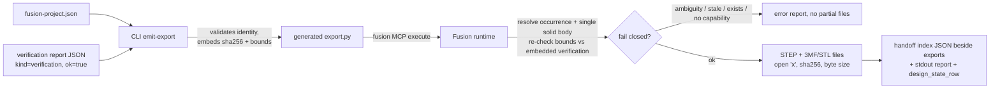

# Summary

Add a generated Fusion export transaction that turns the manual "export exact STEP/3MF/STL files and record hashes" instruction into a deterministic, evidence-bound step: exact body resolution, no-overwrite output, in-script hashing, and a machine-readable handoff index bound to the manifest and the verification report that justified the export.

---

## Problem Frame

The skill verifies geometry rigorously but leaves export selection, naming, identity binding, and handoff assembly manual. That makes it easy to export the wrong body, overwrite prior evidence, or hand off a file detached from the manifest/verification identities that justified it. Everything upstream (manifest hashing, occurrence disambiguation, stdout report protocol, fail-closed generated scripts) already exists; export is the missing transaction.

---

## Requirements

- **R1.** Resolve each `verification.expected_print_parts` path to its exact root-context occurrence and exactly one solid B-Rep body; any duplicate semantic path, missing occurrence, missing solid, multiple solids, or duplicate body name within the occurrence blocks the whole export (fail closed, no partial output).
- **R2.** Export STEP plus 3MF and/or STL per requested formats through `design.exportManager`. Export scope per format: STEP exports the resolved part's component (Fusion's STEP options take a Component — live-verified that the root-context occurrence proxy is rejected; the occurrence transform is recorded per artifact so the assembly frame stays recoverable); 3MF/STL export the resolved single solid body — R1's single-solid gate makes the scopes equivalent in content, and the index records `export_scope` (`component` | `body`) per artifact. If the export manager or a required option constructor is unavailable, emit an explicit unsupported/fail-closed report naming the missing attribute (e.g. `createC3MFExportOptions` — note the `C` prefix; a leading digit is not a legal identifier) — never a silent skip.
- **R3.** Deterministic filenames derived from project name, part path, format, and manifest hash prefix; the index filename is likewise deterministic (`export-index__<manifest_sha256[:8]>.json`, no run-ID component) so a rerun collides with it. Every output file and the index file are created with `open(..., "x")` semantics so an existing file blocks the run. Re-running with the same targets must not overwrite anything. Any post-preflight failure deletes the artifact files this run created before reporting (mirroring `_cleanup_created` in `positive_control.py`), emits only the error report (no partial index), and reports a `cleanup-incomplete` failure token naming any file it could not remove.
- **R4.** Record per artifact: Fusion document name and saved/version identity (explicit `"unsaved"` when the document has no `dataFile`), manifest SHA-256, bound verification-report SHA-256, export run ID, body identity (semantic path, body name, transform, bounds), design units, export scope and options, byte size, and file SHA-256 — all computed inside the Fusion process, which owns the exported bytes.
- **R5.** Emit a machine-readable handoff index both as the stdout report (existing delimiter protocol) and as an index JSON file written beside the exports, independently verifiable against file bytes and against the originating manifest/verification identities.
- **R6.** Bind the export to fresh verification: the CLI embeds the verification report's identity (kind `verification`, `ok: true`, matching `manifest_sha256`, its SHA-256, and its per-part B-Rep bounds); at runtime the script re-checks live bounds against those recorded bounds within a purpose-named `EXPORT_STALENESS_TOLERANCE_MM` (1e-3 mm — distinguishes real drift from recompute float noise; the positive-control `GEOMETRY_TOLERANCE_MM` of 1e-6 is exact-construction tolerance, wrong for this check) and fails closed on drift (stale verification).
- **R7.** The export claims nothing about slicing, print time, mass, supports, or physical fit; the handoff index carries no such fields.
- **R8.** Preserve existing CLI, emitter, planner (nine phases — reuse `export-and-cost`, add none), and golden-path behavior and tests.

---

## Assumptions

Headless-planned; inferred bets recorded rather than asked:

- **No manifest/schema change in this issue.** `verification.expected_print_parts` (component paths) is the printable-part identity surface for #24; per-part body naming, orientation, and intent land in issue #18. This keeps `manifest.py`, the JSON schema, and their lockstep tests untouched.
- **DESIGN-STATE update is a rendered row, not file mutation.** Nothing in the codebase writes `DESIGN-STATE.md` today; the handoff report includes a pre-rendered `design_state_row` markdown string and the docs instruct appending it. No host-side file-editing machinery.
- **Unsaved documents export with explicit `"unsaved"` identity** rather than requiring save-first, so the disposable golden-path document remains usable for live acceptance.
- Fusion `ExportManager` option constructor names are checked dynamically at runtime (fail closed if absent) rather than assumed correct from documentation; live acceptance is the proof.

---

## Key Technical Decisions

1. **KTD1: Export runs as a generated Fusion transaction, not a host CLI action.** `capability-matrix.md` states the host CLI does not impersonate Fusion export, and the Fusion process is the only side guaranteed to see the exported bytes (CLI and Fusion may not share a filesystem). Hashing, byte sizes, no-overwrite creation, and the index file therefore all happen in-script; the host CLI only emits the script and pre-binds identities.
2. **KTD2: Identity binding is embed-at-emit.** The new `emit-export` CLI subcommand reads the saved verification report JSON, validates it against the manifest, and embeds its SHA-256 plus per-part bounds into the script (the `__PLACEHOLDER__` + `_json_literal` replacement pattern from `positive_control.py`). The script cannot run against a different manifest or a stale document without tripping a check.
3. **KTD3: Run identity uses `uuid.uuid4().hex`, computed inside the generated script at run time — never at emit time.** `secrets` does not import in the Fusion runtime (live-probed fact in `references/mcp-adapter.md`); `uuid` does. Emit-time generation would make every emitter invocation produce different script text and permanently break the byte-equality guards, so the emitter stays a pure function of manifest + config. The index and stdout report carry the same `export_run_id`.
4. **KTD4: Body resolution mirrors `_root_context_occurrence_map`'s `(mapping, duplicates)` shape** at body level, built from `occurrence.bRepBodies` (root-context proxies — assembly frame, matching `_body_summary` in `scripts.py` and the verification report's `brep_bounding_boxes_mm`; never `occurrence.component.bRepBodies`, which is untransformed component space): within the resolved occurrence, solid bodies are mapped by name; zero solids, more than one solid, or duplicate names are each distinct fail-closed causes. This is the issue's "no name ambiguity" requirement made concrete.
5. **KTD5: Reuse the `export-and-cost` planner phase.** `tests/test_planner.py` and `docs/live-fusion-acceptance.md` both assert exactly nine phases; the existing phase's completion evidence ("export hashes", "handoff report") already names this feature.

---

## High-Level Technical Design

Failure ordering: capability check → document identity → per-part resolution (all parts checked before any file is written) → output-directory preflight (exists and writable, `missing-output-dir` token) → output-path collision preflight for every target and the index → then exports. All-or-nothing: the first runtime failure after preflight deletes the artifact files this run created (mirroring `_cleanup_created`), emits only the error report — which lists what was created and removed — and reports `cleanup-incomplete` for anything it could not remove. No partial index is ever written.

---

## Scope Boundaries

In scope: export emitter + runtime script, `emit-export` CLI subcommand, checked-in generated example, tests, and doc updates (SKILL.md §14, live acceptance §10, DESIGN-STATE Exports table columns, capability matrix row).

### Deferred to Follow-Up Work

- Slicer-neutral printable-part/manufacturing intent manifest surface (issue #18).
- PrusaSlicer project adapter (#22), material gate (#21), variant matrix runner (#23) — #23 will call this emitter per variant; the emitter's config (output dir, formats, verification binding) is already parameterized, which is all the composability #23 needs.
- Any host-side evidence session machinery of the deleted `report_session.py` kind; stdout + in-script index file is the transport.

---

## Implementation Units

### U1. Export emitter and runtime transaction

**Goal:** `src/fusion_design/export_handoff.py` providing `emit_export_script(manifest, config)` where config carries output directory (Fusion-host path), requested formats (`step` required; `3mf`/`stl` optional), and the embedded verification binding (report SHA-256 + per-part `brep_bounding_boxes_mm` + report `ok`/kind/manifest identity).

**Requirements:** R1–R7; KTD1–KTD4.

**Dependencies:** None.

**Files:**
- `plugins/agent-utilities/skills/fusion-parametric-design/src/fusion_design/export_handoff.py`
- `plugins/agent-utilities/skills/fusion-parametric-design/tests/test_export_handoff.py`

**Approach:**
1. Build the script as `_script_prelude(manifest)` + plain-string body with `__EXPORT_SPECS__` placeholder replaced via the `_json_literal` pattern (avoids f-string brace doubling).
2. Runtime order: require export capability (`design.exportManager` plus each needed `create*ExportOptions` attribute) → `_require_target_document` / `_active_design` → resolve every expected print part via `_root_context_occurrence_map` + new body-level map → compare each part's live precise bounds to embedded verification bounds within `GEOMETRY_TOLERANCE_MM` → preflight `os.path.lexists` on every output path and the index path → export per format with `open`-`"x"`-style collision safety (export APIs write the file; preflight plus a post-write existence/size check covers them; the index file itself uses `open(path, "x")`) → hash each file with `hashlib.sha256` streaming, record byte size → write index JSON → emit stdout report with `_emit`, including `design_state_row`.
3. Document identity: `document.name`; `dataFile.versionNumber`/`dataFile.id` when `isSaved` and `dataFile` present, else the literal `"unsaved"`.
4. Deterministic names: `<slug(project)>__<slug(part path)>__<manifest_sha256[:8]>.<ext>`; index `export-index__<manifest_sha256[:8]>.json` (no run-ID component — a rerun must collide with the index too; the run ID lives inside the index and report).
5. Fail-closed report mirrors existing convention (`report_attempted` guard, failure tokens such as `export-capability`, `ambiguous-body`, `missing-solid`, `stale-verification`, `output-exists`).

**Patterns to follow:** `positive_control.py` (placeholder replacement, `_require_scaffold_identity`-style hard checks, cleanup-on-partial reporting), `scripts.py` prelude helpers, stdout report protocol.

**Test scenarios** (unittest + fake-`adsk` execution per `tests/test_scripts.py::load_generated_script`):
- Emitted script compiles and contains no `from __future__` import; embeds manifest SHA-256 and verification SHA-256.
- Body resolver: single solid body → resolved; two solids → `ambiguous-body`; duplicate body names → `ambiguous-body`; zero solids → `missing-solid`; duplicate semantic path → blocked.
- Stale check: live bounds beyond tolerance vs embedded bounds → `stale-verification`, no export attempted.
- Output collision: pre-existing target file (or index) → `output-exists` before any export call.
- Missing `exportManager`/option constructor on the fake design → `export-capability` failure.
- Index content: recomputing SHA-256 over a temp file matches the index entry (the fake `exportManager` doubles must write real bytes to the temp target for this to be meaningful); index carries no slicing/mass/fit keys (explicit negative assertion, R7).
- Missing/unwritable export directory → `missing-output-dir` before any collision check.
- Post-preflight failure with one file already written → that file removed, error report lists it as created-and-removed, no index written; a file that cannot be removed → `cleanup-incomplete` naming it.
- Per-artifact `export_scope` recorded as `occurrence` for STEP and `body` for 3MF/STL.
- Happy path via fakes: report `ok: true`, per-part entries carry path, body name, transform (16-tuple), bounds, units, format list, byte size, hash, run ID.

**Verification:** `scripts/test.sh` green; script text executes under the fake `adsk` harness.

---

### U2. CLI `emit-export` subcommand with host-side identity validation

**Goal:** Wire the emitter into `cli.py` with fail-closed host-side binding.

**Requirements:** R2, R6, R8; KTD2.

**Dependencies:** U1.

**Files:**
- `plugins/agent-utilities/skills/fusion-parametric-design/src/fusion_design/cli.py`
- `plugins/agent-utilities/skills/fusion-parametric-design/tests/test_cli.py`

**Approach:**
1. `emit-export <manifest> --verification-report <json> --export-dir <fusion-host path> [--format step|3mf|stl ...] [-o output]`.
2. Host validation before emitting: report parses, `kind == "verification"`, `ok is true`, `manifest_sha256` matches the loaded manifest's hash, `brep_bounding_boxes_mm` covers every expected print part. Any miss → exit 2 with a specific message (existing error-style).
3. Reuse `_validate_emit_paths` aliasing rejection, extended to the verification-report path.
4. `--format` defaults to `step` + `3mf` (issue: "STEP plus 3MF/STL as requested"); duplicates rejected.

**Test scenarios:**
- Happy path emits a script containing the embedded verification SHA-256 (exit 0).
- Mismatched `manifest_sha256` in report → exit 2, message names the mismatch.
- `ok: false` or wrong `kind` report → exit 2.
- Report missing a print part's bounds → exit 2.
- Output aliasing manifest or report path → exit 2.
- Unknown format value → argparse error.

**Verification:** existing `test_cli.py` suite still green; new cases pass.

---

### U3. Checked-in generated example and exact-set guard updates

**Goal:** `examples/electronics-enclosure/generated/export.py` stays byte-equal to the canonical emitter, like the other five scripts.

**Requirements:** R8.

**Dependencies:** U1, U2.

**Files:**
- `plugins/agent-utilities/skills/fusion-parametric-design/examples/electronics-enclosure/generated/export.py`
- `plugins/agent-utilities/skills/fusion-parametric-design/examples/electronics-enclosure/sample-verification-report.json`
- `plugins/agent-utilities/skills/fusion-parametric-design/tests/test_scripts.py`
- `plugins/agent-utilities/skills/fusion-parametric-design/tests/test_golden_path.py`
- `plugins/agent-utilities/skills/fusion-parametric-design/examples/electronics-enclosure/README.md`

**Approach:** The emitter takes `(manifest, config)`, but the existing `test_scripts.py` guard maps filenames to single-argument emitters — so define a module-level `EXAMPLE_EXPORT_CONFIG` in `export_handoff.py` pinning the example's canonical config: a fixed conventional output-directory placeholder (not a machine-specific path — the committed script must be byte-stable across hosts; live acceptance overrides the directory at emit time), format list (`step`, `3mf`), and the committed `examples/electronics-enclosure/sample-verification-report.json` binding (captured from the golden-path fake harness so regeneration is deterministic). Both the checked-in `export.py` and the byte-equality test use `EXAMPLE_EXPORT_CONFIG` (e.g. via a zero-argument partial in the emitter map). Update both exact-set assertions (`test_golden_path.py` filename set; `test_scripts.py` emitter map) and add content assertions (e.g. `"stale-verification"`, `"export-capability"`).

**Test scenarios:**
- Byte-equality of checked-in script vs emitter output.
- Exact filename set includes `export.py`.

**Verification:** both guard tests updated and green.

---

### U4. Documentation and DESIGN-STATE surface

**Goal:** Docs describe the deterministic flow; DESIGN-STATE Exports table gains the identity columns the index feeds.

**Requirements:** R4, R5, R7.

**Dependencies:** U1–U3.

**Files:**
- `plugins/agent-utilities/skills/fusion-parametric-design/SKILL.md`
- `plugins/agent-utilities/skills/fusion-parametric-design/docs/live-fusion-acceptance.md`
- `plugins/agent-utilities/skills/fusion-parametric-design/templates/DESIGN-STATE.md`
- `plugins/agent-utilities/skills/fusion-parametric-design/references/capability-matrix.md`
- `plugins/agent-utilities/skills/fusion-parametric-design/references/mcp-adapter.md`

**Approach:** SKILL.md §14 points at `emit-export` and the `design_state_row` append step. Live acceptance §10 becomes concrete: emit, run via MCP, verify index vs bytes independently (`shasum -a 256` on the Fusion host), rerun to prove no-overwrite, negative test (duplicate a body name, expect `ambiguous-body`). DESIGN-STATE Exports table adds Units / Export options / Byte size / Export run ID columns (heading unchanged — `tests/test_skill.py` guards headings only). Capability matrix `nurb export` row updated to name the new command.

**Test scenarios:** Test expectation: none — docs and template prose; `tests/test_skill.py` invariants (reference existence, `## Exports` heading) remain green.

**Verification:** `scripts/test.sh` green; docs cross-references resolve.

---

## Verification Contract

- Offline gate: `scripts/test.sh` (unittest discovery + compileall) green — this is the repo final gate.
- Live gate (single Fusion instance, manual/MCP): golden-path doc creation → verify → `emit-export` → run export script → confirm base/lid/coupon files + index, independent hash check, rerun blocks on existing outputs, ambiguity negative test blocks. Recorded in `docs/live-fusion-acceptance.md` §10; if live capability is unavailable at delivery time, the offline implementation ships and the live step is recorded as pending acceptance — never fabricated.

## Definition of Done

All four units implemented and tested; both exact-set guards updated; no planner phase count change; no manifest/schema change; issue #24 acceptance criteria mapped: exact-body export (R1), no-overwrite rerun (R3), independently verifiable index (R4/R5), negative ambiguity test (R1), no slicing/fit claims (R7).
