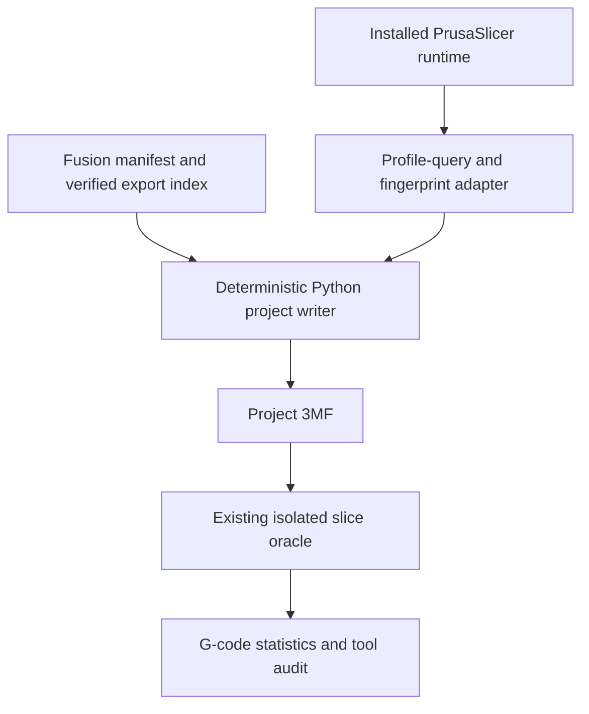

# PrusaSlicer Source-Backed Fusion Handoff

## Goal Capsule

- **Objective:** Integrate the PrusaSlicer 2.9.6 source findings into the existing `fusion-parametric-design` release-lane handoff so installed PrusaSlicer owns profile discovery, compatibility, slicing, and measured outcomes.
- **Means:** Keep deterministic project construction in Python, add one process-isolated runtime adapter for profile queries and fingerprints, retain the current parser only as an explicit offline fallback, and record the exact runtime/configuration environment in every result.
- **Authority:** Fusion owns geometry and manufacturing semantics; PrusaSlicer owns installed presets, compatibility, configuration normalization, supports, flow, toolpaths, wipe structures, and slice statistics.
- **Stop condition:** Basic profile-query/fingerprint/audit integration is merged and verified. Native painted-facet, variable-layer-height, FullSpectrum, and arrangement serialization wait for a separately proven AGPL bridge build/package/invoke chain.

---

## Product Contract

### Summary

The existing adapter already binds a verified Fusion export index to a deterministic PrusaSlicer project, resolves preset identifiers, performs bed-aware placement, and optionally slices with a complete profile triple. This extension replaces the remaining home-grown profile-discovery path as the production authority and makes the exact PrusaSlicer runtime/configuration state part of the evidence chain.

### Problem Frame

The current project adapter parses `PrusaSlicer.ini`, user preset files, and vendor bundles itself. That code is a useful offline fallback, but it duplicates installed-profile, inheritance, variant, and compatibility behavior already exposed by PrusaSlicer's `PresetBundle`-backed CLI actions. Results also record the slicer version only after a successful G-code export; a profile query or failed slice is not bound to the executable bytes and configuration snapshot that produced it.

### Requirements

#### Existing project and slice invariants

- R1. Preserve the manifest → verification report → export index → project → slice hash chain and all current fail-closed checks.
- R2. Preserve deterministic, process-free project construction; only the runtime/slice modules may start PrusaSlicer.
- R3. Preserve preset identifiers as identities. Never copy a full printer, print, or filament profile into the project or Fusion manifest.
- R4. Preserve the complete-profile guard before slicing; a partial printer/print/material set must never reach PrusaSlicer.
- R5. Preserve G-code-only print-time and filament statistics. Missing measurements remain absent, never inferred.

#### Source-backed runtime and profiles

- R6. Add a typed `PrusaSlicerRuntime` adapter that resolves the executable, records its SHA-256 and detected version from the `--help` banner, requires an explicit absolute datadir, and invokes subprocesses with `shell=False`, timeout, and bounded output. Authoritative profile queries are gated to the source-validated `2.9.6` runtime until another version has fixtures and a live canary.
- R7. Expose the installed `--query-printer-models` and `--query-print-filament-profiles` actions as structured JSON results with distinct outcome classes: `not_found`, `timeout`, `nonzero_exit`, `signal_crash`, `malformed_json`, `missing_app_config`, `profile_not_resolvable`, `snapshot_changed`, `unsupported_version`, and `success`. For 2.9.6 query actions, valid schema-conforming JSON is success even when the raw process exit code is `1`; retain that raw code as evidence. Exit `1` without valid expected JSON is not success.
- R8. Make the installed runtime query the primary CLI resolver. Retain the current `.ini`/vendor parser only through an explicit `--offline-profiles` mode whose result is labeled non-authoritative and non-installed. Runtime-query failures never trigger an automatic downgrade.
- R9. Preserve each profile identifier exactly as PrusaSlicer emits it. Normalized vendor/model/variant fields are evidence fields and must never replace the identifier supplied back to PrusaSlicer.
- R10. Fingerprint the relevant datadir state deterministically from `PrusaSlicer.ini` and sorted `.ini` files under `printer/`, `print/`, `filament/`, and `vendor/`; record the snapshot SHA-256 without copying profile contents into output.

#### Evidence and audit

- R11. Add runtime evidence to query/project/slice CLI results: version, executable path and SHA-256, datadir path and snapshot SHA-256, command kind, exit code, signal, and bounded stderr tail.
- R12. Add a conservative bounded-memory, full-file G-code tool audit for standard `T<number>` tool-selection commands. Report observed tools and transition count only when the parser recognizes the flavor; otherwise report the metric unavailable.
- R13. A PrusaSlicer crash invalidates that operation only. It must not crash the agent, weaken validation, drop an override, or cause a fallback to a different datadir.
- R14. Correct documentation that still claims bed fit is unchecked; the current adapter reads the selected printer geometry and fails closed on placement/height overflow.

#### Source and native-metadata boundary

- R15. Add a concise source contract pinned to PrusaSlicer `2.9.6`, commit `b028299c770b8380ee81c921a2867d522f288123`, naming the source areas that own CLI/profile/project/support/wipe/tool-ordering/FullSpectrum behavior.
- R16. Document the semantic/native boundary: painted facets, variable layer heights, FullSpectrum, and arrangement transforms are not ordinary config keys and are not hand-authored until a version-gated native serializer has semantic round-trip proof.
- R17. Do not add or link `libslic3r` to the Python package in this wave. No empty C++ bridge scaffold, copied Prusa algorithms, or new dependency is accepted as implementation progress.

### Scope Boundaries

#### In scope

- Installed-runtime fingerprinting and structured query execution.
- Primary profile discovery through PrusaSlicer's own CLI.
- Explicit offline fallback to the existing parser.
- Runtime evidence propagation, tool-event audit, documentation, tests, and release coupling.

#### Deferred for a separately proven native bridge

- `FacetsAnnotation` serialization for painted supports, seams, fuzzy skin, or MMU regions.
- Variable-layer-height project metadata.
- FullSpectrum/ColorMix virtual-extruder serialization and schedule validation.
- Prusa arrange-wrapper transform extraction and gantry collision evaluation.
- A generated `PrintConfigDef` catalog that requires building against pinned PrusaSlicer source.

#### Outside this product's identity

- Reimplementing support generation, wipe towers, tool ordering, flow, Arachne, or exact slicer estimates in Python.
- Treating an offline source/vendor bundle as proof that a profile is installed in the user's current datadir.
- Treating a syntactically valid project, clean slice, or GUI load as physical-print or fit proof.

---

## Planning Contract

### Product Contract preservation

Restructured with no scope loss: the original R1-R9 project-writer contract is implemented in the current tree; this revision retains those invariants as R1-R5 and adds the source-backed runtime/profile/evidence requirements as R6-R17. The obsolete historical conclusion that all headless slicing crashes was removed because current code and measured 2.9.6 behavior show the crash is caused by an incomplete profile set.

### Key Technical Decisions

- KTD1. **Subprocess boundary, not `libslic3r` embedding.** The installed executable is the authoritative local service; Python remains standard-library-only and process-isolated.
- KTD2. **Prusa query first, parser second.** `PresetBundle`-backed CLI results are authoritative in installed-runtime mode. Manual parsing remains useful only when the executable/query surface is unavailable and is labeled accordingly.
- KTD3. **Runtime evidence is external to deterministic project bytes.** The project remains byte-deterministic for the same geometry/intent/preset identifiers. Runtime fingerprints bind the result and slice evidence rather than being injected into Prusa project metadata.
- KTD4. **One process boundary.** `prusaslicer_runtime.py` may execute profile queries; `prusaslicer_slice.py` continues to own slicing. `prusaslicer_project.py` remains process-free, with the AST confinement test expanded accordingly.
- KTD5. **Native metadata waits for a real bridge.** Source knowledge determines the boundary now, but source-coupled serialization ships only after load → save → inspect semantic equality is demonstrated against a pinned PrusaSlicer family.
- KTD6. **No invented tool metrics.** Tool changes are reported only from recognized `T<number>` events; unknown G-code flavors yield unavailable, not a heuristic count.

### High-Level Technical Design

`PrusaSlicerRuntime` resolves and fingerprints the executable once, then fingerprints the datadir before and after every authoritative query or slice. A changed snapshot is a terminal `snapshot_changed` result. `prusaslicer_profiles.py` normalizes the query JSON into exact identifiers plus vendor/model/variant/bed/extruder evidence. The CLI uses this inventory to validate requested presets. `--offline-profiles` skips runtime querying and calls the existing parser with `resolver: offline_parser`, `installed: false`, and compatibility marked unknown; every runtime-query failure otherwise exits without producing a project.

The project writer receives already resolved identifiers and the existing printer geometry record. It does not start a process or absorb runtime concerns. The slice oracle receives the runtime fingerprint and echoes it with the existing binding chain. After a successful text G-code export, `gcode_audit.py` scans bounded complete lines for standard tool-selection events and reports only what was observed.

### Assumptions

- The installed 2.9.6 CLI actions observed on this host remain available under the exact action names in R7.
- Query output shape may evolve; normalization rejects malformed or incomplete objects rather than guessing.
- The relevant datadir snapshot is the selection file plus profile/vendor `.ini` inputs, not thumbnails, caches, logs, or generated G-code.
- A runtime query may legitimately fail against a bare copied vendor directory because installed `AppConfig` state is part of the contract.

### Risks

- **Query schema drift:** isolate normalization and reject incomplete objects rather than guessing.
- **Runtime/config race:** fingerprint before and after an authoritative operation and reject if the relevant snapshot changes.
- **Fallback ambiguity:** never silently mix query and parser evidence in one inventory. A result has one named resolver and authority level.
- **Release drift:** changes under `plugins/` bump both manifests in lockstep; marketplace repin occurs only after merge to `main`.

---

## Implementation Units

### U5. Runtime fingerprint and structured query adapter

- **Goal:** Add the single reusable process boundary for PrusaSlicer discovery/query operations.
- **Requirements:** R6, R7, R10, R13; KTD1, KTD4.
- **Files:**
  - `plugins/agent-utilities/skills/fusion-parametric-design/src/fusion_design/prusaslicer_runtime.py`
  - `plugins/agent-utilities/skills/fusion-parametric-design/tests/test_prusaslicer_runtime.py`
- **Patterns:** Reuse executable discovery, bounded stderr handling, timeout behavior, and argument-list subprocess calls from `prusaslicer_slice.py`; share helpers only where doing so reduces duplication without weakening the process-free project boundary.
- **Test scenarios:** `--help` version banner, missing banner, timeout, and failed probe; exact argv for both query actions; valid expected JSON with raw exit `1` succeeds and invalid/empty exit `1` fails for both actions; every query result carries the complete runtime evidence payload; executable/datadir hashes are stable; relevant profile edit changes snapshot; unrelated file does not; unsupported version, timeout, nonzero, signal, and malformed JSON are distinct; executable or datadir drift during a query refuses; no shell invocation.

### U6. Installed profile inventory and offline fallback

- **Goal:** Make PrusaSlicer's query API the primary source of installed printer/print/filament identifiers and compatibility.
- **Requirements:** R8, R9; KTD2.
- **Files:**
  - `plugins/agent-utilities/skills/fusion-parametric-design/src/fusion_design/prusaslicer_profiles.py`
  - `plugins/agent-utilities/skills/fusion-parametric-design/src/fusion_design/prusaslicer_project.py`
  - `plugins/agent-utilities/skills/fusion-parametric-design/tests/test_prusaslicer_profiles.py`
  - `plugins/agent-utilities/skills/fusion-parametric-design/tests/test_prusaslicer_project.py`
- **Patterns:** Normalize `printer_models[].variants[].printer_profiles` and `user_printer_profiles`; preserve `name` verbatim; call `--query-print-filament-profiles` for the selected printer; use the current parser only through an explicitly labeled fallback adapter.
- **Test scenarios:** system and user printer profiles normalize; compatible print/filament identifiers survive unchanged; requested incompatible/absent profiles refuse before build/slice; missing installed-style config yields structured failure; `--offline-profiles` is labeled non-installed and compatibility-unknown; no profile setting contents enter the project.

### U7. CLI and evidence-chain integration

- **Goal:** Expose profile inventory and attach exact runtime evidence to project/slice results without changing deterministic project bytes.
- **Requirements:** R1-R5, R11, R13; KTD3.
- **Files:**
  - `plugins/agent-utilities/skills/fusion-parametric-design/src/fusion_design/cli.py`
  - `plugins/agent-utilities/skills/fusion-parametric-design/src/fusion_design/prusaslicer_slice.py`
  - `plugins/agent-utilities/skills/fusion-parametric-design/tests/test_cli.py`
  - `plugins/agent-utilities/skills/fusion-parametric-design/tests/test_prusaslicer_slice.py`
- **Patterns:** Add `prusaslicer-profiles --config-root ... [--printer ...]`; resolve one runtime before project construction; echo its fingerprint in the project result; pass it into the slice result; preserve the current binding and complete-profile guards.
- **Test scenarios:** project bytes remain identical with equivalent runtime evidence; CLI JSON names authoritative vs offline resolver; every runtime-query failure exits 2 without a project; an explicitly supplied missing executable never falls back; failed slice retains runtime and binding evidence; datadir drift during slicing refuses; no alternate datadir fallback occurs.

### U8. Conservative G-code tool audit

- **Goal:** Report observed standard tool-selection events without inventing unsupported tool-change metrics.
- **Requirements:** R12; KTD6.
- **Files:**
  - `plugins/agent-utilities/skills/fusion-parametric-design/src/fusion_design/gcode_audit.py`
  - `plugins/agent-utilities/skills/fusion-parametric-design/tests/test_gcode_audit.py`
  - `plugins/agent-utilities/skills/fusion-parametric-design/src/fusion_design/prusaslicer_slice.py`
- **Patterns:** Stream the complete file in bounded memory, parse only complete lines matching `T<number>` with optional surrounding whitespace/comment, and report event line, active tools, and transitions. Any conflicting flavor evidence returns `available: false`.
- **Test scenarios:** single tool, repeated tool, alternating tools, comments containing `T1`, malformed commands, unknown flavor, transitions outside the existing statistics head/tail windows, and a command spanning an input-chunk boundary.

### U9. Source contract, acceptance correction, and release coupling

- **Goal:** Put the source-derived ownership boundary where Fusion-skill operators will read it and ship the plugin update correctly.
- **Requirements:** R14-R17; KTD5.
- **Files:**
  - `plugins/agent-utilities/skills/fusion-parametric-design/SKILL.md`
  - `plugins/agent-utilities/skills/fusion-parametric-design/references/prusaslicer-source-contract.md`
  - `plugins/agent-utilities/skills/fusion-parametric-design/references/prusaslicer-3mf-contract.md`
  - `plugins/agent-utilities/skills/fusion-parametric-design/references/capability-status.md`
  - `plugins/agent-utilities/skills/fusion-parametric-design/references/unsupported.md`
  - `plugins/agent-utilities/skills/fusion-parametric-design/docs/live-fusion-acceptance.md`
  - `plugins/agent-utilities/.codex-plugin/plugin.json`
  - `plugins/agent-utilities/.claude-plugin/plugin.json`
- **Patterns:** Keep source details in references, not the top-level skill; update both manifests from `0.13.1` to `0.14.0` because this adds user-visible CLI/runtime behavior.
- **Test scenarios:** skill routing mentions the new references; stale “bed fit unchecked” claim is absent; source commit/version are exact; both manifests parse and agree; every skill frontmatter name still matches its directory.

### U10. Post-merge marketplace repin

- **Goal:** Bind the published marketplace entry to the merged plugin SHA and `0.14.0` manifest version.
- **Owner:** Shipping tail after the implementation PR merges to `main`.
- **Dependency:** U9 and the merge commit on `origin/main`.
- **Target:** The agent-utilities marketplace entry updated by `.github/workflows/repin-marketplace.yml`; use `scripts/repin-marketplace` only as the documented manual fallback.
- **Proof:** Record the merged SHA, wait for the repin workflow, then verify the marketplace entry names that SHA and version. A green implementation PR without this observable post-merge state is not release-complete.

---

## Verification Contract

| Gate | Command | Proves |
|---|---|---|
| Focused runtime/profile/audit | `PYTHONPATH=plugins/agent-utilities/skills/fusion-parametric-design/src:plugins/agent-utilities/skills/fusion-parametric-design/tests python3 -m unittest plugins/agent-utilities/skills/fusion-parametric-design/tests/test_prusaslicer_runtime.py plugins/agent-utilities/skills/fusion-parametric-design/tests/test_prusaslicer_profiles.py plugins/agent-utilities/skills/fusion-parametric-design/tests/test_prusaslicer_project.py plugins/agent-utilities/skills/fusion-parametric-design/tests/test_prusaslicer_slice.py plugins/agent-utilities/skills/fusion-parametric-design/tests/test_gcode_audit.py -v` | New source-backed seams and existing project/slice behavior |
| Fusion skill gate | `./plugins/agent-utilities/skills/fusion-parametric-design/scripts/test.sh` | Full offline Fusion package and hook contract |
| Repository skill gate | `npx tsx plugins/agent-utilities/skills/skill-cleaner/scripts/skill-cleaner.test.ts` | Skill structure/frontmatter/package hygiene |
| Manifest parse | `python3 -m json.tool plugins/agent-utilities/.codex-plugin/plugin.json` and the Claude manifest equivalent | Release manifests valid and in lockstep |
| Live Prusa 2.9.6 canary (installed-runtime only) | Run `prusaslicer-profiles` against the installed datadir, then build and slice a known tiny project with the selected complete profile set | Real query shape, runtime fingerprint, project consumer, and slice evidence |
| Explicit offline-unsliced check | Run `prusaslicer-project --offline-profiles` without `--slice`, then verify `profile_resolution.geometry_authority == "offline_parser"`; confirm `--offline-profiles --slice` exits 2 without a project | Non-authoritative parser fallback stays explicitly unsliced |
| Manual GUI acceptance | Open the exact hash-bound project in PrusaSlicer | Objects, placements, presets, and overrides appear as intended; does not prove physical print quality |

## Definition of Done

- R1-R17 are implemented or explicitly preserved by the current tested behavior.
- Installed PrusaSlicer queries are the primary resolver in CLI use; the parser fallback is visible and non-authoritative.
- Every query/project/slice result carries exact runtime/datadir fingerprint evidence where a runtime was used.
- The project writer remains process-free and deterministic.
- Tool audit reports only recognized G-code facts.
- Source/native metadata boundaries are documented without speculative bridge scaffolding.
- Targeted tests, the Fusion skill gate, repository skill gate, manifest checks, and live 2.9.6 canary pass.
- The PR is merged with post-merge proof; the marketplace repin reaches the merged SHA and version.
