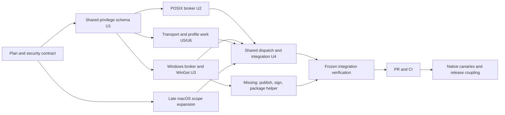

# Fleet Privilege Brokers Execution Retrospective

## Executive summary

This retrospective is primarily an execution-simplification analysis, not a completion audit. The decisive opportunity is to reduce a sprawling 96-spawn, review-heavy delivery into four durable lanes with two early gates: objective closure and deployable-artifact closure. Those two gates would have prevented most late macOS rework and the Windows helper dead end without weakening any security verification.

For outcome context only, the original goal was **not yet achieved**. The run produced a substantial security-oriented implementation and pushed PR #5, but it did not reach a locally verified, review-ready state. At retrospective time the PR head `931bbaff81d521853ae98208eea1ad7ed3d57f30` is open, conflicts with current `main`, has no passing CI on that head, lacks required native canaries and release coupling, and cannot distribute the Windows WinGet helper that enrollment requires.

The app-visible execution span was 2026-08-02 22:24:17 through 2026-08-03 22:01:14 EDT: 23 h 36 m 57 s. That span contains 18 parent turns, three interrupted parent turns, 30 context compactions, 574 agent messages, 701 subagent-activity events involving 84 unique subagent thread identifiers, 121 recorded file-change events, and 48 user messages. These are activity counts, not token or tool-cost totals.

The avoidable duration and complexity were dominated by five causes:

1. **Simplify the architecture before scaling implementation.** A roughly 5,100-line C# helper and roughly 6,000-line POSIX broker/enrollment surface crossed existing complexity thresholds without forcing a product-level simplification decision.
2. **Front-load two thin gates.** The compiled Windows helper was designed and tested before proving that the plugin could distribute it; the plan's macOS exclusion was not reconciled with the owning outcome.
3. **Use fewer, durable lanes.** Useful POSIX/Windows parallelism existed, but 96 spawn calls, 84 observed subagent thread identifiers, repeated reviewer reuse, and 1,459 agent waits created more coordination than critical-path reduction.
4. **Validate shared seams cheapest-first.** Expensive lifecycle runs preceded cheap catalog/parser and packaging checks, causing avoidable reruns and late cross-platform defects.
5. **Redirect nonproducing models and optional reviews quickly.** Three Luna attempts consumed at least 519k reported tokens with zero edits; Fable and Claude review attempts stalled or failed authentication.

With the same safety and verification requirements, a credible counterfactual is **10–15 hours** if the macOS scope and a distributable Windows implementation are settled in the first hour. That is a 36–58% wall-clock reduction with medium confidence. If the compiled-helper architecture must be retained and a signed artifact pipeline must be added, the more conservative estimate is **14–19 hours** (19–41% reduction, medium-low confidence). Neither estimate assumes weaker testing.

## Goal and outcome

### Requested terminal state

Implement the plan across Machine Utilities, change Agent Utilities only when governing delivery behavior genuinely required it, couple Marketplace only for a release, commit and push, open PR #5, resolve feedback, and leave the PR locally verified and review-ready while preserving all privilege boundaries.

### Observed terminal state

| Surface | Observed state | Assessment |
| --- | --- | --- |
| Machine Utilities source | Nine branch commits, 45 changed paths, about 51,337 added lines; head `931bbaf` | Substantial but incomplete |
| PR #5 | Open; `CONFLICTING`; latest head has no Actions run/status checks | Not review-ready |
| Hosted CI | Run `30859708835` tested older `0d9fa8c` and failed Ubuntu and Windows; macOS cancelled | No passing CI evidence |
| WinGet distribution | Enrollment expects x64/ARM64 executable/runtime/provider bundles; none are tracked or published | V1 Windows path not distributable |
| Native canaries | Required Linux/macOS/native-Windows/WSL proofs not performed | Completion contract unmet |
| Release coupling | Branch version `0.2.11`; current source/marketplace `0.2.13`; no associated marketplace change | Not releasable |
| Security boundaries | No evidence of arbitrary root/Admin shell, WSL privileged fallback, or real enrollment | Important boundary preserved |
| Final review | Extensive local reviews and fixtures; two PR threads resolved | Useful evidence, insufficient terminal proof |

The later diagnosis that the WinGet payload was not distributable is a correction of an earlier claim, not evidence that the goal was eventually met.

## Evidence inventory and gaps

### Primary evidence

| Ref | Evidence | Use |
| --- | --- | --- |
| E01 | Codex app thread `019fc56f-9be7-7192-a37b-39364067e9f9`, 18 paginated turns, plus Mini rollout `/Users/claire/.codex/sessions/2026/08/02/rollout-2026-08-02T22-24-13-019fc56f-9be7-7192-a37b-39364067e9f9.jsonl` | Parent timeline, messages, compactions, commands, waits, file changes, subagent activity |
| E02 | Parent turns `019fc56f-a843-70d2-9aa7-ce3bb1f44137`, `3a07790b-5ceb-4b73-87f4-bea195c73986`, `7ab129bb-2bc7-4aa7-8ab4-2b19c6318ecc`, `be478d38-46b7-4c37-8912-671abe008708` | Main implementation and restart boundaries |
| E03 | Parent turns `48059da1-47b3-406e-8282-5b266deb09f7`, `70728450-c152-41fc-a3b9-9c94db16b2df`, `647309cc-726e-4deb-9b5d-e32532819417`, `019fca50-fb77-7513-8465-40bbae9ef956` | PR closeout, macOS expansion, late validation, packaging discovery |
| E04 | Earlier thread `019fb9cb-827f-7a92-b2c7-517db0e4aef8` and its archived rollout | Plan creation, copied-workspace dispatch, original no-push/no-enrollment boundary |
| E05 | `docs/plans/2026-07-31-001-feat-unattended-fleet-privilege-brokers-plan.md` | Original platform scope, requirements, U1-U6, verification/native-canary contract |
| E06 | Machine Utilities PR #5, branch head `931bbaf`, current main `5203221`, run `30859708835` | Final repository and CI state |
| E07 | `enroll-privilege-windows.ps1:185-205`, `integrity.json:80-101`, `.github/workflows/validate.yml:143-159` | Required binary layout versus absent publish/package pipeline |
| E08 | Goal Driven Delivery and Task Orchestrator versions reconstructed from Agent Utilities Git history | Whether a recommendation fixes skill design or agent noncompliance |
| E09 | Parent thread `019fc823-b125-7200-9644-6caa338778f3` | Identifier mismatch: app-visible objective is unrelated cross-provider routing |

### Material gaps

- The Mac Mini parent rollout JSONL is not present in the local session filesystem. App pagination exposes turn and item structure, but not per-item timestamps or full command stdout for every event.
- Exact total tokens, cost, cache hits, model latency, and tool CPU time are unavailable. Only agent-reported token figures for three failed Luna attempts are used.
- Subagent activity events are not unique tool calls. The 701 count must not be read as 701 agents or 701 commands.
- Model/effort receipts are incomplete. “Sol,” “Terra Max,” “Luna Max,” “Fable,” and “Claude” assignments are taken from parent messages and prompts, not a complete billing ledger.
- Some inactive subagent transcripts were archived locally, but exhaustively attributing all 84 identifiers to models and token totals was not possible from available metadata.
- Human idle versus orchestration idle cannot be separated precisely inside a long parent turn. The timeline uses ranges and labels inference.
- Thread ID `019fc823-b125-7200-9644-6caa338778f3` is not the Fleet Brokers source in current app evidence. It appears as a restart delegation source but currently resolves to an unrelated task; no conclusion depends on treating it as Fleet Brokers history.

## Actual timeline

Times are EDT. “Active” means model/tool work is evidenced; it does not imply continuous CPU use. Waiting ranges include external processes, reviewers, user response, and unexplained gaps when item-level timestamps are unavailable.

| Phase | Approx. start–end / wall | Responsible tier | Work, dependencies, tools, outputs | Active vs wait/idle | Critical path / parallelism / use |
| --- | --- | --- | --- | --- | --- |
| P0 Plan and remote dispatch | Jul 31–Aug 2 22:24 | Strong planner/orchestrator | Researched threat model; wrote 821-line plan; copied three repos to Mini; dispatched `ce-work` return-to-caller | Earlier run; exact active time unavailable | Necessary. Plan review was incomplete; macOS privileged exclusion became latent scope mismatch |
| P1 Kickoff, repo map, U1 contract | Aug 2 22:24–early Aug 3, within 15 h interrupted turn | Sol orchestration; Terra/other writers and Sol reviewers | Read plan/repositories; implemented shared privilege schema/contracts; established integrity and fixture surfaces | High model activity; repeated agent interaction | Critical foundation. Parallelizable research was useful; repeated rereads/reviews were not |
| P2 POSIX broker and enrollment | Within same 15 h turn | Terra Max writers; Sol security review | Implemented protected broker, enrollment, CA/SSHSIG/KRL, replay/lifecycle/recovery; multiple isolated U2 suites | Long active tool time; several 11–13 min lifecycle runs; disk interruptions | Critical. Many review findings were real. Repeated full runs on moving hashes added rework |
| P3 Windows broker, SFTP, S4U, WinGet | Within same 15 h turn | Multiple Terra writers; Sol/.NET/security reviewers | Implemented scheduled tasks, SFTP slots, profile worker, compiled WinGet helper, locks, canaries/fixtures | High active model time; many correction loops; temp SDK/proof trees exhausted disk | Critical. Windows helper packaging feasibility was never gated, so much work rested on an unproven delivery path |
| P4 Shared dispatch U4/U5/U6 integration | Same turn through Aug 3 08:38, followed by a 3 h 42 m observable gap before restart work | Sol integrator; Terra writers | Mixed plan schema, transport enrollment, certifier, readiness, docs, recovery; targeted gates and reviews | Active plus queued slots; at least 15 compactions in first turn; no implementation events during the gap | Critical join point. Cross-lane mismatches were caught, but a machine-readable seam contract was absent |
| P5 First restart/recovery | 13:32–14:59; 1 h 27 m, interrupted | Preserved workers; Sol coordinator | Reconciled hashes and resumed lanes after app-server restart | Mostly active; item-level split unavailable | Necessary recovery. Preserved workers prevented total restart |
| P6 Second recovery and freeze | 14:59–15:29; 29 m 38 s | Sol coordinator/reviewers | Continued targeted review/fix and freeze | Active | Critical closeout |
| Gap/restart | 15:29–15:34; about 5 m | Environment | Parent interrupted; authorized restart reported complete | External/tool wait | Critical but short |
| P7 Review, full-suite convergence, branch integration | 15:34–18:28; 2 h 54 m | Sol orchestrator/review; Terra fixes; attempted Claude/Fable | Reattached two writers; full suite failed after 213 s on fixture; isolated/fixed; reran full suite PASS 233.77 s; simplify/Thermos/code review; merged 15 upstream commits; further Windows fixes and final packaged suite | High active time, several one-time long tests, reviewer waits | Critical. Reviews found real issues. Late upstream integration and late cheap parser/fixture checks caused rework |
| P8 PR creation and feedback | 18:28–18:46; 17 m 53 s | Coordinator | U5/Windows fixes, commit, integrate latest main, open PR #5; babysit feedback | Active | Critical to requested terminal state; latest head still lacked CI |
| P9 macOS scope discovery | 18:46–19:13; 27 m 9 s | Coordinator/user | User asks where Mac root support is; plan explicitly had none; estimate and time-box negotiation | Human + orchestration | Critical new scope. Could have been a kickoff contract check |
| P10 macOS first implementation attempt | 19:13–20:27; 1 h 14 m | Luna Max attempts, then native high-effort writers | Parallel plan/docs/tests/core; noninteractive stdin stall; Luna attempts reported 266k, 91k, and 162k tokens with zero edits; redirected to writers | Large model waste; limited useful output from failed lanes | Critical. Parallelism failed until rerouting; plan/docs/tests outputs were partly used |
| P11 macOS implementation and review | 20:27–21:08; 41 m plus several short continuation turns | Native writers, Sol/Thermos/Fable review | Added about 2,183 lines and two root actions; caught Bash 3.2, `flock`, `/etc`/`/var`, unsigned observation, package-script issues; Fable stalled ~10 m and was terminated | Active with review/tool waits; user authorization loops | Critical. Security review prevented unsafe design, but scope churn and review fan-out added time |
| P12 exact cask closeout and delayed shared validation | 21:08–21:52; 43 m 50 s | Terra Max writer, reviewers, local tools | Narrow signed-PKG cask; focused checks; one long U2 lifecycle run; wrong WinGet cwd; missing pinned SDK; shared catalog parser and fixtures fixed; commit/push `931bbaf`; PR threads resolved | About 12 min known long test plus debugging and user discussion | Critical. Cheap Windows parser test should have run immediately after shared catalog change |
| P13 packaging reality check | 21:52–22:01; 8 m 32 s | Coordinator/read-only inspection | User challenges distribution; inspection proves no publish/sign/package path and no distributed binaries | Active | Decisive. Output used to correct completion claim; should have been P0 |

### Time-category reconstruction

| Category | Supported estimate | Basis and confidence |
| --- | --- | --- |
| End-to-end wall time | 23 h 36 m 57 s | Exact app turn span; high confidence |
| Parent active-turn span | About 22 h; interrupted-turn duration is not fully reported | Turn boundaries; medium confidence |
| Explicit long local test/process time | At least 1–2 h cumulative | Multiple 11–13 min U2 runs, 213 s and 233.77 s full suites, packaged suites, SDK/build checks; lower bound only |
| External/reviewer wait | At least tens of minutes | Fable 10 min stall, Claude auth failure/retry, agent-slot queues, CI/watch, restart; medium-low confidence |
| Human-dependent delay | Roughly 20–50 min visible, possibly more inside gaps | macOS/any-cask authorization and architecture questions; low confidence |
| Orchestration/model overhead | Several hours | 84 subagent threads, 701 activity events, 30 compactions, failed model lanes, repeated review loops; medium confidence |
| Unexplained gaps | Under 1 h aggregate outside long turns | Inter-turn gaps; low confidence |

Raw implementation-rollout tool counts reinforce the coordination diagnosis: 2,858 shell/process executions, 1,459 `wait_agent` calls, 503 agent messages, 257 agent-list calls, 184 process waits, 105 follow-ups, 96 spawns, and 25 interrupts. Wait requests included 1,104 nominal 30-second waits, 139 nominal 60-second waits, and 119 nominal 20-second waits; many returned early, so these durations cannot be summed as wall time.

## Critical path



The real critical path was not “all implementation plus all reviews.” It was:

1. Agree on the platform/action catalog, including macOS.
2. Prove the Windows implementation can be distributed through the plugin.
3. Stabilize the shared policy/protocol schema.
4. Implement POSIX and Windows platform lanes in parallel behind that schema.
5. Integrate once, validate cheap shared seams first, then run expensive lifecycle suites.
6. Obtain independent security review, CI, and required native canaries.

The actual run started steps 3–5 before completing steps 1–2. That made macOS a late critical-path branch and left the Windows distribution branch permanently unresolved.

## Findings

### F01 — No early distributable-artifact gate

- **Observed behavior:** A 5,100-line C# WinGet helper and associated tests were implemented before checking whether the plugin release path published its x64/ARM64 executable, runtime, and provider files. Enrollment requires them; Git and CI provide none.
- **Evidence:** E03 turn `019fca79-cb61-74a1-8f56-42a24bb1365d`; E07; PR head `931bbaf`.
- **Phase:** P3, discovered P13.
- **Classification:** missing skill instruction; agent failure to follow adequate skill; task-specific ambiguity.
- **Root cause:** The plan specified a compiled helper and a build test, but neither the plan nor workflow forced an end-to-end “installed plugin contains every runtime byte” spike before implementation.
- **Consequence:** Native Windows V1 is not deployable; the terminal claim was invalid; thousands of lines may be replaced.
- **Wall-clock impact:** 3–8 h direct and rework risk; medium confidence.
- **Token/model/tool/human impact:** Large implementation/review spend; ignored build output; late human architecture intervention.
- **Critical-path effect:** Fatal unresolved dependency.
- **Generalizability:** High for plugins, generators, native helpers, assets, migrations, and release bundles.
- **Confidence:** High.
- **Counterfactual:** In the first hour, build/publish both RIDs, assemble the exact marketplace layout, run enrollment’s file-presence verifier, and stop if the distribution route is absent.
- **Prevention:** Mandatory runtime-asset feasibility receipt listing producer, package path, consumer, integrity/signature, and install smoke test.
- **Skill-change warrant:** Yes.
- **Candidate location:** Goal Driven Delivery “Lane contract and verification cadence”; Task Orchestrator readiness contract; CE plan/work artifact contract.
- **Tradeoffs:** Adds 20–60 min to tasks with generated/native artifacts; saves far more when the route is broken.

### F02 — Platform product contract was not reconciled at kickoff

- **Observed behavior:** The plan explicitly said macOS installs no root grant and supports ordinary SSH only. The user later expected privileged macOS/Homebrew operations, after PR creation.
- **Evidence:** E05 lines 16, 30, 60, 751, 787; E03 turns `48059da1-47b3-406e-8282-5b266deb09f7` and `70728450-c152-41fc-a3b9-9c94db16b2df`.
- **Phase:** Latent P0–P8; surfaced P9.
- **Classification:** task-specific ambiguity; agent failure to follow adequate skill.
- **Root cause:** “Implement the existing plan” was treated as sufficient product confirmation despite the broader fleet goal and prior user concern about macOS.
- **Consequence:** Late architecture expansion, two new shared action IDs, cross-platform parser changes, new reviews, and user frustration.
- **Wall-clock impact:** About 3–4.5 h observed after PR, plus earlier false-closeout effort.
- **Token/model/tool/human impact:** New implementation lanes; repeated user decisions; additional long tests.
- **Critical-path effect:** Added a new critical branch after integration.
- **Generalizability:** High for implementation-ready plans whose exclusions may conflict with outcome language.
- **Confidence:** High.
- **Counterfactual:** Produce a one-page platform/action matrix and ask only about explicit mismatches before coding; macOS root support either enters V1 or is accepted as excluded.
- **Prevention:** Kickoff contract must enumerate supported, unsupported, and human-gated outcomes per platform.
- **Skill-change warrant:** Narrow rewrite, not a generic requirement to re-plan every task.
- **Candidate location:** Goal Driven Delivery lane acknowledgement; Task Orchestrator frozen contract.
- **Tradeoffs:** One brief confirmation can delay a clear task; trigger only on contradictions or high-impact exclusions.

### F03 — Excessive agent graph and coordination churn

- **Observed behavior:** The parent contains 701 subagent-activity events, 84 unique subagent thread IDs, 77 start events, 25 interruptions, and 599 interactions. Some agents spawned their own reviewers; many were recycled across changing hashes.
- **Evidence:** E01 aggregate; E02 initial turn has 433 activity events; E03 turn `be478d38-46b7-4c37-8912-671abe008708` has 79.
- **Phase:** P1–P12.
- **Classification:** orchestration/model-routing defect; agent failure to follow adequate skill.
- **Root cause:** Decomposition optimized for keeping slots busy rather than reducing the dependency-weighted critical path. Review and implementation ownership often outlived a frozen input.
- **Consequence:** Prompt/reread cost, context loss, reviewer invalidation, agent-slot backpressure, and hard-to-audit ownership.
- **Wall-clock impact:** 2–5 h; medium confidence.
- **Token/model/tool/human impact:** Very high model/token and orchestration traffic; no direct human benefit.
- **Critical-path effect:** Mixed: early U2/U3 parallelism helped; later fan-out lengthened integration.
- **Generalizability:** High for multi-agent deliveries.
- **Confidence:** High on behavior, medium on time.
- **Counterfactual:** Four durable roles only: integrator, POSIX writer, Windows writer, independent security reviewer; bounded scouts return artifacts and close.
- **Prevention:** Require a DAG with lane output, consumer, writer, freeze hash, stop condition, and “output used?” field; terminate unused lanes at fan-in.
- **Skill-change warrant:** Yes.
- **Candidate location:** Task Orchestrator decomposition/fan-in; Goal Driven Delivery concurrency policy.
- **Tradeoffs:** Fewer agents can reduce discovery breadth; allow extra lanes only with an independent output consumed by the DAG.

### F04 — No hard redirect budget for nonproducing models

- **Observed behavior:** During the macOS time box, Luna attempts reportedly consumed 266k, 91k, and 162k tokens while rereading and produced zero edits; one also waited because stdin was not closed.
- **Evidence:** E03 turns `70728450-c152-41fc-a3b9-9c94db16b2df` and `647309cc-726e-4deb-9b5d-e32532819417`.
- **Phase:** P10.
- **Classification:** orchestration/model-routing defect; tool/environment limitation.
- **Root cause:** Model preference was treated as stronger than observed progress; no edit/receipt/time budget forced a redirect.
- **Consequence:** At least 519k tokens and roughly 30–50 min elapsed without implementation output.
- **Wall-clock impact:** 0.5–1 h observed; high confidence.
- **Token/model/tool/human impact:** Very high avoidable token cost; user intervention increased.
- **Critical-path effect:** Direct delay on sole remaining implementation slice.
- **Generalizability:** High.
- **Confidence:** High.
- **Counterfactual:** Require an orientation receipt within 5–10 min and first scoped artifact/edit within 15–20 min; otherwise redirect once to the economical fallback or shrink the scope.
- **Prevention:** Progress-budget and one-redirect policy keyed to output, not tokens alone.
- **Skill-change warrant:** Yes.
- **Candidate location:** Task Orchestrator model routing; Goal Driven Delivery implementation carrier.
- **Tradeoffs:** A hard timer may interrupt genuinely deep analysis; security architecture can explicitly request a longer receipt deadline.

### F05 — Cheap shared-seam validation ran after expensive lifecycle validation

- **Observed behavior:** Adding macOS action IDs changed the shared policy catalog. The Windows parser mismatch was found only after a long U2 lifecycle run; the initial WinGet command was also run from the repository root.
- **Evidence:** E03 turn `019fca50-fb77-7513-8465-40bbae9ef956`, agent items around “WinGet is now green: 22/22.”
- **Phase:** P12.
- **Classification:** agent failure to follow adequate skill; orchestration/model-routing defect.
- **Root cause:** Validation was organized by platform and final-gate habit, not dependency radius and cost.
- **Consequence:** Late cross-platform fixes, integrity regeneration, confusion about why Windows tests were running during macOS work.
- **Wall-clock impact:** 20–60 min; medium confidence.
- **Token/model/tool/human impact:** Extra debugging, command retries, and human explanation.
- **Critical-path effect:** Direct closeout delay.
- **Generalizability:** High for shared schemas/catalogs/protocols.
- **Confidence:** High.
- **Counterfactual:** On changing a shared catalog hash, immediately run every parser’s 1–10 second acceptance/rejection canary before any lifecycle suite.
- **Prevention:** Machine-readable invalidation map ordered cheapest-to-expensive.
- **Skill-change warrant:** Mostly enforcement of the current cadence; add a concrete shared-contract trigger.
- **Candidate location:** Goal Driven Delivery “component gate only when input hash changes”; CE work validation loop.
- **Tradeoffs:** Maintaining the invalidation map costs effort; keep it at component level, not individual tests.

### F06 — Expensive tests were repeatedly invalidated by moving source

- **Observed behavior:** Long U2/full suites ran while security review could still change broker hashes; at least one run failed `broker_drift` after a legitimate review fix. Other full runs took 213 s and 233.77 s; macOS U2 later ran about 12–13 min.
- **Evidence:** E03 turns `be478d38-46b7-4c37-8912-671abe008708`, `647309cc-726e-4deb-9b5d-e32532819417`, and `019fca50-fb77-7513-8465-40bbae9ef956`.
- **Phase:** P2, P7, P11–P12.
- **Classification:** agent failure to follow adequate skill; unavoidable work.
- **Root cause:** Some runs began before review freeze; the suite itself is intentionally thorough and slow.
- **Consequence:** Discarded valid compute and repeated integrity updates.
- **Wall-clock impact:** 0.5–1.5 h avoidable; additional test time unavoidable.
- **Token/model/tool/human impact:** Tool/compute-heavy; modest model cost.
- **Critical-path effect:** Direct when run serially; some overlap was useful.
- **Generalizability:** High.
- **Confidence:** Medium-high.
- **Counterfactual:** Freeze review inputs, run cheap gates, settle review, regenerate integrity once, then run each expensive gate once unless a failure invalidates it.
- **Prevention:** Evidence ledger with input hashes and explicit invalidation reason.
- **Skill-change warrant:** Current instruction is already substantially adequate; strengthen compliance tests rather than add duplicate prose.
- **Candidate location:** Goal Driven Delivery cadence and contract tests.
- **Tradeoffs:** Waiting for freeze can leave compute idle; run only provably independent expensive gates early.

### F07 — Review fan-out was valuable but poorly budgeted

- **Observed behavior:** Sol, Thermos, Fable, Claude, and code-quality reviews overlapped. Fable produced no output for about ten minutes and was terminated; Claude authentication expired; some review inputs changed mid-pass.
- **Evidence:** E03 P7/P11 turns; parent messages explicitly report Fable and Claude failures.
- **Phase:** P7, P11–P12.
- **Classification:** orchestration/model-routing defect; tool/environment limitation.
- **Root cause:** “More independent reviewers” substituted for a risk-ranked review plan with verified provider readiness and frozen inputs.
- **Consequence:** Wait time and duplicate reading; some reviews invalidated. Conversely, reviews found real P1 security defects.
- **Wall-clock impact:** 20–60 min avoidable; medium confidence.
- **Token/model/tool/human impact:** Significant model cost; no required human action until auth restoration.
- **Critical-path effect:** Often directly blocking commit.
- **Generalizability:** High.
- **Confidence:** High.
- **Counterfactual:** One Sol security/correctness review on frozen platform lanes, one focused cross-model review only if preflight succeeds, then targeted rereview of changed findings.
- **Prevention:** Review budget: purpose, unique question, provider preflight, timeout, and invalidation rule.
- **Skill-change warrant:** Yes, narrow.
- **Candidate location:** Thermos and Goal Driven Delivery review tail.
- **Tradeoffs:** Fewer perspectives may miss defects; preserve mandatory independent strong-model review and allow escalation on real findings.

### F08 — Toolchain, working-directory, and storage preflight was incomplete

- **Observed behavior:** Noninteractive stdin left Luna waiting; WinGet ran from the wrong directory; pinned SDK 8.0.423 was unavailable; repeated temp proof/SDK trees filled the volume; Fable/Claude capability was learned late.
- **Evidence:** E02/E03 messages; task-owned 603 MB, 956 MB, and 2.8 GB temporary trees were later removed.
- **Phase:** P2–P3, P7, P10–P12.
- **Classification:** tool/environment limitation; agent failure to follow adequate skill.
- **Root cause:** The kickoff verified repositories but not exact per-component commands, cwd, SDK/runtime availability, provider auth, free-space floor, or process I/O completion semantics.
- **Consequence:** Retries, environmental failures, interrupted tests, and cleanup work.
- **Wall-clock impact:** 0.5–1.5 h; medium confidence.
- **Token/model/tool/human impact:** Extra shell/tool calls and diagnostics; low human cost.
- **Critical-path effect:** Direct during long test and implementation lanes.
- **Generalizability:** High.
- **Confidence:** High.
- **Counterfactual:** Run a generated preflight matrix once: command, cwd, version, offline cache, native-host requirement, auth, disk estimate, timeout/progress signal.
- **Prevention:** Exact toolchain receipt and disposable-artifact budget.
- **Skill-change warrant:** Yes.
- **Candidate location:** Goal Driven Delivery kickoff; Task Orchestrator host readiness.
- **Tradeoffs:** Preflight can become broad; restrict it to commands required by the plan/DAG.

### F09 — Compaction/restart recovery lacked one authoritative task manifest

- **Observed behavior:** The run had 30 context compactions and three interrupted parent turns. Recovery relied on narrative reconciliation of workers, hashes, and ownership.
- **Evidence:** E01/E02; restart turns `3a07790b-5ceb-4b73-87f4-bea195c73986`, `cb5e5907-0fbe-4250-ad06-d74e408f9d9d`.
- **Phase:** P1–P7.
- **Classification:** missing skill instruction; tool/environment limitation.
- **Root cause:** State was distributed across transcript prose, agent mailboxes, Git, and temp logs; no compact canonical manifest existed.
- **Consequence:** Rereads, risk of stale reviewer hashes, uncertainty about whether outputs were consumed, and five-minute-plus restart recovery.
- **Wall-clock impact:** 0.5–2 h cumulative; medium-low confidence.
- **Token/model/tool/human impact:** High context/token overhead; little human cost.
- **Critical-path effect:** Repeated small delays and risk of wrong resume.
- **Generalizability:** Very high for long tasks.
- **Confidence:** High on behavior.
- **Counterfactual:** Maintain `task-state.yaml`-equivalent data in task memory (not necessarily the repo): lanes, owner, paths, base/head, input/output hashes, gate receipts, blocker, next command, and output consumer.
- **Prevention:** Machine-readable checkpoint before compaction, handoff, restart, or long wait.
- **Skill-change warrant:** Yes.
- **Candidate location:** Task Orchestrator handoff/checkpoint contract; Goal Driven Delivery evidence section.
- **Tradeoffs:** State maintenance costs tokens; keep it concise and update only on material transitions.

### F10 — Upstream integration and branch-currency checks were late

- **Observed behavior:** `origin/main` advanced by 15 commits during the branch. Integration occurred late after review work, and PR #5 is currently conflicting with newer `main`.
- **Evidence:** E03 P7 parent messages; E06 current PR state.
- **Phase:** P7 and post-run drift.
- **Classification:** orchestration/model-routing defect; unavoidable work.
- **Root cause:** Long-running branch with no planned currency checkpoints at schema freeze and pre-review.
- **Consequence:** Conflict resolution invalidated evidence; current PR is not review-ready.
- **Wall-clock impact:** 20–90 min during run; additional unresolved future work.
- **Token/model/tool/human impact:** Integration/retest cost.
- **Critical-path effect:** Direct before PR and again now.
- **Generalizability:** High.
- **Confidence:** High.
- **Counterfactual:** Read-only fetch throughout; integrate at stable seam freeze before deep review and again before PR, rerunning only hash-invalidated gates.
- **Prevention:** Branch-currency receipt as a fan-in prerequisite.
- **Skill-change warrant:** Current checkpoint guidance partially covers this; add explicit long-run currency triggers.
- **Candidate location:** Goal Driven Delivery GitHub checkpoints; CE commit/push/PR preflight.
- **Tradeoffs:** Frequent merges create churn; use two fixed checkpoints, not continuous rebasing.

### F11 — Completion status was overclaimed relative to the plan

- **Observed behavior:** The branch was described as locally frozen/review-ready and PR threads resolved, despite absent native canaries, failed/absent CI, conflicting head, and missing binaries. The packaging claim was corrected only after user challenge.
- **Evidence:** E03 turns `019fca50-fb77-7513-8465-40bbae9ef956` and `019fca79-cb61-74a1-8f56-42a24bb1365d`; E05 verification contract; E06/E07.
- **Phase:** P7–P13.
- **Classification:** agent failure to follow adequate skill.
- **Root cause:** Local fixture convergence was treated as terminal proof even though the plan explicitly separated hosted, native, and release evidence.
- **Consequence:** Misleading status and late discovery of a fatal defect.
- **Wall-clock impact:** Not primarily time; high reliability/trust impact and future rework.
- **Token/model/tool/human impact:** Human had to audit architecture and distribution.
- **Critical-path effect:** Hid an unresolved path instead of stopping early.
- **Generalizability:** Very high.
- **Confidence:** High.
- **Counterfactual:** Terminal receipt enumerates every required gate as pass/fail/unavailable and forbids “review-ready” when a required release or native gate is absent.
- **Prevention:** Evidence-state vocabulary and mechanically checked completion matrix.
- **Skill-change warrant:** Existing instruction was adequate; enforce rather than broaden.
- **Candidate location:** Goal Driven Delivery terminal routing/contract tests.
- **Tradeoffs:** More tasks end explicitly blocked or incomplete; that is correct.

### F12 — Source-thread identity was trusted without objective verification

- **Observed behavior:** The supplied fleet source ID `019fc823-b125-7200-9644-6caa338778f3` currently resolves to an unrelated cross-provider routing task, while the actual Fleet Brokers implementation is `019fc56f-...`.
- **Evidence:** E01 and E09.
- **Phase:** Dispatch/restart/retrospective.
- **Classification:** insufficient evidence; orchestration/model-routing defect.
- **Root cause:** Thread IDs were propagated as authority without binding them to objective, cwd, plan hash, and branch.
- **Consequence:** Forensic ambiguity and risk of resuming or crediting the wrong work.
- **Wall-clock impact:** Small here; potentially severe in remote orchestration.
- **Token/model/tool/human impact:** Extra evidence search.
- **Critical-path effect:** None proven in implementation; major audit risk.
- **Generalizability:** High for cross-thread/fleet work.
- **Confidence:** High on current mismatch, low on historical cause.
- **Counterfactual:** Every dispatch/resume receipt binds thread ID, host, cwd, objective digest, plan digest, branch, and last checkpoint.
- **Prevention:** Identity-bound handoff receipt.
- **Skill-change warrant:** Yes for orchestration metadata; no thread-specific workaround.
- **Candidate location:** Task Orchestrator placement and handoff contract.
- **Tradeoffs:** Slightly more metadata; objective bodies should remain out of routing logs when sensitive.

### F13 — Fine-grained polling dominated orchestration traffic

- **Observed behavior:** The implementation rollout records 1,459 `wait_agent` calls, 257 agent-list calls, 503 agent messages, 105 follow-ups, and 25 interrupts. Nominal waits were commonly 20–60 seconds and often returned early.
- **Evidence:** E01 raw tool counts; 1,104 nominal 30-second waits, 139 nominal 60-second waits, and 119 nominal 20-second waits.
- **Phase:** P1–P12.
- **Classification:** orchestration/model-routing defect; missing skill instruction; tool/environment limitation.
- **Root cause:** The coordinator monitored many small agent state changes rather than waiting on milestone receipts or bounded fan-in snapshots.
- **Consequence:** High tool-call/token overhead, frequent context injection, and attention fragmentation. The nominal timeout total is not wall time and is not summed.
- **Wall-clock impact:** Plausibly 0.3–1 h from serial orchestration and delayed focus; low-medium confidence.
- **Token/model/tool/human impact:** High avoidable tool/model cost; negligible direct human time.
- **Critical-path effect:** Mostly indirect, but repeated serial polls competed with integration work.
- **Generalizability:** High for multi-agent work.
- **Confidence:** High on traffic, low-medium on wall-time attribution.
- **Counterfactual:** Each lane emits only orientation, first artifact, blocker, freeze, and final receipts; the coordinator uses one bounded wait across active lanes and reads detail only on a milestone or timeout.
- **Prevention:** Milestone-based monitoring contract and unchanged-snapshot suppression.
- **Skill-change warrant:** Yes, as part of SC-03 rather than a new standalone skill.
- **Candidate location:** Task Orchestrator monitoring/fan-in.
- **Tradeoffs:** Less frequent polling can delay discovery of a blocker by minutes; lane-owned blocker notifications preserve responsiveness.

### F14 — Existing simplification thresholds were not enforced

- **Observed behavior:** Historical code-quality instructions treated files crossing 1,000 lines and avoidable complexity as presumptive blockers. The final Simplify/Thermos loop applied no changes despite a roughly 5,100-line C# helper and roughly 6,000 lines across POSIX broker/enrollment; the user surfaced the architectural concern later.
- **Evidence:** E03 architecture-challenge turns; historical `thermo-nuclear-code-quality-review/SKILL.md` complexity guidance; branch diff and helper size inspection.
- **Phase:** P3, P7, discovered P13.
- **Classification:** agent failure to follow adequate skill.
- **Root cause:** Review prompts emphasized local correctness/security findings and did not present deterministic line-growth, artifact-consumer, or product-surface facts that forced a threshold disposition.
- **Consequence:** Large maintenance and review surface, high token/read cost, slower tests, and a likely post-PR rewrite.
- **Wall-clock impact:** 2–6 h implementation/review and future rework; medium confidence.
- **Token/model/tool/human impact:** Very high model token cost because every reviewer reread thousands of lines; user had to trigger simplification.
- **Critical-path effect:** Directly lengthened implementation and review; did not solve the packaging blocker.
- **Generalizability:** High for generated/native/security helpers and monolithic scripts.
- **Confidence:** High on behavior, medium on time.
- **Counterfactual:** At the first 1,000-line crossing, require a written disposition: reuse an existing platform/module, split only by real trust boundary, delete unnecessary checks, or justify why the large surface is the smallest safe solution. Pair that with the artifact closure spike.
- **Prevention:** SC-05 deterministic Thermos packet with line deltas and mandatory threshold disposition; reject “no simplification” without evidence.
- **Skill-change warrant:** No new principle is needed; enforce the existing adequate rule with structured inputs and acceptance tests.
- **Candidate location:** Thermos packet and code-quality review contract tests.
- **Tradeoffs:** Line count is a warning, not a design oracle. Security checks must not be deleted merely to meet a size target.

## Positive patterns

1. **Security boundaries held.** No arbitrary root/Admin shell, request-controlled argv, WSL root fallback, or real privileged enrollment was used to manufacture proof.
2. **Independent review found real defects.** Reviews caught unsigned root observation, macOS portability, Windows SID/task/retention bindings, package-script, and crash-consistency problems. The answer is better review targeting, not weaker review.
3. **Frozen-hash evidence was used repeatedly.** Hash-bound gates and integrity regeneration exposed `broker_drift` instead of silently accepting stale evidence.
4. **Targeted reruns often replaced broad reruns.** After isolated failures, the coordinator frequently narrowed to U4/U5/parser/self-tests and reran the full suite only when justified.
5. **Interrupted workers were preserved.** Restart reconciliation recovered useful U5/core edits rather than discarding or duplicating them.
6. **Unsafe designs were rejected.** The unsigned root observation shortcut and generic/root Homebrew approaches were removed or blocked.
7. **Native boundaries were stated honestly.** macOS missing elevation and Windows native-canary gaps were eventually disclosed; WSL was not used as native Windows proof.
8. **Dirty/unrelated repositories were preserved.** Work remained isolated; no cache or unrelated checkout cleanup was used as a shortcut.
9. **Root-cause fixes were sometimes correctly shared.** The Windows parser’s fixed action-count assumption was changed to derive from the shared catalog rather than patched only in a macOS caller.

## Actual vs counterfactual

### Counterfactual design

#### 0. Reconnaissance and terminal contract (30–60 min)

- Verify exact repos, branches, dirty state, current upstream, plan hash, installed governing skill versions, and requested terminal state.
- Produce a platform/action matrix: Linux root actions, native Windows LocalSystem/S4U actions, macOS privileged actions, WSL unsupported actions.
- Surface the macOS contradiction immediately.
- Inventory every non-source runtime artifact and bind producer → package → integrity/signature → consumer.

**Early stop:** If the compiled WinGet helper cannot be published and installed from the plugin, choose a user-authorized distributable design or explicitly add a release-pipeline unit before feature implementation.

#### 1. Implementation-ready DAG (20–40 min)

| Lane | Owner/tier | Output | Dependency | Stop condition |
| --- | --- | --- | --- | --- |
| Shared protocol/catalog | Luna/Terra Max writer | Canonical schemas plus 1–10 s parser canaries | Contract only | Schema frozen |
| POSIX/Linux/macOS | Luna Max writer | Broker/enrollment/actions | Frozen schema, resolved macOS scope | Focused platform gate green |
| Native Windows | Luna Max writer | SFTP/S4U/WinGet and **packaged payload** | Frozen schema, artifact feasibility green | Focused gate plus install-layout smoke green |
| Transport/profile | Fast economical writer | U5/U6 scripts/docs | Frozen schema | Focused transport gate green |
| Integration | Sol High/Max | Canonical branch, evidence ledger | Frozen lane receipts | All consumers integrated |
| Review | Independent Sol High/Max | Security/correctness findings | Frozen integration hash | Findings settled |

Only the integration owner writes shared catalog/controller/integrity files. Scouts are read-only, bounded, and close after returning a referenced artifact.

#### 2. Validation cadence

1. On every shared schema/catalog change: parsers and canonical rejection tests first.
2. On every runtime-asset change: publish/package/install-layout smoke next.
3. Platform-local fast self-tests during edit loop.
4. Independent security review on frozen lane hashes.
5. Integrate current upstream at seam freeze.
6. Regenerate integrity once.
7. Run expensive lifecycle/full suites once on the frozen integration hash.
8. Run hosted CI, then required native canaries on recoverable hosts.
9. Release coupling and dual-harness install verification only after source head is final.

#### 3. Model routing

| Work | Actual tier | Recommended tier | Escalation |
| --- | --- | --- | --- |
| Repo map, command discovery, evidence indexing | Often Sol/Terra mixed | Fast/economical low–medium | Escalate only on ambiguity affecting design |
| Security/product architecture | Sol/high reasoning and many reviewers | One Sol Max owner plus one independent Sol High/Max review | Escalate on conflicting trust boundaries |
| Routine shell/PowerShell/C# implementation | Terra Max, attempted Luna Max | Luna Max; Terra Max verified fallback | Redirect after missing progress receipt or two failed focused attempts |
| Fixtures/mechanical docs | Mixed | Fast/economical model | Escalate only when fixture reflects trust semantics |
| Failure triage | Multiple writers/reviewers | Sol High focused diagnosis, then one implementation owner | Escalate on nondeterminism or native-only repro |
| Final security/correctness review | Sol, Thermos, Fable, Claude | One independent Sol High/Max; one cross-model pass only if preflight ready | Add reviewer only for a unique unresolved question |

#### 4. Shared state and recovery

Maintain one concise task manifest outside product source with:

- objective/plan digest, host/cwd/repo/branch/base/head;
- lane owner and exclusive paths;
- input/output hashes and consumer;
- exact command/cwd/toolchain receipt;
- gate status, duration, and invalidation reason;
- current blocker and next command;
- thread ID bound to objective/cwd/plan digest.

Checkpoint it before compaction, restart, handoff, expensive wait, or branch integration.

#### 5. Human intervention points

- Kickoff only for the macOS/platform contradiction and any explicit trust-boundary widening.
- Before real privileged enrollment/native canaries.
- If the distributable implementation choice materially changes the plan.
- No repeated micro-confirmations once the platform/action matrix is accepted.

### Comparison

| Dimension | Actual | Counterfactual |
| --- | --- | --- |
| Wall time | 23 h 37 m and still not review-ready | 10–15 h with early simplification; 14–19 h if compiled pipeline retained |
| Active agent time | Very high; 84 subagent IDs and 701 activity events | 35–55% lower through four durable lanes and bounded scouts |
| Tool/compute | Multiple long suites, invalidated runs, wrong-cwd/SDK retries | 25–45% lower; cheap seams before expensive suites |
| Model usage/cost | At least 519k known no-output Luna tokens plus unmeasured review/reread/polling cost | 45–70% lower model cost, medium-low confidence; this does not imply the same wall-time reduction |
| Rework | Late macOS branch; shared parser fixes; helper likely replacement | 50–75% less rework if scope/artifact gate succeeds |
| Reliability | Fatal packaging gap and no terminal proof | Higher: every runtime artifact and required gate is in the DAG |
| Verification | Extensive but not terminal | Same required checks, ordered by cost/dependency and hash validity |

## Improvement ranges

### Separate optimization ledgers

| Change | Wall-clock mechanism | Token/cost mechanism | Expected dominant benefit |
| --- | --- | --- | --- |
| Artifact feasibility and objective admission | Removes dead-end branches from the critical path | Avoids implementing/reviewing code that cannot ship | Both |
| Enforced simplification at 1,000-line crossings | Shortens implementation, review, and test surfaces | Reduces every later reviewer’s reread context | Both |
| Four durable DAG lanes and milestone monitoring | Reduces coordination/fan-in delay; parallelizes only independent work | Eliminates unused scouts, 1,459 fine-grained waits, and repeated prompts | Cost first; some wall time |
| Progress-budgeted model redirect | Removes no-output preferred-model stalls from the critical path | Directly avoids at least 519k known no-output tokens in this run | Both, especially cost |
| Cheapest-first hash invalidation | Prevents expensive suites from running before cheap blockers | Reduces tool/compute more than model tokens | Wall/tool time |
| Frozen deterministic review packet | Avoids stalled/duplicated review lanes and catches architecture issues earlier | Shrinks reviewer context and duplicate readings | Both |
| Skill/restart checkpoint | Shortens restart and compaction recovery | Avoids broad transcript/repository/skill rereads | Cost first |

Cost improvements can exceed wall-clock improvements because independent model work and early-return waits often overlap. Conversely, native test, CI, and human-authorization waits may dominate wall time even after token usage falls. The evaluation plan measures both independently.

| Scenario | Wall time | Reduction vs 23 h 37 m | Assumptions | Confidence |
| --- | --- | --- | --- | --- |
| Distributable simpler WinGet path and macOS scope agreed in first hour | 10–15 h | 36–58% | User accepts distributable PowerShell/native approach; four lanes; no new native-host outage | Medium |
| Keep compiled helper and add real signed artifact pipeline | 14–19 h | 19–41% | Pipeline/signing design is straightforward; native canaries available | Medium-low |
| Only orchestration/model/test-order fixes; architecture unchanged | 16–20 h | 15–32% | Same scope changes and tooling constraints | Medium |

Active-agent time plausibly falls 35–55%, tool/compute 25–45%, model/token cost 45–70%, and avoidable rework 50–75%. These ranges are not additive and are not interchangeable with wall time. Wall time remains bounded by security review, lifecycle suites, CI, native canaries, and any human authorization; token/cost can fall substantially even when those waits do not.

## Top five recommendations

1. **SC-01 (P0): Runtime-asset feasibility gate.** Prove the installed plugin contains every executable/module/provider asset before implementation expands.
2. **SC-02 (P0): Platform and terminal contract matrix.** Resolve high-impact plan exclusions and enumerate required hosted/native/release gates at kickoff.
3. **SC-05 (P1): Enforce simplification with a deterministic review packet.** Surface line growth and runtime-artifact consumers; require a disposition instead of accepting a 5,000-line helper by default.
4. **SC-03 (P1): Critical-path DAG and bounded agent lifecycle.** One writer per lane, output consumer, freeze hash, milestone-based monitoring, stop condition, and fan-in cleanup.
5. **SC-04/SC-07 (P1): Progress-budgeted routing plus cheapest-first validation.** Redirect nonproducing models once; run shared parser/artifact checks before lifecycle suites.

## Evidence appendix

### App-visible turn boundaries

| Turn | Start–end EDT | Status | Notable counts |
| --- | --- | --- | --- |
| `019fc56f-a843-70d2-9aa7-ce3bb1f44137` | Aug 2 22:24–Aug 3 13:32 | Interrupted | 283 agent messages, 433 subagent events, 15 compactions, 49 file changes |
| `3a07790b-5ceb-4b73-87f4-bea195c73986` | Aug 3 13:32–14:59 | Interrupted | 50 agent messages, 90 subagent events, 2 compactions |
| `7ab129bb-2bc7-4aa7-8ab4-2b19c6318ecc` | 14:59–15:29 | Complete | 17 agent messages, 20 subagent events, 1 compaction |
| `cb5e5907-0fbe-4250-ad06-d74e408f9d9d` | 15:29 | Interrupted | 5 agent messages, 2 subagent events |
| `be478d38-46b7-4c37-8912-671abe008708` | 15:34–18:28 | Complete | 100 agent messages, 79 subagent events, 7 compactions, 36 file changes |
| `48059da1-47b3-406e-8282-5b266deb09f7` | 18:28–18:46 | Complete | PR closeout and macOS gap discovery |
| `70728450-c152-41fc-a3b9-9c94db16b2df` | 18:46–19:13 | Complete | 18 subagent events; failed Luna time box |
| `647309cc-726e-4deb-9b5d-e32532819417` | 19:13–20:27 | Complete | 45 subagent events, 27 file changes, 2 compactions |
| `019fca50-fb77-7513-8465-40bbae9ef956` | 21:08–21:52 | Complete | 42 agent messages, 7 subagent events, 5 file changes, 2 compactions |
| `019fca79-cb61-74a1-8f56-42a24bb1365d` | 21:53–21:54 | Complete | Packaging gap established |
| `019fca7c-d830-7c00-b9ab-af8643f005b2` | 21:56–22:01 | Complete | PowerShell replacement dispatched; retrospective created |

### Reproduction references

```text
Codex read_thread: 019fc56f-9be7-7192-a37b-39364067e9f9 on claires-mac-mini
Earlier rollout: /Users/claire/.codex/archived_sessions/rollout-2026-07-31T16-09-10-019fb9cb-827f-7a92-b2c7-517db0e4aef8.jsonl
Plan: /Users/claire/dev/AgentSkills/machine-utilities/docs/plans/2026-07-31-001-feat-unattended-fleet-privilege-brokers-plan.md
PR: https://github.com/novotnyllc/machine-utilities/pull/5
PR head: 931bbaff81d521853ae98208eea1ad7ed3d57f30
Current main observed: 520322111f4ba6ba0e2b60af1424e3e9b4903a29
Failed CI: 30859708835 on 0d9fa8c
```
